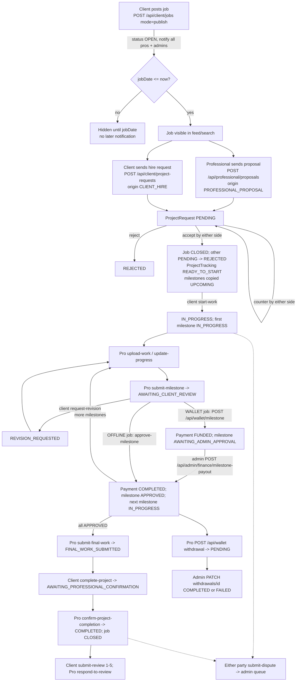
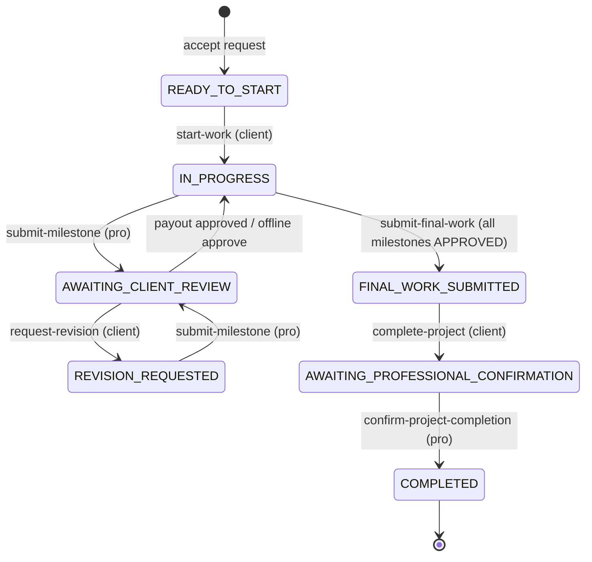

# Product Requirements Document (PRD) — Klick-Pro (as implemented)

Last verified against code: 2026-09-16 (commit cd8f4fb); runtime-validated 2026-09-17

| Field | Value |
|---|---|
| Scope | The web application in this repository: Next.js 16 App Router, a custom `server.mjs` with Socket.IO, PostgreSQL through Prisma |
| Status labels | **Implemented** · **Partial** · **Planned** (only with evidence from older docs) · **Unknown** |
| Companion docs | [BRD](./BRD.md) (business rules BR-*, fee model) · [User stories](./user-stories.md) · [Functional requirements](../02-requirements/functional-requirements.md) · [Screen inventory](../06-ui/screen-inventory.md) · [API specification](../05-api/api-specification.md) · [Data dictionary](../04-database/data-dictionary.md) · [Auth & authorization](../03-architecture/authentication-and-authorization.md) |
| API path note | Browser code mostly calls `/api/v1/...`. `next.config.ts` rewrites `/api/v1/:path*` to `/api/:path*`, except where `app/api/v1/*` exists physically (`messages`, `professionals`). This document cites the canonical `app/api/...` path. |

---

## 1. Product overview

Klick-Pro is an India-focused marketplace for local and remote services. The product has four surfaces:

| Surface | Route root | Audience | Layout / shell |
|---|---|---|---|
| Marketing site | `app/(marketing)/*`, `/blog`, `/careers`, `/pro/[proId]` | Public | Marketing shell (`src/components/MarketingPageShell.tsx`) |
| Client portal | `app/(portal)/(client)/*`, `/project/[projectId]/tracking`, `/earnings`, `/notifications`, `/verification`, `/my-info` | CLIENT | `AppShell` |
| Professional portal | `app/(portal)/professional/*`, `/professional-home`, `/professional/setup`, `/professional-profile`, `/earnings`, `/verification`, `/project/[projectId]/tracking` | PROFESSIONAL | `AppShell` |
| Admin back office | `app/admin/*` (login at `/admin/login`) | ADMIN | Admin shell (`src/routes/admin/admin.tsx`) |

Several routes are shared by clients and professionals and render a different component depending on `session.role`:

- `app/(portal)/earnings/page.tsx` renders `ClientEarnings` or the professional `Earnings`.
- `app/(portal)/verification/page.tsx` renders the client or professional verification view.

---

## 2. Personas

Roles are verified from `prisma/schema.prisma` `enum UserRole { ADMIN CLIENT PROFESSIONAL }`. There are no other roles and no permission table.

| Persona | Role | Goals | Key capabilities (implemented) | Constraints in code |
|---|---|---|---|---|
| **Public visitor** | none | Understand the service, find a professional, sign up | Browse marketing pages; view a public professional profile `/pro/[proId]`; public marketplace APIs (`GET /api/marketplace/*`, `GET /api/v1/professionals`, `GET /api/search`); submit a contact form (`POST /api/contact`) | Cannot post jobs, send proposals or message anyone. Protected page prefixes redirect to `/login` (`proxy.ts` `isAuthenticatedPage`). |
| **Client** (individual or business) | `CLIENT` | Post work, find and hire a professional, track delivery, pay, review | Profile and company details; saved locations; post, edit and close jobs; discover professionals; send hire requests; accept, reject or counter proposals; start the project; define milestones; request revisions; fund the wallet; pay milestones; request completion; review; dispute; message the hired professional and admins; PDF reports and invoices; withdraw the wallet balance | Must verify email before email/password or phone-OTP login (`EMAIL_NOT_VERIFIED`); `login-phone-password` still issues a session to unverified accounts and APIs accept it [CORRECTED 2026-09-17 · V-22, V-23]. Only clients can fund a wallet. |
| **Professional** (tradesperson, freelancer) | `PROFESSIONAL` | Find nearby work, win jobs, deliver, get paid, build reputation | Profile setup (category, skills, rate, base location, radius, work mode); verification documents and Persona KYC; radius-filtered job feed and map; favourite jobs; proposals; respond to hire requests and counter-offers; progress updates; work uploads; milestone submission; final work; confirm completion; respond to reviews; dispute; earnings and wallet; withdrawals; Razorpay Route linked account ID | Verification is optional. Can message only clients with a running project, plus admins. |
| **Administrator** | `ADMIN` | Keep the marketplace safe and solvent | Dashboard overview; user activation, deactivation and deletion (deletion works only for users without related records — active users return 500 [VALIDATED 2026-09-17 · V-07]); verification decisions (overall, per document, Persona); job moderation (open, close, delete); dispute handling and messaging; milestone payout approval; withdrawal completion or failure; Razorpay Route transfer; service catalogue; file CMS; FAQ and contact requests; PDF reports; messages; notification centre | Separate login (`/admin/login`, username/password). The same session cookie and mechanism as users. Every admin has full rights. |

---

## 3. Module inventory

MOD codes follow the shared scheme. Status reflects the current code. Evidence lists the main route, API and library for each module.

| MOD | Module | Status | Evidence (route · API · lib/model) | Notes / gaps |
|---|---|---|---|---|
| SYS | Marketing site and file CMS | Implemented | `app/(marketing)/*` · `GET/PUT /api/admin/cms` · `src/lib/cms-file.ts`, `home-cms-file.ts`, `marketing-cms.ts`, `data/cms-*.json` | Legal, about and cookie pages are not CMS-managed. CMS writes to the local filesystem. Pages prerendered static at build (e.g. `/pricing`, `/how-it-works`, `/services`) show CMS edits only after a rebuild [FOUND IN VALIDATION 2026-09-17 · V-03, V-03b]. |
| AUTH | Registration, login, verification, reset | Implemented | `/signup`, `/login`, `/verify`, `/verify-email`, `/forgot-password`, `/reset-password`, `/admin/login` · `POST /api/auth/[action]` (register, login, login-phone, login-phone-password, send-phone-otp, verify-phone, send-phone-login-otp, check-availability, logout, update-email, resend-verification, forgot-password, forgot-password-phone, verify-forgot-password-phone, verify-email, reset-password), `GET /api/auth/google`, `GET /api/auth/me`, `POST /api/admin/login` · `src/lib/auth.ts`, `phone-otp-provider.ts`, `rate-limit.ts` | Details: [authentication-and-authorization.md](../03-architecture/authentication-and-authorization.md). Runtime defects: mixed-case registered emails can never log in by email/password [V-21]; phone OTP verification always fails when the DB session time zone is not UTC [V-27]; Google sign-in redirects to Google (307) [V-33] [FOUND IN VALIDATION 2026-09-17] |
| ACC | Account and profile | Implemented | `/client-profile`, `/my-info`, `/professional/setup`, `/professional-profile` · `GET/POST /api/profile`, `/api/profile/locations[/id]`, `POST /api/profile/avatar`, `GET/PUT /api/professional/profile`, `GET /api/client/account` · `ClientProfile`, `ClientSavedLocation`, `User` | Billing details and stored payment methods: Planned (old CPR-06/07) |
| CAT | Service catalogue | Implemented | `/admin/services`, `/services` · `GET/POST/PATCH/DELETE /api/admin/services`, `GET /api/marketplace/categories` · `ServiceCategory` (segment, parentId), `src/lib/queries/categories-hierarchy.ts` | The `Service` model is not queried through `db.service` (0 references) [NEEDS VALIDATION] |
| JOB | Job posting and management | Implemented | `/post-job`, `/my-jobs`, `/job/[jobId]` · `GET/POST /api/client/jobs`, `GET/PATCH/DELETE /api/client/jobs/[id]` · `ClientJob`, `ClientJobMilestone` | Attachments: Planned/Partial (`ClientJobAttachment` has no writer) |
| SRCH | Discovery, search, geo | Implemented | `/discover`, `/professional/my-jobs`, `/pro/[proId]`, header search · `GET /api/v1/professionals`, `GET /api/marketplace/[resource]`, `GET /api/marketplace/jobs`, `GET /api/search`, `GET /api/geocode`, `GET /api/portal/professional-jobs` · `src/lib/queries/professional-discovery.ts`, `marketplace.ts`, `src/lib/geo.ts` | Travel time: Planned. Profile comparison: Planned. |
| PROP | Proposals, hire requests, negotiation, hiring | Implemented | `/job/[jobId]`, `/professional/job/[jobId]` · `GET/POST /api/professional/proposals`, `POST /api/client/project-requests`, `PATCH /api/client/project-requests/[id]`, `PATCH /api/professional/project-requests/[id]` · `src/lib/project-request-actions.ts` · `ProjectRequest`, `ProjectNegotiation` | Shortlist: Planned. `Hire*` and `DirectHireNegotiation` models are unused. |
| PRJ | Project tracking, milestones, files | Implemented | `/project/[projectId]/tracking`, `/professional/running-projects` · `POST /api/portal/project-actions` (17 actions), `POST /api/portal/project-files`, `GET /api/portal/project-files/[fileId]`, `GET /api/portal/project` · `ProjectTracking`, `ProjectMilestone`, `ProjectTimelineEvent`, `ProjectWorkUpload`, `StoredFile`, `src/lib/project-file-storage.ts` | `ProjectCompletionRequest` and `ProjectReviewRequest` models are unused |
| PAY | Wallet, milestone payments, payouts, invoices | Implemented | `/earnings`, `/admin/finance` · `GET/POST /api/wallet`, `POST /api/wallet/deposit/{order,verify,fail}`, `POST /api/wallet/milestone`, `GET /api/payments/razorpay/config`, `POST /api/payments/razorpay/{order,verify}` (410), `POST /api/webhooks/razorpay`, `POST /api/admin/finance/milestone-payout`, `PATCH /api/admin/finance/withdrawals/[id]`, `POST /api/admin/finance/payouts`, `PUT/GET /api/professional/razorpay-account`, `GET /api/portal/invoices/[paymentId]` (PDF), `GET /api/portal/payment-details/[paymentId]`, `GET /api/portal/earnings` · `src/lib/wallet-ledger.ts`, `razorpay.ts` · `Wallet`, `WalletTransaction`, `Payment`, `Invoice`, `ProjectWithdrawal`, `ProjectTransaction` | Refunds: Planned. Configurable commission: Planned. Route payouts: Partial (see BRD §10; 503 when Route is disabled [V-47]). Concurrent top-up verify can double-credit a wallet [V-41]; lowering a funded milestone underpays the professional [V-42] [FOUND IN VALIDATION 2026-09-17]. Invoice PDF download works after payout (200) [VALIDATED 2026-09-17 · V-45]. |
| DSP | Disputes | Implemented | Tracking page dispute form, `/admin/operations` · `submit-dispute` action, `GET/PATCH /api/admin/disputes/[id]`, `POST /api/admin/disputes/[id]/messages` · `ProjectDispute`, `ProjectDisputeMessage` | No financial remedy. Users cannot reply to admin dispute messages in the dispute thread [NEEDS VALIDATION]. |
| MSG | Messaging | Implemented | `/messages`, `/professional/messages`, `/admin/messages` · `GET/POST/PATCH /api/v1/messages` · `SocketConversation`, `SocketMessage`, `src/components/MessagesWorkspace.tsx`, `server.mjs` | No pre-hire chat. `MessageConversation`/`Message` is a legacy table read only by `GET /api/portal/messages`, which is used only by the orphan `src/routes/messages.tsx`. `CallSession` is unused. |
| NOT | Notifications | Implemented | `/notifications`, `/admin/notifications` · `GET/PATCH/DELETE /api/portal/notifications`, `GET/PATCH /api/admin/sidebar-counts` · `src/lib/marketplace-notifications.ts`, `email.ts`, `realtime.ts` · `UserNotification` | Browser push (`BrowserSubscription`): Planned. SMS notifications: not implemented (SMS is used for OTP only). |
| VER | Verification and KYC | Implemented / Partial | `/verification`, `/admin/verifications` · `GET/PUT /api/professional/verification`, `POST /api/professional/verification/upload`, `GET /api/professional/verification/documents/[...storageKey]`, `POST /api/verification/persona/start`, `GET /api/verification/persona/status`, `POST /api/webhooks/persona`, `GET/PATCH /api/admin/verifications`, `GET /api/client/verification` · `ProfessionalVerification`, `VerificationDocumentReview`, `PersonaVerification`, `src/lib/persona.ts` | Multi-badge model and "Reviewing" status: Planned |
| RPT | Reports and exports (PDF) | Implemented | `/reports`, `/professional/reports`, `/admin/reports` · `GET /api/client/jobs/export`, `GET /api/client/payments/export`, `GET /api/professional/jobs/export`, `GET /api/professional/earnings/export`, `POST /api/admin/reports/[resource]` (users, jobs, finance) · `src/lib/reports/pdf/*` | PDF only. Export query parameters are parsed by `src/lib/reports/pdf/request.ts`. |
| ADM | Admin operations | Implemented | `/admin`, `/admin/users`, `/admin/operations`, `/admin/support`, `/admin/finance` · `GET /api/admin/data/[resource]` (overview, users, jobs, finance, support), `GET/PATCH/DELETE /api/admin/users/[id]`, `GET/PATCH/DELETE /api/admin/jobs/[id]`, `POST/PUT/DELETE /api/admin/support`, `GET /api/admin/database-status` | No admin-user management UI. No audit trail for most actions (`AuditLog` has 1 reference). |
| CMS | Content management | Implemented / Partial | `/admin/cms` · `GET/PUT /api/admin/cms` · `CmsEditor` | DB CMS models (`CmsPage`, `WebsitePage`, `LegalPage`, `PageConfiguration`, overrides) are not used by the app. Admin FAQs are not shown on the public FAQ page. |
| — | Native mobile apps | Unknown | `flutter_app/` is tracked at HEAD but deleted in the working tree. `/api/v1` rewrite; login returns `token`; Bearer accepted in `auth/me`, `auth/[action]`, `client/jobs`. | `proxy.ts` Origin enforcement blocks non-browser mutating calls (Bearer POST without `Origin` → 403) [VALIDATED 2026-09-17 · V-20]. Whether a mobile client is maintained: [NEEDS VALIDATION — not testable locally] |

---

## 4. Key user journeys (from code)

### 4.1 Onboarding

| Step | Client | Professional | Evidence |
|---|---|---|---|
| 1 | `/signup`: first and last name, email, optional phone (OTP-verified first), password, role, terms | Same, with role PROFESSIONAL | `src/routes/signup.tsx` → `POST /api/auth/check-availability`, `send-phone-otp`, `verify-phone`, `register` |
| 2 | A verification email is sent in the background. The response redirects to `/verify`. | Same | `enqueueBackgroundJob("email.verification")` |
| 3 | The user clicks the email link → `/verify-email` → `POST /api/auth/verify-email`. A session cookie is issued and the user is redirected to `/client-profile?profileSetup=1`. | Redirected to `/professional/setup?profileSetup=1` unless category and coordinates are already set | `action === "verify-email"` |
| 4 | Profile: company, address, saved locations, avatar | Category, skills, experience, hourly rate, state/district/city, lat/lng, radius, work mode, bio | `POST /api/profile`; `PUT /api/professional/profile` |
| 5 | Admins receive a `NEW_ACCOUNT` notification | Admins receive `NEW_ACCOUNT`; **all clients** receive `NEW_PROFESSIONAL` | `notifyAdminsOfNewAccount`, `notifyClientsOfNewProfessional` |
| Alt | Google OAuth (`/api/auth/google?role=`) creates a pre-verified account | Same | `action === "google"` |

### 4.2 Hire-to-payout journey (core)

### 4.3 State models

**ProjectRequest.status** (`src/lib/project-request-actions.ts`): `PENDING` → `ACCEPTED` | `REJECTED`. A counter-offer keeps the status `PENDING`. Whose turn it is comes from `attachLastActorRole`. The server does **not** enforce turns: a client countered and then accepted its own hire request (both 200), creating a project without the professional responding [VALIDATED 2026-09-17 · V-44].

**ProjectTracking.status** (from `app/api/portal/project-actions/route.ts`):

Server-side caveats:

- `complete-project` is accepted from any status except COMPLETED and AWAITING_PROFESSIONAL_CONFIRMATION (observed 200 from READY_TO_START) [VALIDATED 2026-09-17 · V-34b].
- `update-progress` (professional) forces `IN_PROGRESS` from any status, including READY_TO_START and COMPLETED (observed COMPLETED → IN_PROGRESS) [VALIDATED 2026-09-17 · V-43].

**ProjectMilestone.status**: `UPCOMING` → `IN_PROGRESS` → `AWAITING_CLIENT_REVIEW` → (`REVISION_REQUESTED` ↔ `AWAITING_CLIENT_REVIEW`) → `PAYMENT_PROCESSING` → `AWAITING_ADMIN_APPROVAL` (WALLET only) → `APPROVED`.

- APPROVED milestones cannot be updated. A funded (AWAITING_ADMIN_APPROVAL) milestone **can** be lowered; increases above the agreed total return 400 [FOUND IN VALIDATION 2026-09-17 · V-42].
- APPROVED and AWAITING_CLIENT_REVIEW milestones cannot be deleted. Deleting a funded milestone returns 500 (blocked only by the FK) [FOUND IN VALIDATION 2026-09-17 · V-42].
- Project milestones copied at acceptance use the job's `budgetMax`-based amounts, not the agreed bid (bid 1,400 → milestone 2,000) [VALIDATED 2026-09-17 · V-44].

**Payment.status**: WALLET `PENDING` → `FUNDED` → `PAYOUT_PROCESSING` → `COMPLETED`. OFFLINE is created directly as `COMPLETED`. Legacy Razorpay webhook transitions: `PENDING`/`FAILED` → `COMPLETED`, `PENDING` → `FAILED`.

**ProjectWithdrawal.status**: `PENDING` → `COMPLETED` | `FAILED`.

**ProjectDispute.status**: `OPEN` ↔ `RESOLVED` (admin). Note: `project-docs/STATUS_POLICY.md` lists `OPEN`/`CLOSED`. The code uses `RESOLVED`.

### 4.4 Wallet funding journey (client)

1. `/earnings` (ClientEarnings) → `POST /api/wallet/deposit/order`. This creates a Razorpay order and a `WalletTransaction` WALLET_TOP_UP in PENDING.
2. Razorpay Checkout runs in the browser.
3. On success, `POST /api/wallet/deposit/verify` checks the HMAC signature and credits the wallet. On cancel or failure, `POST /api/wallet/deposit/fail` marks the transaction FAILED.
4. The Razorpay webhook (`payment.captured` / `payment.failed`) can also finalize PENDING top-ups. It is idempotent through `RazorpayWebhookEvent`. A webhook POST without `Origin` is rejected 403 by `proxy.ts` before the handler (see [BRD §10](./BRD.md#10-business-level-discrepancies-and-risks-found)) [VALIDATED 2026-09-17 · V-20].
5. Concurrent `verify` calls for the same top-up are **not** safely idempotent: 20 parallel calls credited one ₹5,000 top-up up to ₹25,000 [FOUND IN VALIDATION 2026-09-17 · V-41].

### 4.5 Verification journey (professional)

1. `/verification` (professional view) → `PUT /api/professional/verification` stores document references. `POST /api/professional/verification/upload` accepts JPG, PNG, WEBP or PDF up to 10 MB into private storage. The status is set to `PENDING` on every save.
2. Optional: `POST /api/verification/persona/start` creates a Persona inquiry. Status is polled through `GET /api/verification/persona/status` and updated by the Persona webhook.
3. The admin opens `/admin/verifications` → `PATCH /api/admin/verifications` with one of:
   - `documentKey` for a per-document decision,
   - `providerInquiryId` for a Persona decision,
   - neither, for an overall APPROVED/REJECTED decision that sets `User.isVerified`.
   A realtime `VERIFICATION_UPDATE` is sent. It is **not** stored as a `UserNotification` and no email is sent.
4. The verified flag appears in discovery (`verified` filter) and on public profiles.

Gap: re-saving documents after approval resets `ProfessionalVerification.status` to PENDING but leaves `User.isVerified = true` (`app/api/professional/verification/route.ts:53`).

### 4.6 Review and dispute journey

- **Review:** the client uses the tracking page → `submit-review` (rating 1–5, comment ≤ 2000). The professional's `averageRating` (1 decimal place) and `reviewCount` are recalculated. The professional sees reviews at `/professional/reviews` (`GET /api/portal/reviews`) and responds with `respond-to-review`.
- **Dispute:** either party calls `submit-dispute` with an issue type (2–80 characters), a priority (LOW/MEDIUM/HIGH) and a message (10–4000 characters). All admins get `DISPUTE_RAISED`, and so does the counterparty (`notifyDisputeRaised`). The admin works it in `/admin/operations`: details view, messages to the client or the professional (`DISPUTE_MESSAGE`), and a status toggle OPEN/RESOLVED (`DISPUTE_UPDATED`).

---

## 5. Notifications and messaging

### 5.1 Channels

| Channel | Mechanism | User control | Evidence |
|---|---|---|---|
| In-app | `UserNotification` rows. List, mark read or unread, clear (soft-delete via `clearedAt`). | None (always stored) | `app/api/portal/[resource]/route.ts` (notifications GET/PATCH/DELETE) |
| Email | SMTP through nodemailer, HTML template with optional detail rows | `User.emailNotificationsEnabled` | `src/lib/email.ts`, `sendEmails` |
| Realtime | Socket.IO rooms `user:<id>`, `admins`, `admin:room`. Server → client push only (the server registers no client event handlers). | n/a | `server.mjs`, `src/lib/realtime.ts` |
| SMS | OTP only (Twilio Verify or a generic SMS API; `DEV_PHONE_OTP` in development). Without `DEV_PHONE_OTP` the development provider uses a fixed hard-coded code and prints the code to the server log [VALIDATED 2026-09-17 · V-27] | n/a | `src/lib/phone-otp-provider.ts`, `dev-phone-otp.ts` |
| Browser push | Not implemented (`BrowserSubscription` unused). The `browserNotificationsEnabled` and `projectActivityNotificationsEnabled` flags exist on `User`; their use is [NEEDS VALIDATION]. | — | `prisma/schema.prisma` |

### 5.2 Notification catalogue (types emitted in code)

| Type | Recipients | Trigger | Evidence |
|---|---|---|---|
| `NEW_ACCOUNT` | All admins | Registration or Google signup | `notifyAdminsOfNewAccount` |
| `NEW_PROFESSIONAL` | All active clients | Professional registers | `notifyClientsOfNewProfessional` |
| `WELCOME_CLIENT` / `WELCOME_PROFESSIONAL` | The user | First email/password login | `action === "login"` |
| `NEW_JOB` | All active professionals and all admins | Job published via `POST /api/client/jobs` with `jobDate` ≤ now. Publishing an existing draft via `PATCH` sends none [FOUND IN VALIDATION 2026-09-17 · V-46] | `notifyProfessionalsOfNewJob`, `notifyAdminsOfNewJob` |
| `NEW_PROPOSAL` | Job client (plus admins, in the background) | New proposal | `app/api/professional/proposals/route.ts`, `notifyAdminsOfNewProposal` |
| `PROPOSAL_UPDATED` | Job client | Proposal re-submitted | same |
| `NEW_HIRE_REQUEST` | Professional | Client hire request | `app/api/client/project-requests/route.ts` |
| `REQUEST_COUNTERED` / `REQUEST_DECLINED` / `REQUEST_ACCEPTED` | Other party | Negotiation actions | `respondToProjectRequest` |
| `PROJECT_ACTIVITY_<EVENT>` (event suffixes: `WORK_STARTED`, `PROGRESS_UPDATED`, `MILESTONE_CREATED`, `MILESTONE_UPDATED`, `MILESTONE_DELETED`, `WORK_UPLOADED`, `REVISED_WORK_UPLOADED`, `MILESTONE_SUBMITTED`, `REVISED_WORK_SUBMITTED`, `REVISION_REQUESTED`, `MILESTONE_PAID` (offline only), `FINAL_WORK_SUBMITTED`, `PROJECT_REVIEW_SUBMITTED`, `REVIEW_RESPONSE_SUBMITTED`, `DISPUTE_RAISED`; completion events use the dedicated types below) | Project counterparty | Any project timeline event | `event()` helper in `project-actions` |
| `PROJECT_REQUEST` | Client | Professional "request client" nudge | `request-client` |
| `PROJECT_COMPLETION_REQUESTED` / `PROJECT_COMPLETED` | Professional / client | Two-step completion | `complete-project`, `confirm-project-completion` |
| `MILESTONE_FUNDED` | Professional and all admins ("payout approval required") | Wallet milestone payment | `notifyMilestoneFunded` |
| `MILESTONE_PAYOUT_APPROVED` | Client, professional, all admins | Admin payout approval | `notifyMilestonePayoutApproved` |
| `DISPUTE_RAISED` / `DISPUTE_UPDATED` / `DISPUTE_MESSAGE` | Admins and parties / parties / addressed party | Dispute lifecycle | `notifyDisputeRaised`, `notifyDisputeResolved`, `notifyDisputeMessage` |
| `NEW_MESSAGE` | Message recipient | `POST /api/v1/messages` | `app/api/v1/messages/route.ts` |
| `VERIFICATION_UPDATE` | Professional (realtime only) | Admin overall verification decision | `app/api/admin/verifications/route.ts` |

Not notified: withdrawal status changes, auto-rejected competing proposals, wallet top-up success.

### 5.3 Messaging rules

| Rule | Evidence |
|---|---|
| Conversations are stored per user pair in `SocketConversation` (`userAId`/`userBId`), with messages in `SocketMessage` (UUID ids) | `app/api/v1/messages/route.ts` POST |
| A client and a professional can message each other only if they share a `ProjectTracking` whose status is not COMPLETED | same, 403 "Messaging is available for running projects only." |
| A user can always message an admin. An admin can message any non-admin. Admin-to-admin messaging is blocked. | same |
| An admin can read any conversation. Other users can read only conversations they belong to. | GET `conversationId` branch |
| Read state is updated through `PATCH /api/v1/messages`. Unread counts feed the admin sidebar. | PATCH handler; `app/api/admin/sidebar-counts/route.ts` |
| No attachments, calls or pre-hire chat | `CallSession` unused |

---

## 6. Admin operations

| Admin screen | Purpose | APIs | Implemented actions |
|---|---|---|---|
| `/admin` | Overview | `GET /api/admin/data/overview` | Counts: clients, professionals, pending verifications, total jobs, open disputes, completed project-transaction volume. Latest 5 users, jobs and disputes. Realtime refresh. |
| `/admin/users` | User management | `GET /api/admin/data/users`, `GET/PATCH/DELETE /api/admin/users/[id]` | View detail (profile plus counts of jobs, project requests, projects and completed transaction total; client-profile data — company, address, saved locations — is never displayed because the page reads `clientProfiles[0]` from an object [FOUND IN VALIDATION 2026-09-17 · V-05b]); activate or deactivate (revokes sessions); hard delete (500 "Unable to delete account…" for any user with activity; a fresh user deletes with 200 but leaves an orphaned `ApiToken` row) [VALIDATED 2026-09-17 · V-07] |
| `/admin/verifications` | Trust and safety | `GET/PATCH /api/admin/verifications`, `GET /api/professional/verification/documents/[...storageKey]` | Approve or reject overall, per document, or per Persona inquiry |
| `/admin/operations` | Jobs and disputes | `GET /api/admin/data/jobs`, `GET/PATCH/DELETE /api/admin/jobs/[id]`, `GET/PATCH /api/admin/disputes/[id]`, `POST /api/admin/disputes/[id]/messages` | Open or close a job; delete a job; dispute detail (project, milestones, payments); message a party; resolve or reopen |
| `/admin/finance` | Money | `GET /api/admin/data/finance`, `POST /api/admin/finance/milestone-payout`, `PATCH /api/admin/finance/withdrawals/[id]`, `POST /api/admin/finance/payouts` | Platform wallet (the sum of admin wallets); payment breakdown (client fee, pro commission, net); approve milestone payouts; complete or fail withdrawals; Razorpay Route transfer (503 "Razorpay Route payouts are not enabled." when disabled [VALIDATED 2026-09-17 · V-47]) |
| `/admin/services` | Catalogue | `GET/POST/PATCH/DELETE /api/admin/services` | Category CRUD with segment and parent (children inherit the segment) |
| `/admin/cms` | Marketing content | `GET/PUT /api/admin/cms` | Edit home (hero, features, cards, section order) and 8 marketing pages (hero and items). Saves succeed, but statically prerendered pages (e.g. `/pricing`, `/how-it-works`) keep old content until a rebuild [VALIDATED 2026-09-17 · V-03b] |
| `/admin/support` | Support | `GET /api/admin/data/support`, `POST/PUT/DELETE /api/admin/support` | FAQ CRUD; list contact requests (read-only, no status workflow) |
| `/admin/reports` | Reporting | `GET /api/admin/data/{users,jobs,finance}`, `POST /api/admin/reports/[resource]` | PDF reports for users, jobs and finance |
| `/admin/messages` | Support inbox | `/api/v1/messages` | Chat with any user |
| `/admin/notifications` | Notification centre | `/api/portal/notifications`, `/api/portal/project` | List, read and clear notifications; open linked project detail |

There is no dedicated admin screen for: creating admins, configuring fees, handling refunds, or viewing audit logs.

---

## 7. Success metrics

| Metric | Evidence in product | Target |
|---|---|---|
| Registered clients and professionals | Admin overview counts | [UNKNOWN] |
| Pending verifications (trust backlog) | Admin overview, sidebar counts | [UNKNOWN] |
| Open disputes | Admin overview | [UNKNOWN] |
| Completed transaction volume (sum of `ProjectTransaction.amount` with status COMPLETED, base amounts including offline) | Admin overview `payments` | [UNKNOWN] |
| Platform commission and retained earnings | `/admin/finance` metrics (`platformCommission`, `retainedEarnings`) | [UNKNOWN] |
| Professional rating and review count | `User.averageRating`, `reviewCount` | [UNKNOWN] |
| Conversion funnels, retention, GMV growth, analytics tooling | None (no analytics SDK found) | [UNKNOWN] |

---

## 8. Non-goals and known product gaps

See [BRD §8.3](./BRD.md#83-specified-in-older-docs-but-not-implemented-planned) for Planned items and [BRD §10](./BRD.md#10-business-level-discrepancies-and-risks-found) for discrepancies. The main product gaps are:

- Job attachments.
- Profile comparison and shortlist.
- Pre-hire chat.
- Refunds.
- Multi-badge verification.
- Travel time.
- Radius-targeted new-job alerts.
- Browser push.
- Two-way reviews.
- Configurable fees.
- A pricing page that matches the fee model.

---

## 9. Relationship to existing docs

| Existing file | Status | Why |
|---|---|---|
| `project-docs/src/routes/docs/Software_Requirements_Specification.md`, `Business_Requirements_Document.md`, `Scope_Of_Development_MASTER.md` | Outdated | Phase split and payment assumptions no longer match the code (see BRD §11) |
| `project-docs/from-offer-to-delivery.md` | Not re-verified line by line. The flow in §4.2 above is authoritative. | Code is the source of truth |
| `project-docs/STATUS_POLICY.md` | Partially accurate | Dispute status in code is `OPEN`/`RESOLVED`, not `OPEN`/`CLOSED`. It also omits `FUNDED`, `PAYOUT_PROCESSING`, `AWAITING_ADMIN_APPROVAL`, `PAYMENT_PROCESSING`. |
| `docs/_archive/2026-09-14-flat-docs/api-reference.md`, `docs/_archive/2026-09-14-flat-docs/architecture.md` (earlier AI session) | Superseded | Replaced by `/docs/05-api` and `/docs/03-architecture` |
