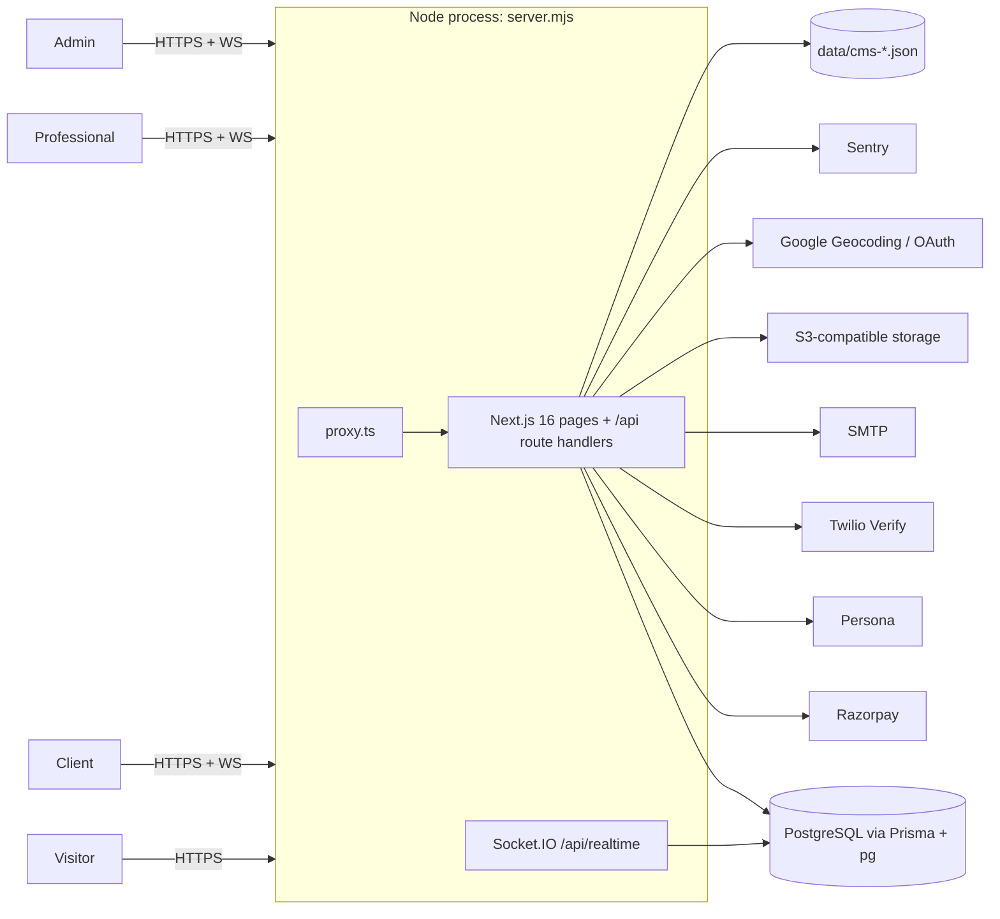

# Software Requirements Specification (SRS): Klick-Pro (`servio`)

Last verified against code: 2026-09-16 (commit cd8f4fb); runtime-validated 2026-09-17

| Field | Value |
|---|---|
| Document type | Implementation-derived SRS (reverse-engineered, IEEE 830 / ISO/IEC/IEEE 29148 structure) |
| Product | Klick-Pro, a services marketplace for India (npm package `servio`) |
| Source of truth | Repository code. Order of precedence: implementation, then existing docs, then assumption |
| Companion documents | [functional-requirements.md](./functional-requirements.md) (FR catalogue and traceability matrix), [non-functional-requirements.md](./non-functional-requirements.md) |
| Status labels | **Implemented** · **Partial** (partially implemented) · **Planned** (only when there is evidence) · **Unknown** · plus `[NEEDS VALIDATION]` / `[UNKNOWN]` markers |

This document describes what the system **does today**. It does not describe what an earlier plan said it should do. Where an older plan disagrees with the code, the disagreement is recorded in §8.

---

## 1. Introduction

### 1.1 Purpose

This document specifies the software requirements of the Klick-Pro web platform as implemented in this repository. It is written for engineers, QA, product owners and AI agents who need a precise, traceable account of system behaviour. Every functional requirement is listed in [functional-requirements.md](./functional-requirements.md) with code evidence and a traceability chain (Requirement → Screen → Component → API → Service → Model).

### 1.2 Scope

Klick-Pro is a two-sided, location-aware services marketplace:

- **Clients** post jobs (drafts or published), discover professionals, send hire requests, negotiate, fund milestones from a wallet, review work, raise disputes and leave reviews.
- **Professionals** complete a service profile (category, base location, service radius), browse nearby jobs, send proposals, negotiate, deliver work through milestones, receive payouts and manage verification (document upload and optional Persona KYC).
- **Administrators** run operations: users, jobs and disputes, verification review, finance (milestone payout approval, withdrawals), service catalogue, CMS content, FAQ and contact requests, reports and messages.

**In scope (implemented in this repository):** a Next.js 16 web application (public marketing site, client and professional portals, admin back office), a REST-style JSON API under `/api/*` (with the alias `/api/v1/*`), a Socket.IO realtime channel, a PostgreSQL database accessed through Prisma, and integrations with Razorpay, Persona, Twilio Verify, SMTP, S3-compatible storage, Google Maps and Geocoding, Google OAuth and Sentry.

**Out of scope / not present in this repository:** native iOS and Android apps (no mobile source exists in the repository; the `/api/v1` alias and Bearer-token support on two endpoints are the only "mobile-ready" evidence), push notifications to devices (the `BrowserSubscription` model is unused), automated tests, and a deployment pipeline beyond CI quality checks.

### 1.3 Definitions, acronyms, abbreviations

| Term | Meaning in this codebase |
|---|---|
| Client | `User.role = CLIENT`. Posts `ClientJob` records |
| Professional / Pro | `User.role = PROFESSIONAL`. Sends proposals and delivers projects |
| Admin | `User.role = ADMIN`. Signs in at `/admin/login` with a username |
| Job | `ClientJob` with status `DRAFT` / `OPEN` / `CLOSED`. The UI also derives `RUNNING` when a `ProjectTracking` exists |
| Scheduled job | An `OPEN` job whose `jobDate` is in the future. It is hidden from professionals and public lists until that date |
| Project request | `ProjectRequest`. `origin = PROFESSIONAL_PROPOSAL` (proposal) or `CLIENT_HIRE` (hire request). Status `PENDING` / `ACCEPTED` / `REJECTED` |
| Negotiation / counter-offer | `ProjectNegotiation` row. Stores the previous terms when either party counters |
| Project | `ProjectTracking`, created when a request is accepted. Statuses include `READY_TO_START`, `IN_PROGRESS`, `AWAITING_CLIENT_REVIEW`, `REVISION_REQUESTED`, `FINAL_WORK_SUBMITTED`, `AWAITING_PROFESSIONAL_CONFIRMATION`, `COMPLETED` |
| Milestone | `ProjectMilestone`: `UPCOMING` → `IN_PROGRESS` → `AWAITING_CLIENT_REVIEW` → (`REVISION_REQUESTED`) → `PAYMENT_PROCESSING` → `AWAITING_ADMIN_APPROVAL` → `APPROVED` |
| Wallet | `Wallet` (`balance`, `pendingBalance`) plus the `WalletTransaction` ledger. Amounts are integer INR (rupees) |
| Platform wallet | The wallet(s) of ADMIN users. Client milestone funds are credited here before payout |
| Session | `servio_session` cookie holding an HS256 JWT `{userId, role, sessionId}` that is checked against the `sessions` table (`Session` model) on every verification |
| Proxy | `proxy.ts`, the Next.js 16 replacement for `middleware.ts` |
| `/api/v1` | A rewrite alias of `/api/*` (`next.config.ts:25`) |
| KYC | Know-your-customer identity verification through Persona |
| OTP | One-time password for phone verification or phone login |
| CMS | File-based JSON content in `data/cms-*.json` |

### 1.4 References

| Ref | Artifact |
|---|---|
| R1 | `Claude Code Prompt — Reverse Engineer Existing Project.md` (governing documentation spec) |
| R2 | `prisma/schema.prisma` (69 models, 5 enums) |
| R3 | `proxy.ts`, `next.config.ts`, `server.mjs` |
| R4 | `app/api/**/route.ts` + `route.tsx` (66 route files), `src/lib/**` |
| R5 | `project-docs/src/routes/docs/Software_Requirements_Specification.md` v0.1 (older planning SRS, superseded; see §8) |
| R6 | Sibling docs: [../03-architecture/solution-architecture.md](../03-architecture/solution-architecture.md), [../03-architecture/authentication-and-authorization.md](../03-architecture/authentication-and-authorization.md), [../04-database/database-design.md](../04-database/database-design.md), [../05-api/api-specification.md](../05-api/api-specification.md), [../06-ui/screen-inventory.md](../06-ui/screen-inventory.md), [../08-operations/security.md](../08-operations/security.md) |

---

## 2. Overall Description

### 2.1 Product perspective

Klick-Pro is a single **modular monolith**. One Node.js process runs `server.mjs`, which wraps the Next.js request handler and attaches a Socket.IO server at path `/api/realtime`. The same Next.js application serves:

| Surface | Route area | Rendering |
|---|---|---|
| Public marketing site | `app/(marketing)/*`, `/blog`, `/careers`, `/pro/[proId]` | Server components with some client components. Content comes from the file CMS |
| Auth screens | `/login`, `/signup`, `/verify`, `/verify-email`, `/forgot-password`, `/reset-password` | Client components that call `/api/v1/auth/*` |
| Client portal | `app/(portal)/(client)/*`, `/earnings`, `/verification`, `/notifications`, `/my-info`, `/project/[id]/tracking` | Mostly client components using `fetch` + `useEffect` |
| Professional portal | `app/(portal)/professional/*`, `/professional-home`, `/professional-profile`, `/professional/setup` | Same pattern |
| Admin back office | `app/admin/*` | Client components inside `AdminPortal`, except `/admin` and `/admin/cms`, which are server-guarded |
| API | `app/api/**/route.ts` | Route handlers (no server actions exist) |
| Realtime | `server.mjs` Socket.IO | Emits from `src/lib/realtime.ts` through `globalThis.__servioIo` |

### 2.2 Product functions (summary)

| Module | Summary | FR range |
|---|---|---|
| AUTH | Email/password, phone OTP and Google sign-in; email verification; password reset; revocable sessions; admin login | FR-AUTH-001…020 |
| ACC | Client profile and saved locations, avatar, professional profile setup, Razorpay linked account | FR-ACC-001…011 |
| CAT | Service category hierarchy (public catalogue and admin CRUD) | FR-CAT-001…006 |
| JOB | Job drafting, publishing, editing, closing, deleting; client dashboard; admin job operations | FR-JOB-001…014 |
| PROP | Proposals, hire requests, counter-offers, acceptance into a project; professional job feed; saved jobs | FR-PROP-001…008 |
| PRJ | Project tracking, milestones, work uploads, revisions, completion, reviews | FR-PRJ-001…020 |
| PAY | Wallet, Razorpay top-up, milestone escrow and payout, withdrawals, invoices, finance admin | FR-PAY-001…017 |
| DSP | Disputes raised by parties and handled by admin | FR-DSP-001…005 |
| MSG | Project-scoped direct messaging with realtime delivery | FR-MSG-001…005 |
| NOT | In-app, realtime and email notifications; admin counters | FR-NOT-001…009 |
| VER | Professional document verification, Persona KYC, admin review | FR-VER-001…011 |
| SRCH | Professional discovery, public listings, job search, geocoding | FR-SRCH-001…008 |
| CMS | File-based marketing content, legal pages, FAQ, contact form | FR-CMS-001…007 |
| RPT | PDF exports (client, professional, admin) | FR-RPT-001…006 |
| ADM | Admin overview, user management, DB status, realtime admin updates | FR-ADM-001…008 |
| SYS | Realtime server, API alias, origin check, request IDs, audit, background jobs, error pages | FR-SYS-001…008 |

### 2.3 User classes and characteristics

| User class | How identified | Entry points | Access boundary (as implemented) |
|---|---|---|---|
| Visitor (anonymous) | No `servio_session` cookie | `/`, marketing pages, `/services`, `/pro/[proId]`, auth screens | Public GET APIs (`/api/marketplace/*`, `/api/v1/professionals`, `/api/search`, `/api/geocode`) and `POST /api/contact` |
| Client | `role = CLIENT` | `/dashboard` (after profile setup at `/client-profile`) | The `(portal)/(client)` layout redirects other roles away. Client APIs check `role === "CLIENT"` and ownership (`userId` / `clientId`) |
| Professional | `role = PROFESSIONAL` | `/professional-home` (after `/professional/setup`) | The `(portal)/professional` layout checks the role. Professional APIs check the role and ownership (`professionalId`) |
| Administrator | `role = ADMIN`, signs in by `username` | `/admin` | `proxy.ts:64-68` redirects non-admins on `/admin/*`. Admin APIs check `role === "ADMIN"` individually. There are no sub-roles or MFA |
| Unverified user | Session exists, `emailVerifiedAt = null`, not admin | `/verify` | `proxy.ts:87-91` redirects pages to `/verify`. APIs mostly do **not** enforce email verification (exception: `POST /api/profile`). Such a session is obtainable through `login-phone-password` (403 + cookie), and `POST /api/client/jobs` then returns 201 [VALIDATED 2026-09-17 · V-22, V-23] |
| External systems | Razorpay and Persona webhooks | `POST /api/webhooks/razorpay`, `POST /api/webhooks/persona` | Signature-verified. They are also subject to the proxy Origin check: without `Origin` → 403 (see §8, D-01) [VALIDATED 2026-09-17 · V-20] |

User and admin sessions use the **same cookie and session table**. The only separation is the `role` claim, which is re-read from the database on every `verifySession` (`src/lib/auth.ts:23-45`). See [../03-architecture/authentication-and-authorization.md](../03-architecture/authentication-and-authorization.md).

### 2.4 Operating environment

| Component | Evidence | Value |
|---|---|---|
| Runtime | `package.json` scripts, `server.mjs` | Node.js (CI uses Node 22). `npm run dev` / `npm start` both run `node server.mjs` |
| Web framework | `package.json` | Next.js `^16.1.6` App Router (16.3.0 installed; `next build` uses Turbopack) [VALIDATED 2026-09-17 · V-03], React 19, TypeScript 5.8 (`strict`, `noUncheckedIndexedAccess`) |
| Proxy runtime | `node_modules/next/dist/docs/.../proxy.md` | Next 16 proxy defaults to the Node.js runtime, so `verifySession` can use Prisma |
| Database | `prisma/schema.prisma`, `src/lib/db.ts` | PostgreSQL (CI uses Postgres 16) through Prisma 7.9 with `@prisma/adapter-pg`. Shared `pg` pool, max 5 connections |
| Realtime | `server.mjs` | Socket.IO at `/api/realtime`. Its own `pg` pool (max 2) checks sessions |
| Browsers | Next 16 / React 19 defaults | Evergreen browsers. No explicit browserslist `[UNKNOWN]` |
| Hosting | `.vercelignore`, `project-docs/DEPLOY.md` | `[NEEDS VALIDATION — not testable locally]`: Vercel artefacts exist, but Socket.IO needs a long-lived Node process. See [../08-operations/deployment.md](../08-operations/deployment.md) |
| Locale | Code-wide | India: INR (`₹`), `en-IN` number/date formatting in notifications, Indian state/district data (`src/lib/india-locations.ts`). UI language is English only |

### 2.5 Design and implementation constraints (as found)

| ID | Constraint | Evidence |
|---|---|---|
| CON-01 | A custom server is required. Socket.IO attaches to the HTTP server created in `server.mjs`, so pure serverless deployment loses realtime (emits become no-ops) | `server.mjs:28-35`, `src/lib/realtime.ts:24-25` |
| CON-02 | `AUTH_SECRET` and `DATABASE_URL` are mandatory at module load. `server.mjs` reads `DATABASE_URL` before `app.prepare()` loads `.env`, so when it is only in `.env` the Socket.IO revocation check is skipped (revoked tokens can open new sockets) and `REALTIME_ALLOWED_ORIGIN`/`APP_URL` from `.env` give no Socket.IO CORS; a shell-inherited `HOSTNAME` (e.g. Git Bash) binds the server to the LAN IP only [FOUND IN VALIDATION 2026-09-17 · V-10, V-11] | `src/lib/auth.ts:7-8`, `src/lib/db.ts:20-26`, `server.mjs` |
| CON-03 | Local file storage is disabled when `NODE_ENV=production`. `FILE_STORAGE_PROVIDER=s3` is required; otherwise every upload returns 500 [VALIDATED 2026-09-17 · PROD-STORAGE] | `src/lib/project-file-storage.ts:44-49` |
| CON-04 | CMS content is written to the local filesystem (`data/*.json`). Changes do not persist on ephemeral or multi-instance hosts `[NEEDS VALIDATION — not testable locally]`. Locally proven: pages prerendered static (`/pricing`, `/how-it-works`, `/services`, …) do not show saved edits until a rebuild [FOUND IN VALIDATION 2026-09-17 · V-03, V-03b] | `src/lib/cms-file.ts`, `home-cms-file.ts`, `marketing-cms.ts` |
| CON-05 | Money is stored as integer rupees (not paise) with a `currency` column. Razorpay amounts are converted with `* 100` | `app/api/wallet/deposit/order/route.ts:52`, `webhooks/razorpay/route.ts:107` |
| CON-06 | State-changing `/api/*` requests must carry an `Origin` equal to the request origin or `APP_URL`. Under `server.mjs` only the exact `APP_URL` origin passed; a genuine same-origin request to `127.0.0.1` got 403 [CORRECTED 2026-09-17 · V-20] | `proxy.ts:4-14,44-46` |
| CON-07 | Rate limiting, the background job queue and Socket.IO rooms are in-process memory, so they are single-instance semantics | `src/lib/rate-limit.ts`, `src/lib/background-jobs.ts`, `server.mjs` |
| CON-08 | No server actions. All mutations go through route handlers | Repository grep: no `"use server"` |

### 2.6 Assumptions and dependencies

| ID | Assumption / dependency | Status |
|---|---|---|
| AS-01 | At least one ADMIN user exists before any wallet milestone is funded (`fundMilestoneFromWallet` throws otherwise) | Enforced in code (`src/lib/wallet-ledger.ts:116-117`) |
| AS-02 | With several ADMIN users, platform receipts and payouts target `findFirst({role: ADMIN})`, which has no deterministic ordering. Admin payout may debit a different admin wallet than the one credited | Known risk (`src/lib/wallet-ledger.ts:116,150`; comment in `app/api/admin/data/[resource]/route.ts:226-229`) |
| AS-03 | Integrations are optional and degrade when not configured: Razorpay 503, Persona `enabled:false`, SMTP silently skipped, Twilio 503, geocode 503, Google OAuth redirect with error | Implemented |
| AS-04 | `PHONE_OTP_PROVIDER` defaults to `development`, which stores hashed codes but sends no SMS. With `DEV_PHONE_OTP` set, the code is static; without it, a fixed hard-coded development code is used and printed to the server log (non-production). OTP verification fails whenever the DB session time zone is not UTC [VALIDATED 2026-09-17 · V-27] | Implemented. Production configuration `[NEEDS VALIDATION — not testable locally]` |
| AS-05 | `GEO_OBFUSCATION_SALT` must be set for map display points. It is absent from `.env.example`, so display points become `null` without it | `src/lib/geo.ts:41-42` |
| AS-06 | `X-Forwarded-For` is set by a trusted reverse proxy (it is used for rate-limit keys) | Locally the header is trusted as sent: rotating it bypasses the login limit [VALIDATED 2026-09-17 · V-26]. Production proxy behaviour `[NEEDS VALIDATION — not testable locally]` |
| AS-07 | `SMS_API_*` environment variables in `.env.example` are not read by any code | Dead configuration |

---

## 3. External Interface Requirements

### 3.1 User interfaces

| ID | Interface requirement (implemented behaviour) | Evidence |
|---|---|---|
| UI-01 | Four UI shells: marketing (`SiteHeader`/`SiteFooter`), auth (`AuthLayout`), portal (`PortalShell`/`AppShell` with `AppHeader` and `AppNavigation`), admin (`AdminPortal` with `AdminSidebar`, `AdminHeader`, `AdminRealtime`) | `app/(marketing)/layout.tsx`, `app/(portal)/layout.tsx`, `app/admin/layout.tsx` |
| UI-02 | Component library: shadcn/ui on Radix (46 primitives in `src/components/ui`), Tailwind CSS, `lucide-react` icons, `sonner` toasts (top-right, 4.5 s) | `src/components/providers.tsx` |
| UI-03 | Loading states through route `loading.tsx` files (dashboard, discover, professional, admin, job, pro, project, root) and the `LoadingSkeleton` component | `find app -name loading.tsx` |
| UI-04 | Responsive layouts using Tailwind breakpoints, a `useIsMobile` hook (768 px) and separate mobile navigation item sets | `src/hooks/use-mobile.tsx`, `src/lib/portal-navigation.ts` |
| UI-05 | Maps: Google Maps JS (`GoogleMapsProvider`, `AddressMapPicker`, discovery and job maps) with obfuscated display points | `src/components/*Map*.tsx`, `src/lib/geo.ts` |
| UI-06 | Visual in-place CMS editing (custom editor with drag-and-drop sections) in `/admin/cms`. CKEditor 5 packages are installed but **not imported** | `src/components/CmsEditor.tsx` |
| UI-07 | Error boundary (`app/error.tsx`) and 404 page (`app/not-found.tsx`) | `app/` |

Screen-level detail is in [../06-ui/screen-inventory.md](../06-ui/screen-inventory.md) and [../06-ui/ui-specification.md](../06-ui/ui-specification.md).

### 3.2 Hardware interfaces

Not applicable. The system is a web application with no device-specific hardware integration. The browser geolocation permission is allowed for the same origin only (`Permissions-Policy: geolocation=(self)`, `next.config.ts:41`).

### 3.3 Software interfaces (integrations)

| System | Purpose | Direction / protocol | Code | Failure behaviour |
|---|---|---|---|---|
| PostgreSQL | Primary data store | Prisma client + `pg` pool (TCP). Raw SQL in `server.mjs` and wallet/OTP updates | `src/lib/db.ts`, `server.mjs:9-11` | Request 500. `/api/admin/database-status` reports 503 |
| Razorpay Checkout / Orders | Client wallet top-up | Outbound REST (`api.razorpay.com`), browser Checkout script | `src/lib/razorpay.ts`, `app/api/wallet/deposit/*` | 503 "not configured" |
| Razorpay webhooks | Payment captured/failed reconciliation | Inbound `POST /api/webhooks/razorpay`, HMAC `X-Razorpay-Signature` | `app/api/webhooks/razorpay/route.ts` | 401 bad signature, 500 with persisted `lastError` |
| Razorpay Route | Transfer to a professional's linked account | Outbound REST `payments/{id}/transfers` | `app/api/admin/finance/payouts/route.ts` | 503 if Route is disabled, 502 on transfer failure. **No UI caller** |
| Persona | Hosted KYC inquiry and webhook status updates | Outbound REST, inbound `POST /api/webhooks/persona` (HMAC with timestamp) | `src/lib/persona.ts` | `enabled:false` response. Webhook returns 401 or 500 |
| Twilio Verify | SMS OTP when `PHONE_OTP_PROVIDER=twilio` | Twilio SDK | `src/lib/phone-otp-provider.ts` | 503 |
| SMTP (nodemailer) | Verification, reset and notification emails | SMTP (465 = TLS) | `src/lib/email.ts` | Skipped with a one-time console warning |
| S3-compatible storage | Project files, verification documents, avatars | AWS SDK v3 (custom endpoint and path-style supported) | `src/lib/project-file-storage.ts` | 500. Local-disk fallback outside production only |
| Google Geocoding API | Forward and reverse geocoding proxy | Server fetch with an 8 s abort | `app/api/geocode/route.ts` | 503 with a "manual entry" message |
| Google Maps JS / Places | Map rendering and pickers | Browser script (CSP-allowed) | `src/components/GoogleMapsProvider.tsx` | `[UNKNOWN]` UI fallback |
| Google OAuth 2.0 / OIDC | Sign-in with Google | Authorization-code redirect, token exchange, userinfo | `app/api/auth/[action]/route.ts:101-222` | Redirect to `/login?oauthError=...` |
| Sentry | Error capture and 10% tracing | `@sentry/nextjs` (`instrumentation.ts`, `sentry.*.config.ts`, `instrumentation-client.ts`) | `src/lib/server-logger.ts` | Disabled when no DSN is set |
| `@react-pdf/renderer` | PDF invoices and reports | In-process rendering | `src/lib/reports/pdf/*` | 500 |

Detailed integration analysis: [../03-architecture/integrations.md](../03-architecture/integrations.md).

### 3.4 Communications interfaces

| ID | Channel | Specification | Evidence |
|---|---|---|---|
| COM-01 | HTTPS JSON API | Route handlers under `/api/*`. `/api/v1/:path*` is rewritten to `/api/:path*` as an `afterFiles` rewrite, so the physical `app/api/v1/messages` and `app/api/v1/professionals` routes win over the alias. The web client mostly calls `/api/v1/*` (some calls use unprefixed paths). `/api/messages` and `/api/professionals` return 404; `/api/v1/v1/*` returns 404 [VALIDATED 2026-09-17 · V-13] | `next.config.ts:21-27` |
| COM-02 | Authentication transport | HttpOnly `servio_session` cookie (SameSite=Lax, Secure in production, 7 days). `Authorization: Bearer` is accepted **only** by `GET /api/auth/me` and `GET/POST /api/client/jobs`. Login also returns `token` in the JSON body. Production cookie observed: `Path=/; Max-Age=604800; Secure; HttpOnly; SameSite=lax` [VALIDATED 2026-09-17 · V-29, V-32] | `src/lib/auth.ts:66-72`, `app/api/auth/me/route.ts:6-10`, `app/api/client/jobs/route.ts:49-52` |
| COM-03 | CSRF-style origin gate | POST/PUT/PATCH/DELETE on `/api/*` require `Origin` equal to the request origin or `APP_URL`. A missing Origin returns 403 (webhooks, Bearer clients included). Engine.io traffic at `/api/realtime` bypasses `proxy.ts` (no `x-request-id`, no Origin 403) [VALIDATED 2026-09-17 · V-20, V-12] | `proxy.ts:4-14` |
| COM-04 | Correlation | `x-request-id` is taken from the request or generated, forwarded to handlers and echoed in the response | `proxy.ts:93-99` |
| COM-05 | Error format | Mostly `{ "error": "<message>" }`, sometimes with `fields`. `/api/v1/professionals` uses `{error:{code,message,details}}`. `src/lib/api-response.ts` defines a standard envelope that no handler uses | handlers |
| COM-06 | Realtime (Socket.IO) | Path `/api/realtime`. Handshake auth reads the `servio_session` cookie, verifies the JWT with `AUTH_SECRET`, and when a `sessionId` is present checks that the `sessions` row is not revoked or expired and the user is active. CORS origin is `REALTIME_ALLOWED_ORIGIN` or `APP_URL`. Revocation is checked only at handshake: an open socket stays connected after logout [VALIDATED 2026-09-17 · V-28]; see CON-02 for the `.env` fail-open [V-10] | `server.mjs:32-68` |
| COM-07 | Realtime rooms | Every socket joins `user:<id>`. ADMIN sockets also join `admins` and `admin:room` | `server.mjs:70-76` |
| COM-08 | Realtime events (server → client only) | `notification:new`, `message:new`, `message:read`, `project:updated`, `proposal:new` (to `user:<id>`); `admin:notification`, `notification:new`, `admin:overview-update`, `admin:verifications-update`, `admin:operations-update`, `admin:users-update` (to `admins`). No client → server events are handled | `src/lib/realtime.ts` |
| COM-09 | Email | SMTP. HTML and text templates branded "Klick-Pro". Links use `APP_URL` (notifications) or request host headers (auth emails); a forged `X-Forwarded-Host` produced a reset link to that host [VALIDATED 2026-09-17 · V-25] | `src/lib/email.ts`, `app/api/auth/[action]/route.ts:45-73` |
| COM-10 | Outbound webhooks consumed | Razorpay (`X-Razorpay-Signature`), Persona (`Persona-Signature` with `t=` and `v1=`) | see §3.3 |

The full endpoint catalogue is in [../05-api/api-specification.md](../05-api/api-specification.md) and [../05-api/openapi.yaml](../05-api/openapi.yaml).

---

## 4. System Features (summary)

Each feature below links to its detailed requirements in [functional-requirements.md](./functional-requirements.md). Counts reflect the FR catalogue after runtime validation on 2026-09-17 (11 FRs moved to Partial).

| Feature | Description | FRs | Implemented / Partial / Not implemented |
|---|---|---|---|
| 4.1 Identity and access | Registration, verification, login (email, phone OTP, Google), reset, sessions, admin login, route guards | [AUTH](./functional-requirements.md#auth-identity-and-access) | 13 / 7 / 0 |
| 4.2 Accounts and profiles | Client profile, saved locations, avatar, professional setup | [ACC](./functional-requirements.md#acc-accounts-and-profiles) | 8 / 3 / 0 |
| 4.3 Service catalogue | Category hierarchy, admin taxonomy | [CAT](./functional-requirements.md#cat-service-catalogue) | 5 / 1 / 0 |
| 4.4 Jobs | Post, draft, edit, close, delete, dashboard, admin ops | [JOB](./functional-requirements.md#job-jobs) | 12 / 2 / 0 |
| 4.5 Proposals and hiring | Proposals, hire requests, negotiation, acceptance, job feed | [PROP](./functional-requirements.md#prop-proposals-hiring-and-job-feed) | 6 / 1 / 1 |
| 4.6 Project delivery | Tracking, milestones, uploads, revisions, completion, reviews | [PRJ](./functional-requirements.md#prj-project-delivery-and-reviews) | 17 / 3 / 0 |
| 4.7 Payments and wallet | Top-up, escrow, payout, withdrawals, invoices | [PAY](./functional-requirements.md#pay-payments-wallet-payouts-invoices) | 12 / 5 / 0 |
| 4.8 Disputes | Raise, review, message, resolve | [DSP](./functional-requirements.md#dsp-disputes) | 4 / 0 / 1 |
| 4.9 Messaging | Project-scoped chat, realtime | [MSG](./functional-requirements.md#msg-messaging) | 4 / 0 / 1 (dead legacy) |
| 4.10 Notifications | In-app, realtime, email, admin counters | [NOT](./functional-requirements.md#not-notifications) | 8 / 0 / 1 |
| 4.11 Verification | Documents, Persona KYC, admin review | [VER](./functional-requirements.md#ver-professional-verification-and-kyc) | 9 / 2 / 0 |
| 4.12 Search and discovery | Pro discovery, public listings, search, geocoding | [SRCH](./functional-requirements.md#srch-search-discovery-and-geo) | 8 / 0 / 0 |
| 4.13 Content | CMS, legal pages, FAQ, contact | [CMS](./functional-requirements.md#cms-content-faq-contact) | 5 / 2 / 0 |
| 4.14 Reports | PDF exports | [RPT](./functional-requirements.md#rpt-reports-and-exports) | 6 / 0 / 0 |
| 4.15 Administration | Overview, users, DB status, realtime | [ADM](./functional-requirements.md#adm-administration) | 7 / 1 / 0 |
| 4.16 Platform services | Realtime server, API alias, origin gate, request IDs, audit, jobs | [SYS](./functional-requirements.md#sys-platform-services) | 6 / 2 / 0 |

Quality attributes are specified in [non-functional-requirements.md](./non-functional-requirements.md).

---

## 5. Data requirements (summary)

- 69 Prisma models and 5 enums (`UserRole`, `JobUrgency`, `JobWorkMode`, `JobStatus`, `CmsPageStatus`). Most other statuses are free-text `String` columns validated only in code.
- The core runtime models used by handlers are `User`, `Session`, `ApiToken`, `OtpCode`, `ClientProfile`, `ClientSavedLocation`, `ServiceCategory`, `ClientJob`, `ClientJobMilestone`, `FavoriteJob`, `ProjectRequest`, `ProjectNegotiation`, `ProjectTracking`, `ProjectMilestone`, `ProjectTimelineEvent`, `ProjectWorkUpload`, `ProjectRevisionRequest`, `ProjectReview`, `ProjectDispute`, `ProjectDisputeMessage`, `StoredFile`, `Payment`, `Invoice`, `Wallet`, `WalletTransaction`, `ProjectTransaction`, `ProjectWithdrawal`, `RazorpayWebhookEvent`, `ProfessionalVerification`, `VerificationDocumentReview`, `PersonaVerification`, `PersonaWebhookEvent`, `SocketConversation`, `SocketMessage`, `UserNotification`, `Faq`, `ContactRequest`, `AuditLog`, `LegacyUserProfile`.
- Models with no runtime handler usage (scripts, legacy or unused): `Hire*`, `DirectHireNegotiation`, `CallSession`, `BrowserSubscription`, `CmsPage*`, `WebsitePage*`, `PageConfiguration`, `PageTextOverride`, `Legacy*` (except `LegacyUserProfile`), `SQLiteMigration*`, `UserNotificationState`, `ProjectCompletionRequest`, `ProjectReviewRequest`, `ClientHiringNeed`, `Service` (read only by `getDetailedProfessional`), `MessageConversation`/`Message` (dead `/api/portal/messages` consumer). `DirectHireNegotiation` has no table on a migration-built database (migrations create `direct_hire_negotiations`; queries fail with P2021) [VALIDATED 2026-09-17 · V-06]. A database built only from migrations lacks 28 model tables, 16 foreign keys and 30 indexes [FOUND IN VALIDATION 2026-09-17 · V-01]. Remaining list `[NEEDS VALIDATION]` against [../04-database/database-design.md](../04-database/database-design.md).

---

## 6. Other requirements

| Area | Implemented behaviour |
|---|---|
| Legal | Static Privacy Policy, Terms and Cookies pages (`LegalPage`). No consent capture beyond `terms: true` at registration. No data export or erasure feature |
| Auditability | The `AuditLog` table is written only for verification document upload and view. Admin decisions are not audited |
| Localization | English only. INR currency. India-specific location data |
| Business rules (fees) | Client fee 10% added on top of the milestone amount. Professional commission 10% deducted from payout (`CLIENT_FEE_RATE`, `PROFESSIONAL_FEE_RATE`, `src/lib/wallet-ledger.ts:5-6`). The rates are compile-time constants, not admin-configurable. The offline payment method charges no fees |

---

## 7. Verification approach

No automated test suite exists (no `*.test.*` or `*.spec.*` files and no test runner configuration). CI (`.github/workflows/quality.yml`) runs only `lint`, `typecheck` and `build` (which includes `prisma migrate deploy`). At `cd8f4fb` lint reports 0 errors and 0 warnings and typecheck exits 0 [VALIDATED 2026-09-17 · V-04]. A one-off local runtime validation is recorded in [LOCAL_VALIDATION_LOG](../validation/LOCAL_VALIDATION_LOG.md). Each FR's evidence column names the handler or component to exercise manually. See [../07-development/testing-strategy.md](../07-development/testing-strategy.md).

---

## 8. Relationship to existing documentation

### 8.1 Supersession

| Older document | Status | Reason |
|---|---|---|
| `project-docs/src/routes/docs/Software_Requirements_Specification.md` (v0.1 draft, 09 Aug 2026) | **Superseded (planning-era)** | Written before code existed ("Stack TO BE CONFIRMED"). It targets web plus iOS/Android, JWT access and refresh tokens, PostGIS, a quote-versioning model and badge derivation, none of which match the implementation. Its SRS-IDs do not map 1:1 to code |
| `project-docs/src/routes/docs/CLAUDE.md` ("Greenfield … no application code yet") | **Obsolete** | Its stack table (RS256 JWT, Supabase Storage, PostGIS, Web Push, TanStack Query, pnpm monorepo `packages/*`) contradicts the repository |
| `project-docs/src/routes/docs/Business_Requirements_Document.md`, `Scope_Of_Development_MASTER.md` | Outdated for requirements, still useful for intent | Owned by [../01-product/BRD.md](../01-product/BRD.md) / [../01-product/PRD.md](../01-product/PRD.md) |
| `project-docs/docs/backend/16.x`, `project-docs/docs/API_CONTRACT.md`, `project-docs/docs/openapi.yaml`, root `openapi.yaml` (69 lines) | Partially accurate | Replaced by [../05-api/api-specification.md](../05-api/api-specification.md) |
| `docs/_archive/2026-09-14-flat-docs/architecture.md`, `docs/_archive/2026-09-14-flat-docs/api-reference.md`, `docs/_archive/2026-09-14-flat-docs/review-findings.md` (flat files from an earlier AI session) | Starting map only | Retired by the orchestrator. Findings are re-verified here |

### 8.2 Discrepancies: old SRS vs implementation

| # | Topic | Old SRS said | Implementation does | Evidence |
|---|---|---|---|---|
| D-01 | Webhooks | Idempotent webhook processing | The handlers are idempotent, but `proxy.ts` rejects any state-changing `/api/*` request without a matching `Origin` header. Server-to-server Razorpay and Persona webhooks normally send no `Origin`, so they are blocked with 403 before the handler (locally: no `Origin` → 403, `APP_URL` Origin → handler 401 on bad signature) [PARTIALLY VALIDATED 2026-09-17 · V-20]. Live provider delivery `[NEEDS VALIDATION — not testable locally]` | `proxy.ts:5-8,44-46`, `config.matcher` |
| D-02 | Platforms | Web, iOS and Android with feature parity (CON-01) | Web only. There is an `/api/v1` alias, but cookie-centric auth (Bearer accepted on 2 endpoints) | `next.config.ts:25` |
| D-03 | Tokens | Access and refresh tokens, bearer auth (SRS-AUT-06, SRS-API-02) | A single 7-day HS256 JWT in an HttpOnly cookie, backed by a revocable DB session. No refresh tokens | `src/lib/auth.ts` |
| D-04 | OTP | 6-digit OTP, 423 lock with 30-minute cooldown | 4-digit dev codes (hashed, 10 min, 5 attempts) or Twilio Verify. The static `DEV_PHONE_OTP` is possible in production. Verification breaks on a non-UTC DB session time zone [FOUND IN VALIDATION 2026-09-17 · V-27] | `src/lib/phone-otp-provider.ts` |
| D-05 | Registration | Email or phone registration with an OTP-activated `account_status` | Email/password registration. Email verified by link (24 h). No `account_status` enum, uses `isActive` plus `emailVerifiedAt` | `app/api/auth/[action]/route.ts:366-445` |
| D-06 | Google linking | Link to an existing account only after password confirmation (SRS-AUT-05) | Links automatically by matching email (Google `email_verified` required). No password confirmation | `app/api/auth/[action]/route.ts:169-192` |
| D-07 | Password reset | 30-minute token, identical response | Email: 1 h token, generic response. Phone: 30 min token returned in the JSON body after OTP. All sessions revoked on reset (matches) | `route.ts:737-878` |
| D-08 | Job lifecycle | DRAFT→PUBLISHED→QUOTED→ASSIGNED→…→DISPUTED/EXPIRED | `ClientJob.status` is only `DRAFT`/`OPEN`/`CLOSED`. The delivery lifecycle lives on `ProjectTracking`. No QUOTED, EXPIRED or DISPUTED job states and no auto-expiry | `prisma/schema.prisma` `enum JobStatus`, `project-actions/route.ts` |
| D-09 | Quotes | Versioned quotes (SUPERSEDED), withdrawal, daily cap | A pending proposal is overwritten in place. Negotiation history is in `ProjectNegotiation`. No withdraw endpoint and no cap | `professional/proposals/route.ts:95-118` |
| D-10 | Appointment | Professional must accept the appointment (SRS-WRK-01). Atomic transaction | Accepting a request immediately creates a `READY_TO_START` project. The sequence is several non-transactional writes guarded by a conditional `updateMany` on job status | `src/lib/project-request-actions.ts:96-168` |
| D-11 | Geo matching | PostGIS, in-DB spatial index, no application-layer filtering (SRS-ALG-01) | Bounding-box prefilter in Prisma, then Haversine in JavaScript. No PostGIS | `src/lib/geo.ts`, `src/lib/queries/professional-discovery.ts` |
| D-12 | Location privacy | Obfuscated markers 1–2 km, address release on assignment | Obfuscated display point 1.2–2.0 km (needs `GEO_OBFUSCATION_SALT`). `approximateAddress` keeps the last 2 address segments. The public profile strips email, phone, address, coordinates and document URLs. Projects expose the job's exact `locationLat/Lng` to both parties | `src/lib/geo.ts:30-61`, `src/lib/queries/marketplace.ts:472-491`, `portal/[resource]/route.ts:853-872` |
| D-13 | Verification | 7 document types, REVIEWING and EXPIRED states, derived badges, signed URLs ≤15 min | 5 document fields (`governmentIdUrl`, `licenseUrl`, `certificationsJson`, `insuranceUrl`, `selfieUrl`). Status `PENDING`/`APPROVED`/`REJECTED`. The admin sets `User.isVerified` directly. Documents are streamed through an authorized API route (no signed URLs). No expiry | `app/api/admin/verifications/route.ts` |
| D-14 | Milestones | PENDING→IN_PROGRESS→SUBMITTED→CONFIRMED | Richer states including payment (`PAYMENT_PROCESSING`, `AWAITING_ADMIN_APPROVAL`, `APPROVED`). The client defines milestones at job posting (percentages) or on the project (amounts) | `project-actions/route.ts`, `wallet/milestone/route.ts` |
| D-15 | Reviews | Review window, bidirectional double-blind, 24 h edit window | Client → professional only. Can be re-submitted (upsert) at any time, including before completion (200 on a READY_TO_START project) [VALIDATED 2026-09-17 · V-34c]. Professional response allowed. No window | `project-actions/route.ts:832-888` |
| D-16 | Disputes | OPEN→UNDER_REVIEW→RESOLVED→CLOSED; job becomes DISPUTED | Only `OPEN`/`RESOLVED`. The project status is not changed. Admin-to-party messages only | `admin/disputes/[id]/route.ts` |
| D-17 | Payments | "Phase 2" outline: escrow via gateway, commission frozen at appointment | Implemented as a wallet-based escrow: Razorpay top-up → client wallet → admin wallet → professional wallet after admin approval. Fees are fixed 10% + 10% computed at payment time. Withdrawals are settled manually by the admin | `src/lib/wallet-ledger.ts`, `admin/finance/*` |
| D-18 | Messaging | Phase 2 | Implemented for pairs with a non-completed project, plus admin | `app/api/v1/messages/route.ts` |
| D-19 | Notifications | Push (APNs/FCM), per-user channel preferences, geofenced nearby-job fan-out with caps | In-app, Socket.IO and email. `emailNotificationsEnabled` flag with no UI to change it `[NEEDS VALIDATION]`. A new job notifies **all** active professionals (no radius or category filter, no cap) when published via POST (+15 rows observed); publishing a draft via PATCH notifies nobody [FOUND IN VALIDATION 2026-09-17 · V-46] | `src/lib/marketplace-notifications.ts:213-236` |
| D-20 | Admin | MFA, separable admin roles, immutable audit log | Single ADMIN role, username/password, no MFA, no audit of admin actions | `app/api/admin/login/route.ts` |
| D-21 | API standards | Versioned REST, standard error envelope, pagination on lists, idempotency keys, OpenAPI maintained | An alias version only. Inconsistent error shapes. Pagination helper unused. Idempotency keys only internal (wallet/payment rows) | `src/lib/pagination.ts`, `src/lib/api-response.ts` |
| D-22 | Contact form | Captures phone. CAPTCHA plus 5/hour rate limit | name, email, subject, message only. No CAPTCHA and no rate limit | `app/api/contact/route.ts` |
| D-23 | Money representation | Integer minor units (paise/cents) | Integer **rupees** | `schema.prisma` `Payment.amount Int` |
| D-24 | Tests | ≥70% unit coverage | No tests | repository |
