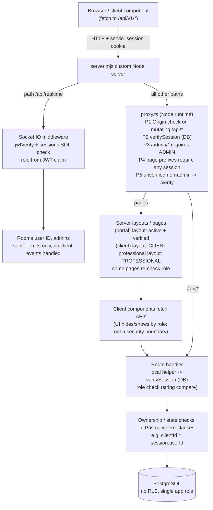

# Authentication and Authorization

Last verified against code: 2026-09-16 (commit cd8f4fb); runtime-validated 2026-09-17

> Scope: spec §6 (authentication) and §7 (authorization). This is a reverse-engineered description of what the code does, not a design proposal.
> Security risks referenced as `RISK-SEC-NNN` are defined in [../08-operations/security.md](../08-operations/security.md).
> Diagrams: [diagrams/authentication-flow.md](diagrams/authentication-flow.md), [diagrams/user-vs-admin-flow.md](diagrams/user-vs-admin-flow.md).

---

## 1. Key facts (summary)

| Topic                    | Finding                                                                                                                                                                                             | Status                              | Evidence                                                                 |
| ------------------------ | --------------------------------------------------------------------------------------------------------------------------------------------------------------------------------------------------- | ----------------------------------- | ------------------------------------------------------------------------ |
| Provider                 | Custom, in-house. No NextAuth/Auth.js, Clerk, Cognito, Supabase Auth or similar.                                                                                                                    | Implemented                         | `src/lib/auth.ts`, `app/api/auth/[action]/route.ts`                      |
| Credential store         | PostgreSQL `User` table (Prisma). `passwordHash` (bcryptjs), `googleId`, `authProvider`, `role`, `isActive`, `emailVerifiedAt`, `phoneVerifiedAt`, `username`.                                      | Implemented                         | `prisma/schema.prisma` model `User`                                      |
| Session                  | HS256 JWT (`jose`) in the `servio_session` cookie, **plus** a server-side `sessions` row that is checked on every verification (revocable).                                                         | Implemented                         | `src/lib/auth.ts:12-45`                                                  |
| Session lifetime         | Fixed 7 days (JWT `exp` 7d, cookie `maxAge` 7d, `sessions.expires_at` +7d). No refresh, no sliding expiry, no idle timeout.                                                                         | Implemented                         | `src/lib/auth.ts:14,18,71`                                               |
| Login methods            | Email+password, phone+OTP, phone+password, Google OAuth (authorization-code), email-verification link (implicitly logs in), admin username+password.                                                | Implemented                         | §4                                                                       |
| MFA / 2FA                | None.                                                                                                                                                                                               | Not present                         | no TOTP/MFA fields or code                                               |
| Roles                    | `UserRole` enum: `ADMIN`, `CLIENT`, `PROFESSIONAL`. Flat; no permissions table, no hierarchy, no admin sub-roles.                                                                                   | Implemented                         | `prisma/schema.prisma:1150-1154`                                         |
| User vs admin separation | **Not separated.** Same cookie, same JWT format, same `sessions` table, same TTL, same logout endpoint. Separation is role-based only, and the general email login endpoint accepts ADMIN accounts. | Implemented (by design or omission) | §19                                                                      |
| Route protection         | `proxy.ts` (Next 16 Proxy, Node runtime): CSRF-style Origin check on mutating `/api/*`, ADMIN role check on `/admin/*`, session-presence check on a page prefix list, unverified-email redirect.    | Implemented                         | `proxy.ts`                                                               |
| API protection           | Every API handler performs its own check by calling `verifySession()` through ~15 differently named local helpers. No shared guard.                                                                 | Implemented, inconsistent           | §24, §25                                                                 |
| Database-level authz     | None (no PostgreSQL RLS policies; single application DB role).                                                                                                                                      | Not present                         | `prisma/migrations/**` contain no `ROW LEVEL SECURITY` / `CREATE POLICY` |
| Tenancy                  | Single-tenant marketplace. Tenant-level authorization is not applicable.                                                                                                                            | N/A                                 | no tenant/org model                                                      |

---

## 2. Source map

| Concern                                      | File                                                                                                                                                                        | Key symbols                                                                                                                                            |
| -------------------------------------------- | --------------------------------------------------------------------------------------------------------------------------------------------------------------------------- | ------------------------------------------------------------------------------------------------------------------------------------------------------ |
| Session create/verify/revoke, cookie options | `src/lib/auth.ts`                                                                                                                                                           | `sessionCookie`, `createSession`, `verifySession`, `revokeSession`, `sessionOptions`, `requireAuthenticatedUser` / `requireVerifiedUser` (both unused) |
| Route guard / CSRF / request id              | `proxy.ts`                                                                                                                                                                  | `proxy`, `isTrustedStateChangingRequest`, `isAuthenticatedPage`, `config.matcher`                                                                      |
| All user auth actions                        | `app/api/auth/[action]/route.ts` (880 lines)                                                                                                                                | `GET` (google), `POST` (15 actions), `publicAppOrigin`                                                                                                 |
| Current user lookup                          | `app/api/auth/me/route.ts`                                                                                                                                                  | `GET` (cookie or `Authorization: Bearer`)                                                                                                              |
| Admin login + bootstrap                      | `app/api/admin/login/route.ts`                                                                                                                                              | `POST`, `createBootstrapAdmin`                                                                                                                         |
| Admin login UI                               | `app/admin/login/page.tsx`                                                                                                                                                  | `AdminLogin` (client component)                                                                                                                        |
| User login/signup UI                         | `src/routes/login.tsx`, `src/routes/signup.tsx`                                                                                                                             | `DEMO_ACCOUNTS`, `quickLogin`, `getPostLoginRedirect`                                                                                                  |
| Phone OTP provider                           | `src/lib/phone-otp-provider.ts`                                                                                                                                             | `requestPhoneOtp`, `verifyPhoneOtp`, `developmentCode`                                                                                                 |
| Signup phone-proof cookie                    | `src/lib/dev-phone-otp.ts`                                                                                                                                                  | `createPhoneVerificationProof`, `hasValidPhoneVerificationProof`, `phoneProofCookie`                                                                   |
| Rate limiting                                | `src/lib/rate-limit.ts`                                                                                                                                                     | `rateLimit`, `checkRateLimit` (unused by routes), `clearRateLimit`                                                                                     |
| Auth e-mails                                 | `src/lib/email.ts`                                                                                                                                                          | `sendAuthEmail`                                                                                                                                        |
| Only shared role helper                      | `src/lib/client-profile-auth.ts`                                                                                                                                            | `getClientSession` (used by 2 route files)                                                                                                             |
| Realtime (Socket.IO) auth                    | `server.mjs:38-76`                                                                                                                                                          | `io.use` middleware, rooms                                                                                                                             |
| Server-side page/layout guards               | `app/(portal)/layout.tsx`, `app/(portal)/(client)/layout.tsx`, `app/(portal)/professional/layout.tsx`, `app/(portal)/professional/dashboard/layout.tsx`, several `page.tsx` | inline `verifySession` + `redirect`                                                                                                                    |
| Persistence                                  | `prisma/schema.prisma`                                                                                                                                                      | `User`, `Session` (`sessions`), `ApiToken`, `OtpCode`                                                                                                  |

---

## 3. Identity data model (auth-relevant)

| Model / table                 | Fields used by auth                                                                                                                                                                                                                                                                                                                                                                                                                         | Notes                                                                       |
| ----------------------------- | ------------------------------------------------------------------------------------------------------------------------------------------------------------------------------------------------------------------------------------------------------------------------------------------------------------------------------------------------------------------------------------------------------------------------------------------- | --------------------------------------------------------------------------- |
| `User`                        | `id` (Int), `email` (unique, required), `phone` (unique, nullable), `username` (unique, nullable; used only by admin login), `passwordHash` (nullable for Google-only accounts), `googleId` (unique), `authProvider` (`LOCAL`/`GOOGLE`, default `LOCAL`), `role` (`UserRole`, default `CLIENT`), `isActive` (default true), `emailVerifiedAt`, `phoneVerifiedAt`, `lastLoginAt`, `isVerified` (professional KYC flag, **not** an auth flag) | `prisma/schema.prisma` model `User`                                         |
| `Session` → table `sessions`  | `id` (String; set to `randomUUID()` by code), `user_id`, `expires_at`, `revoked_at`, `created_at`; index `(user_id, revoked_at)`; cascade on user delete                                                                                                                                                                                                                                                                                    | `prisma/schema.prisma:184-194`                                              |
| `ApiToken`                    | `tokenHash` (SHA-256 hex, unique), `kind` (`EMAIL_VERIFICATION` / `PASSWORD_RESET`, free-text String), `expiresAt`, `usedAt`                                                                                                                                                                                                                                                                                                                | `prisma/schema.prisma:964-974`. No FK relation to `User` declared.          |
| `OtpCode`                     | `phone`, `codeHash` (SHA-256 of the code), `role` (String), `attempts`, `expiresAt`, `consumedAt`                                                                                                                                                                                                                                                                                                                                           | Used only by the "development" OTP provider. `prisma/schema.prisma:976-988` |
| `LegacyUser` (`legacy_users`) | has `passwordHash`, `googleId`                                                                                                                                                                                                                                                                                                                                                                                                              | Not used by any authentication code path (data-migration remnant).          |

Cleanup: no code deletes expired `sessions`, `ApiToken` or `OtpCode` rows (no `deleteMany` outside generated client).

---

## 4. Login mechanisms

| #   | Mechanism                             | Endpoint (web client calls the `/api/v1/*` alias)                                                 | Roles allowed                                                                | Session issued when                                                                                                                                                                                                                                           | Status                                                                     | Evidence                                                              |
| --- | ------------------------------------- | ------------------------------------------------------------------------------------------------- | ---------------------------------------------------------------------------- | ------------------------------------------------------------------------------------------------------------------------------------------------------------------------------------------------------------------------------------------------------------- | -------------------------------------------------------------------------- | --------------------------------------------------------------------- |
| L1  | Email + password                      | `POST /api/auth/login`                                                                            | **CLIENT, PROFESSIONAL and ADMIN** (no role filter)                          | password matches, `isActive`, `emailVerifiedAt` set                                                                                                                                                                                                           | Implemented                                                                | `app/api/auth/[action]/route.ts:446-533`                              |
| L2  | Phone + OTP                           | `POST /api/auth/send-phone-login-otp` then `POST /api/auth/login-phone`                           | CLIENT, PROFESSIONAL (ADMIN rejected)                                        | OTP valid **and** `emailVerifiedAt` set                                                                                                                                                                                                                       | Implemented                                                                | `route.ts:534-601`                                                    |
| L3  | Phone + password                      | `POST /api/auth/login-phone-password`                                                             | CLIENT, PROFESSIONAL                                                         | password matches — **cookie is set even when e-mail is unverified** (response is 403 but carries `Set-Cookie`; the session works for `/api/auth/me` and `POST /api/client/jobs` → 201) [VALIDATED 2026-09-17 · [V-23](../validation/LOCAL_VALIDATION_LOG.md)] | Implemented (defect, RISK-SEC-009)                                         | `route.ts:602-653`                                                    |
| L4  | Google OAuth 2.0 (authorization code) | `GET /api/auth/google` (start and callback)                                                       | Any role, **including ADMIN** if the Google e-mail matches an admin's e-mail | Google profile has `email_verified === true`                                                                                                                                                                                                                  | Implemented, only if `GOOGLE_CLIENT_ID` and `GOOGLE_CLIENT_SECRET` are set | `route.ts:101-222`                                                    |
| L5  | E-mail verification link              | `POST /api/auth/verify-email`                                                                     | CLIENT, PROFESSIONAL (any user holding a token)                              | token valid → session created                                                                                                                                                                                                                                 | Implemented                                                                | `route.ts:803-844`                                                    |
| L6  | Admin username + password             | `POST /api/admin/login`                                                                           | ADMIN only (`findFirst({ username, role: "ADMIN" })`)                        | password matches and `isActive`                                                                                                                                                                                                                               | Implemented                                                                | `app/api/admin/login/route.ts:44-83`                                  |
| L7  | Bearer token                          | `Authorization: Bearer <jwt>` accepted by `GET /api/auth/me` and `GET/POST /api/client/jobs` only | as the token's user                                                          | n/a (re-uses the cookie JWT returned in L1's JSON body)                                                                                                                                                                                                       | Partially implemented (mobile-oriented, 2 endpoints)                       | `app/api/auth/me/route.ts:6-10`, `app/api/client/jobs/route.ts:49-52` |

Not present: magic links (other than L5), passkeys/WebAuthn, SSO/SAML, username login for non-admins, "remember me", device management.

UI entry points:

- `src/routes/login.tsx` (rendered by `app/login/page.tsx`): e-mail/password and phone/OTP tabs, Google button, and an **always-visible "Quick fill — temporary, for testing only" selector that signs in immediately with hard-coded seed client/professional credentials** (`src/routes/login.tsx:15-26, 299-318`; RISK-SEC-002).
- `app/admin/login/page.tsx`: username/password form with an **"Auto-fill demo credentials" button containing the seed admin username and password literal** (`app/admin/login/page.tsx:54-58, 230-240`; RISK-SEC-002).

---

## 5. Registration

| Aspect                  | Behaviour                                                                                                                                                                                                                                                                                                                                       | Evidence                                                                                                                |
| ----------------------- | ----------------------------------------------------------------------------------------------------------------------------------------------------------------------------------------------------------------------------------------------------------------------------------------------------------------------------------------------- | ----------------------------------------------------------------------------------------------------------------------- |
| Endpoint                | `POST /api/auth/register`                                                                                                                                                                                                                                                                                                                       | `route.ts:366-445`                                                                                                      |
| Role choice             | Body field `role: "CLIENT"                                                                                                                                                                                                                                                                                                                      | "PROFESSIONAL"`(zod enum). The signup UI toggles client/pro and also honours`?role=` query. ADMIN cannot self-register. | `route.ts:37`; `src/routes/signup.tsx:16,34,113` |
| Required fields         | `firstName`, `lastName` (1-80), `email` (zod email, **not lower-cased** — a mixed-case registered e-mail can never log in by e-mail/password, as typed or lower-cased, even after verification [VALIDATED 2026-09-17 · [V-21](../validation/LOCAL_VALIDATION_LOG.md)]), `password` (policy below), `terms: true`; `phone` optional (7-25 chars) | `route.ts:31-39`                                                                                                        |
| Phone at signup         | If `phone` provided, the request must carry a valid `servio_phone_verification` proof cookie for the same phone+role (issued by `verify-phone` after OTP). `phoneVerifiedAt` is set at creation.                                                                                                                                                | `route.ts:378-390, 413`; `src/lib/dev-phone-otp.ts`                                                                     |
| Duplicate handling      | 409 with per-field messages if e-mail or phone exists (account enumeration, RISK-SEC-014)                                                                                                                                                                                                                                                       | `route.ts:391-406`                                                                                                      |
| Result                  | User created with `role`, bcrypt hash; background jobs notify admins (and clients, for new professionals) and send the verification e-mail; response `201 { success, redirect: "/verify" }`; **no session is created**; proof cookie cleared.                                                                                                   | `route.ts:407-444`                                                                                                      |
| Google signup           | First Google login creates the user with `role` from `?role=` (default CLIENT), `authProvider: "GOOGLE"`, `emailVerifiedAt: now`, no password.                                                                                                                                                                                                  | `route.ts:111-114, 169-186`                                                                                             |
| Professional onboarding | After verification the professional is routed to `/professional/setup?profileSetup=1` until category + coordinates exist; client to `/client-profile?profileSetup=1`. This is routing, not authorization.                                                                                                                                       | `route.ts:464-477, 823-833`                                                                                             |

Pre-signup helpers: `POST /api/auth/check-availability` (e-mail/phone taken?), `POST /api/auth/send-phone-otp`, `POST /api/auth/verify-phone` (§20).

---

## 6. Password handling

| Aspect                             | Value                                                                                                                 | Evidence                                                                     |
| ---------------------------------- | --------------------------------------------------------------------------------------------------------------------- | ---------------------------------------------------------------------------- |
| Library                            | `bcryptjs`                                                                                                            | `route.ts:3`                                                                 |
| Cost factor                        | 12 (register, reset, admin bootstrap, seed)                                                                           | `route.ts:414, 870`; `app/api/admin/login/route.ts:36`; `prisma/seed.ts:817` |
| Policy (register/reset)            | min 8 chars, at least one upper-case, one lower-case, one digit; **no maximum length** (bcrypt truncates at 72 bytes) | `route.ts:30`                                                                |
| Policy (login)                     | `min(1)` only                                                                                                         | `route.ts:40, 604`                                                           |
| Admin login input                  | username 1-64, password 1-256                                                                                         | `app/api/admin/login/route.ts:8-11`                                          |
| Comparison                         | `bcrypt.compare`; generic "Invalid email or password." on failure                                                     | `route.ts:451-456`                                                           |
| Change password (authenticated)    | **Not implemented** (only reset flow).                                                                                | no endpoint found                                                            |
| Password on Google-linked accounts | Existing `passwordHash` is kept when an account is linked to Google; both methods keep working.                       | `route.ts:187-192`                                                           |

---

## 7. Session mechanism

### 7.1 Token

| Property      | Value                                                                                                                                   | Evidence                                            |
| ------------- | --------------------------------------------------------------------------------------------------------------------------------------- | --------------------------------------------------- |
| Format        | JWT, `alg: HS256`, signed with `jose` `SignJWT`                                                                                         | `src/lib/auth.ts:15-19`                             |
| Secret        | `AUTH_SECRET` env (UTF-8 bytes). Module throws at import if unset. No minimum-length check. Same secret also signs the phone-proof JWT. | `src/lib/auth.ts:7-9`; `src/lib/dev-phone-otp.ts:8` |
| Claims        | `userId` (number), `role` (UserRole at login time), `sessionId` (UUID), `iat`, `exp` (+7d)                                              | `src/lib/auth.ts:15-18`                             |
| Server record | `sessions` row `{ id: sessionId, userId, expiresAt: now+7d }` created with the token                                                    | `src/lib/auth.ts:13-14, 20`                         |

### 7.2 Cookie `servio_session` (`sessionOptions`)

| Flag                         | Value                                                                                                                                                 | Evidence             |
| ---------------------------- | ----------------------------------------------------------------------------------------------------------------------------------------------------- | -------------------- |
| `httpOnly`                   | `true`                                                                                                                                                | `src/lib/auth.ts:67` |
| `secure`                     | `process.env.NODE_ENV === "production"`                                                                                                               | `src/lib/auth.ts:68` |
| `sameSite`                   | `lax`                                                                                                                                                 | `src/lib/auth.ts:69` |
| `path`                       | `/`                                                                                                                                                   | `src/lib/auth.ts:70` |
| Observed (production server) | `Path=/; Max-Age=604800; Secure; HttpOnly; SameSite=lax` (no `__Host-` prefix) [VALIDATED 2026-09-17 · [V-32](../validation/LOCAL_VALIDATION_LOG.md)] | `Set-Cookie` header  |
| `maxAge`                     | 604800 s (7 days)                                                                                                                                     | `src/lib/auth.ts:71` |
| `domain`                     | not set (host-only)                                                                                                                                   | —                    |

Other auth-related cookies:

| Cookie                                                            | Purpose                                                                                                                     | Flags                                           | Evidence                                      |
| ----------------------------------------------------------------- | --------------------------------------------------------------------------------------------------------------------------- | ----------------------------------------------- | --------------------------------------------- |
| `servio_phone_verification`                                       | Signed proof (HS256 JWT, `purpose: "signup-phone"`, phone, role, `jti`) that the phone was OTP-verified before registration | httpOnly, secure in prod, lax, path `/`, 10 min | `src/lib/dev-phone-otp.ts:14-54`              |
| `servio_google_oauth`                                             | OAuth `state`, requested `role`, `nextPath` (JSON, unsigned)                                                                | httpOnly, secure in prod, lax, path `/`, 600 s  | `route.ts:124-130`                            |
| `servio_admin_seen_verifications`, `servio_admin_seen_operations` | Admin sidebar "last seen" ISO timestamps (not auth)                                                                         | httpOnly, lax, 30 days, **no `secure`**         | `app/api/admin/sidebar-counts/route.ts:69-90` |

### 7.3 Verification algorithm (`verifySession`, `src/lib/auth.ts:23-45`)

1. `jwtVerify(token, secret)` — signature and `exp`.
2. Require `payload.sessionId` string and positive safe-integer `payload.userId`.
3. Load `sessions` row by id with `user { id, role, isActive, emailVerifiedAt }`.
4. Reject if row missing, `revokedAt` set, or `expiresAt <= now`.
5. Reject if `user.id !== payload.userId` or `!user.isActive`.
6. Return `{ userId, role: user.role /* from DB, not JWT */, emailVerifiedAt }`.

Consequences:

- Role changes and deactivation take effect immediately for HTTP requests (the DB role is authoritative).
- Every verification is a database round-trip; the proxy performs one for every matched request that carries the cookie, and route handlers/layouts perform additional ones.
- `verifySession` does **not** check `emailVerifiedAt`; callers decide (most APIs do not — RISK-SEC-009).

### 7.4 Where the session is verified

| Layer                          | Mechanism                                                                  | Role source                                                                                                                                                                                                                                                                                                                           |
| ------------------------------ | -------------------------------------------------------------------------- | ------------------------------------------------------------------------------------------------------------------------------------------------------------------------------------------------------------------------------------------------------------------------------------------------------------------------------------- |
| `proxy.ts`                     | `verifySession` once per request if cookie present                         | DB                                                                                                                                                                                                                                                                                                                                    |
| Server layouts/pages           | inline `verifySession` + `redirect`                                        | DB                                                                                                                                                                                                                                                                                                                                    |
| API route handlers             | inline `verifySession` via local helpers                                   | DB                                                                                                                                                                                                                                                                                                                                    |
| Socket.IO (`server.mjs:38-68`) | `jwtVerify` + raw SQL on `sessions` join `User` (revoked/expired/isActive) | **JWT claim** (stale until re-login); DB check skipped entirely if `DATABASE_URL` unset or JWT lacks `sessionId` (fail-open, RISK-SEC-013). `DATABASE_URL` is read before `.env` is loaded, so with the URL only in `.env` a revoked token opened a new socket [CORRECTED 2026-09-17 · [V-10](../validation/LOCAL_VALIDATION_LOG.md)] |

### 7.5 Token refresh

**Not implemented.** No refresh token, no re-issue on activity. After 7 days the cookie expires and `verifySession` fails; the user must log in again.

### 7.6 Token storage (client side)

- Browser: httpOnly cookie only. No `localStorage`/`sessionStorage` token storage found (local storage is used only for UI flags and job drafts).
- **However** `POST /api/auth/login` also returns the JWT in the JSON body (`token`) (`route.ts:518-530`), which is readable by page JavaScript; the web UI ignores it (RISK-SEC-011) `[VALIDATED 2026-09-17 · V-29]`.

---

## 8. Logout and revocation

| Event                                                                   | Effect                                                                                                                                                                                                                               | Evidence                                    |
| ----------------------------------------------------------------------- | ------------------------------------------------------------------------------------------------------------------------------------------------------------------------------------------------------------------------------------ | ------------------------------------------- |
| `POST /api/auth/logout`                                                 | If cookie present: `revokeSession` sets `revokedAt` on that session row; cookie cleared (`maxAge: 0`). If the JWT fails verification, returns **500 and does not clear the cookie**. Subject to the generic 5/min per-IP rate limit. | `route.ts:654-666`; `src/lib/auth.ts:47-55` |
| Admin logout                                                            | Same endpoint (`/api/v1/auth/logout`)                                                                                                                                                                                                | `src/components/AdminHeader.tsx:27-28`      |
| Password reset                                                          | Revokes **all** active sessions of the user                                                                                                                                                                                          | `route.ts:872-875`                          |
| Admin deactivates user (`PATCH /api/admin/users/[id]` `isActive:false`) | Sets `isActive=false` and revokes all sessions                                                                                                                                                                                       | `app/api/admin/users/[id]/route.ts:16-29`   |
| Admin deletes user                                                      | Sessions cascade-deleted                                                                                                                                                                                                             | `prisma/schema.prisma:190`                  |
| E-mail change (`update-email`)                                          | Does **not** revoke sessions                                                                                                                                                                                                         | `route.ts:667-717`                          |
| "Log out everywhere"                                                    | Not implemented                                                                                                                                                                                                                      | —                                           |

Socket.IO connections are authenticated only at handshake; a revoked session keeps an already-open socket connected until disconnect (still connected after logout; a new connection with the revoked token is rejected when the revocation pool exists) `[VALIDATED 2026-09-17 · V-28]` ([log](../validation/LOCAL_VALIDATION_LOG.md)).

---

## 9. Password reset

| Variant | Steps                                                                                                                                                                                                                                                                                                              | Token                      | Evidence                    |
| ------- | ------------------------------------------------------------------------------------------------------------------------------------------------------------------------------------------------------------------------------------------------------------------------------------------------------------------ | -------------------------- | --------------------------- |
| E-mail  | `POST forgot-password {email}` → always `200 {success}` (no enumeration) → if user exists: 32-byte random token, SHA-256 stored in `ApiToken(kind=PASSWORD_RESET)`, **expires 1 h**, e-mail link `${publicAppOrigin(request)}/reset-password?token=…` sent in background → `POST reset-password {token, password}` | single-use (`usedAt`), 1 h | `route.ts:737-765, 845-878` |
| Phone   | `POST forgot-password-phone {phone}` (3 per 10 min per IP+phone) → OTP sent if active CLIENT/PROFESSIONAL → `POST verify-forgot-password-phone {phone, code}` (5 per 10 min) → **returns the raw reset token in JSON**, 30 min → `POST reset-password`                                                             | single-use, 30 min         | `route.ts:766-802`          |

Observations:

- `isActive` is not checked by `forgot-password` (e-mail) or `reset-password` (inactive users cannot log in afterwards anyway).
- Earlier unused reset tokens are not invalidated when a new one is issued.
- The reset e-mail template text says the link "expires in 24 hours" (`src/lib/email.ts:98`) while the token expires in 1 hour.
- Reset/verification link origin is derived from `X-Forwarded-Host`/`Host` headers (`publicAppOrigin`, `route.ts:45-73`) — host-header poisoning (RISK-SEC-005): `forgot-password` with `X-Forwarded-Host: evil.example` e-mailed a reset link on `https://evil.example`; links follow `Host`, not `APP_URL` `[VALIDATED 2026-09-17 · V-25]`.
- ADMIN accounts can use the e-mail reset flow (no role restriction); the phone flow excludes ADMIN.

---

## 10. E-mail verification

| Step           | Behaviour                                                                                                                                                                                                                                                                                     | Evidence                                    |
| -------------- | --------------------------------------------------------------------------------------------------------------------------------------------------------------------------------------------------------------------------------------------------------------------------------------------- | ------------------------------------------- |
| Token issue    | On register, `resend-verification` (requires session) and `update-email`: 32-byte random, SHA-256 in `ApiToken(kind=EMAIL_VERIFICATION)`, 24 h                                                                                                                                                | `route.ts:74-94, 430-435, 719-736, 685-708` |
| Link           | `${publicAppOrigin}/verify-email?token=…`                                                                                                                                                                                                                                                     | `route.ts:91`                               |
| Consume        | `POST verify-email {token}` → marks token used, sets `emailVerifiedAt`, **creates a session** and returns a redirect                                                                                                                                                                          | `route.ts:803-844`                          |
| Enforcement    | (a) L1/L2 refuse login with 403 `EMAIL_NOT_VERIFIED`; (b) `proxy.ts:78-91` redirects authenticated non-admin users without `emailVerifiedAt` to `/verify` on non-exempt pages; (c) `(portal)` layout and some pages redirect; (d) **API handlers do not check it** except `POST /api/profile` | see refs                                    |
| Gap            | L3 (phone+password) sets a session cookie for unverified users, which the APIs accept (RISK-SEC-009).                                                                                                                                                                                         | `route.ts:637-652`                          |
| `update-email` | Requires only a session (no password re-entry); immediately replaces the e-mail and clears `emailVerifiedAt`.                                                                                                                                                                                 | `route.ts:667-717`                          |

---

## 11. Phone verification and OTP provider

| Aspect               | Behaviour                                                                                                                                                                                                                                                                                                                                                                                                                                                                                                                                                                                                                                        | Evidence                                              |
| -------------------- | ------------------------------------------------------------------------------------------------------------------------------------------------------------------------------------------------------------------------------------------------------------------------------------------------------------------------------------------------------------------------------------------------------------------------------------------------------------------------------------------------------------------------------------------------------------------------------------------------------------------------------------------------ | ----------------------------------------------------- |
| Provider selection   | `PHONE_OTP_PROVIDER` (default `"development"`). Only the literal `"twilio"` uses Twilio Verify; **any other value uses the local "development" provider.**                                                                                                                                                                                                                                                                                                                                                                                                                                                                                       | `src/lib/phone-otp-provider.ts:13-15, 80, 121`        |
| Development provider | Code = `DEV_PHONE_OTP` if set; else a fixed default 4-digit code when `NODE_ENV !== "production"`; else a random 4-digit code. Code is SHA-256-hashed into `OtpCode` (10 min, max 5 attempts, prior codes invalidated). **No SMS is ever sent** by this provider; in non-production the code is written to the server console (confirmed in the server log). **Verification always fails when the DB session TimeZone is not UTC** (raw `"expiresAt" > NOW()`; proven IST fail / UTC pass) `[FOUND IN VALIDATION 2026-09-17 · V-27]`. A code comment states Preview and Production must set `DEV_PHONE_OTP` "while this temporary mode is used". | `src/lib/phone-otp-provider.ts:25-32, 76-88, 110-164` |
| Twilio Verify        | `verifications.create({channel:"sms"})` / `verificationChecks.create`; expiry and attempt limits delegated to Twilio                                                                                                                                                                                                                                                                                                                                                                                                                                                                                                                             | `src/lib/phone-otp-provider.ts:90-106, 166-193`       |
| Generic SMS API      | `SMS_API_KEY`, `SMS_API_SECRET`, `SMS_SENDER_ID`, `SMS_API_URL` exist in `.env.example` but are **not referenced by any code**.                                                                                                                                                                                                                                                                                                                                                                                                                                                                                                                  | grep: no usage                                        |
| Attempt atomicity    | Development provider increments `attempts` and consumes via a single conditional `UPDATE` (`Prisma.sql`, parameterised)                                                                                                                                                                                                                                                                                                                                                                                                                                                                                                                          | `src/lib/phone-otp-provider.ts:149-162`               |
| Uses                 | signup phone proof (`send-phone-otp`/`verify-phone`), phone login (L2), phone password reset, adding a phone to an existing account (`verify-phone` with session)                                                                                                                                                                                                                                                                                                                                                                                                                                                                                | §20                                                   |

Security consequence: if a deployed environment runs the development provider with `DEV_PHONE_OTP` set, the OTP is a static shared value and phone login / phone password reset become account-takeover vectors for any CLIENT/PROFESSIONAL whose phone number is known (RISK-SEC-001, `[NEEDS VALIDATION — not testable locally]` against deployed env configuration; locally the development provider without `DEV_PHONE_OTP` uses the fixed development code `[VALIDATED 2026-09-17 · V-27]`).

---

## 12. OAuth / social login (Google)

| Aspect                             | Behaviour                                                                                                                                                                                                                                                                                                                                                                                                                        | Evidence                            |
| ---------------------------------- | -------------------------------------------------------------------------------------------------------------------------------------------------------------------------------------------------------------------------------------------------------------------------------------------------------------------------------------------------------------------------------------------------------------------------------- | ----------------------------------- |
| Enabled when                       | `GOOGLE_CLIENT_ID` **and** `GOOGLE_CLIENT_SECRET` set; otherwise redirect `/login?oauthError=google-not-configured`                                                                                                                                                                                                                                                                                                              | `route.ts:102-108`                  |
| Flow                               | Authorization Code, scope `openid email profile`, `prompt=select_account`; token exchange at `oauth2.googleapis.com/token`; profile from OIDC `userinfo`                                                                                                                                                                                                                                                                         | `route.ts:115-168`                  |
| Redirect URI                       | `${publicAppOrigin(request)}/api/v1/auth/google` (served via the `/api/v1/:path*` rewrite to `/api/auth/[action]`)                                                                                                                                                                                                                                                                                                               | `route.ts:104`; `next.config.ts:25` |
| CSRF (`state`)                     | 48-hex random `state` stored in `servio_google_oauth` cookie and compared on callback                                                                                                                                                                                                                                                                                                                                            | `route.ts:115, 124-141`             |
| PKCE / nonce / ID-token validation | Not used (confidential client with secret; identity taken from `userinfo`)                                                                                                                                                                                                                                                                                                                                                       | —                                   |
| Account matching                   | `findFirst({ OR: [{ googleId: sub }, { email }] })` — **auto-links any existing account (including ADMIN) with the same e-mail** and sets `authProvider: GOOGLE`, `emailVerifiedAt`                                                                                                                                                                                                                                              | `route.ts:169-192`                  |
| Requirements                       | `email_verified === true`                                                                                                                                                                                                                                                                                                                                                                                                        | `route.ts:167`                      |
| `isActive` check                   | Not checked before `createSession` (a session row is created; `verifySession` then rejects it)                                                                                                                                                                                                                                                                                                                                   | `route.ts:207-212`                  |
| Post-login redirect                | `nextPath` accepted if it starts with `/` and not `//` (a `/\host` value is not rejected — possible open redirect, RISK-SEC-010; `next=/\evil.example` is stored unmodified in `servio_google_oauth`, passes the guard and `new URL()` resolves it to `http://evil.example/`; callback not executed end-to-end `[PARTIALLY VALIDATED 2026-09-17 · V-24]`); else role default (`/client-profile`, `/professional-home`, `/admin`) | `route.ts:199-206`                  |
| Other providers                    | None                                                                                                                                                                                                                                                                                                                                                                                                                             | —                                   |

---

## 13. MFA / 2FA

**Not present** for any role, including ADMIN. Phone OTP is used as a primary login factor (L2) or for phone verification, never as a second factor.

---

## 14. `proxy.ts` behaviour (Next.js 16 Proxy)

Next 16 renamed Middleware to Proxy; it runs on the Node.js runtime by default and executes before `next.config` `afterFiles` rewrites, so it sees the **original** path (e.g. `/api/v1/...`) (`node_modules/next/dist/docs/01-app/03-api-reference/03-file-conventions/proxy.md`, "Execution order", "Runtime").

Matcher: every path except `_next/static`, `_next/image`, `favicon.ico` (`proxy.ts:102-104`). Socket.IO traffic on `/api/realtime` is intercepted by `server.mjs` before Next and does not pass through the proxy.

| Step                       | Condition                                                                                                                       | Action                                                                                                                   | Evidence                |
| -------------------------- | ------------------------------------------------------------------------------------------------------------------------------- | ------------------------------------------------------------------------------------------------------------------------ | ----------------------- |
| P1 CSRF-style origin check | path starts with `/api/` and method ∈ POST/PUT/PATCH/DELETE                                                                     | Allow only if `Origin` header equals `request.nextUrl.origin` or exactly equals `APP_URL`; **missing Origin → 403 JSON** | `proxy.ts:4-14, 44-46`  |
| P2 Session load            | cookie present                                                                                                                  | `verifySession`; errors → treated as anonymous                                                                           | `proxy.ts:53-61`        |
| P3 Admin pages             | path starts with `/admin` and is not exactly `/admin/login`                                                                     | redirect `/admin/login` unless `session.role === "ADMIN"`                                                                | `proxy.ts:63-68`        |
| P4 Protected pages         | non-API path matching prefix list                                                                                               | redirect `/login` if no session (**role not checked**)                                                                   | `proxy.ts:16-37, 70-75` |
| P5 E-mail verification     | non-API, non-admin, not in exempt list (`/login`, `/signup`, `/verify`, `/verify-email`, `/forgot-password`, `/reset-password`) | redirect `/verify` if session is non-ADMIN and `emailVerifiedAt` is null                                                 | `proxy.ts:77-91`        |
| P6 Correlation id          | always                                                                                                                          | propagate/generate `x-request-id` on request and response                                                                | `proxy.ts:93-99`        |

P4 prefix list: `/dashboard`, `/discover`, `/messages`, `/my-jobs`, `/post-job`, `/reports`, `/earnings`, `/notifications`, `/professional`, `/professional-profile`, `/professional-home/dashboard` (no such page exists — stale entry), `/client-profile`, `/my-info`, `/project`.

Edge cases of P1 (details in security.md §CSRF):

- Server-to-server webhooks (`/api/webhooks/razorpay`, `/api/webhooks/persona`) send no `Origin` and are therefore **rejected with 403 before the handler runs** (RISK-SEC-004; locally both webhooks without Origin → 403 "Request origin is not allowed." `[PARTIALLY VALIDATED 2026-09-17 · V-20]`; live webhook delivery `[NEEDS VALIDATION — not testable locally]`).
- Non-browser clients (mobile, curl, Bearer-token callers) must send an `Origin` header to perform mutations (Bearer POST without Origin → 403 `[VALIDATED 2026-09-17 · V-20]`).
- `APP_URL` comparison is exact string equality (a trailing slash in `APP_URL` would never match a browser `Origin`).
- Behind a reverse proxy, `request.nextUrl.origin` may differ from the public origin; correctness then depends on `APP_URL` being set. Even without a reverse proxy, under `server.mjs` a genuine same-origin request (`Origin: http://127.0.0.1:3100` to 127.0.0.1:3100) was rejected with 403 and only the exact `APP_URL` origin passed — in practice mutations work only at exactly `APP_URL` `[CORRECTED 2026-09-17 · V-20]`; behaviour behind the production edge `[NEEDS VALIDATION — not testable locally]`.
- GET endpoints are not covered (e.g. `GET /api/portal/invoices/[paymentId]` performs an `invoice.upsert`).

---

## 15. Protected routes (pages)

### 15.1 Page protection matrix

| Route group / page                                                                                                                    | Proxy (P3/P4/P5)                    | Server layout/page check                                                                                      | Role enforced server-side?                                            | Evidence                                                                           |
| ------------------------------------------------------------------------------------------------------------------------------------- | ----------------------------------- | ------------------------------------------------------------------------------------------------------------- | --------------------------------------------------------------------- | ---------------------------------------------------------------------------------- |
| Marketing `(marketing)/*`, `/blog`, `/careers`, `/pro/[proId]`                                                                        | P5 only (if logged in & unverified) | `/` redirects PROFESSIONAL to `/professional-home`                                                            | n/a (public)                                                          | `app/(marketing)/page.tsx`                                                         |
| `/professional-home`                                                                                                                  | P5                                  | `verifySession`; non-PROFESSIONAL → `/login`; unverified → `/verify`; incomplete profile → setup              | Yes (PROFESSIONAL)                                                    | `app/(marketing)/professional-home/page.tsx:8-37`                                  |
| `/login`, `/signup`, `/verify`, `/verify-email`, `/forgot-password`, `/reset-password`                                                | none                                | none                                                                                                          | n/a                                                                   | —                                                                                  |
| All `(portal)/*` pages                                                                                                                | P4 for listed prefixes, P5          | `(portal)/layout.tsx`: session required, `isActive`, non-admin must be verified; any role incl. ADMIN allowed | No (at this layer)                                                    | `app/(portal)/layout.tsx:7-39`                                                     |
| `(portal)/(client)/*`: `/dashboard`, `/discover`, `/job/[jobId]`, `/messages`, `/my-jobs`, `/post-job`, `/reports`, `/client-profile` | P4 (except `/job`), P5              | `(client)/layout.tsx`: PROFESSIONAL → `/professional-profile`, ADMIN → `/admin`                               | Yes (CLIENT)                                                          | `app/(portal)/(client)/layout.tsx:5-19`                                            |
| `(portal)/professional/*`                                                                                                             | P4, P5                              | `professional/layout.tsx` (+ duplicate `dashboard/layout.tsx`): non-PROFESSIONAL redirected                   | Yes (PROFESSIONAL)                                                    | `app/(portal)/professional/layout.tsx:5-25`                                        |
| `(portal)/professional-profile`                                                                                                       | P4, P5                              | page: non-PROFESSIONAL redirected                                                                             | Yes                                                                   | `app/(portal)/professional-profile/page.tsx:155-171`                               |
| `(portal)/earnings`, `(portal)/verification`                                                                                          | P4 (`/earnings` only), P5           | page renders client or professional variant by role; ADMIN → `/admin`                                         | Yes (CLIENT or PROFESSIONAL)                                          | `app/(portal)/earnings/page.tsx:28-40`, `app/(portal)/verification/page.tsx:28-40` |
| `(portal)/notifications`                                                                                                              | P4, P5                              | portal layout only                                                                                            | No (any active verified role)                                         | —                                                                                  |
| `/my-info`                                                                                                                            | P4, P5                              | page: CLIENT only, verified                                                                                   | Yes                                                                   | `app/my-info/page.tsx:20-46`                                                       |
| `/professional/setup`                                                                                                                 | P4                                  | page: PROFESSIONAL, verified                                                                                  | Yes                                                                   | `app/professional/setup/page.tsx:7-22`                                             |
| `/professional/my-jobs/[jobId]`                                                                                                       | P4                                  | none (re-exports client component `src/routes/job.$jobId`)                                                    | **No** — data protected by APIs                                       | `app/professional/my-jobs/[jobId]/page.tsx`                                        |
| `/project/[projectId]`, `/project/[projectId]/tracking`                                                                               | P4                                  | none (redirect / client component)                                                                            | **No** — data protected by `GET /api/portal/project` membership check | `app/project/[projectId]/tracking/page.tsx`                                        |
| `/admin/login`                                                                                                                        | none                                | none                                                                                                          | n/a                                                                   | —                                                                                  |
| `/admin`                                                                                                                              | P3                                  | page re-checks ADMIN                                                                                          | Yes (twice)                                                           | `app/admin/page.tsx`                                                               |
| `/admin/cms`                                                                                                                          | P3                                  | page re-checks ADMIN                                                                                          | Yes (twice)                                                           | `app/admin/cms/page.tsx`                                                           |
| `/admin/{finance,messages,notifications,operations,reports,services,support,users,verifications}`                                     | P3                                  | none (client components; `AdminPortal` layout has no auth logic)                                              | Yes (proxy only)                                                      | `app/admin/layout.tsx`, `src/components/AdminPortal.tsx`                           |

Defect: in `app/(portal)/layout.tsx:16-39`, `app/professional/setup/page.tsx:10-20`, `app/admin/page.tsx` and `app/admin/cms/page.tsx`, `redirect()` is called inside `try { … } catch { redirect(...) }`. `redirect()` works by throwing, so the inner redirect is caught and replaced by the catch-block target (e.g. an unverified user gets `/login` instead of `/verify` from the portal layout). Proxy step P5 normally redirects first, so impact is low (RISK-SEC-025).

---

## 16. Admin authentication

| Aspect              | Behaviour                                                                                                                | Evidence                                    |
| ------------------- | ------------------------------------------------------------------------------------------------------------------------ | ------------------------------------------- |
| UI                  | `/admin/login` (client component) posts `{username, password}` to `/api/v1/admin/login`, then `router.replace("/admin")` | `app/admin/login/page.tsx:30-52`            |
| Credential lookup   | `db.user.findFirst({ where: { username, role: "ADMIN" } })` (username is not normalised here; bootstrap lower-cases)     | `app/api/admin/login/route.ts:61-65`        |
| Checks              | `passwordHash` present, `isActive`, `bcrypt.compare`; generic 401 "Invalid administrator credentials."                   | `route.ts:67-73`                            |
| Rate limit          | 5 attempts / 15 min per `X-Forwarded-For` (first entry) + username; in-memory                                            | `route.ts:13-15, 53-59`                     |
| Session             | `createSession({ userId, role: "ADMIN" })` → same `servio_session` cookie and `sessionOptions` as users                  | `route.ts:76-81`                            |
| E-mail verification | Not required for ADMIN anywhere (proxy P5 and portal layout exempt ADMIN)                                                | `proxy.ts:88`, `app/(portal)/layout.tsx:30` |

### 16.1 Bootstrap (`ADMIN_BOOTSTRAP_*`)

| Condition        | Behaviour                                                                                                                                                                                                                                         | Evidence                                                   |
| ---------------- | ------------------------------------------------------------------------------------------------------------------------------------------------------------------------------------------------------------------------------------------------- | ---------------------------------------------------------- |
| Trigger          | Only when `db.user.count({ role: "ADMIN" }) === 0` at the time of an admin login attempt                                                                                                                                                          | `route.ts:61-64`                                           |
| Required env     | `ADMIN_BOOTSTRAP_USERNAME`, `ADMIN_BOOTSTRAP_PASSWORD` (≥ 12 chars), **`ADMIN_EMAIL` (valid e-mail)** — `ADMIN_EMAIL` is not listed in `.env.example`; without it admin login returns 401 and no admin is created `[VALIDATED 2026-09-17 · V-31]` | `route.ts:17-23`                                           |
| Creation         | If a user with that username exists: reuse it only if ADMIN, else fail. Otherwise create `ADMIN` user (`firstName "Platform"`, `lastName "Administrator"`, verified, active). If `ADMIN_EMAIL` is already owned, uses `<username>@admin.local`.   | `route.ts:25-41`                                           |
| Quirk            | While no admin exists, **the submitted username is ignored**: the bootstrap user is created/loaded from env and only the submitted password is compared.                                                                                          | `route.ts:62-70`                                           |
| Seed alternative | `prisma/seed.ts` upserts a seed admin (username `seed-admin`) with a shared seed password; the same username/password literal is embedded in the admin login page UI.                                                                             | `prisma/seed.ts:809-822`; `app/admin/login/page.tsx:54-58` |

### 16.2 Admin session handling

- Identical to user sessions: same cookie name, flags, 7-day TTL, `sessions` table, `verifySession`, logout endpoint.
- No admin-specific idle timeout, shorter TTL, re-authentication for sensitive actions, IP allow-listing, step-up, or MFA.
- Socket.IO: ADMIN sockets additionally join rooms `admins` and `admin:room` (`server.mjs:72-75`); `admin:room` is never emitted to (`src/lib/realtime.ts` uses only `admins`). Room membership is decided from the JWT `role` claim.

---

## 17. Are user and admin authentication actually separate? (spec §6)

**Verdict: No.** The separate login pages are a UI distinction. Underneath there is one identity table, one session mechanism, and role checks are the only separation.

| Question                                        | Answer                                                                                                                                                                                                                                                                                                                    | Evidence                                                                   |
| ----------------------------------------------- | ------------------------------------------------------------------------------------------------------------------------------------------------------------------------------------------------------------------------------------------------------------------------------------------------------------------------- | -------------------------------------------------------------------------- |
| Different cookie name?                          | No — both use `servio_session`.                                                                                                                                                                                                                                                                                           | `src/lib/auth.ts:10`; `app/api/admin/login/route.ts:77-81`; `route.ts:531` |
| Different JWT format / secret / algorithm?      | No — same `createSession`, same `AUTH_SECRET`, HS256, same claims.                                                                                                                                                                                                                                                        | `src/lib/auth.ts:12-22`                                                    |
| Different session table / TTL?                  | No — same `sessions` table, same 7-day expiry.                                                                                                                                                                                                                                                                            | `src/lib/auth.ts:13-20`                                                    |
| Different identity store?                       | No — admins are `User` rows with `role = ADMIN`.                                                                                                                                                                                                                                                                          | `prisma/schema.prisma` `User.role`                                         |
| Can an admin use the user login endpoint?       | **Yes.** `POST /api/auth/login` has no role filter and returns `redirect: "/admin"` for ADMIN. Google OAuth also logs in an ADMIN whose e-mail matches. Phone login (L2/L3) and phone reset exclude ADMIN. E-mail password reset works for ADMIN.                                                                         | `route.ts:449-466, 169-206, 547, 565, 616, 773, 740`                       |
| Can a user use the admin login endpoint?        | No — lookup is `role: "ADMIN"`; bootstrap only creates ADMIN.                                                                                                                                                                                                                                                             | `app/api/admin/login/route.ts:65`                                          |
| Can a user reach admin pages?                   | No — proxy P3 requires DB role ADMIN for all `/admin/*` except `/admin/login`.                                                                                                                                                                                                                                            | `proxy.ts:63-68`                                                           |
| Can a user call admin APIs?                     | No for all 15 non-login admin API files: each checks `role === "ADMIN"` from `verifySession` (DB role). **Exception:** `GET /api/admin/database-status` skips auth entirely when `NODE_ENV !== "production"` (prod unauthenticated → 401; dev unauthenticated → 200 `[VALIDATED 2026-09-17 · V-30]`).                     | §18 matrix; `app/api/admin/database-status/route.ts:10-24`                 |
| Can an admin call user APIs?                    | Mostly blocked by explicit CLIENT/PROFESSIONAL checks, but several endpoints accept any authenticated role including ADMIN (e.g. `GET /api/wallet`, `POST /api/wallet/deposit/fail`, `/api/v1/messages`, `GET /api/portal/[resource]` notifications/messages/project, payment details, invoices, verification documents). | §18                                                                        |
| Is logout separate?                             | No — admins call `/api/v1/auth/logout`.                                                                                                                                                                                                                                                                                   | `src/components/AdminHeader.tsx:27-28`                                     |
| Does an admin session need e-mail verification? | No — exempted in proxy and portal layout.                                                                                                                                                                                                                                                                                 | `proxy.ts:88`                                                              |

Implications: admin accounts are exposed to every weakness of the general login surface (Google account linking by e-mail, the e-mail reset flow and its host-header issue, in-memory rate limiting) and gain no extra protection (no MFA, same 7-day session). See RISK-SEC-006.

---

## 18. Catalogue of `app/api/auth/[action]/route.ts` actions

Common to all `POST` actions: body parsed with `request.json().catch(() => null)`; **generic rate limit 5 requests / 60 s** keyed `"<action>:<first X-Forwarded-For entry or 'local'>"` (for `login`, the lower-cased e-mail is appended) (`route.ts:234-243`) — same XFF: 401×5 then 429; rotating XFF is never limited `[VALIDATED 2026-09-17 · V-26]`; proxy P1 Origin check applies. Unknown action → 404.

| #   | Method + action                     | Input (zod)                              | Auth required                          | Extra rate limit                                                 | Behaviour / side effects                                                                                                                                                                                                                                    | Session issued                                             | Lines   |
| --- | ----------------------------------- | ---------------------------------------- | -------------------------------------- | ---------------------------------------------------------------- | ----------------------------------------------------------------------------------------------------------------------------------------------------------------------------------------------------------------------------------------------------------- | ---------------------------------------------------------- | ------- |
| A1  | `GET google`                        | query `code`, `state`, `role`, `next`    | No                                     | none (GET)                                                       | Start (no `code`): set state cookie, 302 to Google. Callback: verify state, exchange code, fetch userinfo, find/link/create user, notify admins on new account, set session cookie, 302 to `next` or role home. Errors → `/login?oauthError=google-failed`. | Yes                                                        | 101-222 |
| A2  | `POST send-phone-otp`               | `{phone (7-25, valid intl), role: CLIENT | PROFESSIONAL}`                         | Optional (if signed in, own phone excluded from duplicate check) | 3 / 10 min per IP+phone                                                                                                                                                                                                                                     | 409 if phone registered to another user; `requestPhoneOtp` | No      | 244-283 |
| A3  | `POST verify-phone`                 | `{phone, code (1-20), role?}`            | Optional                               | 5 / 10 min per IP+phone                                          | With session: role taken from session, duplicate check, verify OTP, set `user.phone`, `phoneVerifiedAt`. Without session: verify OTP, set `servio_phone_verification` proof cookie.                                                                         | No                                                         | 284-339 |
| A4  | `POST check-availability`           | `{email?, phone?}` (one required)        | No                                     | generic only                                                     | Returns `{fields}` naming taken e-mail/phone (enumeration)                                                                                                                                                                                                  | No                                                         | 340-364 |
| A5  | `POST register`                     | `registerSchema`                         | No (phone proof cookie if phone given) | generic only                                                     | Create user (bcrypt 12), background notifications + verification e-mail, 201 `redirect:/verify`, clear proof cookie                                                                                                                                         | No                                                         | 366-445 |
| A6  | `POST login`                        | `{email, password}`                      | No                                     | key includes e-mail; cleared on success                          | Lower-case e-mail lookup; any role; requires `isActive` and `emailVerifiedAt` (else 403 `EMAIL_NOT_VERIFIED`); updates `lastLoginAt`; first login creates welcome notification; returns `{success, redirect, token, user}` + cookie                         | Yes                                                        | 446-533 |
| A7  | `POST send-phone-login-otp`         | `{phone}`                                | No                                     | generic only                                                     | 404 if no active CLIENT/PROFESSIONAL with that phone (enumeration); `requestPhoneOtp(phone, user.role)`                                                                                                                                                     | No                                                         | 534-552 |
| A8  | `POST login-phone`                  | `{phone, code}`                          | No                                     | generic only                                                     | Active CLIENT/PROFESSIONAL; verify OTP; 403 if e-mail unverified; cookie                                                                                                                                                                                    | Yes (verified users)                                       | 553-601 |
| A9  | `POST login-phone-password`         | `{phone, password}`                      | No                                     | generic only; not cleared on success                             | Active CLIENT/PROFESSIONAL; bcrypt; **sets cookie even when responding 403 for unverified e-mail**                                                                                                                                                          | Yes (always on correct password)                           | 602-653 |
| A10 | `POST logout`                       | none                                     | Cookie optional                        | generic only                                                     | Revoke session; clear cookie; 500 (cookie kept) if JWT invalid                                                                                                                                                                                              | Clears                                                     | 654-666 |
| A11 | `POST update-email`                 | `{email}`                                | Yes (cookie)                           | generic only                                                     | 409 if taken; invalidate old verification tokens, set new e-mail, clear `emailVerifiedAt`, send verification link (awaited)                                                                                                                                 | No                                                         | 667-717 |
| A12 | `POST resend-verification`          | none                                     | Yes (cookie)                           | generic only                                                     | New 24 h token, background e-mail (old tokens remain valid)                                                                                                                                                                                                 | No                                                         | 719-736 |
| A13 | `POST forgot-password`              | `{email}`                                | No                                     | generic only                                                     | Always 200; if user exists create 1 h reset token and e-mail link                                                                                                                                                                                           | No                                                         | 737-765 |
| A14 | `POST forgot-password-phone`        | `{phone}`                                | No                                     | 3 / 10 min per IP+phone                                          | Always 200 unless provider error; OTP to active CLIENT/PROFESSIONAL                                                                                                                                                                                         | No                                                         | 766-778 |
| A15 | `POST verify-forgot-password-phone` | `{phone, code}`                          | No                                     | 5 / 10 min per IP+phone                                          | Verify OTP; create 30 min reset token; **return raw token in JSON**                                                                                                                                                                                         | No                                                         | 779-802 |
| A16 | `POST verify-email`                 | `{token (≥32)}`                          | No                                     | generic only                                                     | Consume token, set `emailVerifiedAt`, create session, return role-based redirect                                                                                                                                                                            | Yes                                                        | 803-844 |
| A17 | `POST reset-password`               | `{token (≥32), password (policy)}`       | No                                     | generic only                                                     | Consume token, update hash, revoke all sessions                                                                                                                                                                                                             | No                                                         | 845-878 |

Related: `GET /api/auth/me` (`app/api/auth/me/route.ts`) — token from `Authorization: Bearer` or a regex over the raw `Cookie` header (unanchored pattern `servio_session=([^;]+)`, which would also match a cookie whose name merely ends in `servio_session`); returns `{user: null}` on any failure, otherwise id (as string), role, names, e-mail, `emailVerifiedAt`, avatar.

---

## 19. Roles, permissions and hierarchy (spec §7)

| Role           | Meaning                                                                                             | How assigned                                                                                            | Evidence                             |
| -------------- | --------------------------------------------------------------------------------------------------- | ------------------------------------------------------------------------------------------------------- | ------------------------------------ |
| `CLIENT`       | Posts jobs, hires, funds wallet, pays milestones, reviews                                           | Self-registration (`role: CLIENT`), Google first login default, `User.role` DB default                  | `route.ts:37, 113`; schema default   |
| `PROFESSIONAL` | Proposes, delivers milestones, uploads work, KYC, withdrawals                                       | Self-registration (`role: PROFESSIONAL`), Google `?role=PROFESSIONAL`                                   | same                                 |
| `ADMIN`        | Back-office: users, jobs, disputes, verifications, finance/payouts, CMS, services, support, reports | Bootstrap via admin login, `prisma/seed.ts`, or direct DB edit. **No API or UI changes a user's role.** | `app/api/admin/login/route.ts:17-41` |

- Permissions model: **none** (no permission/role tables, no capability flags). Authorization is `session.role === "<ROLE>"` string comparison plus ownership filters.
- Hierarchy: **none**. ADMIN is not treated as a superset of CLIENT/PROFESSIONAL; most client/professional APIs reject ADMIN, a few allow any role.
- Admin sub-roles (finance, support, moderator…): **none**. Every admin can do everything, including deleting or deactivating other admins and themselves (`app/api/admin/users/[id]/route.ts`).
- `User.isVerified` is a professional KYC badge set by admin verification decisions; it gates nothing in authorization.
- Account state gates: `isActive` (checked by `verifySession`), `emailVerifiedAt` (pages/logins only), `phoneVerifiedAt` (informational).

---

## 20. Enforcement layers

| Layer                                                                     | What it enforces                                                                                         | What it does not enforce                                                     |
| ------------------------------------------------------------------------- | -------------------------------------------------------------------------------------------------------- | ---------------------------------------------------------------------------- |
| Browser/client                                                            | Nothing authoritative. `PortalShell`, `AppShell`, `SiteHeader`, etc. call `/api/v1/auth/me` for display. | —                                                                            |
| `proxy.ts`                                                                | Origin check; ADMIN for `/admin/*`; session presence for listed prefixes; e-mail verification for pages  | Role for non-admin pages; anything on GET APIs; e-mail verification for APIs |
| Layouts/pages                                                             | Role for `(client)`, `professional`, several pages                                                       | `/project/*`, `/professional/my-jobs/*`, `/notifications` role               |
| API handlers                                                              | Authentication and role for every protected endpoint; ownership filters                                  | Uniform status codes; e-mail verification; audit logging                     |
| Service/helper (`src/lib/project-request-actions.ts`, `wallet-ledger.ts`) | Ownership via `where` filters (e.g. `respondToProjectRequest` filters by `clientId`/`professionalId`)    | Separate authorization layer does not exist                                  |
| Database                                                                  | FK/unique constraints only                                                                               | Row-level security, per-role DB users                                        |

---

## 21. API protection matrix (all 66 route files, 97 handlers)

Legend — Auth: `NONE` public; `SESSION` any authenticated active user; `CLIENT`/`PROFESSIONAL`/`ADMIN` role required; `C|P` either. Helper = local function name in the file (`inline` = direct `verifySession` call). Status on failure given as `unauth/wrong-role`. Every mutating method is additionally subject to proxy P1.

### 21.1 Auth, account, profile

| Route file                      | Methods       | Helper                                                       | Auth                       | Ownership / resource checks             | Notes                                                                           |
| ------------------------------- | ------------- | ------------------------------------------------------------ | -------------------------- | --------------------------------------- | ------------------------------------------------------------------------------- |
| `auth/[action]`                 | GET, POST     | inline (per action)                                          | per action (§18)           | own account only                        | —                                                                               |
| `auth/me`                       | GET           | inline (Bearer or cookie regex)                              | NONE (returns `user:null`) | self                                    | —                                                                               |
| `admin/login`                   | POST          | —                                                            | NONE                       | `role: ADMIN` lookup                    | bootstrap                                                                       |
| `profile`                       | GET, POST     | `getSession` → `getClient` (re-checks `isActive`)            | CLIENT (401/403)           | self                                    | POST requires `emailVerifiedAt` (only API that does); `profilePhotoUrl` any URL |
| `profile/avatar`                | POST, GET     | `getSession`                                                 | POST C                     | P (401); GET SESSION                    | GET only serves keys under `avatars/<own id>/`                                  | other users cannot fetch someone else's avatar via this URL |
| `profile/locations`             | GET, POST     | `getClientSession` (shared `src/lib/client-profile-auth.ts`) | CLIENT (401)               | own `clientProfile`                     | max 3                                                                           |
| `profile/locations/[id]`        | PATCH, DELETE | `getClientSession` via `getOwnedLocation`                    | CLIENT (404)               | `clientProfile.userId = session.userId` | —                                                                               |
| `client/account`                | GET           | `getSession`                                                 | CLIENT (401/403)           | self                                    | —                                                                               |
| `client/verification`           | GET           | inline                                                       | CLIENT (401/403)           | self                                    | —                                                                               |
| `professional/profile`          | GET, POST     | `professionalIdFrom`                                         | PROFESSIONAL (401)         | self                                    | 500 returns `error.message`                                                     |
| `professional/razorpay-account` | GET, PUT      | `professional`                                               | PROFESSIONAL (401)         | self                                    | `acc_…` regex                                                                   |
| `dashboard`                     | GET           | inline                                                       | CLIENT (401/403)           | `userId`/`clientId` filters             | —                                                                               |

### 21.2 Client jobs and hiring

| Route file                     | Methods            | Helper                                                   | Auth                                | Ownership / resource checks                                       | Notes                                          |
| ------------------------------ | ------------------ | -------------------------------------------------------- | ----------------------------------- | ----------------------------------------------------------------- | ---------------------------------------------- |
| `client/jobs`                  | GET, POST          | `getClient` (Bearer **or** cookie; re-checks `isActive`) | CLIENT (401)                        | `userId = session`                                                | 500 returns `error.message`                    |
| `client/jobs/[id]`             | GET, PATCH, DELETE | `client`                                                 | CLIENT (**404**)                    | `findFirst({id, userId})`                                         | DELETE only DRAFT; 500 returns `error.message` |
| `client/jobs/export`           | POST               | `getClient` (isActive)                                   | CLIENT (401)                        | `userId` filter incl. selected ids                                | —                                              |
| `client/payments/export`       | POST               | `getClient` (isActive)                                   | CLIENT (401)                        | `clientId` filter                                                 | —                                              |
| `client/project-requests`      | POST               | `getClientId`                                            | CLIENT (401)                        | job must be owned by client and OPEN; target must be PROFESSIONAL | —                                              |
| `client/project-requests/[id]` | PATCH              | inline                                                   | CLIENT (401/403; invalid JWT → 500) | `respondToProjectRequest` filters `clientId`, `PENDING`           | —                                              |

### 21.3 Professional

| Route file                                            | Methods      | Helper                       | Auth                                            | Ownership / resource checks                      | Notes                                                         |
| ----------------------------------------------------- | ------------ | ---------------------------- | ----------------------------------------------- | ------------------------------------------------ | ------------------------------------------------------------- |
| `professional/proposals`                              | GET, POST    | inline                       | PROFESSIONAL (401/403; invalid JWT → 500)       | own proposals; job OPEN & in window; not own job | —                                                             |
| `professional/project-requests/[id]`                  | PATCH        | inline                       | PROFESSIONAL (401/403; invalid JWT → 500)       | `professionalId` filter, PENDING                 | —                                                             |
| `professional/favorite-jobs/[jobId]`                  | POST, DELETE | `professionalIdFrom`         | PROFESSIONAL (**404**)                          | own favourites; job OPEN                         | —                                                             |
| `professional/jobs/export`                            | POST         | `getProfessional` (isActive) | PROFESSIONAL (401)                              | `professionalId` filter                          | —                                                             |
| `professional/earnings/export`                        | POST         | `getProfessional` (isActive) | PROFESSIONAL (401)                              | `professionalId` filter                          | —                                                             |
| `professional/verification`                           | GET, PUT     | `professionalId`             | PROFESSIONAL (401)                              | self                                             | PUT accepts arbitrary strings as document URLs (RISK-SEC-027) |
| `professional/verification/upload`                    | POST         | inline                       | PROFESSIONAL (401/403; errors → 500)            | key `verification/<own id>/<uuid>`               | 10 MB, ext + magic bytes; audit logged                        |
| `professional/verification/documents/[...storageKey]` | GET          | inline                       | SESSION; PROFESSIONAL own prefix or ADMIN (403) | `storageKey` must start `verification/<own id>/` | audit logged; invalid JWT → 404                               |
| `verification/persona/start`                          | POST         | `session`                    | PROFESSIONAL (401)                              | self                                             | —                                                             |
| `verification/persona/status`                         | GET          | inline                       | PROFESSIONAL (401/403)                          | latest own inquiry                               | —                                                             |

### 21.4 Portal (shared client/professional)

| Route file                                  | Methods            | Helper               | Auth                                                                                                                                                                        | Ownership / resource checks                                                                                                     | Notes                                                                                                                                                                                              |
| ------------------------------------------- | ------------------ | -------------------- | --------------------------------------------------------------------------------------------------------------------------------------------------------------------------- | ------------------------------------------------------------------------------------------------------------------------------- | -------------------------------------------------------------------------------------------------------------------------------------------------------------------------------------------------- |
| `portal/[resource]`                         | GET, PATCH, DELETE | `sessionFromRequest` | SESSION (401)                                                                                                                                                               | `notifications`: own; `earnings`: C                                                                                             | P own; `messages`: own legacy conversations; `reviews`: PROFESSIONAL own; `professional-jobs`: PROFESSIONAL; `project`: member (client/professional) **or ADMIN**. PATCH/DELETE: own notifications | ADMIN viewing a project gets `viewerRole: "PROFESSIONAL"` |
| `portal/project-actions`                    | POST               | inline               | role per action: client-actions CLIENT, professional-actions PROFESSIONAL, `submit-review`/`submit-dispute` any role (review then requires CLIENT) (403; invalid JWT → 500) | project membership (`clientId` OR `professionalId` = session); attachments must be owned files with `purpose project-work:<id>` | Milestone update/delete allowed after funding (RISK-SEC-007)                                                                                                                                       |
| `portal/project-files`                      | POST               | inline               | PROFESSIONAL (401/403)                                                                                                                                                      | project `professionalId = session`, status gate                                                                                 | 15 MB × ≤10, ext + MIME + magic bytes                                                                                                                                                              |
| `portal/project-files/[fileId]`             | GET                | inline               | SESSION (401)                                                                                                                                                               | file purpose `project-work:<projectId>` and requester is project client or professional (ADMIN **not** allowed)                 | `nosniff`, sanitised filename                                                                                                                                                                      |
| `portal/payment-details/[paymentId]`        | GET                | inline               | SESSION (401/403)                                                                                                                                                           | `clientId`/`professionalId` = session or ADMIN                                                                                  | —                                                                                                                                                                                                  |
| `portal/invoices/[paymentId]` (`route.tsx`) | GET                | inline               | SESSION (401/403)                                                                                                                                                           | as above; COMPLETED only                                                                                                        | GET performs `invoice.upsert`                                                                                                                                                                      |

### 21.5 Wallet and payments

| Route file                 | Methods   | Helper        | Auth                                       | Ownership / resource checks                                                            | Notes                                                      |
| -------------------------- | --------- | ------------- | ------------------------------------------ | -------------------------------------------------------------------------------------- | ---------------------------------------------------------- |
| `wallet`                   | GET, POST | `sessionFrom` | GET SESSION (any role incl. ADMIN); POST C | P (401)                                                                                | own wallet; atomic reserve via parameterised `$executeRaw` | CLIENT withdrawals are stored with `professionalId = clientId` |
| `wallet/deposit/order`     | POST      | inline        | CLIENT (401/403)                           | own wallet                                                                             | —                                                          |
| `wallet/deposit/verify`    | POST      | inline        | CLIENT (401/403)                           | transaction's wallet owner = session; Razorpay HMAC verified (timing-safe)             | —                                                          |
| `wallet/deposit/fail`      | POST      | inline        | SESSION (401)                              | `wallet.userId = session`                                                              | no role check                                              |
| `wallet/milestone`         | POST      | inline        | CLIENT (401/403)                           | project `clientId = session`; milestone `AWAITING_CLIENT_REVIEW`; claim in transaction | —                                                          |
| `payments/razorpay/order`  | POST      | —             | NONE                                       | —                                                                                      | always 410                                                 |
| `payments/razorpay/verify` | POST      | —             | NONE                                       | —                                                                                      | always 410                                                 |
| `payments/razorpay/config` | GET       | —             | NONE                                       | —                                                                                      | exposes public key id only                                 |

### 21.6 Messaging, marketplace, public

| Route file               | Methods          | Helper       | Auth          | Ownership / resource checks                                                                                                                                                                              | Notes                                                         |
| ------------------------ | ---------------- | ------------ | ------------- | -------------------------------------------------------------------------------------------------------------------------------------------------------------------------------------------------------- | ------------------------------------------------------------- |
| `v1/messages`            | GET, PATCH, POST | `getSession` | SESSION (401) | conversation participant or ADMIN (ADMIN sees all conversations/contacts); POST: non-admin↔non-admin requires a non-completed shared project; **any user may message any ADMIN id**; admin↔admin blocked | no zod; body cast; unbounded text length                      |
| `v1/professionals`       | GET              | —            | NONE          | active professionals via `searchProfessionals`                                                                                                                                                           | zod query                                                     |
| `marketplace/[resource]` | GET              | —            | NONE          | public projections; `professional-detail` strips e-mail/phone/address/coordinates/KYC URLs                                                                                                               | `src/lib/queries/marketplace.ts:467-491`                      |
| `marketplace/jobs`       | GET              | —            | NONE          | OPEN jobs, client first name only                                                                                                                                                                        | —                                                             |
| `search`                 | GET              | —            | NONE          | OPEN jobs, 8 rows                                                                                                                                                                                        | —                                                             |
| `geocode`                | GET              | —            | NONE          | —                                                                                                                                                                                                        | proxies paid Google Geocoding with server key; 20/min per XFF |
| `contact`                | POST             | —            | NONE          | —                                                                                                                                                                                                        | zod; no rate limit / captcha                                  |

### 21.7 Webhooks

| Route file          | Methods | Auth | Verification                                                                                                             | Notes                                              |
| ------------------- | ------- | ---- | ------------------------------------------------------------------------------------------------------------------------ | -------------------------------------------------- |
| `webhooks/razorpay` | POST    | HMAC | `X-Razorpay-Signature` HMAC-SHA256 of raw body with `RAZORPAY_WEBHOOK_SECRET`, `timingSafeEqual`; idempotent event table | **Blocked by proxy P1 (no Origin)** — RISK-SEC-004 |
| `webhooks/persona`  | POST    | HMAC | `Persona-Signature` `t=` timestamp (±300 s) + `v1=` HMAC-SHA256 of `t.body`, `timingSafeEqual`                           | **Blocked by proxy P1**                            |

### 21.8 Admin

| Route file                       | Methods                  | Helper                                                  | Failure codes                         | Notes                                                       |
| -------------------------------- | ------------------------ | ------------------------------------------------------- | ------------------------------------- | ----------------------------------------------------------- |
| `admin/cms`                      | GET, PUT                 | `requireAdmin()` using `cookies()`                      | 401                                   | writes JSON files                                           |
| `admin/data/[resource]`          | GET                      | inline                                                  | 401/403                               | overview/users/jobs/finance/support; returns PII (expected) |
| `admin/database-status`          | GET                      | inline, **production only**                             | 401/403 in prod; **open in non-prod** | `SELECT 1`                                                  |
| `admin/disputes/[id]`            | GET, PATCH               | `requireAdmin` (boolean)                                | 403                                   | —                                                           |
| `admin/disputes/[id]/messages`   | POST                     | `admin` (session)                                       | 403                                   | —                                                           |
| `admin/finance/milestone-payout` | POST                     | `isAdmin`                                               | 403                                   | payout amount computed from current `milestone.amount`      |
| `admin/finance/payouts`          | POST                     | `isAdmin`                                               | 403                                   | Razorpay Route transfer                                     |
| `admin/finance/withdrawals/[id]` | PATCH                    | `isAdmin`                                               | 403                                   | —                                                           |
| `admin/jobs/[id]`                | GET, PATCH, DELETE       | GET inline (401/403); PATCH/DELETE `requireAdmin` (403) | mixed                                 | —                                                           |
| `admin/reports/[resource]`       | POST                     | `requireAdmin` (session)                                | 403                                   | PDF export                                                  |
| `admin/services`                 | GET, POST, PATCH, DELETE | `isAdmin`                                               | 403                                   | `request.json()` without catch in POST/PATCH                |
| `admin/sidebar-counts`           | GET, PATCH               | inline                                                  | 401/403                               | body cast, no zod                                           |
| `admin/support`                  | POST, PUT, DELETE        | `isAdmin`                                               | 403                                   | FAQ CRUD                                                    |
| `admin/users/[id]`               | GET, PATCH, DELETE       | inline                                                  | 401/403                               | can deactivate/delete any user incl. admins and self        |
| `admin/verifications`            | GET, PATCH               | `admin` (called twice in PATCH)                         | 403                                   | —                                                           |

Totals: 66 route files (65 `route.ts` + 1 `route.tsx`), 97 exported handlers. Public (`NONE`) handlers: 13 (`auth/me`, `admin/login`, 3 `payments/razorpay/*`, `v1/professionals`, `marketplace/[resource]`, `marketplace/jobs`, `search`, `geocode`, `contact`, 2 webhooks) plus the unauthenticated actions inside `auth/[action]`.

---

## 22. Duplicated helper variants and behavioural drift

Only one shared role helper exists (`getClientSession`, `src/lib/client-profile-auth.ts`, used by 2 files). All other files re-implement the cookie → `verifySession` → role pattern.

| Variant (local name)                 | Returns                             | Role         | Files                                                                                                                                                                                                                                                                                                                          |
| ------------------------------------ | ----------------------------------- | ------------ | ------------------------------------------------------------------------------------------------------------------------------------------------------------------------------------------------------------------------------------------------------------------------------------------------------------------------------ |
| `requireAdmin(request)`              | boolean                             | ADMIN        | `admin/disputes/[id]`, `admin/jobs/[id]`                                                                                                                                                                                                                                                                                       |
| `requireAdmin(request)`              | session \| null                     | ADMIN        | `admin/reports/[resource]`                                                                                                                                                                                                                                                                                                     |
| `requireAdmin()` (uses `cookies()`)  | boolean                             | ADMIN        | `admin/cms`                                                                                                                                                                                                                                                                                                                    |
| `isAdmin(request)`                   | boolean                             | ADMIN        | `admin/finance/milestone-payout`, `admin/finance/payouts`, `admin/finance/withdrawals/[id]`, `admin/services`, `admin/support`                                                                                                                                                                                                 |
| `admin(request)`                     | session \| null                     | ADMIN        | `admin/disputes/[id]/messages`, `admin/verifications`                                                                                                                                                                                                                                                                          |
| `getClient(request)`                 | user \| null, re-queries `isActive` | CLIENT       | `client/jobs` (also Bearer), `client/jobs/export`, `client/payments/export`                                                                                                                                                                                                                                                    |
| `getClient(request)`                 | `{user}` \| `{error: Response}`     | CLIENT       | `profile`                                                                                                                                                                                                                                                                                                                      |
| `client(request)`                    | userId \| null                      | CLIENT       | `client/jobs/[id]`                                                                                                                                                                                                                                                                                                             |
| `getClientId(request)`               | userId \| null                      | CLIENT       | `client/project-requests`                                                                                                                                                                                                                                                                                                      |
| `getClientSession(request)` (shared) | session \| null                     | CLIENT       | `profile/locations`, `profile/locations/[id]`                                                                                                                                                                                                                                                                                  |
| `getSession(request)`                | session \| null                     | none         | `client/account`, `profile`, `profile/avatar`, `v1/messages`                                                                                                                                                                                                                                                                   |
| `getProfessional(request)`           | user \| null, re-queries `isActive` | PROFESSIONAL | `professional/earnings/export`, `professional/jobs/export`                                                                                                                                                                                                                                                                     |
| `professionalIdFrom(request)`        | userId \| null                      | PROFESSIONAL | `professional/favorite-jobs/[jobId]`, `professional/profile`                                                                                                                                                                                                                                                                   |
| `professional(request)`              | session \| null                     | PROFESSIONAL | `professional/razorpay-account`                                                                                                                                                                                                                                                                                                |
| `professionalId(request)`            | userId \| null                      | PROFESSIONAL | `professional/verification`                                                                                                                                                                                                                                                                                                    |
| `session(request)`                   | session \| null                     | none         | `verification/persona/start`                                                                                                                                                                                                                                                                                                   |
| `sessionFrom(request)`               | session \| null                     | none         | `wallet`                                                                                                                                                                                                                                                                                                                       |
| `sessionFromRequest(request)`        | session \| null                     | none         | `portal/[resource]`                                                                                                                                                                                                                                                                                                            |
| inline `verifySession`               | —                                   | varies       | ~25 files (e.g. `admin/data/[resource]`, `admin/users/[id]`, `dashboard`, `wallet/*`, `portal/project-actions`, `portal/project-files*`, `portal/payment-details`, `portal/invoices`, `professional/proposals`, both `project-requests/[id]`, verification upload/documents, persona status, `client/verification`, `auth/me`) |

Drift observed:

| Drift                                                                                         | Examples                                                                                                                                                                                                        |
| --------------------------------------------------------------------------------------------- | --------------------------------------------------------------------------------------------------------------------------------------------------------------------------------------------------------------- |
| Wrong-role status code varies: 401, 403 or 404                                                | 401: `professional/profile`, `wallet` POST; 403: `dashboard`, admin `isAdmin` files; 404: `client/jobs/[id]`, `professional/favorite-jobs/[jobId]`; admin CMS returns 401 for non-admins                        |
| Invalid/expired JWT produces 500 instead of 401 where `verifySession` is inside a broad `try` | `portal/project-actions`, `professional/proposals`, `client                                                                                                                                                     | professional/project-requests/[id]`, `professional/verification/upload`, `portal/project-files` |
| Redundant `isActive` re-query (already checked by `verifySession`)                            | `getClient`/`getProfessional` in export routes, `profile`                                                                                                                                                       |
| Bearer token accepted only in 2 places                                                        | `auth/me`, `client/jobs`                                                                                                                                                                                        |
| Cookie read three ways                                                                        | `request.cookies.get`, `cookies()` (`admin/cms`), raw header regex (`auth/me`, `client-profile/page.tsx`, `my-info/page.tsx`)                                                                                   |
| E-mail verification checked in one API only                                                   | `profile` POST                                                                                                                                                                                                  |
| ADMIN treated inconsistently on shared endpoints                                              | allowed: `wallet` GET, `wallet/deposit/fail`, `portal/payment-details`, `portal/invoices`, `portal/[resource]?resource=project`, verification documents, `v1/messages`; denied: `portal/project-files/[fileId]` |
| Dead helpers                                                                                  | `requireAuthenticatedUser`, `requireVerifiedUser` in `src/lib/auth.ts:57-65` are never imported; `checkRateLimit` unused                                                                                        |

Existing internal review `docs/_archive/2026-09-14-flat-docs/review-findings.md` §2 reports the same pattern (with slightly different counts); this table supersedes its counts.

---

## 23. Client-side authorization

| Instance                                                                                                                                                                                                                    | What the client does                                                                        | Server-side backing                                                         |
| --------------------------------------------------------------------------------------------------------------------------------------------------------------------------------------------------------------------------- | ------------------------------------------------------------------------------------------- | --------------------------------------------------------------------------- |
| `PortalShell`, `AppShell`, `SiteHeader`, `Logo`, `ClientAccountMenu`, `MessagesWorkspace`, `ProfessionalProfileSetup`, `MarketingVisualPage`, `src/routes/verify.tsx`, `src/routes/job.$jobId.tsx`, `RealtimeNotifications` | Call `/api/v1/auth/me` (or `/api/auth/me`) to decide what to render/navigate                | Proxy + layouts + APIs (not client-only)                                    |
| Admin pages `/admin/{finance,messages,notifications,operations,reports,services,support,users,verifications}`                                                                                                               | Client components with no auth logic; `AdminPortal` only switches layout for `/admin/login` | Proxy P3 (ADMIN) + admin APIs                                               |
| `/project/[projectId]/tracking`, `/professional/my-jobs/[jobId]`                                                                                                                                                            | Client components choose actions by `viewerRole` returned from API                          | Proxy P4 (session only) + API membership/role checks                        |
| Login page quick-login selector and admin demo auto-fill                                                                                                                                                                    | Expose working credentials in the browser bundle                                            | None — this is a secret-exposure issue, not an authz control (RISK-SEC-002) |

Conclusion: no case was found where protected **data or mutations** rely solely on client-side checks. Page-level role gating is incomplete for some routes, but the corresponding APIs enforce role and ownership.

---

## 24. Database-level and tenant-level authorization

| Level                         | Status                                                                                                                            | Evidence               |
| ----------------------------- | --------------------------------------------------------------------------------------------------------------------------------- | ---------------------- |
| PostgreSQL Row-Level Security | Not present. No migration enables RLS or defines policies. `scripts/project-db-check.ts:163-177` only reports RLS status.         | `prisma/migrations/**` |
| Per-role DB users / grants    | Not present. The app (`DATABASE_URL`) and `server.mjs` pool use the same connection string; migrations use `DIRECT_URL            |                        | DATABASE_URL`. | `prisma.config.ts`, `server.mjs:9-11` |
| Tenant isolation              | Not applicable — single marketplace, no organisation/tenant entity.                                                               | schema                 |
| Ownership enforcement         | Application-level only, via Prisma `where` filters (`userId`, `clientId`, `professionalId`, `wallet.userId`, storage-key prefix). | §21                    |

---

## 25. Implementation status summary

| Capability                                            | Status                                                    |
| ----------------------------------------------------- | --------------------------------------------------------- |
| Email/password login, registration, bcrypt hashing    | Implemented                                               |
| Revocable DB-backed sessions                          | Implemented                                               |
| Session refresh / sliding expiry                      | Not present                                               |
| Logout (single session)                               | Implemented (edge-case defect)                            |
| Logout all sessions                                   | Partially (only via password reset or admin deactivation) |
| Password reset (e-mail, phone)                        | Implemented                                               |
| Authenticated password change                         | Not present                                               |
| E-mail verification                                   | Implemented; enforcement partial (pages yes, APIs no)     |
| Phone OTP (Twilio Verify)                             | Implemented                                               |
| Phone OTP (real SMS without Twilio / generic SMS API) | Not present (env names only)                              |
| Google OAuth                                          | Implemented (conditional on env)                          |
| MFA / 2FA                                             | Not present                                               |
| Admin login + bootstrap                               | Implemented                                               |
| Separate admin session / hardened admin auth          | Not present                                               |
| RBAC roles                                            | Implemented (3 flat roles)                                |
| Fine-grained permissions / admin sub-roles            | Not present                                               |
| Centralised API guard                                 | Not present                                               |
| Audit logging of auth/admin events                    | Partially (2 call sites, verification documents only)     |
| Mobile token auth                                     | Partially (JWT in login body; Bearer on 2 endpoints)      |

---

## 26. Relationship to existing docs

| Existing doc                                                                                        | Assessment                                                                                                                                                                                                                                                                                    |
| --------------------------------------------------------------------------------------------------- | --------------------------------------------------------------------------------------------------------------------------------------------------------------------------------------------------------------------------------------------------------------------------------------------- |
| `project-docs/docs/backend/16.2-authentication-and-authorization.md`                                | Partially accurate, superseded. Correct on bcrypt/HTTP-only cookie/Google/role checks at a high level; omits the DB session table, the shared admin/user session, phone OTP modes, proxy behaviour, and states "Sensitive routes validate … not only in the UI" without the gaps listed here. |
| `project-docs/PRODUCTION_HARDENING_REPORT.md` ("Session tokens remain stateless and non-revocable") | **Obsolete** — sessions are now revocable via the `sessions` table (`src/lib/auth.ts:28-37`).                                                                                                                                                                                                 |
| `docs/_archive/2026-09-14-flat-docs/architecture.md` (proxy section)                                | Accurate for P1-P4; does not mention P5, webhook breakage, or user/admin non-separation. To be retired by orchestrator.                                                                                                                                                                       |
| `docs/_archive/2026-09-14-flat-docs/review-findings.md` §2, §9                                      | Accurate in substance (helper duplication, per-process rate limiting); counts superseded by §22 and security.md.                                                                                                                                                                              |
| Root `openapi.yaml`, `project-docs/docs/API_CONTRACT.md`                                            | Not authoritative for auth; see `docs/05-api/`.                                                                                                                                                                                                                                               |

---

## 27. Items needing validation

| ID         | Item                                                                                                                                                                                                                                                                                                                                                                                                                                                                          |
| ---------- | ----------------------------------------------------------------------------------------------------------------------------------------------------------------------------------------------------------------------------------------------------------------------------------------------------------------------------------------------------------------------------------------------------------------------------------------------------------------------------- |
| NV-AUTH-01 | Value of `PHONE_OTP_PROVIDER` and whether `DEV_PHONE_OTP` is set in Preview/Production (determines RISK-SEC-001 exploitability).                                                                                                                                                                                                                                                                                                                                              |
| NV-AUTH-02 | Whether `prisma/seed.ts` has been run against the shared/production database (seed admin and demo accounts with published passwords — RISK-SEC-002).                                                                                                                                                                                                                                                                                                                          |
| NV-AUTH-03 | Whether Razorpay/Persona webhooks actually receive 403 from the proxy in the deployed environment (RISK-SEC-004).                                                                                                                                                                                                                                                                                                                                                             |
| NV-AUTH-04 | How the hosting layer sets `Host` / `X-Forwarded-Host` / `X-Forwarded-For` (reset-link poisoning and rate-limit spoofing).                                                                                                                                                                                                                                                                                                                                                    |
| NV-AUTH-05 | Whether `APP_URL` is set exactly to the public origin (proxy P1 correctness behind a reverse proxy).                                                                                                                                                                                                                                                                                                                                                                          |
| NV-AUTH-06 | Whether `new URL("/\\host", base)` redirects off-site in the deployed runtime/browsers (open redirect).                                                                                                                                                                                                                                                                                                                                                                       |
| NV-AUTH-07 | Whether `GOOGLE_CLIENT_ID`/`GOOGLE_CLIENT_SECRET` are configured in production (Google login active).                                                                                                                                                                                                                                                                                                                                                                         |
| NV-AUTH-08 | ~~Whether open Socket.IO connections are dropped when a session is revoked~~ — not dropped `[VALIDATED 2026-09-17 · V-28]`.                                                                                                                                                                                                                                                                                                                                                   |
| —          | Local runtime results for NV-AUTH-01 (fixed dev code, V-27), NV-AUTH-02 (demo credentials log in against a seeded DB, V-29), NV-AUTH-03 (403 without Origin, V-20), NV-AUTH-04 (XFF spoofing and X-Forwarded-Host poisoning, V-25/V-26), NV-AUTH-06 (resolves to `http://evil.example/`, V-24) and NV-AUTH-07 (route implemented, 307 to Google, V-33) are in the [validation log](../validation/LOCAL_VALIDATION_LOG.md); the production values remain not testable locally. |
