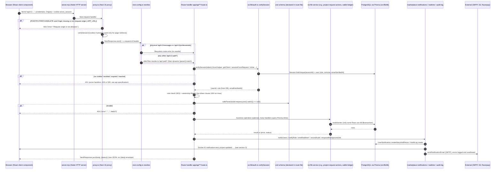
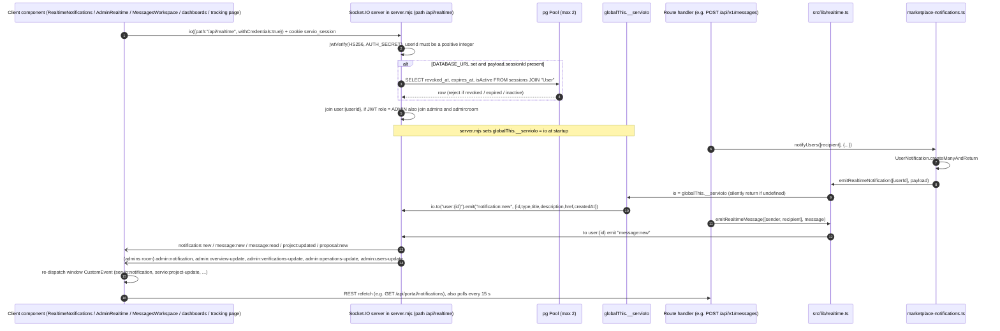

# API Flow Diagrams

Last verified against code: 2026-09-16 (commit cd8f4fb); runtime-validated 2026-09-17

These diagrams show what happens to a request as it moves through the system. Three flows are covered:

1. A generic authenticated API request.
2. The main money flow: a Razorpay wallet top-up, then funding a milestone from the wallet.
3. The realtime (Socket.IO) emit path.

Related documents:

- Endpoint detail: [`../../05-api/api-specification.md`](../../05-api/api-specification.md) and [`../../05-api/openapi.yaml`](../../05-api/openapi.yaml)
- Authentication: [`authentication-flow.md`](authentication-flow.md) and [`../authentication-and-authorization.md`](../authentication-and-authorization.md)
- Containers: [`container-architecture.md`](container-architecture.md)

---

## 1. Generic authenticated API request

### Explanation

| Step               | Behaviour                                                                                                                                                                                                                                     | Evidence                                                                                                                       |
| ------------------ | --------------------------------------------------------------------------------------------------------------------------------------------------------------------------------------------------------------------------------------------- | ------------------------------------------------------------------------------------------------------------------------------ |
| Origin gate        | This is the only CSRF defence. It applies to every mutating `/api/*` call, including `/api/v1/*`, because the proxy runs before rewrites.                                                                                                     | `proxy.ts:3-14`, `:43-46`                                                                                                      |
| Proxy session      | The proxy verifies the session only to redirect **pages**. It does not block API calls and does not pass the session on, so handlers verify it again (two DB lookups per request).                                                            | `proxy.ts:52-91`                                                                                                               |
| Rewrite precedence | An array returned from `rewrites()` means afterFiles rewrites. Physical files are matched first, then rewrites, then dynamic routes.                                                                                                          | `next.config.ts:20-26`; `node_modules/next/dist/docs/01-app/03-api-reference/05-config/01-next-config-js/rewrites.md:48,87-98` |
| Auth helper        | There are about 10 copy-pasted local wrappers around `verifySession`. The role is re-read from the DB on every call.                                                                                                                          | `src/lib/auth.ts:23-45`                                                                                                        |
| Validation         | zod `safeParse` in the route file. No schemas are shared across routes.                                                                                                                                                                       | e.g. `app/api/client/jobs/route.ts:26-47`                                                                                      |
| Service layer      | Thin and partial. `respondToProjectRequest`, the wallet-ledger functions, marketplace queries and professional discovery are services; most other logic is inline in handlers (`portal/[resource]` is 1,010 lines, `project-actions` is 964). | `src/lib/project-request-actions.ts`, `src/lib/wallet-ledger.ts`                                                               |
| Side effects       | Notifications write the DB row, then emit over realtime, then send email. They run inline and are awaited, except `enqueueBackgroundJob`, which is fire-and-forget and in-process.                                                            | `src/lib/marketplace-notifications.ts:275-304`, `src/lib/background-jobs.ts:11-19`                                             |
| Response           | Raw `NextResponse.json`. `apiSuccess`/`apiError` exist but are never used.                                                                                                                                                                    | `src/lib/api-response.ts`                                                                                                      |

---

## 2. Money flow: wallet top-up (Razorpay), then milestone funding, then admin payout

```mermaid
sequenceDiagram
    autonumber
    participant C as Client browser (src/routes/client/earnings.tsx)
    participant O as POST /api/v1/wallet/deposit/order
    participant RZ as Razorpay API / Checkout
    participant V as POST /api/v1/wallet/deposit/verify
    participant F as POST /api/v1/wallet/deposit/fail
    participant WL as src/lib/wallet-ledger.ts
    participant DB as PostgreSQL (Wallet, WalletTransaction, Payment, Invoice, ProjectMilestone, ProjectTransaction)
    participant M as POST /api/v1/wallet/milestone
    participant NT as notifications + Socket.IO
    participant AD as Admin: POST /api/admin/finance/milestone-payout (agent F1)

    Note over C,DB: Phase A: top-up
    C->>O: {amount: rupees 1..1,000,000} (CLIENT)
    O->>O: isRazorpayConfigured() else 503
    O->>RZ: POST /v1/orders {amount: rupees*100, receipt servio_wallet_{uid}_{ts}, notes}
    RZ-->>O: {id: order_xxx}
    O->>DB: ensureWallet(userId), WalletTransaction.create {WALLET_TOP_UP, PENDING, providerReference=order_xxx, idempotencyKey wallet-topup-order_xxx}
    O-->>C: {keyId, orderId, amount (paise), currency INR}
    C->>RZ: Razorpay Checkout (browser widget)
    alt payment succeeds
        RZ-->>C: {razorpay_order_id, razorpay_payment_id, razorpay_signature}
        C->>V: {razorpayOrderId, razorpayPaymentId, razorpaySignature}
        V->>V: HMAC-SHA256(orderId|paymentId, KEY_SECRET) timingSafeEqual else 400
        V->>DB: WalletTransaction.findUnique(providerReference) and owner check (404), COMPLETED returns alreadyProcessed
        V->>WL: db.$transaction(creditWalletFromVerifiedProvider)
        WL->>DB: Wallet.upsert, re-read txn status = PENDING, Wallet.balance += amount, txn to COMPLETED {providerPaymentId}
        V-->>C: {ok:true, amount}
    else checkout dismissed or failed
        C->>F: {orderId, reason}
        F->>DB: WalletTransaction to FAILED (unless COMPLETED)
    end
    Note over RZ,DB: Razorpay webhook (/api/webhooks/razorpay, agent F1) may also reconcile. Concurrent verify calls alone double-credited in local validation V-41

    Note over C,NT: Phase B: fund milestone (milestone must be AWAITING_CLIENT_REVIEW)
    C->>M: {projectId, milestoneId} (CLIENT, project.clientId = me)
    M->>DB: $transaction (maxWait 10s, timeout 30s)
    activate DB
    M->>DB: claim ProjectMilestone AWAITING_CLIENT_REVIEW to PAYMENT_PROCESSING (409 if count not 1)
    M->>DB: Payment.upsert(milestoneId) provider wallet, PENDING, fee split, idempotencyKey wallet-milestone-{id}
    M->>WL: fundMilestoneFromWallet
    WL->>DB: client Wallet.balance -= base*1.1 (conditional, else "Insufficient wallet balance." gives 402) + WalletTransaction MILESTONE_PAYMENT
    WL->>DB: first ADMIN Wallet.balance += base*1.1 + WalletTransaction ADMIN_MILESTONE_RECEIPT
    M->>DB: Payment to FUNDED, Invoice.upsert INV-{yyyy}-{paymentId}, milestone to AWAITING_ADMIN_APPROVAL, ProjectTransaction WALLET_MILESTONE_FUNDED / PENDING_ADMIN_PAYOUT
    deactivate DB
    M->>NT: notifyMilestoneFunded (professional + all admins, DB rows, email, notification:new, admin:notification, admin:overview-update)
    M->>NT: emitRealtimeProjectUpdate([client, professional]) sends project:updated
    M-->>C: {ok, charged, professionalReceives, adminReceives, platformEarnings, remainingBalance, status FUNDED}

    Note over AD,DB: Phase C (agent F1): admin approves payout via releaseMilestoneToProfessional
    AD->>WL: admin Wallet -= base*0.9 (PROFESSIONAL_PAYOUT), professional Wallet += base*0.9 (MILESTONE_EARNING)
```

### Explanation

- **Fee model** (`src/lib/wallet-ledger.ts:5-20`): the client pays `base + ceil(10%)` and the professional receives `base − ceil(10%)`. The platform keeps the difference, which is about 20% of base. Amounts are integer rupees in the DB and paise when sent to Razorpay.
- **Escrow:** the "platform" is the **first ADMIN user's wallet** (`tx.user.findFirst({role:"ADMIN"})`, `wallet-ledger.ts:116`). There is no dedicated platform or escrow account.
- **Idempotency:**
  - Every `WalletTransaction` has a unique `idempotencyKey`, and `providerReference` is uniquely indexed where non-null (`prisma/schema.prisma:758-759`).
  - Milestone funding uses a conditional status claim inside a transaction.
  - Top-up verify checks the status with a plain read followed by an unconditional update.
- **Offline jobs** skip this flow. For those, `POST /api/portal/project-actions {action:"approve-milestone"}` records a `COMPLETED` Payment with provider `offline` in a transaction (`app/api/portal/project-actions/route.ts:597-718`).
- **Retired endpoints:** `POST /api/payments/razorpay/order` and `/verify` always return 410.

---

## 3. Realtime emit path (Socket.IO)

### Explanation

- **Transport:** the Socket.IO server is attached to the same HTTP server as Next.js (`server.mjs:28-35`). Route handlers reach it only through the process-global `globalThis.__servioIo` (`server.mjs:77`, `src/lib/realtime.ts`).
- **Direction:** server to client only. No `socket.on(...)` handlers exist on the server, so clients never send events; they send REST requests and receive refetch signals.
- **Events** (10 custom): `notification:new`, `admin:notification`, `message:new`, `message:read`, `project:updated`, `proposal:new`, `admin:overview-update`, `admin:verifications-update`, `admin:operations-update`, `admin:users-update`. The full emitter and listener table is in the API specification's Realtime section.

## Key assumptions and limitations

| #   | Assumption / limitation                                                                                                                                                                                                                                                                                                                                                                                                                                            | Evidence / status                                                                                                                                                         |
| --- | ------------------------------------------------------------------------------------------------------------------------------------------------------------------------------------------------------------------------------------------------------------------------------------------------------------------------------------------------------------------------------------------------------------------------------------------------------------------ | ------------------------------------------------------------------------------------------------------------------------------------------------------------------------- |
| 1   | Realtime works only when the app runs through `server.mjs` (`npm run dev`/`start`). Under a serverless or Vercel runtime `globalThis.__servioIo` is undefined and every emit silently does nothing.                                                                                                                                                                                                                                                                | `src/lib/realtime.ts` guard `if (!io) return`. Hosting target is `[NEEDS VALIDATION — not testable locally]`                                                              |
| 2   | Single process only: there is no Socket.IO adapter (Redis etc.), so rooms are per instance. The in-memory rate limiter and `enqueueBackgroundJob` are also process-local.                                                                                                                                                                                                                                                                                          | `server.mjs`, `src/lib/background-jobs.ts`                                                                                                                                |
| 3   | The socket handshake role comes from the JWT claim, and revocation is checked only at connect. It is skipped entirely if `DATABASE_URL` is unset or `sessionId` is missing. Open sockets survive logout [VALIDATED 2026-09-17 · [V-28](../../validation/LOCAL_VALIDATION_LOG.md)]. `DATABASE_URL` is read before `.env` loads, so a URL only in `.env` also skips the check (fail-open) [CORRECTED 2026-09-17 · [V-10](../../validation/LOCAL_VALIDATION_LOG.md)]. | `server.mjs:38-68`                                                                                                                                                        |
| 4   | Diagram 1 shows the common path. Some handlers differ: an invalid JWT gives 500 (`project-actions`, `proposals`, `project-requests/[id]`), bad auth gives 404 (`client/jobs/[id]`, `favorite-jobs`), and `client/jobs` also accepts a Bearer token.                                                                                                                                                                                                                | `docs/05-api/api-specification.md`                                                                                                                                        |
| 5   | Diagram 2 stops at the admin payout boundary; payout internals belong to the admin finance endpoints (agent F1). The Razorpay webhook's interaction with the verify route is not analysed here.                                                                                                                                                                                                                                                                    | `[NEEDS VALIDATION — not testable locally]` (live webhook delivery; locally the webhook without Origin is rejected 403, [V-20](../../validation/LOCAL_VALIDATION_LOG.md)) |
| 6   | Top-up verify double-credits under concurrent calls (plain read, then unconditional update): 20 concurrent calls credited one 5,000 top-up 20,000 and 25,000.                                                                                                                                                                                                                                                                                                      | `src/lib/wallet-ledger.ts:88-103` `[VALIDATED 2026-09-17 · V-41]` [V-41](../../validation/LOCAL_VALIDATION_LOG.md)                                                        |
| 7   | Email in notifications is sent inline (awaited) during the request, so SMTP latency adds to API latency.                                                                                                                                                                                                                                                                                                                                                           | `src/lib/marketplace-notifications.ts:297`                                                                                                                                |
| 8   | No endpoint in these flows applies rate limiting or requires email verification.                                                                                                                                                                                                                                                                                                                                                                                   | `proxy.ts:87`; no `rateLimit` or `requireVerifiedUser` calls in these routes                                                                                              |
