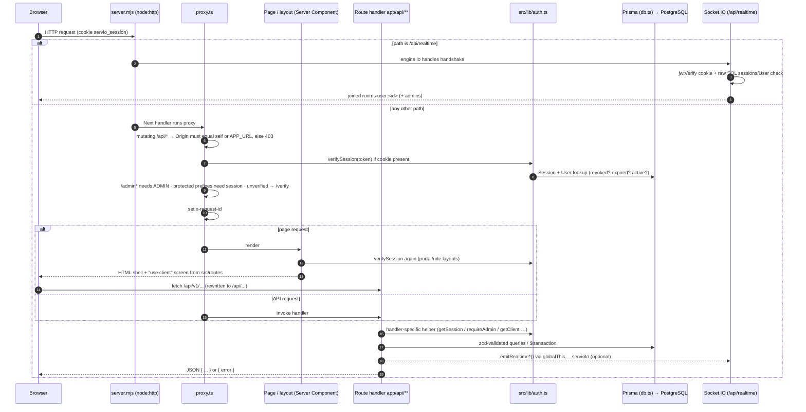

# Application Flow Diagrams

Last verified against code: 2026-09-16 (commit cd8f4fb); runtime-validated 2026-09-17

Two views: (A) the generic request lifecycle every page/API call follows, and (B) the core marketplace business flow from job posting to professional payout.

## A. Request Lifecycle



## B. Core Marketplace Flow (job → hire → delivery → payment → payout)

```mermaid
flowchart TD
  C1["Client: POST /api/client/jobs<br/>mode draft|publish → ClientJob OPEN<br/>(+ ClientJobMilestone)"] --> P1
  P1["Professional browses /professional/jobs, /api/marketplace/jobs"] --> P2
  P2["Professional: POST /api/professional/proposals<br/>→ ProjectRequest PENDING<br/>emit proposal:new, notify client"] --> C2
  C2{"Client: PATCH /api/client/project-requests/[id]<br/>accept | reject | counter"}
  C2 -->|counter| P3["Professional: PATCH /api/professional/project-requests/[id]"] --> C2
  C2 -->|reject| X1["ProjectRequest REJECTED"]
  C2 -->|accept<br/>respondToProjectRequest()| H1["Job OPEN→CLOSED, request ACCEPTED,<br/>other pending requests REJECTED,<br/>ProjectTracking READY_TO_START + milestones UPCOMING"]
  H1 --> W1["Professional: POST /api/portal/project-actions<br/>start-work · update-progress · upload-work"]
  W1 --> W2["Professional: submit-milestone<br/>→ ProjectMilestone AWAITING_CLIENT_REVIEW"]
  W2 --> C3{"Client review on /project/[id]/tracking"}
  C3 -->|request-revision| W1
  C3 -->|approve, job.paymentMethod OFFLINE| OFF["project-actions approve-milestone<br/>offline record, no wallet movement"]
  C3 -->|approve, online| T0{"Wallet balance ≥ base + 10%?"}
  T0 -->|no| T1["Client top-up: POST /api/wallet/deposit/order<br/>Razorpay order + WalletTransaction PENDING"]
  T1 --> T2["Razorpay Checkout.js in browser"]
  T2 --> T3["POST /api/wallet/deposit/verify (HMAC)<br/>and/or webhook payment.captured<br/>→ wallet credited, COMPLETED"]
  T3 --> T0
  T0 -->|yes| M1["POST /api/wallet/milestone<br/>fundMilestoneFromWallet(): client −(base+10%),<br/>first ADMIN wallet +(base+10%)<br/>Payment FUNDED, milestone AWAITING_ADMIN_APPROVAL"]
  M1 --> A1["Admin: POST /api/admin/finance/milestone-payout<br/>releaseMilestoneToProfessional(): admin −(base−10%),<br/>professional +(base−10%); milestone APPROVED"]
  A1 --> WD1["Professional: POST /api/wallet<br/>ProjectWithdrawal PENDING, pendingBalance reserved"]
  WD1 --> WD2{"Admin settles withdrawal"}
  WD2 -->|manual| WD3["PATCH /api/admin/finance/withdrawals/[id]<br/>COMPLETED (balance debited) or FAILED"]
  WD2 -->|Razorpay Route enabled| WD4["POST /api/admin/finance/payouts<br/>Razorpay transfer → COMPLETED"]
  OFF --> E1
  A1 --> E1["complete-project → confirm-project-completion<br/>submit-review / respond-to-review"]
  W2 -.-> D1["submit-dispute → ProjectDispute<br/>admin /api/admin/disputes/[id]"]
```

## Explanation

| Step | Key code | Notes |
|---|---|---|
| Request gate | `proxy.ts`, `src/lib/auth.ts` | Session verified against DB on each check; several layers repeat it |
| Job posting | `app/api/client/jobs/route.ts` | Drafts and published jobs; accepts cookie or Bearer token |
| Proposal | `app/api/professional/proposals/route.ts` | Requires job `OPEN`; background notification job |
| Hiring | `src/lib/project-request-actions.ts` `respondToProjectRequest()` | Accept closes the job and creates `ProjectTracking` |
| Delivery | `app/api/portal/project-actions/route.ts` (17 actions) | Status transitions guarded by conditional `updateMany` claims |
| Client UI switch | `app/project/[projectId]/tracking/page.tsx:389-399` | Offline jobs call `project-actions`; online jobs call `/api/wallet/milestone` |
| Wallet funding | `app/api/wallet/deposit/*`, `app/api/webhooks/razorpay/route.ts` | Amounts whole rupees; paise at Razorpay boundary |
| Escrow & release | `src/lib/wallet-ledger.ts` | 10% client fee + 10% professional fee; admin wallet holds funds |
| Withdrawal | `app/api/wallet/route.ts`, `app/api/admin/finance/withdrawals/[id]/route.ts`, `app/api/admin/finance/payouts/route.ts` | Manual settlement or Razorpay Route |
| Side effects | `src/lib/marketplace-notifications.ts`, `src/lib/realtime.ts` | `UserNotification` rows + socket events + optional email |

## Assumptions and Limitations

- The business flow is reconstructed from handler code; exact status enums and every branch (e.g. counter-offer details, revision limits, dispute resolution outcomes) are documented in [functional-requirements.md](../../02-requirements/functional-requirements.md) and [api-specification.md](../../05-api/api-specification.md).
- The webhook branch in step T3 is blocked by the `proxy.ts` Origin check when the delivery has no `Origin` (local POST → 403 [PARTIALLY VALIDATED 2026-09-17 · [V-20](../../validation/LOCAL_VALIDATION_LOG.md)]; live delivery [NEEDS VALIDATION — not testable locally]); the browser verify call is then the only crediting path.
- Concurrent crediting double-credits: 20 concurrent browser verify calls alone credited one 5,000 top-up 20,000 / 25,000 [VALIDATED 2026-09-17 · [V-41](../../validation/LOCAL_VALIDATION_LOG.md)], finding F-03; the verify + webhook variant was not tested.
- The proxy Origin rule ("Origin must equal self or APP_URL") accepts only the exact `APP_URL` origin under `server.mjs` (a genuine same-origin `127.0.0.1` request was rejected) [FOUND IN VALIDATION 2026-09-17 · [V-20](../../validation/LOCAL_VALIDATION_LOG.md)].
- The escrow wallet is whichever `ADMIN` user `findFirst` returns; behaviour with multiple admins is non-deterministic.
- Direct-hire (`HireJob`/`HireContract`) and legacy messaging models are not part of the live flow and are omitted.
- The Mermaid sequence shows logical order; `proxy.ts` and layouts may each call `verifySession` separately (multiple DB reads per request).
