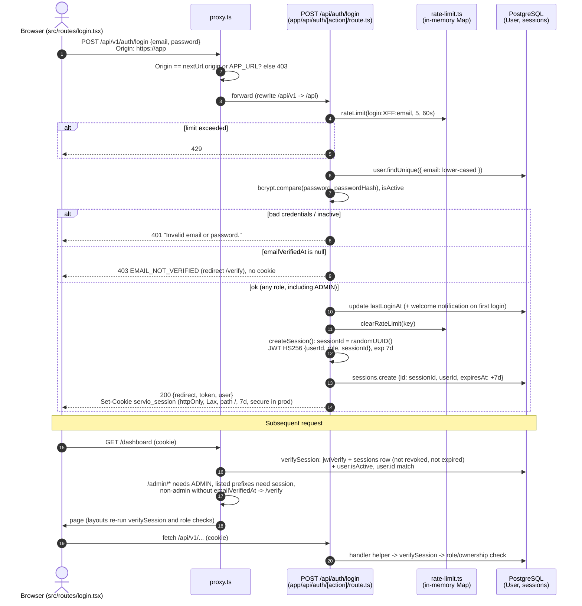
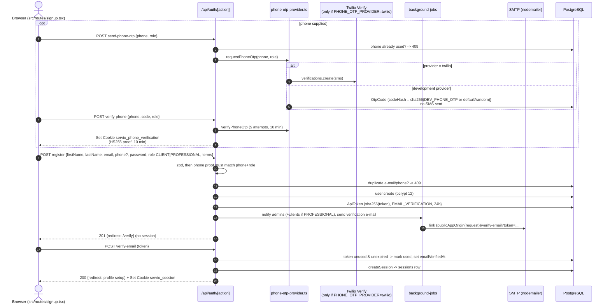
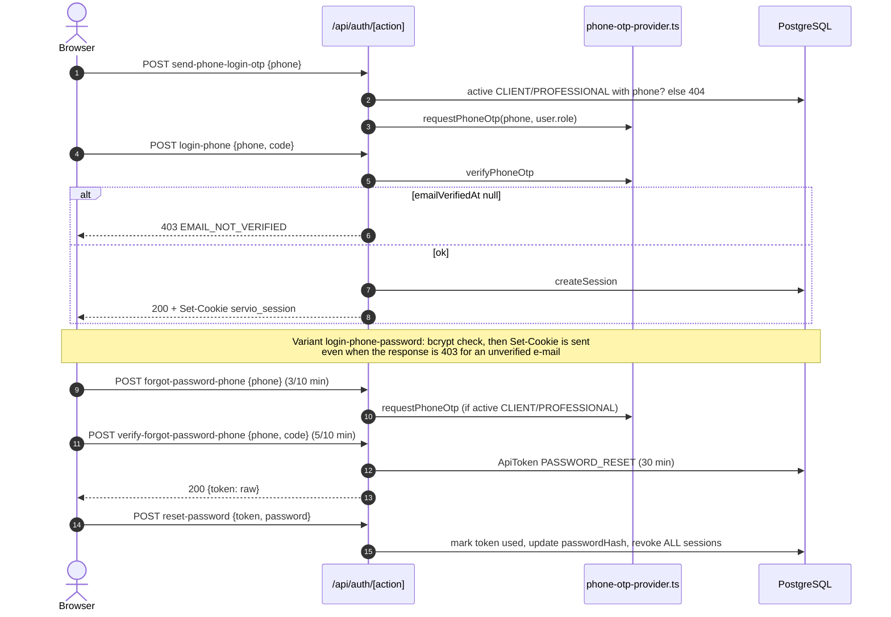
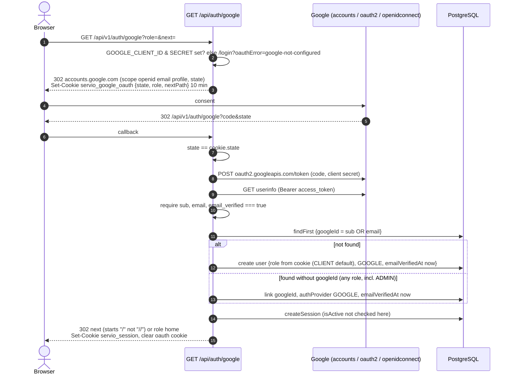
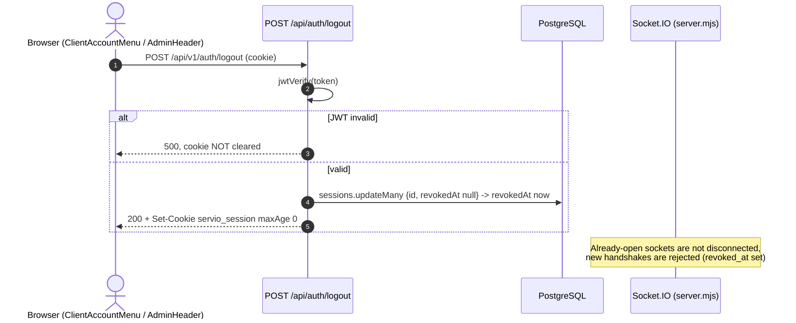

# Authentication Flow

Last verified against code: 2026-09-16 (commit cd8f4fb); runtime-validated 2026-09-17

Related: [../authentication-and-authorization.md](../authentication-and-authorization.md), [user-vs-admin-flow.md](user-vs-admin-flow.md), [../../08-operations/security.md](../../08-operations/security.md).

All browser calls go to `/api/v1/*`, which `next.config.ts` rewrites to `/api/*`. Every mutating `/api/*` request first passes the `proxy.ts` Origin check.

---

## 1. Email + password login and authenticated request

## 2. Registration with phone proof and e-mail verification

## 3. Phone login (OTP) and phone password reset

## 4. Google OAuth

## 5. Logout and revocation

---

## Explanation

- There is exactly one session mechanism for every login method and every role: a 7-day HS256 JWT carried in the `servio_session` cookie and bound to a `sessions` row. `verifySession` (`src/lib/auth.ts:23-45`) re-reads the row and the user on each check, so revocation, deactivation and role changes are effective immediately for HTTP traffic.
- Login methods differ only in how the user is identified (password, OTP, Google profile, verification link); all converge on `createSession` (`src/lib/auth.ts:12-22`).
- E-mail verification is enforced at login (e-mail and phone-OTP paths), in `proxy.ts` for pages, and in the portal layout — not in API handlers.
- Password reset (both variants) is the only user-initiated way to revoke all sessions.

## Key assumptions and limitations

- Diagrams show the code paths at commit `cd8f4fb`; deployed configuration (`PHONE_OTP_PROVIDER`, `DEV_PHONE_OTP`, Google credentials, SMTP) determines which branches are live `[NEEDS VALIDATION — not testable locally]`.
- Local runtime checks ([log](../../validation/LOCAL_VALIDATION_LOG.md)): register sets no session; unverified e-mail login and phone OTP login → 403 without cookie; `login-phone-password` → 403 **with** a working session cookie `[VALIDATED 2026-09-17 · V-22, V-23]`. Development OTP: code printed to the server log, and verification always fails when the DB session TimeZone is not UTC (raw `"expiresAt" > NOW()`) `[FOUND IN VALIDATION 2026-09-17 · V-27]`. Mixed-case registered e-mails can never log in by e-mail/password `[VALIDATED 2026-09-17 · V-21]`. Reset links follow `X-Forwarded-Host` `[VALIDATED 2026-09-17 · V-25]`.
- Background e-mail dispatch is via `enqueueBackgroundJob`; its delivery guarantees (in-process vs durable) are documented elsewhere and are not modelled here.
- The admin login flow is intentionally omitted here and shown in [user-vs-admin-flow.md](user-vs-admin-flow.md).
- Rate limits shown are per-process in-memory counters keyed on `X-Forwarded-For`; they are not reliable across instances, and rotating the header bypasses them entirely `[VALIDATED 2026-09-17 · V-26]`.
- Twilio Verify internal behaviour (expiry, attempt limits) is external and not verified.
