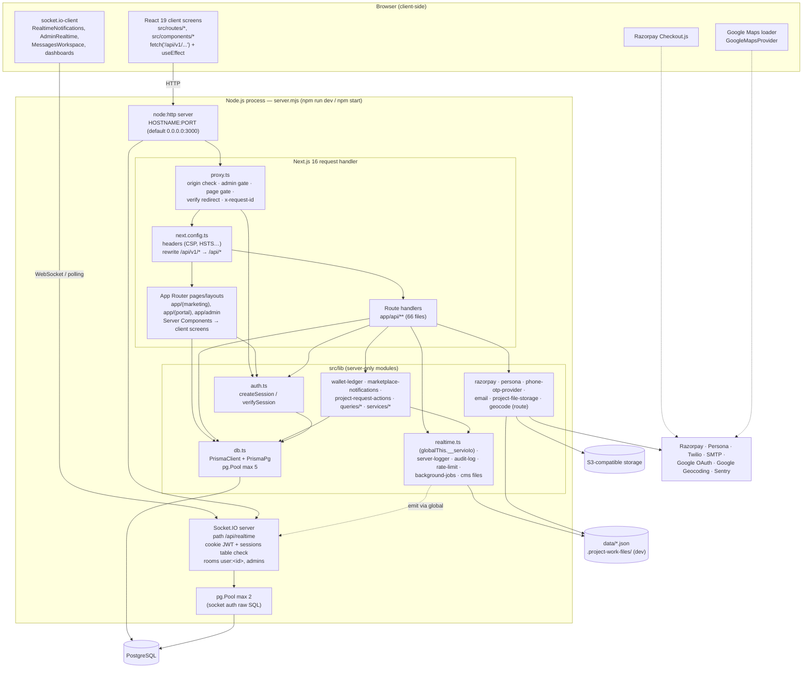

# Container Architecture Diagram

Last verified against code: 2026-09-16 (commit cd8f4fb); runtime-validated 2026-09-17

## Explanation

| Container / component | Technology                                            | Responsibility                                                                 | Evidence                                                                                            |
| --------------------- | ----------------------------------------------------- | ------------------------------------------------------------------------------ | --------------------------------------------------------------------------------------------------- |
| Browser screens       | React 19 client components, Tailwind v4, shadcn/Radix | Rendering, forms, client-side data fetching (no React Query)                   | `src/routes/**`, `src/components/**`                                                                |
| Node process          | `server.mjs` (ESM)                                    | Hosts both Next.js and Socket.IO on one port                                   | `server.mjs:13-81`                                                                                  |
| Socket.IO server      | `socket.io` 4                                         | Authenticated push channel; no client→server event handlers                    | `server.mjs:32-77`                                                                                  |
| `proxy.ts`            | Next 16 proxy (Node runtime)                          | Cross-cutting request gate                                                     | `proxy.ts`                                                                                          |
| `next.config.ts`      | Config                                                | Security headers on all paths; `/api/v1` alias                                 | `next.config.ts`                                                                                    |
| Pages/layouts         | App Router Server Components                          | Auth redirects, a few direct DB reads, render client screens                   | `app/**/page.tsx`, `layout.tsx`                                                                     |
| Route handlers        | App Router route handlers                             | Validation (zod), authn/authz, business logic, Prisma access                   | `app/api/**`                                                                                        |
| Domain modules        | TypeScript, `server-only`                             | Money ledger, notification fan-out, project request transitions, read models   | `src/lib/wallet-ledger.ts`, `marketplace-notifications.ts`, `queries/*`                             |
| Adapters              | fetch / SDKs                                          | External provider calls                                                        | `src/lib/razorpay.ts`, `persona.ts`, `phone-otp-provider.ts`, `email.ts`, `project-file-storage.ts` |
| Cross-cutting         | In-process                                            | Realtime emit bridge, logging, audit, rate limit, background jobs, CMS file IO | `src/lib/realtime.ts`, `server-logger.ts`, …                                                        |
| Data access           | Prisma 7 + `@prisma/adapter-pg`                       | ORM over shared pool                                                           | `src/lib/db.ts`                                                                                     |

## Assumptions and Limitations

- The diagram shows a **single instance**. In-memory state (Socket.IO rooms, rate-limit map, home CMS cache, background jobs) is not shared between instances; no Redis adapter exists.
- The Socket.IO server attaches to the same `http` server; engine.io handles `/api/realtime` requests itself, so they do not pass through `proxy.ts`: `/api/realtime` polling responses carry no `x-request-id`, and a POST without `Origin` gets engine.io's own 400, not the proxy's 403 [VALIDATED 2026-09-17 · [V-12](../../validation/LOCAL_VALIDATION_LOG.md)].
- `HOSTNAME` is inherited from the shell: when it is pre-set (Git Bash exports the machine name) the HTTP server listens only on the LAN IP — unreachable on `localhost`/`127.0.0.1` and exposed on the LAN [FOUND IN VALIDATION 2026-09-17 · [V-11](../../validation/LOCAL_VALIDATION_LOG.md)].
- The socket revocation `pg` pool is created from `DATABASE_URL` before `.env` is loaded; with the URL only in `.env` the revocation check is skipped (fail-open) and `.env`-only `REALTIME_ALLOWED_ORIGIN`/`APP_URL` give no Socket.IO CORS [FOUND IN VALIDATION 2026-09-17 · [V-10](../../validation/LOCAL_VALIDATION_LOG.md)].
- If the app is started with `next dev`/`next start` or on a serverless platform instead of `server.mjs`, the Socket.IO container does not exist and all emits silently no-op.
- Reverse proxies, TLS termination and CDN are outside the repository and [UNKNOWN].
- `src/generated/prisma` (generated client) is part of `DB` and not shown separately.
