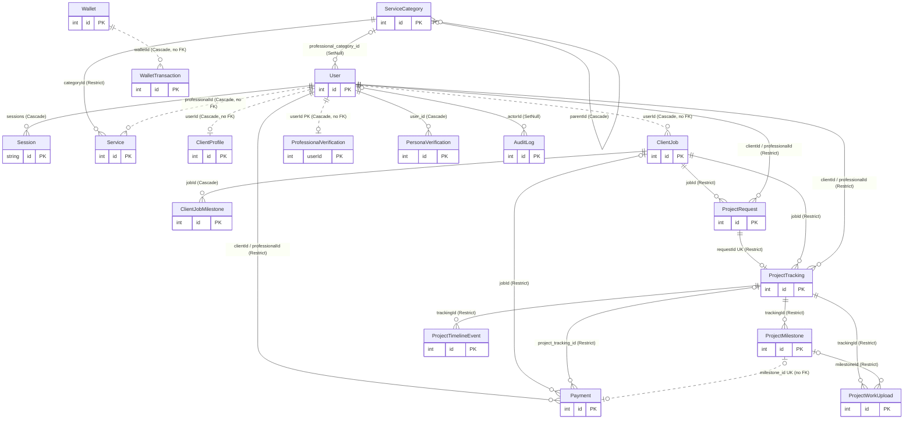
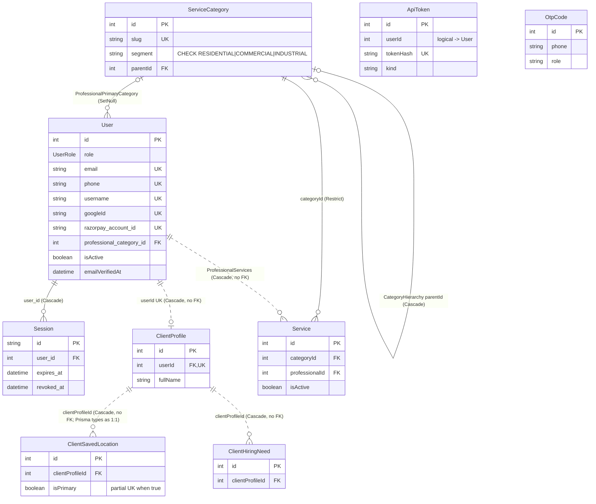
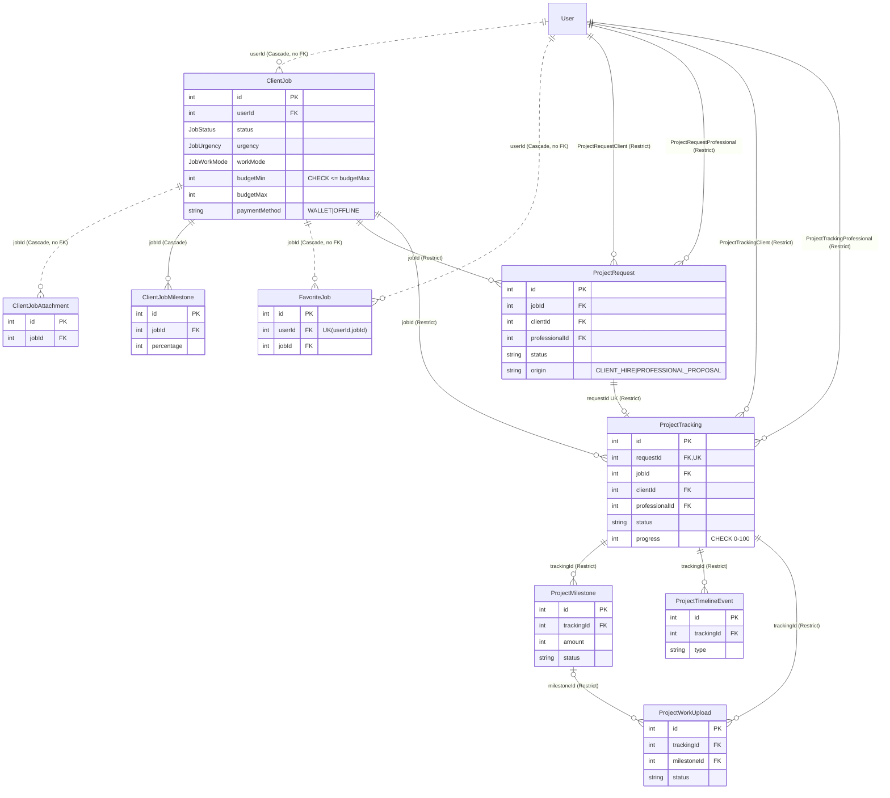
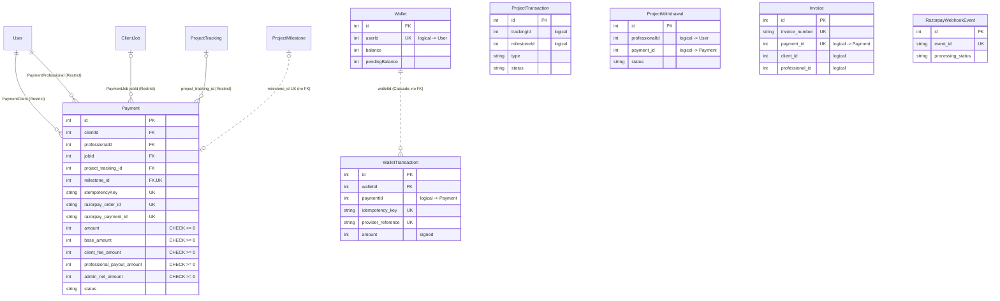
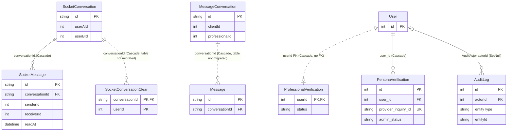
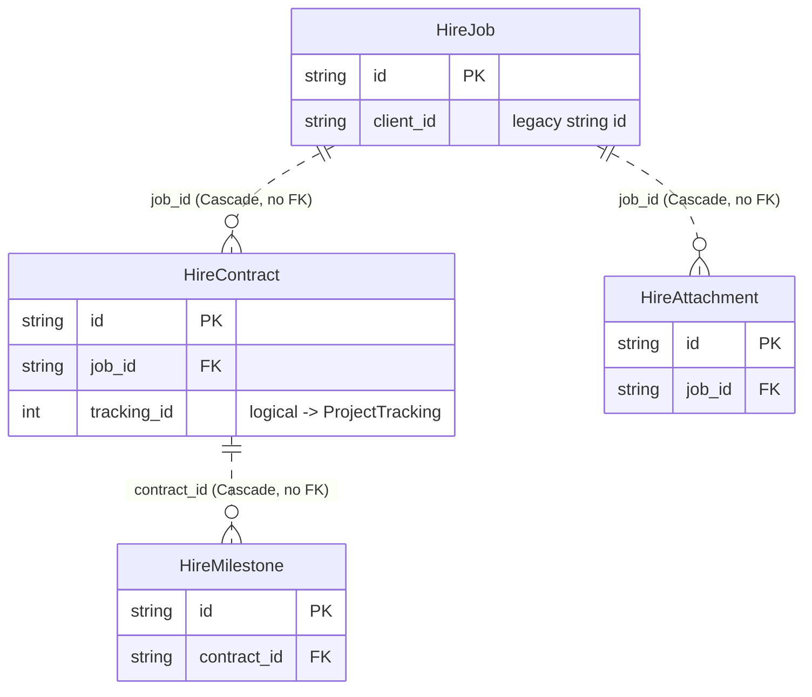

# Database ERD

Last verified against code: 2026-09-16 (commit cd8f4fb); runtime-validated 2026-09-17

> Mermaid entity-relationship diagrams for the PostgreSQL schema in `prisma/schema.prisma`. Details: [database-design.md](../../04-database/database-design.md), [schema.md](../../04-database/schema.md), [data-dictionary.md](../../04-database/data-dictionary.md).

## Notation

| Mermaid                 | Meaning in these diagrams                                                                               |
| ----------------------- | ------------------------------------------------------------------------------------------------------- |
| `\|\|--o{` solid line   | Relation declared in Prisma **and** FK constraint created by a migration                                |
| `\|\|..o{` dotted line  | Relation declared in Prisma **only** (no FK in any migration, so not enforced in a migrations-built DB) |
| `\|\|--o\|`, `\|o..o\|` | One-to-zero-or-one (FK column is unique)                                                                |
| Label                   | Relation name or FK column, plus `onDelete` action (Cascade / Restrict / SetNull)                       |
| `PK`, `FK`, `UK`        | Primary key, foreign key column, unique                                                                 |

Only relationships declared with `@relation` in `schema.prisma` are drawn. Columns that merely _hold_ another model's id without a Prisma relation (e.g. `Wallet.userId`, `ProjectDispute.trackingId`, `Invoice.payment_id`) are listed under "Logical references (not drawn)" for each domain.

---

## 1. Core overview

Entities: identity, catalogue, jobs, hiring, project delivery and money. Attributes limited to keys.

Explanation: a CLIENT `User` posts a `ClientJob` (optionally with a planned `ClientJobMilestone` split). A `ProjectRequest` (either a client hire invitation or a professional proposal, `origin`) links job, client and professional; accepting it creates exactly one `ProjectTracking` (unique `requestId`). Delivery happens through `ProjectMilestone`, `ProjectWorkUpload` and `ProjectTimelineEvent`. Money flows through `Payment` (one per milestone) and the wallet ledger. The finance core (`ProjectRequest`, `ProjectTracking`, `Payment`, project children) is FK-protected with `RESTRICT`; the job/profile layer relies on Prisma-only relations.

---

## 2. Identity, profile and catalogue

Logical references (not drawn): `ApiToken.userId → User`; `OtpCode` keyed by `phone`+`role`.

---

## 3. Jobs, proposals and project tracking

Logical references (not drawn — no Prisma relation): `ProjectNegotiation.{requestId, jobId, clientId, professionalId, senderId}`; `ProjectReview.{trackingId UK, clientId, professionalId}`; `ProjectCompletionRequest` / `ProjectRevisionRequest` / `ProjectReviewRequest`.`{trackingId, clientId, professionalId}`; `ProjectTimelineEvent.milestoneId`; `ProjectMilestone.{clientId, professionalId}`; `StoredFile.ownerId`.

---

## 4. Payments, wallet, payouts and invoices

Logical references (not drawn): `Wallet.userId → User` (1:1 by unique), `WalletTransaction.paymentId → Payment`, `Invoice.payment_id → Payment` (1:1 by unique), `Invoice.client_id/professional_id → User`, `ProjectWithdrawal.{professionalId, payment_id}`, all `ProjectTransaction` ids. `RazorpayWebhookEvent` links to `Payment`/`WalletTransaction` only through provider ids inside `payload_json`.

---

## 5. Messaging, notifications, disputes, verification, audit

Not drawn (no Prisma relations at all): `ProjectDispute` and `ProjectDisputeMessage` (`dispute_id` logical), `UserNotification`, `UserNotificationState`, `BrowserSubscription`, `CallSession`, `VerificationDocumentReview` (`userId`+`documentKey` unique), `PersonaWebhookEvent`, `SocketConversation.userAId/userBId`.

---

## 6. CMS and legacy (isolated tables)

Isolated tables with no relations: `CmsPage`, `CmsPageVersion` (`page_id` logical), `CmsMedia`, `WebsitePage`, `LegalPage`, `PageConfiguration`, `WebsitePageOverride`, `PageTextOverride`, `Faq`, `ContactRequest`, `DirectHireNegotiation`, `LegacyUser`, `LegacyUserProfile`, `LegacyProfessionalDetail`, `LegacyLocation`, `LegacyVerification`, `SQLiteMigrationTableArchive`, `SQLiteMigrationAudit`.

---

## Key assumptions and limitations

1. **Schema-only verification.** Relationships come from `@relation` in `prisma/schema.prisma` and FK constraints in `prisma/migrations/**/migration.sql`. The live database was not inspected; it may have been built partly with `prisma db push` and could contain FKs/tables that migrations do not (shared/production database `[NEEDS VALIDATION — not testable locally]` via `scripts/full-database-audit.sql`). A local migrations-only database was compared with the schema via `prisma migrate diff` `[VALIDATED 2026-09-17 · V-01]` ([log](../../validation/LOCAL_VALIDATION_LOG.md)).
2. **Dotted lines are unenforced in a migrations-built database.** 16 of 39 relations have no FK (14 between tables that exist, incl. `Payment_milestone_id_fkey`); **28** model tables (including `SocketConversationClear`, `Message`, `MessageConversation`, `StoredFile`, `ApiToken`, `UserNotification`) are not created by any migration, plus `DirectHireNegotiation` whose migration creates `direct_hire_negotiations` while the model (no `@@map`) expects `"DirectHireNegotiation"` (queries fail with P2021); 30 schema indexes are missing on existing tables, and migrations add 2 indexes and 19 timestamp defaults the schema does not declare `[CORRECTED 2026-09-17 · V-01, V-06]`. Because `Payment.milestone_id` has an FK only on non-migration databases, `prisma/seed.ts` fails with P2003 on any database that has it `[FOUND IN VALIDATION 2026-09-17 · SEED]`.
3. **Cardinality follows Prisma typing**, except `ClientProfile → ClientSavedLocation`, drawn as 1:N because the unique index is partial (`isPrimary = true`) while Prisma types the relation as 1:1. At runtime `include: { savedLocations }` returns one arbitrary row (not necessarily the primary) as an object, and admin user detail reads `clientProfiles?.[0]` on an object so client profile data never shows `[VALIDATED 2026-09-17 · V-05, V-05b]`.
4. `User` appears twice in several relations (client and professional roles); Mermaid merges these into one entity box with multiple labelled edges.
5. Legacy `Hire*`, `Legacy*` and `DirectHireNegotiation` use string user ids that cannot reference `User.id` (Int); they are not used by the application.
6. Diagrams show keys and a few governing columns only; full column lists are in the data dictionary.
