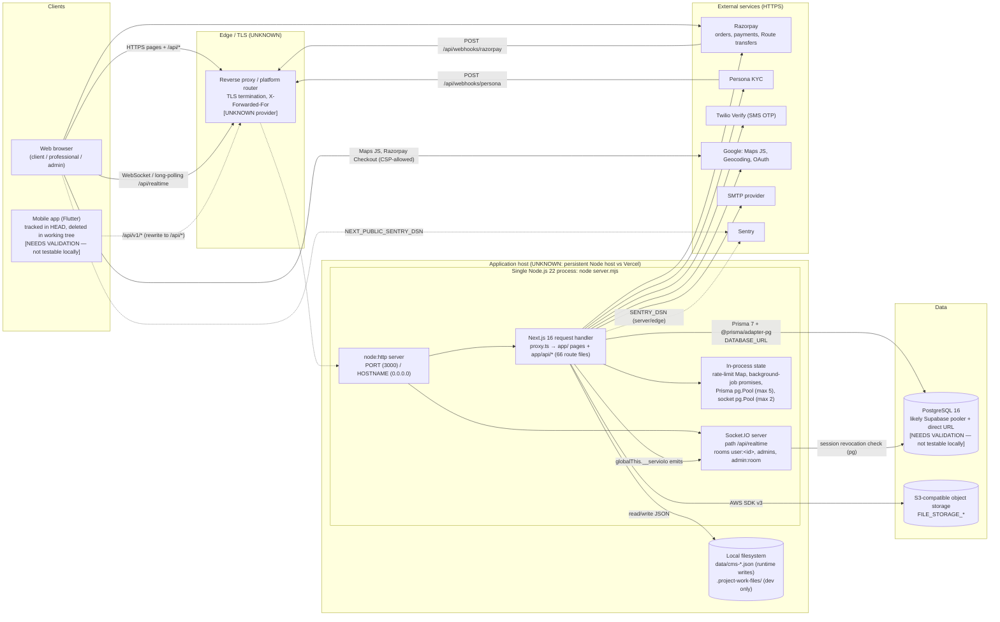
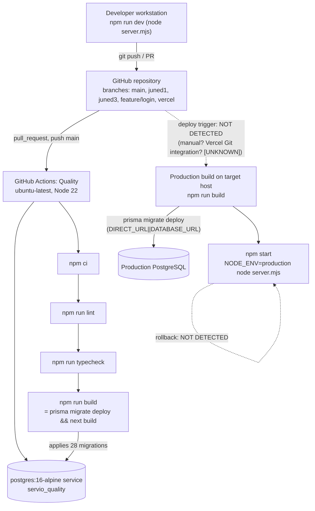

# Deployment Architecture Diagram

Last verified against code: 2026-09-16 (commit cd8f4fb); runtime-validated 2026-09-17

Related: [../../08-operations/deployment.md](../../08-operations/deployment.md) · [../../08-operations/environment.md](../../08-operations/environment.md) · [container-architecture.md](./container-architecture.md) · [system-context.md](./system-context.md)

> Solid lines = evidenced in repository code/config. Dashed lines = **unknown or unverified** (hosting provider, proxy, DNS/TLS, backups). Nodes labelled `UNKNOWN` have no repository artifact.

## 1. Runtime deployment (as implied by code)

## 2. Build, CI and release path

## 3. Explanation

| # | Point | Evidence |
|---|---|---|
| 1 | The deployable unit is **one Node.js process** that serves both Next.js and Socket.IO on the same port. | `server.mjs`, `package.json` `dev`/`start` |
| 2 | Route handlers publish realtime events through a process-global Socket.IO instance; if the process does not host Socket.IO, events are dropped silently. | `server.mjs:77`, `src/lib/realtime.ts:24-26` |
| 3 | `proxy.ts` runs before every non-static request: origin check for `/api/*` mutations, admin/page redirects, `x-request-id`. | `proxy.ts`, `proxy.ts:102-104` matcher |
| 4 | Database access: Prisma (pooled, `DATABASE_URL`) from Next; raw `pg` pool from `server.mjs` for socket auth; Prisma CLI migrations via `DIRECT_URL`. | `src/lib/db.ts`, `server.mjs:9-11`, `prisma.config.ts` |
| 5 | Files: uploads go to S3-compatible storage in production (with `NODE_ENV=production` and `FILE_STORAGE_PROVIDER≠s3` every upload returns 500 [VALIDATED 2026-09-17 · PROD-STORAGE]); CMS content is JSON on local disk written at runtime, and statically prerendered marketing pages show CMS edits only after a rebuild [FOUND IN VALIDATION 2026-09-17 · [V-03b](../../validation/LOCAL_VALIDATION_LOG.md)]. | `src/lib/project-file-storage.ts`, `src/lib/cms-file.ts` |
| 6 | Migrations are applied as part of **every build** (CI and deploy). Prisma 7.9.1 does not fail or warn when applied migrations were edited (checksum drift), so edited content silently never runs on already-migrated databases [FOUND IN VALIDATION 2026-09-17 · [V-02](../../validation/LOCAL_VALIDATION_LOG.md)]. | `package.json` `build` |
| 7 | CI verifies lint, typecheck, build only; there is no deploy job or rollback automation. | `.github/workflows/quality.yml` |
| 8 | Browser loads third-party scripts only from origins allowed by CSP (Razorpay Checkout, Google Maps). | `next.config.ts:4-17` |
| 9 | `/api/v1/:path*` rewrites to `/api/:path*` as a mobile-ready namespace. | `next.config.ts:21-27` |

## 4. Key assumptions and limitations

| ID | Assumption / limitation | Status |
|---|---|---|
| A-1 | **Hosting provider is unknown.** Vercel evidence (`.vercelignore`, `.vercel` gitignored, `project-docs/DEPLOY.md`, `origin/vercel` branch, unused `@vercel/functions`) conflicts with the custom server + Socket.IO + runtime filesystem writes, which require a persistent Node host. | `[NEEDS VALIDATION — not testable locally]` |
| A-2 | If deployed on Vercel: `server.mjs` is not used, realtime is non-functional, CMS writes are not persisted, in-memory rate limits are per-instance. The diagram's "single process" box would then not reflect production. | `[NEEDS VALIDATION — not testable locally]` |
| A-3 | Reverse proxy, TLS, DNS, CDN, WAF, domain: no artifact. | `[UNKNOWN]` |
| A-4 | PostgreSQL provider inferred as Supabase from a code comment about "Supabase PgBouncer" (`src/lib/db.ts:30`) and the pooled/direct URL split. | `[NEEDS VALIDATION — not testable locally]` |
| A-5 | Horizontal scaling is not supported as-is (no Socket.IO adapter, no shared rate-limit store, local CMS files). Diagram shows a single instance. | Implemented limitation |
| A-6 | Backups, restore procedure, monitoring/alerting beyond Sentry: not in repository. `online.dump` in repo root is a committed DB dump, not a backup process. | `[UNKNOWN]` |
| A-7 | Mobile client: a Flutter app (`flutter_app/`, 139 files) exists in `HEAD` but is deleted in the working tree; whether it is deployed or maintained is unknown. | `[NEEDS VALIDATION — not testable locally]` |
| A-8 | S3-compatible provider (AWS, R2, MinIO, Supabase Storage S3 API) not determinable; `FILE_STORAGE_ENDPOINT` optional. | `[UNKNOWN]` |
| A-9 | `HOSTNAME (0.0.0.0)` is only the default: a shell-inherited `HOSTNAME` (e.g. Git Bash sets the machine name) binds the process to the LAN IP only — unreachable on `localhost`, exposed on the LAN. | `[FOUND IN VALIDATION 2026-09-17 · V-11]` ([log](../../validation/LOCAL_VALIDATION_LOG.md)) |
| A-10 | The "session revocation check (pg)" edge exists only when `DATABASE_URL` is a real process env var; `server.mjs` reads it before `.env` is loaded, so `.env`-only configuration skips revocation (fail-open) and leaves Socket.IO without CORS. | `[FOUND IN VALIDATION 2026-09-17 · V-10]` |
| A-11 | Browser → Sentry edge: the browser SDK is active but CSP `connect-src` blocks the ingest host. | `[VALIDATED 2026-09-17 · V-51]` |
