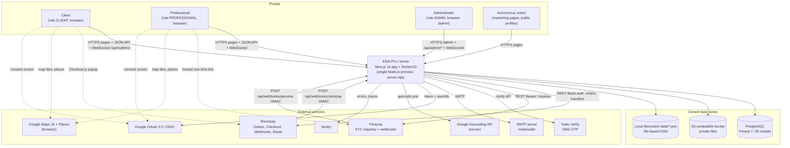

# System Context Diagram

Last verified against code: 2026-09-16 (commit cd8f4fb); runtime-validated 2026-09-17

## Explanation

| Element | Role | Evidence |
|---|---|---|
| Klick-Pro system | One deployable Node.js application serving marketing site, client and professional portals, admin console, REST-style API and realtime socket | `server.mjs`, `app/` |
| Client / Professional | Share the same login mechanism and portal shell; separated by `User.role` | `src/lib/auth.ts`, `app/(portal)/**/layout.tsx` |
| Administrator | Same application under `/admin`, username/password login, same session cookie | `app/api/admin/login/route.ts`, `proxy.ts:62-68` |
| PostgreSQL | System of record | `src/lib/db.ts` |
| S3-compatible bucket | Private project files, verification documents, avatars (local disk in development) | `src/lib/project-file-storage.ts` |
| `data/*.json` | Editable CMS content written at runtime | `src/lib/cms-file.ts`, `home-cms-file.ts`, `marketing-cms.ts` |
| External services | Payments, KYC, OTP, email, OAuth, maps, geocoding, monitoring | [integrations.md](../integrations.md) |

Dotted arrows are browser-to-provider interactions; solid arrows are server-side or provider-to-server calls.

## Assumptions and Limitations

- No mobile client is part of the current working tree: `flutter_app/` is tracked at HEAD but deleted locally ([NEEDS VALIDATION — not testable locally] whether it is being retired). It is therefore omitted.
- Webhook arrows show intended flow; `proxy.ts` rejects these POSTs with 403 when they lack an `Origin` header ([PARTIALLY VALIDATED 2026-09-17 · [V-20](../../validation/LOCAL_VALIDATION_LOG.md)] locally; live provider delivery not testable locally; finding F-01 in [solution-architecture.md](../solution-architecture.md#10-architecture-findings)).
- Which integrations are enabled in any deployed environment is [UNKNOWN]; all are optional and gated by environment variables.
- Hosting provider and any CDN/reverse proxy in front of the app are [UNKNOWN]; see [deployment-architecture.md](./deployment-architecture.md).
- The database vendor is not provable from code; a comment in `src/lib/db.ts` mentions a Supabase PgBouncer endpoint.
