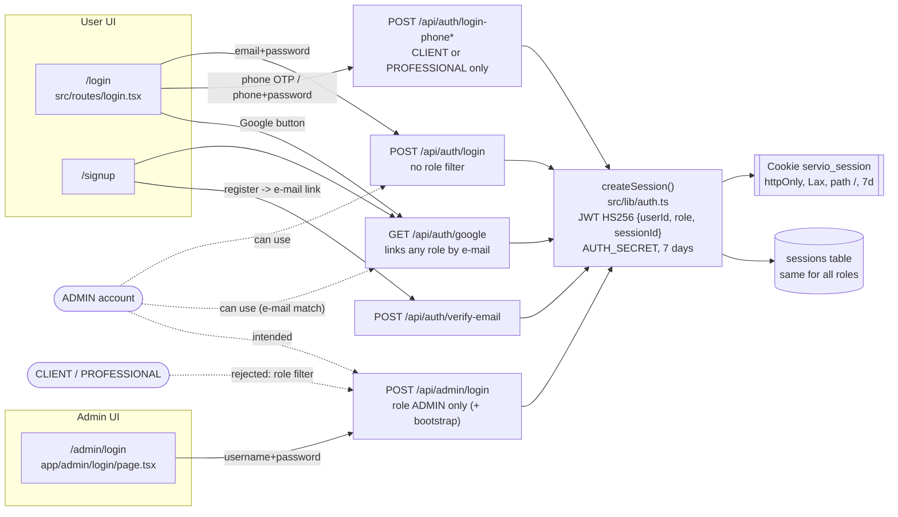
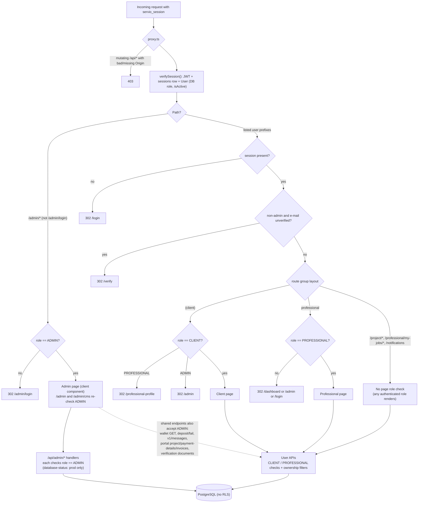
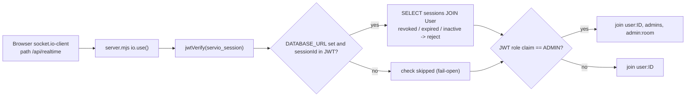

# User vs Admin Authentication and Authorization Flow

Last verified against code: 2026-09-16 (commit cd8f4fb); runtime-validated 2026-09-17

Related: [../authentication-and-authorization.md](../authentication-and-authorization.md) §17 (separation analysis), [authentication-flow.md](authentication-flow.md), [../../08-operations/security.md](../../08-operations/security.md) RISK-SEC-006.

---

## 1. Entry points converge on one session mechanism

## 2. Request-time authorization by role

## 3. Realtime channel

---

## Explanation

- **Separate pages, shared mechanism.** `/login` and `/admin/login` post to different endpoints, but both end in `createSession()` and the same `servio_session` cookie, JWT format, secret, TTL and `sessions` table. Logout for both uses `POST /api/auth/logout`.
- **The admin endpoint is exclusive; the user endpoint is not.** `POST /api/admin/login` only finds `role: ADMIN` users, so clients/professionals cannot use it. `POST /api/auth/login` and Google OAuth apply no role filter, so admin accounts can authenticate there too (phone-based login and phone reset exclude ADMIN).
- **Separation is enforced only by role checks at request time.** `proxy.ts` blocks non-admins from `/admin/*` pages, and every `/api/admin/*` handler checks `role === "ADMIN"` using the database role returned by `verifySession`. User pages are role-gated by route-group layouts; a few user routes rely solely on API-level checks.
- **No elevated controls for admins:** no MFA, no shorter session, no re-authentication, no audit trail for most admin actions, and no admin sub-roles.
- **Realtime** uses the JWT `role` claim (not the DB role) to join admin rooms.

## Key assumptions and limitations

- Based on static reading of `proxy.ts`, `src/lib/auth.ts`, `app/api/auth/[action]/route.ts`, `app/api/admin/login/route.ts`, layouts under `app/(portal)`, `app/admin/*`, all `app/api/**/route.ts(x)` handlers, and `server.mjs`; not validated against a running deployment.
- "Listed user prefixes" is the `isAuthenticatedPage` list in `proxy.ts:16-37`; `/job/[jobId]` and `/verification` are protected by layouts rather than that list.
- `/admin/*` API paths start with `/api/admin`, so the proxy's `/admin` page rule does not apply to them; protection there is entirely in the handlers.
- Whether production data actually contains admin accounts reachable via Google (matching Gmail/Workspace e-mail) or via seed credentials is `[NEEDS VALIDATION — not testable locally]`. Locally, the demo client/professional/admin credentials embedded in the login bundles sign in against a seeded database `[PARTIALLY VALIDATED 2026-09-17 · V-29]` ([log](../../validation/LOCAL_VALIDATION_LOG.md)).
- Runtime checks: `/api/admin/database-status` unauthenticated → 401 in production, 200 in development `[VALIDATED 2026-09-17 · V-30]`; with `DATABASE_URL` only in `.env`, the socket branch "DATABASE_URL set" is false and revoked tokens connect `[FOUND IN VALIDATION 2026-09-17 · V-10]`.
