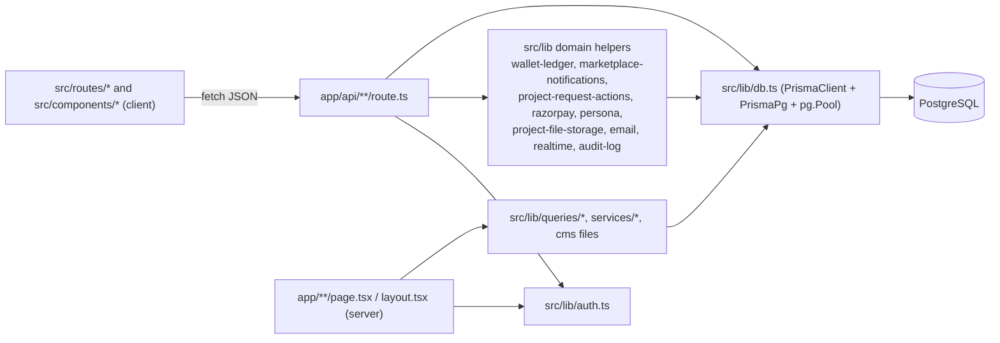

# Solution Architecture

Last verified against code: 2026-09-16 (commit cd8f4fb); runtime-validated 2026-09-17

## Architecture Summary (§23)

| Item                  | Actual value (verified)                                                                                                                                                                                                                                                                                                                                                                                                                       |
| --------------------- | --------------------------------------------------------------------------------------------------------------------------------------------------------------------------------------------------------------------------------------------------------------------------------------------------------------------------------------------------------------------------------------------------------------------------------------------- |
| **Project**           | `servio` (npm package name, `package.json`), marketed as **Klick-Pro** (`app/layout.tsx` metadata). India-focused services marketplace: clients post jobs, professionals propose and deliver, administrators operate the platform.                                                                                                                                                                                                            |
| **Frontend**          | Next.js 16 App Router (`next ^16.1.6`; 16.3.0 installed and built — [V-03](../validation/LOCAL_VALIDATION_LOG.md)), React 19, TypeScript 5.8, Tailwind CSS v4, shadcn/ui on Radix primitives (46 files in `src/components/ui/`). Most screens are `"use client"` components in `src/routes/` rendered by thin `app/**/page.tsx` wrappers; data loaded with `fetch()` + `useEffect`.                                                           |
| **Backend**           | Same Next.js application: 66 route-handler files (`app/api/**/route.ts[x]`, 97 exported HTTP handlers), run inside a custom Node HTTP server (`server.mjs`) that also hosts Socket.IO at `/api/realtime`. No Server Actions (`"use server"` absent). Request gate in `proxy.ts` (Next 16 successor of `middleware.ts`).                                                                                                                       |
| **Database**          | PostgreSQL (CI uses `postgres:16-alpine`; code comment in `src/lib/db.ts:28-30` references a Supabase PgBouncer endpoint). Prisma 7.9 with `@prisma/adapter-pg` over a shared `pg.Pool`; 69 models, 5 enums, 28 migrations. See [database-design.md](../04-database/database-design.md).                                                                                                                                                      |
| **Authentication**    | Custom. HS256 JWT (jose) `{userId, role, sessionId}` stored in httpOnly cookie `servio_session` (7 days) and backed by a revocable `Session` row checked on every verification (`src/lib/auth.ts`). Email+password (bcryptjs), phone OTP (development code or Twilio Verify), Google OAuth authorization-code flow, separate admin username/password login. See [authentication-and-authorization.md](./authentication-and-authorization.md). |
| **Authorization**     | Role-based on the `UserRole` enum (`CLIENT`, `PROFESSIONAL`, `ADMIN`). Coarse page gating in `proxy.ts` and server layouts; per-endpoint checks re-implemented in each route handler (no central policy module). Resource ownership checks are inline Prisma `where` clauses.                                                                                                                                                                 |
| **Hosting**           | **[NEEDS VALIDATION — not testable locally]** No deploy workflow, Dockerfile or IaC. Evidence conflicts: `project-docs/DEPLOY.md`, `.vercelignore` and a code comment (`app/api/auth/[action]/route.ts:47`) point to Vercel, but `npm start` runs the long-lived custom server `server.mjs` required by Socket.IO, local-disk CMS writes and in-memory rate limiting, which implies a persistent Node.js host.                                |
| **External Services** | Razorpay (Checkout orders, webhooks, Route transfers), Persona (KYC inquiries + webhooks), Twilio Verify (SMS OTP), SMTP via nodemailer, Google OAuth 2.0 / OpenID userinfo, Google Maps JavaScript API + Places (browser) and Geocoding API (server), S3-compatible object storage (AWS SDK v3), Sentry (`@sentry/nextjs`). Details: [integrations.md](./integrations.md).                                                                   |

Diagrams: [system-context](./diagrams/system-context.md) · [container-architecture](./diagrams/container-architecture.md) · [application-flow](./diagrams/application-flow.md). Decisions: [architecture-decisions.md](./architecture-decisions.md).

---

## 1. Repository Inventory (§4)

| Dimension                 | Finding                                                                                                                                                                                                                                                                                                                                                                                                                                                                    | Evidence                                                                                | Status                                      |
| ------------------------- | -------------------------------------------------------------------------------------------------------------------------------------------------------------------------------------------------------------------------------------------------------------------------------------------------------------------------------------------------------------------------------------------------------------------------------------------------------------------------- | --------------------------------------------------------------------------------------- | ------------------------------------------- |
| Framework                 | Next.js 16 App Router; route groups `(marketing)`, `(portal)`, `(portal)/(client)`; `proxy.ts` convention                                                                                                                                                                                                                                                                                                                                                                  | `package.json`, `app/`, `proxy.ts`                                                      | Implemented                                 |
| Language                  | TypeScript 5.8 (strict, `noUncheckedIndexedAccess`); `server.mjs` is plain ESM JavaScript                                                                                                                                                                                                                                                                                                                                                                                  | `tsconfig.json`, `server.mjs`                                                           | Implemented                                 |
| Package manager           | npm (`package-lock.json`); a `bun.lock` from the Lovable export was deleted in commit 185afc9                                                                                                                                                                                                                                                                                                                                                                              | `git log -- bun.lock`                                                                   | Implemented                                 |
| Frontend architecture     | Server Component page wrappers (36 of 60 pages import `@/routes/*`) around client "screen" components; shared shells `PortalShell`, `AdminPortal`, `MarketingPageShell`; global `Providers` (Google Maps loader, realtime notifications, sonner toaster)                                                                                                                                                                                                                   | `app/**/page.tsx`, `src/components/providers.tsx`                                       | Implemented                                 |
| Backend architecture      | Modular monolith inside Next.js route handlers. Business logic is mostly inline in handlers (54 of 66 handler files import Prisma directly); a thin `src/lib` layer holds shared services                                                                                                                                                                                                                                                                                  | `app/api/**`, `src/lib/**`                                                              | Implemented                                 |
| Database                  | PostgreSQL                                                                                                                                                                                                                                                                                                                                                                                                                                                                 | `prisma/schema.prisma` (`provider = "postgresql"`)                                      | Implemented                                 |
| ORM                       | Prisma 7.9, generator `prisma-client` output `src/generated/prisma` (committed, 77 tracked files), `partialIndexes` preview feature, driver adapter `PrismaPg`                                                                                                                                                                                                                                                                                                             | `prisma/schema.prisma:1-9`, `src/lib/db.ts`                                             | Implemented                                 |
| Authentication            | Custom JWT + DB session, cookie `servio_session`; Bearer token also accepted by `GET /api/auth/me` and `/api/client/jobs` only                                                                                                                                                                                                                                                                                                                                             | `src/lib/auth.ts`, `app/api/auth/me/route.ts:6-9`, `app/api/client/jobs/route.ts:49-52` | Implemented (Bearer: Partially implemented) |
| Authorization             | Role checks per handler via duplicated helpers (`requireAdmin` ×4, `getSession` ×4, `getClient` ×4, `getProfessional` ×2, plus `sessionFromRequest`, `sessionFrom`, `session`, `getClientId`)                                                                                                                                                                                                                                                                              | `grep "async function" app/api`                                                         | Implemented, inconsistent                   |
| State management          | Local React state + `fetch()` (≈191 `fetch(` calls in components/routes). `@tanstack/react-query` installed but never imported; `react-hook-form` only referenced by the unused shadcn `ui/form.tsx`                                                                                                                                                                                                                                                                       | `grep QueryClient` → 0                                                                  | Implemented (no global store)               |
| API architecture          | REST-ish JSON over route handlers, several "dispatcher" routes keyed by a path segment (`/api/auth/[action]`, `/api/portal/[resource]`, `/api/marketplace/[resource]`, `/api/admin/data/[resource]`, `/api/admin/reports/[resource]`). `/api/v1/:path*` rewrite alias. Error body usually `{ error: string }`; the structured `apiError()` helper in `src/lib/api-response.ts` is used by 1 file                                                                           | `next.config.ts:22-28`, `src/lib/api-response.ts`                                       | Implemented                                 |
| Realtime                  | Socket.IO 4 server in `server.mjs`, clients in 8 components/screens via `socket.io-client`; server code emits through `globalThis.__servioIo` (`src/lib/realtime.ts`)                                                                                                                                                                                                                                                                                                      | `server.mjs:32-77`                                                                      | Implemented                                 |
| External services         | See [integrations.md](./integrations.md)                                                                                                                                                                                                                                                                                                                                                                                                                                   | `.env.example`, `src/lib/*`                                                             | Implemented (all optional/feature-flagged)  |
| Storage                   | (a) Private files: `src/lib/project-file-storage.ts` provider abstraction — local disk `.project-work-files/` (blocked in production) or S3-compatible bucket. (b) CMS content: JSON files in `data/` written at runtime                                                                                                                                                                                                                                                   | `src/lib/project-file-storage.ts`, `src/lib/cms-file.ts`                                | Implemented                                 |
| Caching                   | No shared cache (no Redis). In-process only: `readHomeContent()` module cache (`src/lib/home-cms-file.ts:17`), rate-limit `Map`, Prisma/Pool singletons. No `fetch` cache/ISR usage; `revalidate = 0` on `/faq`, `force-dynamic` declared on `/services` and two admin APIs — but `next build` prerenders `/services` and most marketing pages as static, so they are effectively build-time cached [CORRECTED 2026-09-17 · [V-03](../validation/LOCAL_VALIDATION_LOG.md)] | `src/lib/home-cms-file.ts`, `src/lib/rate-limit.ts`                                     | Implemented (minimal)                       |
| Background jobs           | `enqueueBackgroundJob()` is an in-process fire-and-forget `Promise` with error logging — not durable, no retries, lost on process exit. Used 6 times (auth emails/notifications, project actions, proposals). No cron/queue                                                                                                                                                                                                                                                | `src/lib/background-jobs.ts:11-19`                                                      | Partially implemented                       |
| Testing framework         | None present. `vitest.config.ts` and `vitest.integration.config.ts` existed and were deleted in commit 185afc9 (2026-09-15); no `test` script, no test files                                                                                                                                                                                                                                                                                                               | `git log --name-status`                                                                 | Not implemented (removed)                   |
| Build system              | `next build` ("Next.js 16.3.0 (Turbopack)" — Turbopack is the default; exit 0) [VALIDATED 2026-09-17 · [V-03](../validation/LOCAL_VALIDATION_LOG.md)] preceded by `prisma migrate deploy` in the same npm script                                                                                                                                                                                                                                                           | `package.json` `build`                                                                  | Implemented                                 |
| Deployment platform       | [NEEDS VALIDATION — not testable locally] — see Hosting above and [deployment.md](../08-operations/deployment.md)                                                                                                                                                                                                                                                                                                                                                          | `project-docs/DEPLOY.md`, `.vercelignore`, `server.mjs`                                 | Unknown                                     |
| CI/CD                     | GitHub Actions `Quality` on PR and push to `main`: Postgres 16 service, `npm ci`, lint, typecheck, build (which runs migrations against the CI database). No CD                                                                                                                                                                                                                                                                                                            | `.github/workflows/quality.yml`                                                         | Implemented (CI only)                       |
| Environment configuration | `.env` (gitignored) loaded by Next and by `dotenv/config` in `prisma.config.ts`; names documented in `.env.example`. Some used variables are missing from `.env.example` (`ADMIN_EMAIL`, `GEO_OBFUSCATION_SALT`, `TEST_DATABASE_URL`, `HOSTNAME`, `PORT`)                                                                                                                                                                                                                  | `.env.example`, `grep process.env`                                                      | Implemented, incomplete                     |
| Observability             | Sentry server/edge/client init gated by DSN; `logServerError()` writes JSON to stdout and captures to Sentry; `x-request-id` correlation header                                                                                                                                                                                                                                                                                                                            | `instrumentation*.ts`, `src/lib/server-logger.ts`, `proxy.ts:93-98`                     | Implemented                                 |

### 1.1 Boundary inventory

| Boundary                                   | Scope                                                                                                                                                                                                                                                                   | Enforcement point                                                                                                                                        | Evidence                                     |
| ------------------------------------------ | ----------------------------------------------------------------------------------------------------------------------------------------------------------------------------------------------------------------------------------------------------------------------- | -------------------------------------------------------------------------------------------------------------------------------------------------------- | -------------------------------------------- |
| **User application — public/marketing**    | `/`, `/about`, `/contact`, `/cookies`, `/faq`, `/for-clients`, `/for-professionals`, `/how-it-works`, `/pricing`, `/privacy-policy`, `/terms`, `/services`, `/professional-home`, `/blog`, `/careers`, `/pro/[proId]`                                                   | None (public). `/` redirects signed-in professionals to `/professional-home`                                                                             | `app/(marketing)/page.tsx:18`                |
| **User application — auth screens**        | `/login`, `/signup`, `/verify`, `/verify-email`, `/forgot-password`, `/reset-password`                                                                                                                                                                                  | Exempt from the verification redirect                                                                                                                    | `proxy.ts:78-85`                             |
| **User application — client portal**       | `(portal)/(client)`: `/client-profile`, `/dashboard`, `/discover`, `/job/[jobId]`, `/messages`, `/my-jobs`, `/post-job`, `/reports`                                                                                                                                     | `proxy.ts` (session required for listed prefixes) → `(portal)/layout.tsx` (active + verified) → `(client)/layout.tsx` (role `CLIENT`; others redirected) | `app/(portal)/(client)/layout.tsx:15-16`     |
| **User application — professional portal** | `/professional/**` (dashboard, messages, my-jobs, jobs/[jobId], job/[jobId], reports, reviews, running-projects)                                                                                                                                                        | `proxy.ts` → `(portal)/layout.tsx` → `(portal)/professional/layout.tsx` (role `PROFESSIONAL`)                                                            | `app/(portal)/professional/layout.tsx:15-19` |
| **Shared signed-in pages**                 | `/earnings`, `/notifications`, `/professional-profile`, `/verification` (inside `(portal)`, no role layout); `/my-info`, `/project/[projectId]`, `/project/[projectId]/tracking`, `/professional/setup`, `/professional/my-jobs/[jobId]` (outside the `(portal)` group) | `proxy.ts` prefix list and/or page-level checks; role checks inside APIs                                                                                 | `proxy.ts:17-32`                             |
| **Admin application**                      | `/admin`, `/admin/{cms,finance,messages,notifications,operations,reports,services,support,users,verifications}` + `/admin/login`                                                                                                                                        | `proxy.ts:64-68` requires `session.role === "ADMIN"` for every `/admin*` path except `/admin/login`; `app/admin/page.tsx` re-checks                      | `proxy.ts`, `app/admin/page.tsx`             |
| **Shared functionality**                   | Messaging (`/api/v1/messages`), notifications (`/api/portal/notifications`), project tracking/files (`/api/portal/*`), profile/avatar/locations (`/api/profile/*`), realtime socket                                                                                     | Per-handler session checks                                                                                                                               | `app/api/portal/**`, `app/api/profile/**`    |
| **Authentication boundary**                | One cookie (`servio_session`) and one `Session` table for all roles; admin login differs only in the credential check (`username` + role `ADMIN`)                                                                                                                       | `app/api/admin/login/route.ts:64-66`, `src/lib/auth.ts`                                                                                                  | Implemented                                  |
| **Authorization boundary**                 | Role in DB (`verifySession` returns the DB user role, not the JWT claim) + per-handler role/ownership checks                                                                                                                                                            | `src/lib/auth.ts:25-45`                                                                                                                                  | Implemented                                  |
| **API routes**                             | `/api/*` (66 files); mutating methods require same-origin `Origin` header (`proxy.ts:4-14,44-46`)                                                                                                                                                                       | `proxy.ts`                                                                                                                                               | Implemented — see finding F-01               |
| **Server-side functionality**              | All DB access, auth, payments, KYC, file storage, email, OTP, geocoding, PDF rendering (`@react-pdf/renderer` `renderToBuffer`), CMS file IO, Socket.IO emits. 23 modules import `server-only`                                                                          | `src/lib/**`                                                                                                                                             | Implemented                                  |
| **Client-side functionality**              | Screens in `src/routes/` (27 of 35 files are `"use client"`), Google Maps JS loader, Razorpay Checkout script, Socket.IO client, drag-and-drop CMS editor (`@dnd-kit`), charts (`recharts`)                                                                             | `src/components/**`, `src/routes/**`                                                                                                                     | Implemented                                  |

Full route-by-route inventory: [screen-inventory.md](../06-ui/screen-inventory.md). Endpoint catalogue: [api-specification.md](../05-api/api-specification.md).

---

## 2. Directory Structure and Why `app/` and `src/` Are Split

```text
server.mjs            Custom Node HTTP server: Next handler + Socket.IO (/api/realtime)
proxy.ts              Next 16 proxy: origin check, admin/page gating, verify redirect, x-request-id
next.config.ts        CSP + security headers, /api/v1 rewrite, image remote patterns
instrumentation*.ts   Sentry registration (server/edge/client)
app/                  App Router: routes, layouts, loading/error UI, API route handlers
  (marketing)/        Public pages sharing a marketing layout
  (portal)/           Signed-in shell (PortalShell) ; (client)/ and professional/ role layouts
  admin/              Admin console (AdminPortal layout) + /admin/login
  api/                Route handlers (66 files)
src/
  routes/             Screen components, TanStack-Router-style names (job.$jobId.tsx)
  components/         Feature components + ui/ (shadcn primitives) + reports/
  lib/                Server/shared libraries (auth, db, payments, storage, realtime, …)
    queries/          Read-model query modules (marketplace, discovery, categories, faq)
    services/         client-account-service.ts (only service module)
    reports/pdf/      @react-pdf documents + renderer
    types/, constants/
  hooks/              use-database-status, use-mobile, use-row-selection
  generated/prisma/   Generated Prisma client (committed; do not edit)
prisma/               schema.prisma, migrations/, seed.ts
data/                 Runtime CMS JSON (cms-content.json, cms-home.json, cms-marketing.json)
scripts/              tsx/sql seeders, backfills, audits
```

### 2.1 Origin of the split (evidence)

| Evidence                                                                                                                                                                       | What it shows                                                                                                                                             |
| ------------------------------------------------------------------------------------------------------------------------------------------------------------------------------ | --------------------------------------------------------------------------------------------------------------------------------------------------------- |
| `.lovable/project.json` → `"template": "tanstack_start_ts_2026-05-06"`                                                                                                         | The UI was generated by Lovable from a **TanStack Start** template (not React Router, as stated in `docs/_archive/2026-09-14-flat-docs/architecture.md`). |
| `project-docs/src/routes/docs/nextjs-port-guide.md` ("From: Lovable export, TanStack Start + TanStack Router — To: Next.js 15 App Router")                                     | A planned port that listed `src/routes/*`, `src/server.ts`, `wrangler.jsonc`, `error-page.ts` for removal.                                                |
| First commit `9bdbdc9` (2026-08-09) already contains `app/**/page.tsx` one-line wrappers, `wrangler.jsonc` (`"name": "tanstack-start-app"`, Cloudflare Workers) and `bun.lock` | The port kept `src/routes/` and re-exported its components instead of moving them. `wrangler.jsonc` was deleted in `bd751c8`; `bun.lock` in `185afc9`.    |
| File names `src/routes/job.$jobId.tsx`, `src/routes/professional/pro.$proId.tsx`                                                                                               | TanStack Router flat-file `$param` naming convention.                                                                                                     |
| `src/lib/error-page.ts` `renderErrorPage()` has zero importers                                                                                                                 | Dead leftover of the TanStack Start server error handler.                                                                                                 |

**Consequence:** `app/` owns URLs, layouts and auth redirects; `src/routes/` owns rendering. A page such as `/dashboard` is `app/(portal)/(client)/dashboard/page.tsx` → `src/routes/client/dashboard.tsx`. Some later screens were written directly in `app/` (e.g. `app/admin/verifications/page.tsx`, `app/project/[projectId]/tracking/page.tsx`), so both conventions coexist. Path alias `@/*` → `src/*`.

---

## 3. Layering



| Layer                                 | Responsibility                                                                                                               | Reality in code                                                                                                                                                |
| ------------------------------------- | ---------------------------------------------------------------------------------------------------------------------------- | -------------------------------------------------------------------------------------------------------------------------------------------------------------- |
| Route handler (`app/api/**/route.ts`) | Parse (zod), authenticate, authorize, execute, serialize                                                                     | Also contains most business logic and Prisma queries. Largest: `portal/[resource]` 1010 lines, `portal/project-actions` 964, `auth/[action]` 880               |
| Domain helpers (`src/lib/*.ts`)       | Reusable cross-route logic                                                                                                   | `wallet-ledger.ts` (money movement), `marketplace-notifications.ts` (DB notification + socket + email fan-out), `project-request-actions.ts`, provider clients |
| Query modules (`src/lib/queries/*`)   | Read models for marketplace/discovery/categories/FAQ                                                                         | Used by `/api/marketplace/[resource]`, `/api/v1/professionals`, `/services`, `/professional-profile`                                                           |
| Services (`src/lib/services/*`)       | Intended framework-free services (per project-docs ADR-001)                                                                  | Only `client-account-service.ts`, used by `app/my-info/page.tsx`                                                                                               |
| Data access (`src/lib/db.ts`)         | Prisma singleton with shared `pg.Pool` (`max: 5`, 10 s connect timeout); dev hot-reload guard keyed by `prismaSchemaVersion` | Direct `db.*` calls everywhere; transactions via `db.$transaction` for money and state transitions                                                             |

Status: the "thin handler → service → repository" architecture described in `project-docs/src/routes/docs/technical-architecture.md` §2.2 is **Planned** in those docs and **not implemented**; the implemented pattern is handler-centric.

---

## 4. Runtime: Custom Server and Realtime

| Aspect                 | Implementation                                                                                                                                                                                                                                                                                                                                                                                                                                                                                                                                                                                                                                                                                                                                     | Evidence                               |
| ---------------------- | -------------------------------------------------------------------------------------------------------------------------------------------------------------------------------------------------------------------------------------------------------------------------------------------------------------------------------------------------------------------------------------------------------------------------------------------------------------------------------------------------------------------------------------------------------------------------------------------------------------------------------------------------------------------------------------------------------------------------------------------------- | -------------------------------------- |
| Entry point            | `npm run dev` → `node server.mjs`; `npm start` → `cross-env NODE_ENV=production node server.mjs`                                                                                                                                                                                                                                                                                                                                                                                                                                                                                                                                                                                                                                                   | `package.json`                         |
| HTTP                   | `http.createServer` → `next({ dev, hostname, port }).getRequestHandler()`; `HOSTNAME` default `0.0.0.0`, `PORT` default 3000. `HOSTNAME` is inherited from the shell: Git Bash exports the machine name, so the server then listens only on the LAN IP — unreachable on `localhost`/`127.0.0.1` and exposed on the LAN [FOUND IN VALIDATION 2026-09-17 · [V-11](../validation/LOCAL_VALIDATION_LOG.md)]. Startup emits Node `DEP0169` (`url.parse`)                                                                                                                                                                                                                                                                                                | `server.mjs:13-31`                     |
| Socket.IO server       | `new Server(httpServer, { path: "/api/realtime", cors: REALTIME_ALLOWED_ORIGIN ?? APP_URL })`                                                                                                                                                                                                                                                                                                                                                                                                                                                                                                                                                                                                                                                      | `server.mjs:32-35`                     |
| Socket auth            | Reads `servio_session` from handshake cookie, `jwtVerify` with `AUTH_SECRET`, then raw SQL on a separate `pg.Pool` (`max: 2`) checking `sessions.revoked_at`, `expires_at` and `User.isActive`. If `DATABASE_URL` is unset the DB check is skipped. The pool is created **before** `app.prepare()` loads `.env`, so with `DATABASE_URL` only in `.env` the pool is null and revoked tokens open new sockets (fail-open); `AUTH_SECRET` is read after `prepare()` and works; `REALTIME_ALLOWED_ORIGIN`/`APP_URL` only in `.env` → no Socket.IO CORS [CORRECTED 2026-09-17 · [V-10](../validation/LOCAL_VALIDATION_LOG.md)]. Already-open sockets stay connected after logout [VALIDATED 2026-09-17 · [V-28](../validation/LOCAL_VALIDATION_LOG.md)] | `server.mjs:9-11,38-67`                |
| Rooms                  | `user:<id>` for everyone; `admins` and `admin:room` for role `ADMIN` (role taken from the JWT claim, not the DB)                                                                                                                                                                                                                                                                                                                                                                                                                                                                                                                                                                                                                                   | `server.mjs:70-76`                     |
| Server → socket bridge | `globalThis.__servioIo = io`; `src/lib/realtime.ts` emitters no-op silently when the global is missing (e.g. under `next dev` without `server.mjs`, or on a serverless host)                                                                                                                                                                                                                                                                                                                                                                                                                                                                                                                                                                       | `server.mjs:77`, `src/lib/realtime.ts` |
| Events emitted         | `notification:new`, `message:new`, `message:read`, `project:updated`, `proposal:new` (user rooms); `admin:notification`, `admin:overview-update`, `admin:verifications-update`, `admin:operations-update`, `admin:users-update` (admins room). Client → server events: none handled                                                                                                                                                                                                                                                                                                                                                                                                                                                                | `src/lib/realtime.ts`                  |
| Clients                | `RealtimeNotifications`, `AdminRealtime`, `MessagesWorkspace`, client/professional dashboards, `my-jobs`, `running-projects`, project tracking page                                                                                                                                                                                                                                                                                                                                                                                                                                                                                                                                                                                                | `grep socket.io-client`                |
| Scaling limit          | No Socket.IO adapter (Redis etc.) → emits reach only sockets connected to the same process; horizontal scaling breaks realtime delivery                                                                                                                                                                                                                                                                                                                                                                                                                                                                                                                                                                                                            | `server.mjs`                           |

Event payload details: [api-specification.md](../05-api/api-specification.md) (realtime section).

---

## 5. Request Gate (`proxy.ts`)

Runs on every path except `_next/static`, `_next/image`, `favicon.ico` (`proxy.ts:102-104`). Next 16 proxy defaults to the Node.js runtime (`node_modules/next/dist/docs/01-app/03-api-reference/03-file-conventions/proxy.md:221-223`), which is why it can call Prisma through `verifySession()`.

| Step | Behaviour                                                                                                                                                                                                                                                                                                                                                                                                                                                                                                            | Lines        |
| ---- | -------------------------------------------------------------------------------------------------------------------------------------------------------------------------------------------------------------------------------------------------------------------------------------------------------------------------------------------------------------------------------------------------------------------------------------------------------------------------------------------------------------------- | ------------ |
| 1    | For `/api/*` with POST/PUT/PATCH/DELETE: reject 403 `{error:"Request origin is not allowed."}` unless `Origin` equals request origin or `APP_URL`; **missing Origin is rejected** (webhooks and Bearer calls without Origin → 403). Under `server.mjs` a genuine same-origin `Origin: http://127.0.0.1:3100` was also rejected; only the exact `APP_URL` origin passed, so browser mutations work only when users browse at exactly `APP_URL` [VALIDATED 2026-09-17 · [V-20](../validation/LOCAL_VALIDATION_LOG.md)] | 4-14, 44-46  |
| 2    | If cookie present, `verifySession()` once (JWT + DB session lookup)                                                                                                                                                                                                                                                                                                                                                                                                                                                  | 52-60        |
| 3    | `/admin*` except `/admin/login` → redirect `/admin/login` unless role `ADMIN`                                                                                                                                                                                                                                                                                                                                                                                                                                        | 62-68        |
| 4    | Non-API protected prefixes → redirect `/login` when no valid session (no role check)                                                                                                                                                                                                                                                                                                                                                                                                                                 | 16-36, 70-75 |
| 5    | Signed-in non-admin without `emailVerifiedAt` → redirect `/verify` (except auth pages, APIs, admin)                                                                                                                                                                                                                                                                                                                                                                                                                  | 77-91        |
| 6    | Propagate/generate `x-request-id` on request and response. Engine.io requests under `/api/realtime` bypass `proxy.ts` (no `x-request-id`; POST without Origin → engine.io 400, not proxy 403) [VALIDATED 2026-09-17 · [V-12](../validation/LOCAL_VALIDATION_LOG.md)]                                                                                                                                                                                                                                                 | 93-98        |

Deep analysis of the guard semantics: [authentication-and-authorization.md](./authentication-and-authorization.md).

---

## 6. Rendering Strategy

| Aspect            | Finding                                                                                                                                                                                                                                                                                                                                                                                                                                                                                                                                                                                                                        | Evidence                                          |
| ----------------- | ------------------------------------------------------------------------------------------------------------------------------------------------------------------------------------------------------------------------------------------------------------------------------------------------------------------------------------------------------------------------------------------------------------------------------------------------------------------------------------------------------------------------------------------------------------------------------------------------------------------------------ | ------------------------------------------------- |
| Page composition  | Server Component wrappers render client screens. 5 server pages/layouts query Prisma directly (`(portal)/layout.tsx`, `(client)/client-profile`, `(marketing)/professional-home`, `my-info`, `professional/setup`)                                                                                                                                                                                                                                                                                                                                                                                                             | `grep @/lib/db app --include=page.tsx,layout.tsx` |
| Client components | 90 files declare `"use client"`                                                                                                                                                                                                                                                                                                                                                                                                                                                                                                                                                                                                | grep                                              |
| Data fetching     | Client-side `fetch()` in `useEffect` against `/api/v1/*` (157 literal references) or legacy `/api/*` (54 references); `cache: "no-store"` common                                                                                                                                                                                                                                                                                                                                                                                                                                                                               | grep                                              |
| Dynamic rendering | Pages reading `cookies()` are dynamic by nature. Explicit segment config: `revalidate = 0` (`app/(marketing)/faq/page.tsx`), `dynamic = "force-dynamic"` (`src/routes/services.tsx` re-exported by `/services`, `api/admin/cms`, `api/admin/database-status`). Build output: 29 static / 98 dynamic routes; `/services` is **static despite `force-dynamic`**, as are `/about`, `/contact`, `/pricing`, `/for-clients`, `/for-professionals`, `/how-it-works`, `/cookies`, `/privacy-policy`, `/terms`, `/blog`, `/careers`; `/` and `/faq` are dynamic [VALIDATED 2026-09-17 · [V-03](../validation/LOCAL_VALIDATION_LOG.md)] | grep; `next build` route table                    |
| Runtime exports   | `runtime = "nodejs"` on 9 handlers (admin cms/database-status, marketplace/jobs, portal project-files ×2, verification documents/upload, both webhooks)                                                                                                                                                                                                                                                                                                                                                                                                                                                                        | grep                                              |
| Static generation | No `generateStaticParams`, no ISR, no `fetch` cache tags                                                                                                                                                                                                                                                                                                                                                                                                                                                                                                                                                                       | grep                                              |
| Loading/error UI  | `loading.tsx` at root, `(client)/dashboard`, `(client)/discover`, `professional`, `admin`, `job/[jobId]`, `pro/[proId]`, `project/[projectId]`; single root `error.tsx` and `not-found.tsx`                                                                                                                                                                                                                                                                                                                                                                                                                                    | `find app`                                        |
| Metadata          | Root `metadata` title template `%s                                                                                                                                                                                                                                                                                                                                                                                                                                                                                                                                                                                             | Klick-Pro`                                        | `app/layout.tsx:6-9` |

Frontend deep-dive: [ui-specification.md](../06-ui/ui-specification.md).

---

## 7. File Storage

### 7.1 Private binary files

`src/lib/project-file-storage.ts` defines a `FileStorageProvider { put, get, remove }`:

| Provider      | Selected when                    | Behaviour                                                                                                                                                                                                                                                                                                                                                                                                                                                                    |
| ------------- | -------------------------------- | ---------------------------------------------------------------------------------------------------------------------------------------------------------------------------------------------------------------------------------------------------------------------------------------------------------------------------------------------------------------------------------------------------------------------------------------------------------------------------- |
| Local         | `FILE_STORAGE_PROVIDER !== "s3"` | Writes under `<cwd>/.project-work-files/` with a path-traversal guard that URL-encoded `..%2F` bypasses on the verification-documents route (cross-user read; literal `../` → 403) [FOUND IN VALIDATION 2026-09-17 · [V-35](../validation/LOCAL_VALIDATION_LOG.md)]; **throws in production** (`NODE_ENV === "production"`): every upload returns 500 "Local file storage is disabled in production. Configure S3-compatible storage." [VALIDATED 2026-09-17 · PROD-STORAGE] |
| S3-compatible | `FILE_STORAGE_PROVIDER === "s3"` | `S3Client` with `FILE_STORAGE_BUCKET`, `_REGION`, optional `_ENDPOINT`, `_FORCE_PATH_STYLE`, static keys (else default AWS credential chain)                                                                                                                                                                                                                                                                                                                                 |

Validation: extension allow-list (pdf, png, jpg/jpeg, webp, doc, docx, txt), MIME/extension match, magic-byte signature check, 15 MB per file, max 10 files. Keys: `projects/<projectId>/<uuid>.<ext>`, `verification/<userId>/<uuid>.<ext>`, avatars. Files are never public; they are streamed back through authenticated routes (`/api/portal/project-files/[fileId]`, `/api/professional/verification/documents/[...storageKey]`, `GET /api/profile/avatar?key=`). Metadata rows: `StoredFile`, `ProjectWorkUpload`, verification models.

### 7.2 CMS content (file-based JSON)

| Module                     | File                      | Used for                                                                                                       |
| -------------------------- | ------------------------- | -------------------------------------------------------------------------------------------------------------- |
| `src/lib/cms-file.ts`      | `data/cms-content.json`   | About page hero + cards; HTML sanitized by `sanitizeCmsHtml`; writes serialized by an in-process promise queue |
| `src/lib/home-cms-file.ts` | `data/cms-home.json`      | Home hero/features; cached in module memory after first read (other instances never see updates until restart) |
| `src/lib/marketing-cms.ts` | `data/cms-marketing.json` | Marketing pages keyed by `marketingPageIds`                                                                    |

Admin edits via `GET/PUT /api/admin/cms` (`runtime nodejs`, `force-dynamic`). The Prisma CMS models (`CmsPage`, `CmsPageVersion`, `CmsMedia`, `WebsitePage`, `LegalPage`, `PageConfiguration`, `WebsitePageOverride`, `PageTextOverride`) are largely unused by application code (`CmsPage` referenced in 1 file; the rest 0). Consequence: CMS writes require a writable, persistent filesystem and are not shared across instances. CMS saves for statically prerendered pages (e.g. `/pricing`, `/how-it-works`) succeed in the API, but the public page does not change until the next build [FOUND IN VALIDATION 2026-09-17 · [V-03b](../validation/LOCAL_VALIDATION_LOG.md)]. See ADR-007.

---

## 8. Cross-Cutting Concerns

| Concern          | Implementation                                                                                                                                                                   | Coverage / gaps                                                                                                                                                                                                                                                                                                                       | Evidence                                                                                                                    |
| ---------------- | -------------------------------------------------------------------------------------------------------------------------------------------------------------------------------- | ------------------------------------------------------------------------------------------------------------------------------------------------------------------------------------------------------------------------------------------------------------------------------------------------------------------------------------- | --------------------------------------------------------------------------------------------------------------------------- |
| Logging          | `logServerError(event, error, context)` → one-line JSON on stderr + `Sentry.captureException` with tag/context                                                                   | Used in 13 files; many handlers still use `console.error` with ad-hoc strings (e.g. webhooks)                                                                                                                                                                                                                                         | `src/lib/server-logger.ts`                                                                                                  |
| Error monitoring | Sentry `init` gated by `SENTRY_DSN` (server/edge) and `NEXT_PUBLIC_SENTRY_DSN` (browser), `tracesSampleRate 0.1`, `sendDefaultPii false`; `onRequestError = captureRequestError` | `next.config.ts` is not wrapped with `withSentryConfig` (no source-map upload); CSP `connect-src` does not list a Sentry ingest host, so the (active) browser SDK's requests to the ingest host are blocked by CSP [VALIDATED 2026-09-17 · [V-51](../validation/LOCAL_VALIDATION_LOG.md)]                                             | `instrumentation.ts`, `instrumentation-client.ts`, `next.config.ts:9`                                                       |
| Error responses  | Mostly `NextResponse.json({ error: "message" }, { status })`; structured `{ error: { code, message, details } }` helper exists but is used in 1 file                             | Inconsistent contract                                                                                                                                                                                                                                                                                                                 | `src/lib/api-response.ts`                                                                                                   |
| Error pages      | Root `app/error.tsx` (client, "Try again"), `app/not-found.tsx`; `src/lib/error-page.ts` unused                                                                                  | —                                                                                                                                                                                                                                                                                                                                     | `app/error.tsx`                                                                                                             |
| Request IDs      | `proxy.ts` sets `x-request-id`; 6 handlers pass it into `logServerError` context or `recordAudit` (`AuditLog.requestId`)                                                         | Not added to log context automatically                                                                                                                                                                                                                                                                                                | `proxy.ts:93-98`                                                                                                            |
| Rate limiting    | In-memory fixed-window `Map` (`rateLimit`, `checkRateLimit`, `clearRateLimit`); keys use the first `x-forwarded-for` hop                                                         | Used only by `app/api/auth/[action]` (5 calls), `app/api/admin/login` and `app/api/geocode`. Per-process; reset on restart; `x-forwarded-for` is client-spoofable unless a trusted proxy overwrites it (same XFF: 401×5 then 429; rotating XFF: never limited) [VALIDATED 2026-09-17 · [V-26](../validation/LOCAL_VALIDATION_LOG.md)] | `src/lib/rate-limit.ts`                                                                                                     |
| Audit log        | `recordAudit()` writes `AuditLog` rows, swallowing failures (logged)                                                                                                             | Only 2 call sites: verification document upload and verification document access. Project status changes, admin actions (user suspension, payouts, CMS edits) are **not** audited                                                                                                                                                     | `src/lib/audit-log.ts`, `app/api/professional/verification/upload/route.ts:52`, `.../documents/[...storageKey]/route.ts:44` |
| Background work  | `enqueueBackgroundJob()` in-process; notification emails in `marketplace-notifications.ts` are awaited inline                                                                    | Non-durable                                                                                                                                                                                                                                                                                                                           | `src/lib/background-jobs.ts`                                                                                                |
| Validation       | zod in 38 files (server)                                                                                                                                                         | Some dispatcher routes validate per branch                                                                                                                                                                                                                                                                                            | grep                                                                                                                        |
| Security headers | CSP, HSTS (2 years, preload), nosniff, `X-Frame-Options SAMEORIGIN`, Referrer-Policy, Permissions-Policy                                                                         | CSP allows `'unsafe-inline'` scripts; `'unsafe-eval'` in dev                                                                                                                                                                                                                                                                          | `next.config.ts`                                                                                                            |
| CSRF             | Origin check for mutating `/api/*` requests; cookies `SameSite=Lax`                                                                                                              | Blocks legitimate server-to-server webhooks (F-01)                                                                                                                                                                                                                                                                                    | `proxy.ts`                                                                                                                  |
| Money            | Integer whole-rupee amounts in DB; converted to paise (`×100`) at the Razorpay boundary; platform fee 10% each side                                                              | See ADR-008/009                                                                                                                                                                                                                                                                                                                       | `src/lib/wallet-ledger.ts:4-20`, `src/lib/razorpay.ts`                                                                      |

Security analysis: [security.md](../08-operations/security.md).

---

## 9. Module Map

| Module (MOD code) | UI entry (routes)                                                                                      | API surface                                                                                                                                                                                                                                                                                                                                 | Key libraries                                                                       | Main models                                                                                                 |
| ----------------- | ------------------------------------------------------------------------------------------------------ | ------------------------------------------------------------------------------------------------------------------------------------------------------------------------------------------------------------------------------------------------------------------------------------------------------------------------------------------- | ----------------------------------------------------------------------------------- | ----------------------------------------------------------------------------------------------------------- |
| AUTH              | `/login`, `/signup`, `/verify`, `/verify-email`, `/forgot-password`, `/reset-password`, `/admin/login` | `/api/auth/[action]` (register, login, login-phone, OTP, verify-email, reset, logout, google…), `/api/auth/me`, `/api/admin/login`                                                                                                                                                                                                          | `auth.ts`, `phone-otp-provider.ts`, `dev-phone-otp.ts`, `email.ts`, `rate-limit.ts` | `User`, `Session`, `ApiToken`, `OtpCode`                                                                    |
| ACC               | `/client-profile`, `/my-info`, `/professional-profile`, `/professional/setup`                          | `/api/profile`, `/api/profile/avatar`, `/api/profile/locations[/id]`, `/api/client/account`, `/api/professional/profile`                                                                                                                                                                                                                    | `services/client-account-service.ts`, `project-file-storage.ts`                     | `User`, `ClientProfile`, `ClientSavedLocation`                                                              |
| CAT               | `/services`, `/admin/services`                                                                         | `/api/marketplace/categories`, `/api/admin/services`                                                                                                                                                                                                                                                                                        | `queries/categories-hierarchy.ts`                                                   | `ServiceCategory`, `Service`                                                                                |
| JOB               | `/post-job`, `/my-jobs`, `/job/[jobId]`, `/professional/jobs/[jobId]`                                  | `/api/client/jobs[/id]`, `/api/marketplace/jobs`, `/api/professional/favorite-jobs/[jobId]`                                                                                                                                                                                                                                                 | `queries/marketplace.ts`                                                            | `ClientJob`, `ClientJobMilestone`, `ClientJobAttachment`, `FavoriteJob`                                     |
| PROP              | `/job/[jobId]`, `/professional/my-jobs`                                                                | `/api/professional/proposals`, `/api/client/project-requests[/id]`, `/api/professional/project-requests/[id]`                                                                                                                                                                                                                               | `project-request-actions.ts`, `constants/hiring.ts`                                 | `ProjectRequest`, `ProjectNegotiation`                                                                      |
| PRJ               | `/project/[projectId]`, `/project/[projectId]/tracking`, `/professional/running-projects`              | `/api/portal/project`, `/api/portal/project-actions`, `/api/portal/project-files[/fileId]`                                                                                                                                                                                                                                                  | `project-file-storage.ts`, `realtime.ts`, `server-logger.ts`                        | `ProjectTracking`, `ProjectMilestone`, `ProjectTimelineEvent`, `ProjectWorkUpload`, `StoredFile`            |
| PAY               | `/earnings`, `/admin/finance`                                                                          | `/api/wallet`, `/api/wallet/deposit/{order,verify,fail}`, `/api/wallet/milestone`, `/api/payments/razorpay/{config,order,verify}` (order/verify return 410), `/api/portal/invoices/[paymentId]`, `/api/portal/payment-details/[paymentId]`, `/api/admin/finance/*`, `/api/professional/razorpay-account`, `/api/webhooks/razorpay`, exports | `wallet-ledger.ts`, `razorpay.ts`, `reports/pdf`                                    | `Payment`, `Wallet`, `WalletTransaction`, `ProjectWithdrawal`, `Invoice`, `RazorpayWebhookEvent`            |
| DSP               | `/admin/operations`                                                                                    | `/api/admin/disputes/[id][/messages]`, project-actions                                                                                                                                                                                                                                                                                      | `marketplace-notifications.ts`                                                      | `ProjectDispute`, `ProjectDisputeMessage`                                                                   |
| MSG               | `/messages`, `/professional/messages`, `/admin/messages`                                               | `/api/v1/messages` (physical route)                                                                                                                                                                                                                                                                                                         | `realtime.ts`                                                                       | `SocketConversation`, `SocketMessage`, `SocketConversationClear` (+ legacy `MessageConversation`/`Message`) |
| NOT               | `/notifications`, `/admin/notifications`                                                               | `/api/portal/notifications`, `/api/admin/sidebar-counts`                                                                                                                                                                                                                                                                                    | `marketplace-notifications.ts`, `realtime.ts`, `email.ts`                           | `UserNotification`, `UserNotificationState`                                                                 |
| VER               | `/verification`, `/admin/verifications`                                                                | `/api/professional/verification[/upload, /documents/...]`, `/api/client/verification`, `/api/verification/persona/{start,status}`, `/api/webhooks/persona`, `/api/admin/verifications`                                                                                                                                                      | `persona.ts`, `project-file-storage.ts`, `audit-log.ts`                             | `ProfessionalVerification`, `VerificationDocumentReview`, `PersonaVerification`, `PersonaWebhookEvent`      |
| SRCH              | `/discover`, `/pro/[proId]`                                                                            | `/api/search`, `/api/v1/professionals`, `/api/marketplace/[resource]`, `/api/geocode`                                                                                                                                                                                                                                                       | `queries/professional-discovery.ts`, `geo.ts`, Google Maps components               | `User`, `ClientJob` (lat/lng columns; no PostGIS)                                                           |
| CMS               | `/admin/cms`, marketing pages, `/about`                                                                | `/api/admin/cms`                                                                                                                                                                                                                                                                                                                            | `cms-file.ts`, `home-cms-file.ts`, `marketing-cms.ts`, `sanitizeCmsHtml.ts`         | JSON files in `data/`; `Faq` in DB                                                                          |
| RPT               | `/reports`, `/professional/reports`, `/admin/reports`                                                  | `/api/admin/reports/[resource]`, `/api/client/jobs/export`, `/api/client/payments/export`, `/api/professional/{jobs,earnings}/export`                                                                                                                                                                                                       | `reports/pdf/*`, `components/reports/*`                                             | read-only across models                                                                                     |
| ADM               | `/admin`, `/admin/users`, `/admin/support`, `/admin/operations`                                        | `/api/admin/data/[resource]`, `/api/admin/users/[id]`, `/api/admin/jobs/[id]`, `/api/admin/support`, `/api/admin/sidebar-counts`, `/api/contact`                                                                                                                                                                                            | `realtime.ts`                                                                       | `ContactRequest`, all                                                                                       |
| SYS               | —                                                                                                      | `/api/admin/database-status`, `/api/dashboard`                                                                                                                                                                                                                                                                                              | `db.ts`, `server-logger.ts`, `background-jobs.ts`                                   | `AuditLog`                                                                                                  |

---

## 10. Architecture Findings

| ID   | Severity                                                                                                                                                  | Title                                                                                                 | Evidence                                                                                                                                                                      | Impact                                                                                                                                                                                                                                                                                                                                                                                                                                                                                                                  |
| ---- | --------------------------------------------------------------------------------------------------------------------------------------------------------- | ----------------------------------------------------------------------------------------------------- | ----------------------------------------------------------------------------------------------------------------------------------------------------------------------------- | ----------------------------------------------------------------------------------------------------------------------------------------------------------------------------------------------------------------------------------------------------------------------------------------------------------------------------------------------------------------------------------------------------------------------------------------------------------------------------------------------------------------------- |
| F-01 | Critical [PARTIALLY VALIDATED 2026-09-17 · [V-20](../validation/LOCAL_VALIDATION_LOG.md); live provider delivery NEEDS VALIDATION — not testable locally] | Proxy origin check blocks provider webhooks                                                           | `proxy.ts:4-14,44-46` rejects POST without `Origin`; `/api/webhooks/razorpay` and `/api/webhooks/persona` are under the matcher and not exempted                              | Server-to-server webhook deliveries (which normally carry no `Origin` header) receive 403, so Razorpay captures/failures and Persona status updates never reach handlers. Same rule blocks native mobile clients from all mutations. Locally: both webhooks without Origin → 403 "Request origin is not allowed."; Bearer POST without Origin → 403                                                                                                                                                                     |
| F-02 | High                                                                                                                                                      | Hosting model contradiction                                                                           | `server.mjs` + local-disk CMS + in-memory rate limit vs `project-docs/DEPLOY.md`/`.vercelignore`                                                                              | On serverless hosting Socket.IO does not run, `emit*` no-ops, CMS writes are lost, rate limits are per-instance                                                                                                                                                                                                                                                                                                                                                                                                         |
| F-03 | Critical [VALIDATED 2026-09-17 · [V-41](../validation/LOCAL_VALIDATION_LOG.md)]                                                                           | Double credit of wallet top-up                                                                        | `src/lib/wallet-ledger.ts:88-97` (read status then unconditional `increment`) and `app/api/webhooks/razorpay/route.ts:134-138` run concurrently in separate transactions      | Reproduced with concurrent `/api/wallet/deposit/verify` calls alone (no webhook needed): one 5,000 top-up credited 20,000 and 25,000 in two 20-request rounds. The verify + webhook race itself was not tested                                                                                                                                                                                                                                                                                                          |
| F-04 | High                                                                                                                                                      | Migrations run inside `npm run build`                                                                 | `package.json` `build`                                                                                                                                                        | Any build with production `DIRECT_URL`/`DATABASE_URL` mutates the schema. Edited already-applied migrations (`0_init` rewritten 2026-09-12) do **not** fail builds: Prisma 7.9.1 `migrate deploy`/`status` report no pending migrations (exit 0, no warning) and `migrate resolve` is not required; the real risk is that edited content silently never runs on already-migrated databases (see [deployment.md](../08-operations/deployment.md)) [CORRECTED 2026-09-17 · [V-02](../validation/LOCAL_VALIDATION_LOG.md)] |
| F-05 | Medium                                                                                                                                                    | Persona webhook dedupe recorded before processing                                                     | `src/lib/persona.ts:113-141`                                                                                                                                                  | If the `personaVerification.update` fails after the event row insert, provider retries return `duplicate` and the status update is lost                                                                                                                                                                                                                                                                                                                                                                                 |
| F-06 | Medium                                                                                                                                                    | Non-durable background jobs and inline email fan-out                                                  | `src/lib/background-jobs.ts`, `src/lib/marketplace-notifications.ts:133,297`                                                                                                  | Lost notifications on restart; slow SMTP extends request latency                                                                                                                                                                                                                                                                                                                                                                                                                                                        |
| F-07 | Medium                                                                                                                                                    | Realtime not horizontally scalable; socket admin room uses JWT role                                   | `server.mjs:70-76`                                                                                                                                                            | Multi-instance deployments drop events; role change not reflected until reconnect                                                                                                                                                                                                                                                                                                                                                                                                                                       |
| F-08 | Medium                                                                                                                                                    | Duplicated auth helpers (≈20 variants) and handler-centric business logic                             | `app/api/**`                                                                                                                                                                  | Inconsistent authorization, hard to test                                                                                                                                                                                                                                                                                                                                                                                                                                                                                |
| F-09 | Medium                                                                                                                                                    | Env vars used but absent from `.env.example`                                                          | `ADMIN_EMAIL` (`app/api/admin/login/route.ts:20`), `GEO_OBFUSCATION_SALT` (`src/lib/geo.ts:41`)                                                                               | Admin bootstrap silently fails without `ADMIN_EMAIL` (admin login 401, no admin created [VALIDATED 2026-09-17 · [V-31](../validation/LOCAL_VALIDATION_LOG.md)]) (README omits it); obfuscated display points return `null`                                                                                                                                                                                                                                                                                              |
| F-10 | Low                                                                                                                                                       | Unused dependencies and dead code                                                                     | `@tanstack/react-query`, `@ckeditor/*` (only a CSS comment), `@vercel/functions`, `src/lib/error-page.ts`, `settleMilestoneFromWallet` (deprecated), unused CMS Prisma models | Bundle/maintenance cost, misleading signals                                                                                                                                                                                                                                                                                                                                                                                                                                                                             |
| F-11 | Low                                                                                                                                                       | Redirect inside `try` in portal layout                                                                | `app/(portal)/layout.tsx:30` — `redirect("/verify")` throws inside `try` and is caught, becoming `redirect("/login")`                                                         | Masked by `proxy.ts` step 5 today                                                                                                                                                                                                                                                                                                                                                                                                                                                                                       |
| F-12 | Info                                                                                                                                                      | `flutter_app/` tracked at HEAD (139 files) but deleted in the working tree; README still documents it | `git status`, `README.md:115-125`                                                                                                                                             | Mobile client status ambiguous                                                                                                                                                                                                                                                                                                                                                                                                                                                                                          |

---

## 11. Relationship to Existing Docs

| Existing document                                         | Status                                        | Reason                                                                                                                                                                                                                                                 |
| --------------------------------------------------------- | --------------------------------------------- | ------------------------------------------------------------------------------------------------------------------------------------------------------------------------------------------------------------------------------------------------------ |
| `docs/_archive/2026-09-14-flat-docs/architecture.md`      | Partially accurate — superseded by this file  | Correct on proxy/custom server/route groups; wrong that `src/routes/` came from React Router (it is TanStack Start/Router), that `tests/` and `npm test`/`test:integration` exist (removed), and on the adapter snippet (code uses a shared `pg.Pool`) |
| `project-docs/docs/current-architecture.md` (10 Aug 2026) | Obsolete                                      | Says 23 API handlers, 58 models, no CI, no Sentry, no security headers, no OpenAPI — all contradicted by current code                                                                                                                                  |
| `project-docs/src/routes/docs/technical-architecture.md`  | Planned architecture, largely not implemented | Access/refresh RS256 tokens, PostGIS, `packages/core` ports, Stripe, Web Push, admin sub-roles and MFA do not exist in code                                                                                                                            |
| `project-docs/src/routes/docs/nextjs-port-guide.md`       | Historical; partially executed                | Router replaced, but `src/routes/` retained and React Query not adopted                                                                                                                                                                                |
| `project-docs/DEPLOY.md`                                  | Inaccurate for current runtime                | Describes Vercel/`next start` model; current start command is the custom server                                                                                                                                                                        |
