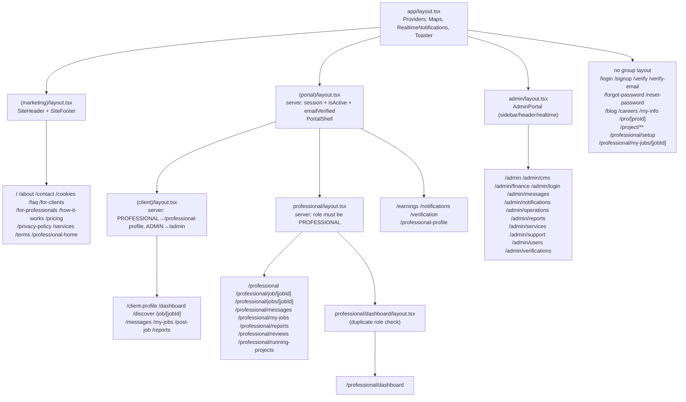

# Screen Inventory (UI / Route Map)

Last verified against code: 2026-09-16 (commit cd8f4fb); runtime-validated 2026-09-17

> Scope: every `app/**/page.tsx` (60 files) in the Next.js 16 App Router tree, mapped to its URL, audience, access control, layout chain, components, API calls, data, forms, actions and UI states.
> Governing spec: §5 (application map) and §11 (UI / screen inventory) of `Claude Code Prompt — Reverse Engineer Existing Project.md`.
> Related docs: [ui-specification.md](ui-specification.md) (frontend and component architecture), [design-system.md](design-system.md), [../03-architecture/authentication-and-authorization.md](../03-architecture/authentication-and-authorization.md), [../05-api/api-specification.md](../05-api/api-specification.md), [../04-database/schema.md](../04-database/schema.md).

## Contents

1. [Conventions](#1-conventions)
2. [Application map](#2-application-map)
3. [Access-control building blocks](#3-access-control-building-blocks)
4. [Summary table (all 60 screens)](#4-summary-table-all-60-screens)
5. [Public screens](#5-public-screens)
6. [Authentication screens](#6-authentication-screens)
7. [User — Client screens](#7-user--client-screens)
8. [User — Professional screens](#8-user--professional-screens)
9. [User — Shared screens (both roles)](#9-user--shared-screens-both-roles)
10. [Admin screens](#10-admin-screens)
11. [Cross-cutting findings](#11-cross-cutting-findings)
12. [Screenshots and design assets](#12-screenshots-and-design-assets)
13. [Relationship to existing docs](#13-relationship-to-existing-docs)

---

## 1. Conventions

| Item          | Convention                                                                                                                                                                                                                                                                                                                                                                       |
| ------------- | -------------------------------------------------------------------------------------------------------------------------------------------------------------------------------------------------------------------------------------------------------------------------------------------------------------------------------------------------------------------------------- |
| Screen ID     | `SCR-<AREA>-NNN`, AREA ∈ `PUB`, `CLI`, `PRO`, `SHR`, `ADM`. Numbered in ASCII route-alphabetical order within each area. Authentication screens (`/login`, `/signup`, …) are anonymous-accessible and therefore use `PUB` IDs, but are described in their own section (§6). `/admin/login` is `ADM`. Other docs should reference screens by **route**, not by ID.                |
| Route         | URL after removing route groups `(marketing)`, `(portal)`, `(client)`. Dynamic segments shown as `[param]`.                                                                                                                                                                                                                                                                      |
| API paths     | Written exactly as the browser calls them. `next.config.ts:21-26` rewrites `/api/v1/:path*` → `/api/:path*`, so `GET /api/v1/client/jobs` is served by `app/api/client/jobs/route.ts`. Exceptions: `app/api/v1/messages/route.ts` and `app/api/v1/professionals/route.ts` physically exist and are served directly (filesystem routes are matched before `afterFiles` rewrites). |
| Prisma models | PascalCase model names from `prisma/schema.prisma`, derived from the `db.<delegate>` calls reachable from the API route handler (including `src/lib/**` helpers). Lists are "touches", not necessarily "reads for this screen".                                                                                                                                                  |
| Status labels | **Implemented**, **Partially implemented**, **Planned / inferred**, **Unknown** — per spec Rule 3.                                                                                                                                                                                                                                                                               |
| Layout keys   | `ROOT` = `app/layout.tsx`; `MKT` = `app/(marketing)/layout.tsx`; `PORTAL` = `app/(portal)/layout.tsx`; `CLIENT` = `app/(portal)/(client)/layout.tsx`; `PRO` = `app/(portal)/professional/layout.tsx`; `PRO-DASH` = `app/(portal)/professional/dashboard/layout.tsx`; `ADMIN` = `app/admin/layout.tsx`.                                                                           |

### Shell components used by many screens (API calls listed once here)

| Shell                                                                                 | Source                                            | Used by                                                                                                         | API calls made by the shell                                                                                                                                                                                                                                                                                                                                                                                       |
| ------------------------------------------------------------------------------------- | ------------------------------------------------- | --------------------------------------------------------------------------------------------------------------- | ----------------------------------------------------------------------------------------------------------------------------------------------------------------------------------------------------------------------------------------------------------------------------------------------------------------------------------------------------------------------------------------------------------------- |
| `Providers` (Google Maps provider, `RealtimeNotifications` toast listener, `Toaster`) | `src/components/providers.tsx`                    | ROOT → every screen                                                                                             | `RealtimeNotifications`: Socket.IO `path=/api/realtime` events `notification:new`, `message:new`, `project:updated`, `proposal:new`; fallback polling (`src/components/RealtimeNotifications.tsx:94`); `PATCH /api/portal/notifications` on toast click                                                                                                                                                           |
| `SiteHeader` + `SiteFooter`                                                           | `src/components/SiteHeader.tsx`, `SiteFooter.tsx` | MKT, `/blog`, `/careers`                                                                                        | `GET /api/v1/auth/me`; `ClientAccountMenu`: `GET /api/v1/auth/me`, `POST /api/v1/auth/logout`                                                                                                                                                                                                                                                                                                                     |
| `PortalShell` (sidebar + header + mobile nav, role-based nav)                         | `src/components/PortalShell.tsx`                  | PORTAL                                                                                                          | `GET /api/v1/auth/me` (only when no server-provided user); `AppHeader`: `GET /api/search?q=`, `GET /api/portal/notifications`; `AppNavigation`: `GET /api/v1/messages`, `GET`/`PATCH /api/portal/notifications`; `ClientAccountMenu` as above                                                                                                                                                                     |
| `AppShell` (same chrome as PortalShell, used outside the PORTAL layout)               | `src/components/AppShell.tsx`                     | `/my-info`, `/pro/[proId]`, `/project/[projectId]/tracking`, `/professional/my-jobs/[jobId]` (via `job.$jobId`) | Same as PortalShell                                                                                                                                                                                                                                                                                                                                                                                               |
| `AdminPortal` (`AdminSidebar`, `AdminHeader`, `AdminRealtime`)                        | `src/components/AdminPortal.tsx`                  | ADMIN (bypassed on `/admin/login`)                                                                              | `AdminSidebar`: `GET`/`PATCH /api/admin/sidebar-counts`; `AdminHeader`: `POST /api/v1/auth/logout`; `AdminRealtime`: Socket.IO events `admin:notification`, `notification:new`, `admin:verifications-update`, `admin:operations-update`, `admin:users-update`, `admin:overview-update`, `message:new`, `project:updated` → re-dispatched as `window` `CustomEvent`s `servio:*`; `PATCH /api/portal/notifications` |

Navigation sources: `src/lib/portal-navigation.ts` (client/professional sidebar and mobile nav), `src/components/AdminSidebar.tsx:26-56` (admin nav), `src/components/ClientAccountMenu.tsx:114-140` (account dropdown), `src/components/SiteFooter.tsx` (footer links incl. `/blog`, `/careers`).

---

## 2. Application map

### 2.1 Route tree (text)

```text
/                                   SCR-PUB-001  Landing (PROFESSIONAL → /professional-home)
├── about                           SCR-PUB-002
├── blog                            SCR-PUB-003  static
├── careers                         SCR-PUB-004  static
├── contact                         SCR-PUB-005  contact form
├── cookies                         SCR-PUB-006  static legal
├── faq                             SCR-PUB-007
├── for-clients                     SCR-PUB-008
├── for-professionals               SCR-PUB-009
├── forgot-password                 SCR-PUB-010  [auth]
├── how-it-works                    SCR-PUB-011
├── login                           SCR-PUB-012  [auth]
├── pricing                         SCR-PUB-013
├── privacy-policy                  SCR-PUB-014  static legal
├── pro/[proId]                     SCR-PUB-015  public professional profile + hire flow
├── reset-password                  SCR-PUB-016  [auth]
├── services                        SCR-PUB-017  service catalogue (DB)
├── signup                          SCR-PUB-018  [auth]
├── terms                           SCR-PUB-019  static legal
├── verify                          SCR-PUB-020  [auth] "check your email" gate
├── verify-email                    SCR-PUB-021  [auth] token landing
│
├── client-profile                  SCR-CLI-001  CLIENT
├── dashboard                       SCR-CLI-002  CLIENT
├── discover                        SCR-CLI-003  CLIENT
├── job/[jobId]                     SCR-CLI-004  CLIENT (job detail, proposals, hire)
├── messages                        SCR-CLI-005  CLIENT
├── my-info                         SCR-CLI-006  CLIENT (read-only account summary)
├── my-jobs                         SCR-CLI-007  CLIENT
├── post-job                        SCR-CLI-008  CLIENT (6-step wizard)
├── reports                         SCR-CLI-009  CLIENT
│
├── professional                    SCR-PRO-001  PROFESSIONAL (alias of dashboard)
├── professional-home               SCR-PRO-002  PROFESSIONAL post-login landing (marketing chrome)
├── professional-profile            SCR-PRO-003  PROFESSIONAL (own profile, read-only)
├── professional/
│   ├── dashboard                   SCR-PRO-004
│   ├── job/[jobId]                 SCR-PRO-005  canonical pro job detail
│   ├── jobs/[jobId]                SCR-PRO-006  duplicate alias (unlinked)
│   ├── messages                    SCR-PRO-007
│   ├── my-jobs                     SCR-PRO-008  job board / proposals / offers
│   ├── my-jobs/[jobId]             SCR-PRO-009  duplicate alias (unlinked, outside portal layout)
│   ├── reports                     SCR-PRO-010
│   ├── reviews                     SCR-PRO-011
│   ├── running-projects            SCR-PRO-012
│   └── setup                       SCR-PRO-013  onboarding / edit profile (outside portal layout)
│
├── earnings                        SCR-SHR-001  CLIENT → wallet view; PROFESSIONAL → income view
├── notifications                   SCR-SHR-002
├── project/[projectId]             SCR-SHR-003  redirect → /tracking
│   └── tracking                    SCR-SHR-004  project workspace (milestones, files, payments, review, dispute)
├── verification                    SCR-SHR-005  CLIENT → contact verification; PROFESSIONAL → KYC documents/Persona
│
└── admin                           SCR-ADM-001  ADMIN overview
    ├── cms                         SCR-ADM-002
    ├── finance                     SCR-ADM-003
    ├── login                       SCR-ADM-004  (anonymous)
    ├── messages                    SCR-ADM-005
    ├── notifications               SCR-ADM-006
    ├── operations                  SCR-ADM-007  jobs & disputes
    ├── reports                     SCR-ADM-008
    ├── services                    SCR-ADM-009  service catalogue taxonomy
    ├── support                     SCR-ADM-010  FAQ & contact requests
    ├── users                       SCR-ADM-011
    └── verifications               SCR-ADM-012
```

### 2.2 Layout nesting (Mermaid)



Explanation: the URL `/professional/...` is served from two different folders — `app/(portal)/professional/**` (with PORTAL + PRO layouts) and `app/professional/**` (`setup`, `my-jobs/[jobId]`, with **no** group layout). Layouts apply per folder, not per URL prefix, so the two sibling trees have different protection and chrome.

Limitations: diagram shows layouts only; `proxy.ts` runs before all of them (see §3).

---

## 3. Access-control building blocks

| Layer                           | Source                                                                                        | What it enforces                                                                                                                                                                                                                                                                                                                              | Applies to                                                                                                                                                     |
| ------------------------------- | --------------------------------------------------------------------------------------------- | --------------------------------------------------------------------------------------------------------------------------------------------------------------------------------------------------------------------------------------------------------------------------------------------------------------------------------------------- | -------------------------------------------------------------------------------------------------------------------------------------------------------------- |
| L1 `proxy.ts` admin gate        | `proxy.ts:57-62`                                                                              | `/admin*` except `/admin/login`: `session.role === "ADMIN"` else redirect `/admin/login`. Session verified via `verifySession` (JWT + `Session` row + `isActive`).                                                                                                                                                                            | All `/admin/**` pages                                                                                                                                          |
| L2 `proxy.ts` auth-prefix gate  | `proxy.ts:16-37`, `64-69`                                                                     | Session required (any role) for `/dashboard`, `/discover`, `/messages`, `/my-jobs`, `/post-job`, `/reports`, `/earnings`, `/notifications`, `/professional`, `/professional-profile`, `/professional-home/dashboard`, `/client-profile`, `/my-info`, `/project` (exact or `prefix/`). Redirect `/login` (no `next` param). **No role check.** | Listed prefixes only                                                                                                                                           |
| L3 `proxy.ts` verification gate | `proxy.ts:72-86`                                                                              | Authenticated non-admin with `emailVerifiedAt == null` → `/verify`, for every non-API, non-admin path except `/login`, `/signup`, `/verify`, `/verify-email`, `/forgot-password`, `/reset-password`.                                                                                                                                          | Almost all pages (incl. public marketing pages)                                                                                                                |
| L4 PORTAL layout                | `app/(portal)/layout.tsx:8-40`                                                                | Token required; user `isActive`; non-admin must be email-verified. Any role (incl. ADMIN) allowed.                                                                                                                                                                                                                                            | All `(portal)` pages                                                                                                                                           |
| L5 CLIENT layout                | `app/(portal)/(client)/layout.tsx:5-21`                                                       | PROFESSIONAL → `/professional-profile`; ADMIN → `/admin`. Effectively CLIENT-only.                                                                                                                                                                                                                                                            | `(portal)/(client)/**`                                                                                                                                         |
| L6 PRO layout                   | `app/(portal)/professional/layout.tsx:5-26` (+ duplicate `professional/dashboard/layout.tsx`) | Role must be PROFESSIONAL; CLIENT → `/dashboard`; ADMIN → `/admin`.                                                                                                                                                                                                                                                                           | `(portal)/professional/**`                                                                                                                                     |
| L7 page server checks           | individual `page.tsx`                                                                         | See per-screen rows.                                                                                                                                                                                                                                                                                                                          | `/`, `/client-profile`, `/my-info`, `/professional-home`, `/professional-profile`, `/professional/setup`, `/earnings`, `/verification`, `/admin`, `/admin/cms` |
| L8 API checks                   | `app/api/**/route.ts`                                                                         | Role checks per handler (e.g. `client/jobs` requires CLIENT, `professional/proposals` requires PROFESSIONAL, `portal/[resource]?resource=project` limits to participants/admin).                                                                                                                                                              | Data behind every screen                                                                                                                                       |

Known defect pattern (applies to L4, `app/professional/setup/page.tsx:10-20`): `redirect()` is called **inside** `try { … } catch { redirect("/login") }`. Next.js `redirect` throws a control-flow error (`node_modules/next/dist/docs/01-app/03-api-reference/04-functions/redirect.md:53` — "should be called outside the try block"), so the inner redirect (`/verify`, or `/login` for inactive users) is swallowed and replaced by `/login`. In practice L3 usually redirects unverified users to `/verify` first, masking the bug. `[NEEDS VALIDATION]` at runtime.

---

## 4. Summary table (all 60 screens)

Legend for "Role enforced where": `proxy` (L1), `layout` (L5/L6), `page` (L7 server check), `client-only` (UI branching only), `API only` (no page-level gate; data APIs reject wrong roles), `none`.

### 4.1 Public (incl. authentication screens)

| SCR ID      | Route                | Audience                                                | Auth required                           | Role required & where enforced                                            | Layout chain                                | Main screen component                                                                   | Source                                            |
| ----------- | -------------------- | ------------------------------------------------------- | --------------------------------------- | ------------------------------------------------------------------------- | ------------------------------------------- | --------------------------------------------------------------------------------------- | ------------------------------------------------- |
| SCR-PUB-001 | `/`                  | Public (CLIENT sees same page; PROFESSIONAL redirected) | No                                      | none; PROFESSIONAL → `/professional-home` (page)                          | ROOT → MKT                                  | `src/routes/index.tsx` (`Landing`)                                                      | `app/(marketing)/page.tsx`                        |
| SCR-PUB-002 | `/about`             | Public                                                  | No                                      | none                                                                      | ROOT → MKT                                  | `src/routes/about.tsx`                                                                  | `app/(marketing)/about/page.tsx`                  |
| SCR-PUB-003 | `/blog`              | Public                                                  | No                                      | none                                                                      | ROOT (renders own SiteHeader/Footer)        | inline static JSX                                                                       | `app/blog/page.tsx`                               |
| SCR-PUB-004 | `/careers`           | Public                                                  | No                                      | none                                                                      | ROOT (own SiteHeader/Footer)                | inline static JSX                                                                       | `app/careers/page.tsx`                            |
| SCR-PUB-005 | `/contact`           | Public                                                  | No                                      | none                                                                      | ROOT → MKT                                  | `src/routes/contact.tsx` → `MarketingPageShell` → `MarketingVisualPage` (`ContactForm`) | `app/(marketing)/contact/page.tsx`                |
| SCR-PUB-006 | `/cookies`           | Public                                                  | No                                      | none                                                                      | ROOT → MKT                                  | `src/components/LegalPage.tsx`                                                          | `app/(marketing)/cookies/page.tsx`                |
| SCR-PUB-007 | `/faq`               | Public                                                  | No                                      | none                                                                      | ROOT → MKT                                  | `src/routes/faq.tsx` → `MarketingPageShell`                                             | `app/(marketing)/faq/page.tsx` (`revalidate = 0`) |
| SCR-PUB-008 | `/for-clients`       | Public                                                  | No                                      | none                                                                      | ROOT → MKT                                  | `src/routes/for-clients.tsx` → `MarketingPageShell`                                     | `app/(marketing)/for-clients/page.tsx`            |
| SCR-PUB-009 | `/for-professionals` | Public                                                  | No                                      | none                                                                      | ROOT → MKT                                  | `src/routes/for-professionals.tsx` → `MarketingPageShell`                               | `app/(marketing)/for-professionals/page.tsx`      |
| SCR-PUB-010 | `/forgot-password`   | Anonymous (auth)                                        | No                                      | none                                                                      | ROOT                                        | `src/routes/forgot-password.tsx` (`AuthLayout`)                                         | `app/forgot-password/page.tsx`                    |
| SCR-PUB-011 | `/how-it-works`      | Public                                                  | No                                      | none                                                                      | ROOT → MKT                                  | `src/routes/how-it-works.tsx` → `MarketingPageShell`                                    | `app/(marketing)/how-it-works/page.tsx`           |
| SCR-PUB-012 | `/login`             | Anonymous (auth)                                        | No                                      | none                                                                      | ROOT                                        | `src/routes/login.tsx` (`AuthLayout`)                                                   | `app/login/page.tsx`                              |
| SCR-PUB-013 | `/pricing`           | Public                                                  | No                                      | none                                                                      | ROOT → MKT                                  | `src/routes/pricing.tsx` → `MarketingPageShell`                                         | `app/(marketing)/pricing/page.tsx`                |
| SCR-PUB-014 | `/privacy-policy`    | Public                                                  | No                                      | none                                                                      | ROOT → MKT                                  | `LegalPage`                                                                             | `app/(marketing)/privacy-policy/page.tsx`         |
| SCR-PUB-015 | `/pro/[proId]`       | Public view; hire action for CLIENT                     | No (`/pro` is not in proxy prefix list) | Hire flow: API only (`POST /api/client/project-requests` requires CLIENT) | ROOT (component wraps itself in `AppShell`) | `src/routes/professional/pro.$proId.tsx`                                                | `app/pro/[proId]/page.tsx` (+ `loading.tsx`)      |
| SCR-PUB-016 | `/reset-password`    | Anonymous (auth)                                        | No                                      | none                                                                      | ROOT                                        | `src/routes/reset-password.tsx` (in `<Suspense>`)                                       | `app/reset-password/page.tsx`                     |
| SCR-PUB-017 | `/services`          | Public                                                  | No                                      | none                                                                      | ROOT → MKT                                  | `src/routes/services.tsx` → `ServicesCatalog` (server query)                            | `app/(marketing)/services/page.tsx`               |
| SCR-PUB-018 | `/signup`            | Anonymous (auth)                                        | No                                      | none                                                                      | ROOT                                        | `src/routes/signup.tsx`                                                                 | `app/signup/page.tsx`                             |
| SCR-PUB-019 | `/terms`             | Public                                                  | No                                      | none                                                                      | ROOT → MKT                                  | `LegalPage`                                                                             | `app/(marketing)/terms/page.tsx`                  |
| SCR-PUB-020 | `/verify`            | Authenticated-but-unverified user (anonymous can open)  | No (exempt from L3)                     | none                                                                      | ROOT                                        | `src/routes/verify.tsx`                                                                 | `app/verify/page.tsx`                             |
| SCR-PUB-021 | `/verify-email`      | Anyone holding a verification link                      | No                                      | none                                                                      | ROOT                                        | `src/routes/verify-email.tsx` (in `<Suspense>`)                                         | `app/verify-email/page.tsx`                       |

### 4.2 User — Client

| SCR ID      | Route             | Audience           | Auth required                                      | Role required & where enforced                                | Layout chain                     | Main screen component                                                              | Source                                                       |
| ----------- | ----------------- | ------------------ | -------------------------------------------------- | ------------------------------------------------------------- | -------------------------------- | ---------------------------------------------------------------------------------- | ------------------------------------------------------------ |
| SCR-CLI-001 | `/client-profile` | CLIENT             | Yes (proxy L2 + layout L4 + page)                  | CLIENT: layout L5 **and** page (`role !== "CLIENT"` redirect) | ROOT → PORTAL → CLIENT           | `src/components/ClientProfilePage.tsx`                                             | `app/(portal)/(client)/client-profile/page.tsx`              |
| SCR-CLI-002 | `/dashboard`      | CLIENT             | Yes (L2, L4)                                       | CLIENT: layout L5                                             | ROOT → PORTAL → CLIENT           | `src/routes/client/dashboard.tsx`                                                  | `app/(portal)/(client)/dashboard/page.tsx` (+ `loading.tsx`) |
| SCR-CLI-003 | `/discover`       | CLIENT             | Yes (L2, L4)                                       | CLIENT: layout L5                                             | ROOT → PORTAL → CLIENT           | `src/routes/client/discover.tsx`                                                   | `app/(portal)/(client)/discover/page.tsx` (+ `loading.tsx`)  |
| SCR-CLI-004 | `/job/[jobId]`    | CLIENT (job owner) | Yes (L4 only; `/job` **not** in proxy prefix list) | CLIENT: layout L5; ownership: API                             | ROOT → PORTAL → CLIENT           | `src/routes/job.$jobId.tsx` (`initialViewerRole="CLIENT"`)                         | `app/(portal)/(client)/job/[jobId]/page.tsx`                 |
| SCR-CLI-005 | `/messages`       | CLIENT             | Yes (L2, L4)                                       | CLIENT: layout L5                                             | ROOT → PORTAL → CLIENT           | `src/components/MessagesWorkspace.tsx`                                             | `app/(portal)/(client)/messages/page.tsx`                    |
| SCR-CLI-006 | `/my-info`        | CLIENT             | Yes (L2 + page)                                    | CLIENT: page                                                  | ROOT (component uses `AppShell`) | `src/components/ClientMyInfoPage.tsx` (server data from `getClientAccountSummary`) | `app/my-info/page.tsx`                                       |
| SCR-CLI-007 | `/my-jobs`        | CLIENT             | Yes (L2, L4)                                       | CLIENT: layout L5                                             | ROOT → PORTAL → CLIENT           | `src/routes/client/my-jobs.tsx`                                                    | `app/(portal)/(client)/my-jobs/page.tsx`                     |
| SCR-CLI-008 | `/post-job`       | CLIENT             | Yes (L2, L4)                                       | CLIENT: layout L5                                             | ROOT → PORTAL → CLIENT           | `src/routes/client/post-job.tsx`                                                   | `app/(portal)/(client)/post-job/page.tsx`                    |
| SCR-CLI-009 | `/reports`        | CLIENT             | Yes (L2, L4)                                       | CLIENT: layout L5                                             | ROOT → PORTAL → CLIENT           | `src/routes/client/reports.tsx`                                                    | `app/(portal)/(client)/reports/page.tsx`                     |

### 4.3 User — Professional

| SCR ID      | Route                            | Audience                | Auth required                                                                          | Role required & where enforced                                                                                                                    | Layout chain                              | Main screen component                                            | Source                                                 |
| ----------- | -------------------------------- | ----------------------- | -------------------------------------------------------------------------------------- | ------------------------------------------------------------------------------------------------------------------------------------------------- | ----------------------------------------- | ---------------------------------------------------------------- | ------------------------------------------------------ |
| SCR-PRO-001 | `/professional`                  | PROFESSIONAL            | Yes (L2, L4)                                                                           | PROFESSIONAL: layout L6                                                                                                                           | ROOT → PORTAL → PRO                       | `src/routes/professional/dashboard.tsx`                          | `app/(portal)/professional/page.tsx` (+ `loading.tsx`) |
| SCR-PRO-002 | `/professional-home`             | PROFESSIONAL            | Yes (page only; proxy lists only `/professional-home/dashboard`, which does not exist) | PROFESSIONAL: page (else `/login`); also requires verified email and completed category + coordinates (else `/professional/setup?profileSetup=1`) | ROOT → MKT                                | `src/routes/professional-home.tsx`                               | `app/(marketing)/professional-home/page.tsx`           |
| SCR-PRO-003 | `/professional-profile`          | PROFESSIONAL            | Yes (L2, L4, page)                                                                     | PROFESSIONAL: page (CLIENT → `/dashboard`; ADMIN → `/login`)                                                                                      | ROOT → PORTAL                             | inline server component in page                                  | `app/(portal)/professional-profile/page.tsx`           |
| SCR-PRO-004 | `/professional/dashboard`        | PROFESSIONAL            | Yes (L2, L4)                                                                           | PROFESSIONAL: layout L6 (twice: PRO + PRO-DASH)                                                                                                   | ROOT → PORTAL → PRO → PRO-DASH            | `src/routes/professional/dashboard.tsx`                          | `app/(portal)/professional/dashboard/page.tsx`         |
| SCR-PRO-005 | `/professional/job/[jobId]`      | PROFESSIONAL            | Yes (L2, L4)                                                                           | PROFESSIONAL: layout L6                                                                                                                           | ROOT → PORTAL → PRO                       | `src/routes/job.$jobId.tsx` (viewer role from `/api/v1/auth/me`) | `app/(portal)/professional/job/[jobId]/page.tsx`       |
| SCR-PRO-006 | `/professional/jobs/[jobId]`     | PROFESSIONAL            | Yes (L2, L4)                                                                           | PROFESSIONAL: layout L6                                                                                                                           | ROOT → PORTAL → PRO                       | `src/routes/job.$jobId.tsx`                                      | `app/(portal)/professional/jobs/[jobId]/page.tsx`      |
| SCR-PRO-007 | `/professional/messages`         | PROFESSIONAL            | Yes (L2, L4)                                                                           | PROFESSIONAL: layout L6                                                                                                                           | ROOT → PORTAL → PRO                       | `MessagesWorkspace`                                              | `app/(portal)/professional/messages/page.tsx`          |
| SCR-PRO-008 | `/professional/my-jobs`          | PROFESSIONAL            | Yes (L2, L4)                                                                           | PROFESSIONAL: layout L6                                                                                                                           | ROOT → PORTAL → PRO                       | `src/routes/professional/my-jobs.tsx`                            | `app/(portal)/professional/my-jobs/page.tsx`           |
| SCR-PRO-009 | `/professional/my-jobs/[jobId]`  | PROFESSIONAL (intended) | Yes (L2 only)                                                                          | **API only** — no layout/page role check; a CLIENT can open it                                                                                    | ROOT (component falls back to `AppShell`) | `src/routes/job.$jobId.tsx`                                      | `app/professional/my-jobs/[jobId]/page.tsx`            |
| SCR-PRO-010 | `/professional/reports`          | PROFESSIONAL            | Yes (L2, L4)                                                                           | PROFESSIONAL: layout L6                                                                                                                           | ROOT → PORTAL → PRO                       | `src/routes/professional/reports.tsx`                            | `app/(portal)/professional/reports/page.tsx`           |
| SCR-PRO-011 | `/professional/reviews`          | PROFESSIONAL            | Yes (L2, L4)                                                                           | PROFESSIONAL: layout L6                                                                                                                           | ROOT → PORTAL → PRO                       | `src/routes/professional/reviews.tsx`                            | `app/(portal)/professional/reviews/page.tsx`           |
| SCR-PRO-012 | `/professional/running-projects` | PROFESSIONAL            | Yes (L2, L4)                                                                           | PROFESSIONAL: layout L6                                                                                                                           | ROOT → PORTAL → PRO                       | `src/routes/professional/running-projects.tsx`                   | `app/(portal)/professional/running-projects/page.tsx`  |
| SCR-PRO-013 | `/professional/setup`            | PROFESSIONAL            | Yes (L2 + page)                                                                        | PROFESSIONAL: page (else `/login`)                                                                                                                | ROOT (no shell; renders own `Logo`)       | `src/components/ProfessionalProfileSetup.tsx`                    | `app/professional/setup/page.tsx`                      |

### 4.4 User — Shared (both roles)

| SCR ID      | Route                           | Audience                                    | Auth required                                                | Role required & where enforced                                                                                                                                                                                                       | Layout chain                           | Main screen component                                                             | Source                                               |
| ----------- | ------------------------------- | ------------------------------------------- | ------------------------------------------------------------ | ------------------------------------------------------------------------------------------------------------------------------------------------------------------------------------------------------------------------------------ | -------------------------------------- | --------------------------------------------------------------------------------- | ---------------------------------------------------- |
| SCR-SHR-001 | `/earnings`                     | CLIENT and PROFESSIONAL (different screens) | Yes (L2, L4, page)                                           | page: CLIENT → `ClientEarnings`; PROFESSIONAL → `Earnings`; other → `/admin`                                                                                                                                                         | ROOT → PORTAL                          | `src/routes/client/earnings.tsx` / `src/routes/professional/earnings.tsx`         | `app/(portal)/earnings/page.tsx`                     |
| SCR-SHR-002 | `/notifications`                | Any authenticated user (ADMIN not blocked)  | Yes (L2, L4)                                                 | none                                                                                                                                                                                                                                 | ROOT → PORTAL                          | `src/routes/notifications.tsx` → `NotificationInbox`                              | `app/(portal)/notifications/page.tsx`                |
| SCR-SHR-003 | `/project/[projectId]`          | Project participants                        | Yes (L2)                                                     | none (pure redirect)                                                                                                                                                                                                                 | ROOT                                   | — (server `redirect` to `/project/[projectId]/tracking`)                          | `app/project/[projectId]/page.tsx` (+ `loading.tsx`) |
| SCR-SHR-004 | `/project/[projectId]/tracking` | Project client, project professional, ADMIN | Yes (L2)                                                     | **API only**: `GET /api/portal/project?id=` returns nothing unless caller is the project's client/professional or ADMIN (`app/api/portal/[resource]/route.ts:817-826`); actions checked in `app/api/portal/project-actions/route.ts` | ROOT (page wraps itself in `AppShell`) | inline client component (2,964 lines)                                             | `app/project/[projectId]/tracking/page.tsx`          |
| SCR-SHR-005 | `/verification`                 | CLIENT and PROFESSIONAL (different screens) | Yes (L4, page; `/verification` **not** in proxy prefix list) | page: CLIENT → `ClientVerification`; PROFESSIONAL → `Verification`; other → `/admin`                                                                                                                                                 | ROOT → PORTAL                          | `src/routes/client/verification.tsx` / `src/routes/professional/verification.tsx` | `app/(portal)/verification/page.tsx`                 |

### 4.5 Admin

All `/admin/**` pages except `/admin/login` are gated by **L1 proxy** (`role === "ADMIN"`). Only `/admin` and `/admin/cms` repeat the check server-side in the page. All admin APIs re-check ADMIN (`app/api/admin/**`).

| SCR ID      | Route                  | Audience  | Auth required | Role required & where enforced     | Layout chain               | Main screen component                        | Source                                           |
| ----------- | ---------------------- | --------- | ------------- | ---------------------------------- | -------------------------- | -------------------------------------------- | ------------------------------------------------ |
| SCR-ADM-001 | `/admin`               | ADMIN     | Yes           | ADMIN: proxy + page                | ROOT → ADMIN               | `src/routes/admin/admin.tsx`                 | `app/admin/page.tsx` (+ `app/admin/loading.tsx`) |
| SCR-ADM-002 | `/admin/cms`           | ADMIN     | Yes           | ADMIN: proxy + page                | ROOT → ADMIN               | `src/components/CmsEditor.tsx`               | `app/admin/cms/page.tsx`                         |
| SCR-ADM-003 | `/admin/finance`       | ADMIN     | Yes           | ADMIN: proxy; API                  | ROOT → ADMIN (full-width)  | inline client component (1,380 lines)        | `app/admin/finance/page.tsx`                     |
| SCR-ADM-004 | `/admin/login`         | Anonymous | No            | none (AdminPortal chrome bypassed) | ROOT → ADMIN (passthrough) | inline client component                      | `app/admin/login/page.tsx`                       |
| SCR-ADM-005 | `/admin/messages`      | ADMIN     | Yes           | ADMIN: proxy; API                  | ROOT → ADMIN               | `MessagesWorkspace admin`                    | `app/admin/messages/page.tsx`                    |
| SCR-ADM-006 | `/admin/notifications` | ADMIN     | Yes           | ADMIN: proxy; API                  | ROOT → ADMIN               | `src/components/AdminNotificationCenter.tsx` | `app/admin/notifications/page.tsx`               |
| SCR-ADM-007 | `/admin/operations`    | ADMIN     | Yes           | ADMIN: proxy; API                  | ROOT → ADMIN               | inline client component (1,398 lines)        | `app/admin/operations/page.tsx`                  |
| SCR-ADM-008 | `/admin/reports`       | ADMIN     | Yes           | ADMIN: proxy; API                  | ROOT → ADMIN               | inline + `src/components/reports/*`          | `app/admin/reports/page.tsx`                     |
| SCR-ADM-009 | `/admin/services`      | ADMIN     | Yes           | ADMIN: proxy; API                  | ROOT → ADMIN               | inline client component (1,080 lines)        | `app/admin/services/page.tsx`                    |
| SCR-ADM-010 | `/admin/support`       | ADMIN     | Yes           | ADMIN: proxy; API                  | ROOT → ADMIN               | inline client component                      | `app/admin/support/page.tsx`                     |
| SCR-ADM-011 | `/admin/users`         | ADMIN     | Yes           | ADMIN: proxy; API                  | ROOT → ADMIN               | inline client component                      | `app/admin/users/page.tsx`                       |
| SCR-ADM-012 | `/admin/verifications` | ADMIN     | Yes           | ADMIN: proxy; API                  | ROOT → ADMIN               | inline client component                      | `app/admin/verifications/page.tsx`               |

### 4.6 Route counts

| Audience                                                        | Count                                                                                                                  |
| --------------------------------------------------------------- | ---------------------------------------------------------------------------------------------------------------------- |
| Public marketing / public content (`PUB`, excl. auth)           | 15                                                                                                                     |
| Authentication screens (`PUB` IDs 010, 012, 016, 018, 020, 021) | 6                                                                                                                      |
| User — Client (`CLI`)                                           | 9                                                                                                                      |
| User — Professional (`PRO`)                                     | 13 (of which 3 are aliases/duplicates: `/professional`, `/professional/jobs/[jobId]`, `/professional/my-jobs/[jobId]`) |
| User — Shared (`SHR`)                                           | 5 (of which 1 is a redirect: `/project/[projectId]`)                                                                   |
| Admin (`ADM`, incl. `/admin/login`)                             | 12                                                                                                                     |
| **Total `page.tsx`**                                            | **60**                                                                                                                 |

Other route-level files: `app/loading.tsx`, `app/error.tsx` (generic "This page didn't load" + retry), `app/not-found.tsx` (404), `loading.tsx` in `(client)/dashboard`, `(client)/discover`, `(portal)/professional`, `admin`, `pro/[proId]`, `project/[projectId]`, and an **orphaned** `app/job/[jobId]/loading.tsx` (no sibling page; the real `/job/[jobId]` page lives in `app/(portal)/(client)/job/[jobId]/`).

---

## 5. Public screens

### SCR-PUB-001 — Landing page (`/`)

| Field             | Detail                                                                                                                                                                                                                                                                                                                            |
| ----------------- | --------------------------------------------------------------------------------------------------------------------------------------------------------------------------------------------------------------------------------------------------------------------------------------------------------------------------------- |
| Route             | `/` — `app/(marketing)/page.tsx`                                                                                                                                                                                                                                                                                                  |
| Audience          | Anonymous visitors and CLIENTs. Logged-in PROFESSIONALs are redirected to `/professional-home` (`page.tsx:19`).                                                                                                                                                                                                                   |
| Authentication    | Optional. Server reads `servio_session`; invalid token is ignored. Unverified non-admin users are sent to `/verify` by proxy L3.                                                                                                                                                                                                  |
| Authorization     | none                                                                                                                                                                                                                                                                                                                              |
| Purpose           | Marketing home: hero, feature cards, featured professionals.                                                                                                                                                                                                                                                                      |
| Components        | `page.tsx` → `src/routes/index.tsx` (`Landing`, props `isAuthenticated`, `homeContent`) → `src/components/ProCard.tsx`. `homeContent` from `readHomeContent()` (`src/lib/home-cms-file.ts` → `data/cms-home.json`). The same `Landing` component is embedded in the CMS editor with editable fields (`src/routes/index.tsx:353`). |
| API calls         | `GET /api/v1/marketplace/professionals` (`src/routes/index.tsx:99`)                                                                                                                                                                                                                                                               |
| Data dependencies | File CMS `data/cms-home.json`; `User` (professionals) via `app/api/marketplace/[resource]/route.ts`                                                                                                                                                                                                                               |
| Forms             | none                                                                                                                                                                                                                                                                                                                              |
| Actions           | CTA links (signup/post job/discover); professional cards link to `/pro/[proId]` (`ProCard.tsx:20`)                                                                                                                                                                                                                                |
| States            | Implemented: loading and empty handling for professionals list `[NEEDS VALIDATION]` of exact skeleton.                                                                                                                                                                                                                            |

### SCR-PUB-002 — About (`/about`)

| Field           | Detail                                                                                                                                                                                                                                                                                   |
| --------------- | ---------------------------------------------------------------------------------------------------------------------------------------------------------------------------------------------------------------------------------------------------------------------------------------- |
| Components      | `src/routes/about.tsx` (async server component) → `AboutHero`, `AboutFeatureGrid` → `AboutFeatureCard`; content from `readCmsContent()` (`src/lib/cms-file.ts` → `data/cms-content.json`), sanitized via `src/lib/sanitizeCmsHtml.ts`. Section order is CMS-controlled (`sectionOrder`). |
| API calls       | none (server file read)                                                                                                                                                                                                                                                                  |
| Data            | `data/cms-content.json`                                                                                                                                                                                                                                                                  |
| Forms / actions | none                                                                                                                                                                                                                                                                                     |
| States          | Static server render.                                                                                                                                                                                                                                                                    |

### SCR-PUB-005/007/008/009/011/013 — CMS marketing pages (`/contact`, `/faq`, `/for-clients`, `/for-professionals`, `/how-it-works`, `/pricing`)

| Field              | Detail                                                                                                                                                                                                                                                                                                                                                                                                                             |
| ------------------ | ---------------------------------------------------------------------------------------------------------------------------------------------------------------------------------------------------------------------------------------------------------------------------------------------------------------------------------------------------------------------------------------------------------------------------------- |
| Components         | `src/routes/<page>.tsx` → `src/components/MarketingPageShell.tsx` (async; `readMarketingContent(page)` from `src/lib/marketing-cms.ts` → `data/cms-marketing.json`) → `src/components/MarketingVisualPage.tsx`. Page-specific sections: `/contact` → `ContactForm` (`MarketingVisualPage.tsx:705`); `/pricing` → pricing variant (`:171`).                                                                                         |
| API calls (bundle) | `GET /api/v1/auth/me` (`:205`), `GET /api/v1/marketplace/categories` (`:213`), `GET /api/marketplace/jobs` (`:221`) — used by `ServicesJobsSection`, which is only rendered for `page === "services"` (`:168`); `POST /api/v1/contact` (`:712`, contact form).                                                                                                                                                                     |
| Data               | `data/cms-marketing.json`; contact form → `ContactRequest` model (`app/api/contact/route.ts`).                                                                                                                                                                                                                                                                                                                                     |
| Forms              | `/contact`: Your name, Email address (`type="email"`), Subject, Message; all `required` (HTML validation); server validates with zod.                                                                                                                                                                                                                                                                                              |
| Actions            | Send message → `POST /api/v1/contact`.                                                                                                                                                                                                                                                                                                                                                                                             |
| States             | Contact: pending/success/error (`"Unable to send your message."`).                                                                                                                                                                                                                                                                                                                                                                 |
| Findings           | (1) **`/faq` renders CMS JSON content, not the `Faq` table.** Admin FAQ CRUD on `/admin/support` writes `Faq` rows, but `src/lib/queries/faq.ts` is not imported by any page or component, so admin-managed FAQs are never shown publicly. (2) `ServicesJobsSection` (job list linking to `/job/[id]`) is only reachable in the CMS editor preview, because `/services` renders `ServicesCatalog` instead of `MarketingPageShell`. |

### SCR-PUB-003/004/006/014/019 — Static pages (`/blog`, `/careers`, `/cookies`, `/privacy-policy`, `/terms`)

| Field                  | Detail                                                                                                                                                                                                                                       |
| ---------------------- | -------------------------------------------------------------------------------------------------------------------------------------------------------------------------------------------------------------------------------------------- |
| Components             | `/blog`, `/careers`: inline JSX with `SiteHeader`/`SiteFooter` (outside the marketing route group, so they include the chrome themselves). `/cookies`, `/privacy-policy`, `/terms`: `src/components/LegalPage.tsx` with hard-coded sections. |
| API calls              | Only shell calls (`SiteHeader`: `GET /api/v1/auth/me`).                                                                                                                                                                                      |
| Data / forms / actions | none                                                                                                                                                                                                                                         |
| States                 | Static. Blog has two hard-coded teaser articles; Careers shows "Open roles coming soon". Status: **Partially implemented** (placeholder content; no blog/careers data model). Legal texts are two short paragraphs each (placeholder-level). |

### SCR-PUB-015 — Public professional profile (`/pro/[proId]`)

| Field          | Detail                                                                                                                                                                                                                            |
| -------------- | --------------------------------------------------------------------------------------------------------------------------------------------------------------------------------------------------------------------------------- |
| Route          | `/pro/[proId]` — `app/pro/[proId]/page.tsx` → `src/routes/professional/pro.$proId.tsx` (621 lines)                                                                                                                                |
| Audience       | Anyone can view; hiring is for CLIENTs. Linked from `ProCard`, `/discover` (`discover.tsx:756-758`, optionally `?jobId=`), job proposals (`job.$jobId.tsx:989,1113`), notifications (`src/lib/marketplace-notifications.ts:153`). |
| Authentication | Not required (`/pro` is not in the proxy prefix list).                                                                                                                                                                            |
| Authorization  | Hire request: API only (`app/api/client/project-requests/route.ts` requires CLIENT).                                                                                                                                              |
| Components     | `AppShell` (sidebar only when a user is loaded) → `ProfessionalLocationMap` → `GoogleMapsProvider`; `src/lib/constants/hiring.ts`.                                                                                                |
| API calls      | `GET /api/v1/marketplace/professional-detail?id=` (`:72`); `GET /api/v1/client/jobs` (`:86`, to pick a job to hire for); `POST /api/v1/client/project-requests` (`:145`).                                                         |
| Data           | `User` (professional profile fields), `ServiceCategory`, `ClientJob`, `ProjectRequest`, `ProjectTracking`, `UserNotification`.                                                                                                    |
| Forms          | 3-step hire dialog: Select your job (required), Estimated duration (`type="number"`), Message to professional.                                                                                                                    |
| Actions        | Hire / send request; Back / Cancel between steps.                                                                                                                                                                                 |
| States         | Loading (`AppShell` skeleton), "Unable to load professional", "Unable to load jobs", "Unable to send the hire request.", empty "No skills published yet.".                                                                        |

### SCR-PUB-017 — Service catalogue (`/services`)

| Field      | Detail                                                                                                                                                                                        |
| ---------- | --------------------------------------------------------------------------------------------------------------------------------------------------------------------------------------------- |
| Components | `src/routes/services.tsx` (`dynamic = "force-dynamic"`) → `getCompleteCategoryHierarchy()` (`src/lib/queries/categories-hierarchy.ts`, direct Prisma) → `src/components/ServicesCatalog.tsx`. |
| API calls  | none (server-side DB query)                                                                                                                                                                   |
| Data       | `ServiceCategory` hierarchy (parent domain → category → sub-category)                                                                                                                         |
| Forms      | Search input "Search any parent category, service, or task…" (client-side filter)                                                                                                             |
| Actions    | Filter by category, reset filters                                                                                                                                                             |
| States     | Empty: "No matching categories found".                                                                                                                                                        |

---

## 6. Authentication screens

All render `src/components/AuthLayout.tsx` + `Logo`; none has a group layout. All are exempt from proxy L3.

### SCR-PUB-012 — Login (`/login`)

| Field               | Detail                                                                                                                                                                                                                                                                                                                                                                                                                                                                               |
| ------------------- | ------------------------------------------------------------------------------------------------------------------------------------------------------------------------------------------------------------------------------------------------------------------------------------------------------------------------------------------------------------------------------------------------------------------------------------------------------------------------------------ |
| Components          | `src/routes/login.tsx` (475 lines) → `AuthLayout`, `GoogleMark`; `src/lib/country-codes.ts`, `src/lib/phone-validation.ts`                                                                                                                                                                                                                                                                                                                                                           |
| API calls           | `POST /api/v1/auth/login` (`:116`); `POST /api/v1/auth/send-phone-login-otp` (`:150`); `POST /api/v1/auth/login-phone` (`:187`); Google: browser navigation to `/api/v1/auth/google`; shell `GET /api/v1/auth/me`                                                                                                                                                                                                                                                                    |
| Data                | `User`, `Session`, `OtpCode` (via `app/api/auth/[action]/route.ts`)                                                                                                                                                                                                                                                                                                                                                                                                                  |
| Forms               | Email mode: Email (`type="email"`, required), Password (required). Phone mode: country code + Phone number (`type="tel"`), Verification code (4 digits). Client validation messages e.g. "Password is required.", "Enter the 4-digit verification code."                                                                                                                                                                                                                             |
| Actions             | Sign in; send OTP; sign in with phone; Continue with Google; **"Quick fill — temporary, for testing only"** select that fills and submits demo accounts (`:15-26`, `:300-327`). Honors `?next=` (same-origin path only, `:71-73`) and `?oauthError=`; shows profile-setup reminder when `?profileSetup=1` or `next` is `/professional/setup` or `/client-profile`.                                                                                                                   |
| Post-login redirect | Server-provided: unverified → `/verify`; PROFESSIONAL → `/professional-home` or `/professional/setup?profileSetup=1`; CLIENT → `/dashboard` or `/client-profile?profileSetup=1` (`app/api/auth/[action]/route.ts:464-477`).                                                                                                                                                                                                                                                          |
| States              | pending, field errors, network error, OTP sent confirmation, Google failure message.                                                                                                                                                                                                                                                                                                                                                                                                 |
| Finding             | **High:** demo account emails and a shared plaintext password are hard-coded in the client bundle and the quick-fill UI is not gated by environment (no `NODE_ENV` check). Values intentionally not reproduced here. The in-bundle client, professional and admin credentials sign in against a locally seeded DB [VALIDATED 2026-09-17 · [V-29](../validation/LOCAL_VALIDATION_LOG.md)]; whether these accounts exist in production is `[NEEDS VALIDATION — not testable locally]`. |

### SCR-PUB-018 — Signup (`/signup`)

| Field      | Detail                                                                                                                                                                                                                                                   |
| ---------- | -------------------------------------------------------------------------------------------------------------------------------------------------------------------------------------------------------------------------------------------------------- |
| Components | `src/routes/signup.tsx` → `AuthLayout`, `GoogleMark`                                                                                                                                                                                                     |
| API calls  | `POST /api/v1/auth/check-availability` (`:51`); `POST /api/v1/auth/register` (`:105`); Google: navigation to `/api/v1/auth/google?role=CLIENT                                                                                                            | PROFESSIONAL` (`:172`) |
| Data       | `User`, `Session`, `ClientProfile`, `UserNotification` (admin/new-pro notifications)                                                                                                                                                                     |
| Forms      | Role toggle (client / pro; preselect via `?role=`), First name (required), Last name (required), Email (required, regex-checked), Password (≥8 chars, uppercase, lowercase, digit — `:82-93`), Confirm password (must match), Terms checkbox (required). |
| Actions    | Create account → redirect to server `redirect` or `/client-profile` (`:125`).                                                                                                                                                                            |
| States     | pending, per-field errors (client + server `fields`), "Network error. Check your connection and try again."                                                                                                                                              |

### SCR-PUB-020 — Verify email gate (`/verify`)

| Field      | Detail                                                                                                                                               |
| ---------- | ---------------------------------------------------------------------------------------------------------------------------------------------------- |
| Components | `src/routes/verify.tsx`                                                                                                                              |
| API calls  | `GET /api/v1/auth/me` polled every 2 s (`:25-35`); `POST /api/v1/auth/resend-verification` (`:58`); `POST /api/v1/auth/update-email` (`:72`)         |
| Forms      | Edit email (`type="email"`)                                                                                                                          |
| Actions    | Resend link; Update email; Cancel                                                                                                                    |
| States     | "Email verified — you can close this tab" once `emailVerifiedAt` is set; errors "Unable to resend the confirmation link.", "Unable to update email." |

### SCR-PUB-021 — Email verification landing (`/verify-email`)

| Field      | Detail                                                                                    |
| ---------- | ----------------------------------------------------------------------------------------- |
| Components | `src/routes/verify-email.tsx` (inside `<Suspense>` for `useSearchParams`)                 |
| API calls  | `POST /api/v1/auth/verify-email` (`:26`) with token from URL                              |
| States     | verifying / success / "This verification link is invalid or has expired." / generic error |

### SCR-PUB-010 — Forgot password (`/forgot-password`)

| Field      | Detail                                                                                                                                                                                                                           |
| ---------- | -------------------------------------------------------------------------------------------------------------------------------------------------------------------------------------------------------------------------------- |
| Components | `src/routes/forgot-password.tsx` (314 lines)                                                                                                                                                                                     |
| API calls  | Email path: `POST /api/v1/auth/forgot-password` (`:21`). Phone path: `POST /api/v1/auth/forgot-password-phone` (`:79`) → `POST /api/v1/auth/verify-forgot-password-phone` (`:123`) → `POST /api/v1/auth/reset-password` (`:151`) |
| Forms      | Email; or Phone number (`type="tel"`) + 4-digit code (single-char inputs) + New password (≥8) + Confirm password (must match)                                                                                                    |
| States     | "Unable to send the reset link…", "Unable to verify this code.", "Passwords do not match."                                                                                                                                       |

### SCR-PUB-016 — Reset password (`/reset-password`)

| Field      | Detail                                                               |
| ---------- | -------------------------------------------------------------------- |
| Components | `src/routes/reset-password.tsx` (inside `<Suspense>`)                |
| API calls  | `POST /api/v1/auth/reset-password` (`:23`) with token from query     |
| Forms      | New password, Confirm password (required; must match)                |
| States     | "Passwords do not match.", "Unable to reset your password.", success |

### SCR-ADM-004 — Admin login (`/admin/login`)

Documented in §10.

---

## 7. User — Client screens

Common to `(client)` screens: PORTAL layout loads the user server-side (`db.user.findUnique`) and renders `PortalShell` with `clientItems` navigation (`src/lib/portal-navigation.ts:18-28`: Dashboard, Find pros, Post a job, Projects, Reports, Messages, Earnings, Verification, Notifications).

### SCR-CLI-002 — Client dashboard (`/dashboard`)

| Field      | Detail                                                                                                                                                                                     |
| ---------- | ------------------------------------------------------------------------------------------------------------------------------------------------------------------------------------------ |
| Purpose    | Overview of the client's jobs, proposals, hire requests and activity.                                                                                                                      |
| Components | `src/routes/client/dashboard.tsx` (457 lines) → `LoadingSkeleton`                                                                                                                          |
| API calls  | `GET /api/v1/dashboard` (`:74`)                                                                                                                                                            |
| Realtime   | Socket.IO (`path=/api/realtime`) `proposal:new`, `project:updated`, `notification:new` → reload (`:92-103`); window events `servio:notification`, `servio:project-update`.                 |
| Data       | `ClientJob`, `ProjectRequest`, `ProjectTracking`, `ProjectTransaction`, `User`, `UserNotification` (`app/api/dashboard/route.ts`, requires CLIENT)                                         |
| Forms      | none                                                                                                                                                                                       |
| Actions    | Links to `/job/[id]` (`:198,318,355`), `/client-profile?from=dashboard` (phone reminder, `:138`); dismiss phone reminder (stored in `localStorage` key `servio-phone-reminder-dismissed`). |
| States     | Skeleton loading (`app/(portal)/(client)/dashboard/loading.tsx` + component skeleton); error "Sign in as a client to view your dashboard."; sections "Your projects", "Activity".          |

### SCR-CLI-003 — Discover professionals (`/discover`)

| Field      | Detail                                                                                                                                                                                                                                                                                                                              |
| ---------- | ----------------------------------------------------------------------------------------------------------------------------------------------------------------------------------------------------------------------------------------------------------------------------------------------------------------------------------- |
| Purpose    | Search and filter verified professionals, list + map view; optionally scoped to a job (`?jobId=`).                                                                                                                                                                                                                                  |
| Components | `src/routes/client/discover.tsx` (835 lines) → `ProfessionalDiscoveryMap`, `ProfessionalsPreviewMap`, `GoogleMapsProvider`, `ProCard`; `src/lib/india-locations.ts`                                                                                                                                                                 |
| API calls  | `GET /api/profile` (`:105`, primary address); `GET /api/geocode?q=` (`:117`); `GET /api/v1/marketplace/categories` (`:139`); `GET /api/v1/marketplace/job?id=` (`:158`, job context); `GET /api/v1/professionals?query&segment&parentCategoryId&categoryId&subcategoryId&city&state&district&minRating&availability&…` (`:188-210`) |
| Data       | `User` (professionals), `ServiceCategory`, `ClientProfile`/`ClientSavedLocation`, `ClientJob`                                                                                                                                                                                                                                       |
| Forms      | Filter panel: text query, segment/category cascade, state/city/district, min rating, availability, location (placeholder "e.g., Toronto, Vancouver" — non-Indian example text in an India-focused product).                                                                                                                         |
| Actions    | "Use my current location" (browser geolocation), use primary address, paginate (Previous/Next), open `/pro/[id]` (with `jobId`), back to `/job/[jobId]` (`:287`).                                                                                                                                                                   |
| States     | Loading (route `loading.tsx`), "Failed to load categories", "Failed to load professionals", "No professionals match these filters yet.", geolocation errors.                                                                                                                                                                        |

### SCR-CLI-004 — Client job detail (`/job/[jobId]`)

| Field      | Detail                                                                                                                                                                                                                                                                                                                                                                                                                                                                                                  |
| ---------- | ------------------------------------------------------------------------------------------------------------------------------------------------------------------------------------------------------------------------------------------------------------------------------------------------------------------------------------------------------------------------------------------------------------------------------------------------------------------------------------------------------- |
| Purpose    | Job owner view: job description/location, received proposals, sent hire requests, negotiation, close/reopen; auto-redirects to project tracking once a project exists.                                                                                                                                                                                                                                                                                                                                  |
| Components | `page.tsx` → `src/routes/job.$jobId.tsx` (1,797 lines, `initialViewerRole="CLIENT"`). Inside PORTAL it renders children only (`:145-147`, `usePortalTitle().isInsidePortal`); outside it wraps with `AppShell`.                                                                                                                                                                                                                                                                                         |
| API calls  | `GET /api/v1/auth/me` (`:287`); `GET /api/v1/portal/project?jobId=` (`:292`, redirect to `/project/[id]/tracking` if found); `GET /api/v1/client/jobs/[jobId]` (`:302`); fallback `GET /api/v1/marketplace/job?id=` (`:321`); `GET /api/v1/professionals?…` (`:399`, "Find a professional" search); `POST /api/v1/client/project-requests` (`:453`, hire request); `PATCH /api/v1/client/project-requests/[id]` or `PATCH /api/v1/professional/project-requests/[id]` (`:542`, `:594`, `{action: accept | reject | counter}`); `PATCH /api/v1/client/jobs/[jobId]` `{status:"CLOSED"}`/`{status:"OPEN"}` (`:1346`, `:1372`). |
| Data       | `ClientJob`, `ClientJobMilestone`, `ProjectRequest`, `ProjectNegotiation`, `ProjectMilestone`, `ProjectTracking`, `ProjectTimelineEvent`, `ServiceCategory`, `User`, `UserNotification`                                                                                                                                                                                                                                                                                                                 |
| Forms      | Negotiate dialog: Your counter price (`type="number"`), Timeline, Explain your counter-offer (validation "Enter a valid price, timeline, and message."). Professional search box.                                                                                                                                                                                                                                                                                                                       |
| Actions    | Accept & Hire (confirmation modal), Negotiate, Decline, Accept Terms (on counter-offers), Close job / Reopen job, Find a professional, Go to My Projects.                                                                                                                                                                                                                                                                                                                                               |
| States     | "Unable to load job", "No proposals yet. Share this job to attract professionals.", "Opening your completed project…", "No verified professionals match this search.", per-action errors.                                                                                                                                                                                                                                                                                                               |

### SCR-CLI-005 — Client messages (`/messages`)

Same component as SCR-PRO-007 and SCR-ADM-005; see [§9 Messages workspace](#messages-workspace-shared-component-messagesworkspace).

### SCR-CLI-007 — Client projects list (`/my-jobs`)

| Field      | Detail                                                                                                                              |
| ---------- | ----------------------------------------------------------------------------------------------------------------------------------- |
| Components | `src/routes/client/my-jobs.tsx` (440 lines) → `LoadingSkeleton`                                                                     |
| API calls  | `GET /api/v1/client/jobs` (`:92`, `:120`); `DELETE /api/v1/client/jobs/[id]` (`:193`)                                               |
| Realtime   | Socket.IO `proposal:new`, `project:updated`, `notification:new` (`:111-127`); window `servio:notification`, `servio:project-update` |
| Data       | `ClientJob`, `ProjectRequest`, `ProjectTracking`, `ServiceCategory`                                                                 |
| Forms      | Filter tabs: All projects, Open, Scheduled jobs, In progress, Drafts, Completed (`:39-46`)                                          |
| Actions    | Open `/job/[id]` or `/project/[projectId]/tracking` (`:327-328`); edit draft (→ `/post-job?edit=`); delete job                      |
| States     | skeleton, "No projects in this view"                                                                                                |

### SCR-CLI-008 — Post / edit a job (`/post-job`)

| Field                                          | Detail                                                                                                                                                                                                                                                                                                                                                                                                                                                                                                                                                             |
| ---------------------------------------------- | ------------------------------------------------------------------------------------------------------------------------------------------------------------------------------------------------------------------------------------------------------------------------------------------------------------------------------------------------------------------------------------------------------------------------------------------------------------------------------------------------------------------------------------------------------------------ |
| Purpose                                        | 6-step wizard: Details → Budget & schedule → Milestones → Job type → Location → Review (`:63`). Supports `?edit=<id>` and saving drafts.                                                                                                                                                                                                                                                                                                                                                                                                                           |
| Components                                     | `src/routes/client/post-job.tsx` (1,257 lines) → `AddressMapPicker` → `GoogleAddressMap`, `GoogleMapsProvider`                                                                                                                                                                                                                                                                                                                                                                                                                                                     |
| API calls                                      | `GET /api/v1/marketplace/categories` (`:115`); `GET /api/v1/profile` (`:119`); `GET /api/v1/profile/locations` (`:142`); `GET /api/v1/client/jobs/[edit]` (`:169`); `POST /api/v1/client/jobs` or `PATCH /api/v1/client/jobs/[id]` (`:358`, `mode: draft                                                                                                                                                                                                                                                                                                           | publish`); `GET /api/geocode?q=` (`:449`; `AddressMapPicker`also calls`GET /api/geocode?q=`and`?lat&lon`) |
| Data                                           | `ClientJob`, `ClientJobMilestone`, `ServiceCategory`, `ClientSavedLocation`, `UserNotification` (new-job notifications to professionals/admins)                                                                                                                                                                                                                                                                                                                                                                                                                    |
| Forms / validation (`clientCheck`, `:309-352`) | Step 0: title (required, max 160), category (required), description (required, max 5000). Step 1: scheduled job date must be future; hourly rate required for HOURLY; budget min/max required for FIXED, max ≥ min; deadline required and ≥ job date. Step 2: optional milestones — each needs a title and a percentage of 1–100; the total must not exceed 100% (`:329-339`); description max 500; "Split evenly". Step 3: work mode. Step 4: if not REMOTE, address required and lat/lng required ("Select the address from the search results or drop a pin…"). |
| Actions                                        | Next/Back, Add Milestone, Split evenly, choose saved location, Edit from review, Save draft, Publish                                                                                                                                                                                                                                                                                                                                                                                                                                                               |
| States                                         | Draft autosaved to `localStorage` (`postJobDraftKey`, `:149`, `:216`, cleared on save `:395`); "Could not save the job."                                                                                                                                                                                                                                                                                                                                                                                                                                           |

### SCR-CLI-009 — Client reports (`/reports`)

| Field      | Detail                                                                                                                                                                                        |
| ---------- | --------------------------------------------------------------------------------------------------------------------------------------------------------------------------------------------- |
| Components | `src/routes/client/reports.tsx` → `reports/ExportMenu`, `reports/SelectableReportTable`, `LoadingSkeleton`; `src/hooks/use-row-selection.ts`                                                  |
| API calls  | `GET /api/v1/client/jobs` (`:54`); `GET /api/v1/portal/earnings` (`:128`); `POST /api/client/jobs/export`; `POST /api/client/payments/export` (via `ExportMenu.tsx:39`, returns PDF download) |
| Data       | `ClientJob`, `ProjectTransaction`                                                                                                                                                             |
| Actions    | Select rows; export selected/all as PDF (orientation, page size options — `src/lib/reports/pdf/types.ts`)                                                                                     |
| States     | skeleton; "No projects to report on yet."; "No payments to report on yet."                                                                                                                    |

### SCR-CLI-001 — Client profile editor (`/client-profile`)

| Field      | Detail                                                                                                                                                                                                                                                                                                                                                                                                                                                                                                                     |
| ---------- | -------------------------------------------------------------------------------------------------------------------------------------------------------------------------------------------------------------------------------------------------------------------------------------------------------------------------------------------------------------------------------------------------------------------------------------------------------------------------------------------------------------------------- |
| Purpose    | Edit client profile (name, phone, avatar) and manage saved locations; onboarding target after signup (`?profileSetup=1`). Canonical "My Profile"/"Saved Locations" destination (`ClientAccountMenu.tsx:120,126`, `AppHeader.tsx:82`).                                                                                                                                                                                                                                                                                      |
| Components | `src/components/ClientProfilePage.tsx` → `AddressMapPicker`, `GoogleAddressMap`, `PhoneVerification`                                                                                                                                                                                                                                                                                                                                                                                                                       |
| API calls  | `GET /api/v1/profile` (`:86`); `POST /api/v1/profile` (`:112`, `:153`); `POST /api/profile/avatar` (`:133`, JPEG/PNG/WebP); `POST /api/v1/profile/locations` or `PATCH /api/v1/profile/locations/[id]` (`:172`); `DELETE /api/v1/profile/locations/[id]` (`:196`); `PhoneVerification`: `POST /api/v1/auth/send-phone-otp`, `POST /api/v1/auth/verify-phone`; `GET /api/geocode`                                                                                                                                           |
| Data       | `User`, `ClientProfile`, `ClientSavedLocation`, `OtpCode`                                                                                                                                                                                                                                                                                                                                                                                                                                                                  |
| Forms      | Profile fields (required fields per server zod), avatar file (`accept="image/jpeg,image/png,image/webp"`), location form (label, address with map pin), phone + OTP                                                                                                                                                                                                                                                                                                                                                        |
| Actions    | Save profile, upload photo, Add/Edit/Delete location, verify phone, "Skip for now" (→ `/dashboard`), Try again                                                                                                                                                                                                                                                                                                                                                                                                             |
| States     | "Unable to load your profile." + retry; save/upload/location errors; "No saved locations yet"                                                                                                                                                                                                                                                                                                                                                                                                                              |
| Findings   | After "upload photo", the stored `avatarUrl` is relative; saving the profile with it fails with 400 "Enter a valid photo URL." (works only if the photo field is empty), and the avatar is served only to its owner (other users/admin 404, anonymous 401) [FOUND IN VALIDATION 2026-09-17 · [V-40](../validation/LOCAL_VALIDATION_LOG.md)]. Phone verification fails with "Invalid verification code." when the DB time zone is not UTC [FOUND IN VALIDATION 2026-09-17 · [V-27](../validation/LOCAL_VALIDATION_LOG.md)]. |

### SCR-CLI-006 — Client account summary (`/my-info`)

| Field      | Detail                                                                                                                                                                                                                   |
| ---------- | ------------------------------------------------------------------------------------------------------------------------------------------------------------------------------------------------------------------------ |
| Purpose    | Read-only account overview (contact, verification, primary address, saved locations) with ability to set primary location. Linked as "My Info" in `ClientAccountMenu.tsx:117`.                                           |
| Components | `app/my-info/page.tsx` (server: role + verified check, `getClientAccountSummary(userId)` from `src/lib/services/client-account-service.ts`) → `src/components/ClientMyInfoPage.tsx` → `AppShell` (title "My Info")       |
| API calls  | `PATCH /api/v1/profile/locations/[id]` (`:72`, set primary); `POST /api/v1/auth/logout` (`:99`)                                                                                                                          |
| Data       | Direct server-side Prisma: `User`, `ClientProfile`, `ClientSavedLocation`, `ClientJob` (via service)                                                                                                                     |
| Actions    | Set primary location; links to `/client-profile?from=dashboard` (`:126,191`); logout                                                                                                                                     |
| States     | "No primary address added.", "No saved locations yet.", "Not verified", "Unable to set the primary location."                                                                                                            |
| Note       | Lives outside the PORTAL layout, so it uses `AppShell` instead of `PortalShell` (same visual chrome, but not covered by PORTAL `isActive`/verification checks — the page performs its own role and verification checks). |

---

## 8. User — Professional screens

Common to `(portal)/professional/**`: PORTAL + PRO layouts; `PortalShell` with `professionalItems` (`portal-navigation.ts:30-41`: Dashboard, My Jobs, Running Projects, Reports, Messages, Verification, Reviews, Earnings, Notifications, Profile).

### SCR-PRO-004 / SCR-PRO-001 — Professional dashboard (`/professional/dashboard`, alias `/professional`)

| Field      | Detail                                                                                                                                                                                             |
| ---------- | -------------------------------------------------------------------------------------------------------------------------------------------------------------------------------------------------- |
| Purpose    | Active work, notifications, incoming client requests, profile card.                                                                                                                                |
| Components | `src/routes/professional/dashboard.tsx` (427 lines). `/professional` renders the identical component (`app/(portal)/professional/page.tsx`); it is not linked from navigation.                     |
| API calls  | `GET /api/v1/portal/professional-jobs` (`:63`, `:86`); `GET /api/portal/notifications` (`:70`, `:93`)                                                                                              |
| Realtime   | Socket.IO `notification:new`, `project:updated`, `proposal:new` (`:77-100`); window `servio:notification`, `servio:project-update`                                                                 |
| Data       | `ClientJob`, `ProjectRequest`, `ProjectTracking`, `ProjectNegotiation`, `FavoriteJob`, `UserNotification`, … (`app/api/portal/[resource]/route.ts:377`)                                            |
| Actions    | Links to `/project/[id]/tracking` (`:307`), `/professional-profile?from=dashboard` (`:200,391`)                                                                                                    |
| States     | Loading skeleton (`(portal)/professional/loading.tsx`); "Unable to load your professional dashboard."; empty "No active work yet…", "No notifications yet.", "No client requests waiting for you." |

### SCR-PRO-002 — Professional home (`/professional-home`)

| Field      | Detail                                                                                                                                                                                                              |
| ---------- | ------------------------------------------------------------------------------------------------------------------------------------------------------------------------------------------------------------------- |
| Purpose    | Post-login landing for professionals (login/Google redirect target, `app/api/auth/[action]/route.ts:205,473,580,632`; `Logo.tsx:21`, `SiteHeader.tsx:37`): CMS marketing content + "Jobs ready for you".            |
| Components | `page.tsx` (server: role, verified email, profile completeness; `readMarketingContent("professional-home")`) → `src/routes/professional-home.tsx` (506 lines). Uses marketing chrome (MKT layout), not PortalShell. |
| API calls  | `GET /api/v1/portal/professional-jobs` (`:154`)                                                                                                                                                                     |
| Data       | Server-side Prisma: `User` (`emailVerifiedAt`, `professionalCategory`, `professionalLatitude/Longitude`); `data/cms-marketing.json`                                                                                 |
| Actions    | Open `/professional/job/[id]` (`:354`)                                                                                                                                                                              |
| States     | "No open jobs are available right now.", "Could not load jobs right now."                                                                                                                                           |

### SCR-PRO-003 — Own professional profile (`/professional-profile`)

| Field      | Detail                                                                                                                                                                                                                                                                                                                                             |
| ---------- | -------------------------------------------------------------------------------------------------------------------------------------------------------------------------------------------------------------------------------------------------------------------------------------------------------------------------------------------------- |
| Purpose    | Read-only rendering of the professional's full profile (about, services, credentials, work photos, contact, company, verification, stats).                                                                                                                                                                                                         |
| Components | Inline async server component; data via `getDetailedProfessional(userId)` (`src/lib/queries/marketplace.ts`, direct Prisma).                                                                                                                                                                                                                       |
| API calls  | none                                                                                                                                                                                                                                                                                                                                               |
| Data       | `User` (+ related services / verification fields)                                                                                                                                                                                                                                                                                                  |
| Actions    | "Edit profile" → `/professional/setup`; "Dashboard" → `/professional/dashboard`                                                                                                                                                                                                                                                                    |
| States     | Server-rendered; empty texts "No bio has been provided yet.", "No active services added yet."                                                                                                                                                                                                                                                      |
| Findings   | (1) "Email verified" badge is shown whenever `professional.email` is truthy (`page.tsx:303`), not based on `emailVerifiedAt`. (2) ADMIN is redirected to `/login` rather than `/admin` (`:164-167`). (3) Canonical profile link is `/professional-profile?from=dashboard` (`portal-navigation.ts:41,59`), although `from` is not read by the page. |

### SCR-PRO-013 — Professional profile setup (`/professional/setup`)

| Field      | Detail                                                                                                                                                                                                                                                                      |
| ---------- | --------------------------------------------------------------------------------------------------------------------------------------------------------------------------------------------------------------------------------------------------------------------------- |
| Purpose    | Onboarding and edit form for the professional profile; required before `/professional-home` is accessible.                                                                                                                                                                  |
| Components | `src/components/ProfessionalProfileSetup.tsx` → `Logo`, `AddressMapPicker`, `GoogleAddressMap`, `PhoneVerification`                                                                                                                                                         |
| API calls  | `GET /api/v1/auth/me` (`:117`); `GET /api/v1/marketplace/categories` (`:153`); `GET /api/v1/professional/profile` (`:160`); `POST /api/v1/professional/profile` (`:249`, FormData); `POST /api/profile/avatar` (`:131`); `GET /api/geocode?lat&lon` (`:93`); phone OTP APIs |
| Data       | `User` (professional fields), `ServiceCategory`                                                                                                                                                                                                                             |
| Forms      | Service, Category (required), Service location & address (map), State (required), City (required), Enter address manually, Work mode, Service radius (km, number), Skills (tag list), About your services, avatar (`image/jpeg,png,webp`), phone + OTP                      |
| Actions    | Save profile → `/professional-profile` (`:276,294`)                                                                                                                                                                                                                         |
| States     | "Choose a service category.", "Please choose your state.", "Please enter your city.", "Unable to upload photo.", "Unable to save your professional profile."                                                                                                                |

### SCR-PRO-008 — Professional job board (`/professional/my-jobs`)

| Field      | Detail                                                                                                                                                                                                                                                         |
| ---------- | -------------------------------------------------------------------------------------------------------------------------------------------------------------------------------------------------------------------------------------------------------------- |
| Purpose    | Browse matching open jobs (list + map), saved jobs, own proposals, and client offers (views `all`, `saved`, `proposals`, `offers` — `:140`).                                                                                                                   |
| Components | `src/routes/professional/my-jobs.tsx` (1,293 lines) → `ProfessionalJobsMap`, `JobsPreviewMap`, `GoogleMapsProvider`                                                                                                                                            |
| API calls  | `GET /api/v1/portal/professional-jobs` (`:294`); `GET /api/v1/marketplace/categories` (`:334`); `POST`/`DELETE /api/v1/professional/favorite-jobs/[jobId]` (`:362`); `PATCH /api/v1/professional/project-requests/[id]` (`:169` accept/reject, `:219` counter) |
| Data       | `ClientJob`, `FavoriteJob`, `ProjectRequest`, `ProjectNegotiation`, `ProjectTracking`, `ServiceCategory`                                                                                                                                                       |
| Forms      | Filters (query, category, location, "near me"); negotiate dialog (counter price, timeline, message)                                                                                                                                                            |
| Actions    | Save/unsave job, Negotiate, Decline, accept offer (→ `/project/[id]/tracking`, `:180`), "Use my service location", open `/professional/job/[id]` (`:661,1114,1192`), link to `/professional/setup` (`:1048`) when location missing                             |
| States     | "Unable to load jobs. Please refresh and try again.", "No clients have invited you to a job yet.", "No jobs match your current filters.", "None of your matching jobs have a pinned location yet.", geolocation errors                                         |

### SCR-PRO-005 / 006 / 009 — Professional job detail (`/professional/job/[jobId]`; aliases `/professional/jobs/[jobId]`, `/professional/my-jobs/[jobId]`)

| Field      | Detail                                                                                                                                                                                                                                                                                                                  |
| ---------- | ----------------------------------------------------------------------------------------------------------------------------------------------------------------------------------------------------------------------------------------------------------------------------------------------------------------------- |
| Purpose    | Professional view of a job: details, send/modify proposal, respond to client hire requests and counter-offers.                                                                                                                                                                                                          |
| Components | `src/routes/job.$jobId.tsx` (no `initialViewerRole`; role taken from `GET /api/v1/auth/me`). In `/professional/my-jobs/[jobId]` (outside PORTAL) it wraps itself in `AppShell`.                                                                                                                                         |
| API calls  | As SCR-CLI-004 plus `GET /api/v1/professional/proposals?jobId=` (`:329`), `POST /api/v1/professional/proposals` (`:509`), `PATCH /api/v1/professional/project-requests/[id]`                                                                                                                                            |
| Forms      | Send Your Proposal: Your price (`type="number"`), Estimated delivery, Message to Client (`minLength={10}`); validation "Enter a valid bid amount.", "Enter a timeline."                                                                                                                                                 |
| Actions    | Send/Modify Proposal, Accept Terms, Negotiate, Decline, Go to Running Projects                                                                                                                                                                                                                                          |
| States     | As SCR-CLI-004                                                                                                                                                                                                                                                                                                          |
| Canonical  | **`/professional/job/[jobId]`** — used by `professional/my-jobs.tsx`, `professional-home.tsx:354`, `AppHeader.tsx:162,198`. `/professional/jobs/[jobId]` and `/professional/my-jobs/[jobId]` have **no inbound links** (orphaned aliases). `/professional/my-jobs/[jobId]` also bypasses the PRO role layout (see §11). |

### SCR-PRO-007 — Professional messages (`/professional/messages`)

See [§9 Messages workspace](#messages-workspace-shared-component-messagesworkspace).

### SCR-PRO-010 — Professional reports (`/professional/reports`)

| Field      | Detail                                                                                                                                                                       |
| ---------- | ---------------------------------------------------------------------------------------------------------------------------------------------------------------------------- |
| Components | `src/routes/professional/reports.tsx` → `ExportMenu`, `SelectableReportTable`, `LoadingSkeleton`                                                                             |
| API calls  | `GET /api/v1/portal/professional-jobs` (`:50`); `GET /api/v1/portal/earnings` (`:130`); `POST /api/professional/jobs/export`; `POST /api/professional/earnings/export` (PDF) |
| Data       | `ClientJob`, `ProjectTracking`, `ProjectTransaction`, `ProjectWithdrawal`                                                                                                    |
| States     | "Your project data could not be loaded…", "No active projects to report on yet.", "No earnings to report on yet."                                                            |

### SCR-PRO-011 — Reviews (`/professional/reviews`)

| Field      | Detail                                                                                                                      |
| ---------- | --------------------------------------------------------------------------------------------------------------------------- |
| Components | `src/routes/professional/reviews.tsx` (sets portal title via `usePortalTitle`)                                              |
| API calls  | `GET /api/v1/portal/reviews` (`:30`)                                                                                        |
| Data       | `ProjectReview`, `ProjectTracking`, `User`                                                                                  |
| Actions    | Link to `/project/[trackingId]/tracking` (`:85`)                                                                            |
| States     | "Unable to load reviews.", "No reviews yet. Your clients will see them here once work is complete.", "No comment provided." |

### SCR-PRO-012 — Running projects (`/professional/running-projects`)

| Field      | Detail                                                                                                                     |
| ---------- | -------------------------------------------------------------------------------------------------------------------------- |
| Components | `src/routes/professional/running-projects.tsx` (512 lines) → `LoadingSkeleton`                                             |
| API calls  | `GET /api/v1/portal/professional-jobs` (`:96`)                                                                             |
| Realtime   | Socket.IO `project:updated`, `notification:new`, `proposal:new` (`:119-130`)                                               |
| Forms      | Search "Search projects or clients"; view toggle `active` / `completed` (`:91`); status filter                             |
| Actions    | Open `/project/[id]/tracking`                                                                                              |
| States     | "Your active projects could not be loaded.", "No active projects yet", "No completed projects yet", "No matching projects" |

---

## 9. User — Shared screens (both roles)

### SCR-SHR-001 — Earnings / wallet (`/earnings`)

The page (`app/(portal)/earnings/page.tsx`) switches component by role. It also contains an unused function `ensureProfessionalAccess` (`:11-26`, dead code).

**CLIENT → `src/routes/client/earnings.tsx` (781 lines)**

| Field     | Detail                                                                                                                                                                                                                                                                                                                                                                                                                                                                                          |
| --------- | ----------------------------------------------------------------------------------------------------------------------------------------------------------------------------------------------------------------------------------------------------------------------------------------------------------------------------------------------------------------------------------------------------------------------------------------------------------------------------------------------- |
| Purpose   | Client wallet: top up via Razorpay, withdraw balance, payment history, payment detail/invoice.                                                                                                                                                                                                                                                                                                                                                                                                  |
| API calls | `GET /api/v1/wallet` (`:88`); `GET /api/v1/portal/earnings` (`:112`); `POST /api/v1/wallet` (`:118`, withdrawal `{amount, destinationType, destinationLabel}`); `POST /api/v1/wallet/deposit/order` (`:140`); `POST /api/v1/wallet/deposit/verify` (`:166`); `POST /api/v1/wallet/deposit/fail` (`:182`); `GET /api/v1/portal/payment-details/[invoicePaymentId]` (`:245`); invoice link `GET /api/v1/portal/invoices/[id]` (`:728`, served by `app/api/portal/invoices/[paymentId]/route.tsx`) |
| Data      | `Wallet`, `WalletTransaction`, `Payment`, `ProjectWithdrawal`, `ProjectTransaction`, `ProjectMilestone`, `Invoice`                                                                                                                                                                                                                                                                                                                                                                              |
| Forms     | Top-up amount (`type="number"`), withdrawal amount + method + destination                                                                                                                                                                                                                                                                                                                                                                                                                       |
| Actions   | Top up (Razorpay Checkout script), request withdrawal, view transaction detail, download invoice                                                                                                                                                                                                                                                                                                                                                                                                |
| States    | "Unable to start wallet top-up.", "Unable to load payment checkout.", "Unable to request withdrawal.", "No payment activity yet."                                                                                                                                                                                                                                                                                                                                                               |

**PROFESSIONAL → `src/routes/professional/earnings.tsx` (691 lines)**

| Field     | Detail                                                                                                                                                                                                                                                                                                                                                                                |
| --------- | ------------------------------------------------------------------------------------------------------------------------------------------------------------------------------------------------------------------------------------------------------------------------------------------------------------------------------------------------------------------------------------- |
| Purpose   | Income overview, commission breakdown, payment activity, Razorpay payout account, withdrawals.                                                                                                                                                                                                                                                                                        |
| API calls | `GET /api/v1/portal/earnings` (`:83`); `GET /api/v1/portal/professional-jobs` (`:86`); `GET /api/v1/wallet` (`:92`); `GET /api/professional/razorpay-account` (`:95`); `POST /api/v1/wallet` (`:114`, withdrawal); `PUT /api/professional/razorpay-account` (`:132`); `GET /api/v1/portal/payment-details/[id]` (`:149`); invoice link `/api/v1/portal/invoices/[paymentId]` (`:517`) |
| Data      | `Wallet`, `WalletTransaction`, `Payment`, `ProjectWithdrawal`, `User` (Razorpay linked account id)                                                                                                                                                                                                                                                                                    |
| Forms     | Razorpay account id (placeholder `acc_...`); withdrawal Amount (number) + Payout destination (bank/UPI)                                                                                                                                                                                                                                                                               |
| Actions   | Save payout account, request withdrawal, open project tracking (`:225`), view invoice                                                                                                                                                                                                                                                                                                 |
| States    | "Payment details could not be loaded.", "No approved payments yet…", "No withdrawal requests yet.", "Invoice not available yet"                                                                                                                                                                                                                                                       |

### SCR-SHR-002 — Notifications (`/notifications`)

| Field      | Detail                                                                                                                                                                                                                                                                                                                                                      |
| ---------- | ----------------------------------------------------------------------------------------------------------------------------------------------------------------------------------------------------------------------------------------------------------------------------------------------------------------------------------------------------------- |
| Components | `src/routes/notifications.tsx` → `src/components/NotificationInbox.tsx` (groups by project/job; timeline modal). `AdminNotificationCenter.tsx` is a near-copy for admins (duplicated code).                                                                                                                                                                 |
| API calls  | `GET /api/portal/notifications` (`:228`); `PATCH /api/portal/notifications` `{ids, unread}` (`:435`) and `{all:true, unread:false}` (`:450`); `DELETE /api/portal/notifications` `{id}` (`:465`); `GET /api/portal/project?id=                                                                                                                              | jobId=` (`:489`, timeline modal) |
| Realtime   | window `servio:notification`, `servio:notifications-read`                                                                                                                                                                                                                                                                                                   |
| Data       | `UserNotification`, `ProjectTracking`, `ProjectTimelineEvent`, `ProjectRequest`, `ClientJob`                                                                                                                                                                                                                                                                |
| Forms      | "Filter notifications…"                                                                                                                                                                                                                                                                                                                                     |
| Actions    | Mark read/unread, mark all read, delete, open project timeline, navigate to `/job/[jobId]` (`:729,1218`) or `/project/[projectId]`                                                                                                                                                                                                                          |
| States     | "Unable to load notifications", "No project activity found", "No general notifications", "No activity events recorded yet."                                                                                                                                                                                                                                 |
| Finding    | Job links always use `/job/[jobId]` (client route). For a PROFESSIONAL this hits the CLIENT layout and redirects to `/professional-profile`. Notification hrefs created server-side for professionals also use `/job/[id]` (`src/lib/marketplace-notifications.ts:233` NEW_JOB → `notifyRole("PROFESSIONAL")`; `src/lib/project-request-actions.ts:49,88`). |

### SCR-SHR-003 / SCR-SHR-004 — Project tracking (`/project/[projectId]` → `/project/[projectId]/tracking`)

| Field                    | Detail                                                                                                                                                                                                                                                                                                                                                                                                                                                                               |
| ------------------------ | ------------------------------------------------------------------------------------------------------------------------------------------------------------------------------------------------------------------------------------------------------------------------------------------------------------------------------------------------------------------------------------------------------------------------------------------------------------------------------------ |
| Purpose                  | Shared client/professional (and admin) workspace for an active project: overview, location, milestones (create/split/update/delete), progress updates, work uploads, milestone submission/approval/payment, revision requests, client requests, final work, completion confirmation, reviews and responses, disputes, timeline.                                                                                                                                                      |
| Components               | `app/project/[projectId]/page.tsx` (server redirect) → `app/project/[projectId]/tracking/page.tsx` (client component, 2,964 lines) → `AppShell`.                                                                                                                                                                                                                                                                                                                                     |
| API calls                | `GET /api/v1/portal/project?id=` (`:243`); `GET /api/v1/wallet` (`:312`); `POST /api/v1/portal/project-actions` (`:330`, `{action, projectId, …}`); `POST /api/v1/portal/project-files` (`:366`, file upload); milestone payment: `POST /api/wallet/milestone` (wallet) or `POST /api/v1/portal/project-actions` `{action:"approve-milestone"}` for `paymentMethod === "OFFLINE"` (`:391-399`)                                                                                       |
| `project-actions` values | `create-milestone`, `create-milestones`, `update-milestone`, `delete-milestone`, `start-work`, `update-progress`, `upload-work`, `submit-milestone`, `request-revision`, `approve-milestone`, `submit-final-work`, `request-client`, `complete-project`, `confirm-project-completion`, `respond-to-review`, `submit-review`, `submit-dispute` (zod discriminated union, `app/api/portal/project-actions/route.ts:11-115`; client-vs-professional action sets at `:143`)              |
| Realtime                 | Socket.IO `project:updated`, `notification:new`, `proposal:new` (`:272-274`) plus polling interval (`:281`); window `servio:notification`, `servio:project-update`                                                                                                                                                                                                                                                                                                                   |
| Data                     | `ProjectTracking`, `ProjectMilestone`, `ProjectWorkUpload`, `StoredFile`, `ProjectRevisionRequest`, `ProjectReview`, `ProjectDispute`, `ProjectTimelineEvent`, `ProjectTransaction`, `Payment`, `Invoice`, `Wallet`, `WalletTransaction`, `ClientJob`, `ProjectRequest`, `UserNotification`                                                                                                                                                                                          |
| Forms                    | Review: Rating, Review comment; Response to client review; Dispute: Issue type, Priority (LOW/MEDIUM/HIGH), Message (max 1000); Client request: subject (max 160), details; Milestones: Milestone Title (required), Percentage (%), Amount (₹) (> 0; total ≤ agreed budget), Deliverables (max 500); Progress: Current Phase / Stage, Progress Update Note; Upload Work: work title, description, files (`accept="image/png,image/jpeg,image/webp,application/pdf,.doc,.docx,.txt"`) |
| Actions                  | Start work, Add Milestone(s), Split evenly, Create First Milestone, update progress, Upload Work, submit milestone, Request revision, approve & pay milestone (wallet or offline), Request client, Request completion confirmation, confirm completion, submit review, Respond to review, submit dispute. Deep-link anchors `#project-feedback`, `#project-dispute` (`job.$jobId.tsx:1315,1320`).                                                                                    |
| States                   | "Unable to load this project." (also for non-participants, since API returns no project), busy per action, "No Milestones Yet", "No work uploads yet.", "Unable to complete wallet payment.", "Unable to record offline payment.", milestone validation errors.                                                                                                                                                                                                                      |
| Status                   | **Implemented** (large single-file screen; high maintenance risk).                                                                                                                                                                                                                                                                                                                                                                                                                   |

### SCR-SHR-005 — Verification (`/verification`)

**CLIENT → `src/routes/client/verification.tsx`**

| Field           | Detail                                                                                                                                                     |
| --------------- | ---------------------------------------------------------------------------------------------------------------------------------------------------------- |
| API calls       | `GET /api/v1/client/verification` (`:13`)                                                                                                                  |
| Data            | `User.email`, `phone`, `emailVerifiedAt`, `phoneVerifiedAt`                                                                                                |
| Forms / actions | none (read-only status cards)                                                                                                                              |
| States          | "Loading…", "Verified" / "Verification pending". Status: **Partially implemented** — no in-page action to verify the phone (that is on `/client-profile`). |

**PROFESSIONAL → `src/routes/professional/verification.tsx` (360 lines)**

| Field     | Detail                                                                                                                                                                                                                                                                                         |
| --------- | ---------------------------------------------------------------------------------------------------------------------------------------------------------------------------------------------------------------------------------------------------------------------------------------------- |
| API calls | `GET /api/v1/professional/verification` (`:92`); `GET /api/verification/persona/status` (`:110`); `POST /api/v1/professional/verification/upload` (`:124`, multipart); `PUT /api/v1/professional/verification` (`:140`, submit document URLs); `POST /api/verification/persona/start` (`:158`) |
| Data      | `ProfessionalVerification`, `VerificationDocumentReview`, `PersonaVerification`, `PersonaWebhookEvent`, `AuditLog`, file storage (`FILE_STORAGE_*`)                                                                                                                                            |
| Forms     | Documents: Government ID, License, Certifications, Insurance, Selfie (`governmentIdUrl`, `licenseUrl`, `certificationsJson`, `insuranceUrl`, `selfieUrl`; `accept="image/*,.pdf"`; some `required`)                                                                                            |
| Actions   | Upload/Replace document, submit verification, start Persona inquiry                                                                                                                                                                                                                            |
| States    | per-document review status (APPROVED/REJECTED), "Unable to upload document.", "Unable to submit verification.", "Unable to start verification."                                                                                                                                                |

### Messages workspace (shared component `MessagesWorkspace`)

Used by SCR-CLI-005 `/messages`, SCR-PRO-007 `/professional/messages`, SCR-ADM-005 `/admin/messages` (`admin` prop).

| Field      | Detail                                                                                                                                                                                                                                                                                                                                                  |
| ---------- | ------------------------------------------------------------------------------------------------------------------------------------------------------------------------------------------------------------------------------------------------------------------------------------------------------------------------------------------------------- |
| Components | `src/components/MessagesWorkspace.tsx`                                                                                                                                                                                                                                                                                                                  |
| API calls  | `GET /api/v1/messages` (`:130`, contacts); `GET /api/v1/auth/me` (`:147`); `PATCH /api/v1/messages` `{all:true}` (`:158`); `GET /api/v1/messages?conversationId=` (`:237`); `PATCH /api/v1/messages` `{conversationId}` (`:243`, mark read); `POST /api/v1/messages` `{recipientId, text}` (`:263`). Served by physical `app/api/v1/messages/route.ts`. |
| Realtime   | Socket.IO `message:new` (`:170`), `message:read` read receipts (`:177`), `project:updated` (`:195`)                                                                                                                                                                                                                                                     |
| Data       | `SocketConversation`, `SocketMessage`, `User`, `ProjectTracking`, `ProjectRequest`, `ClientJob`, `UserNotification`                                                                                                                                                                                                                                     |
| Forms      | "Search people", "Type a message…"                                                                                                                                                                                                                                                                                                                      |
| Actions    | Select conversation, send message, open project `/project/[id]/tracking` (`:579,736`)                                                                                                                                                                                                                                                                   |
| States     | "Unable to load messages.", "No people found.", "No active project conversations yet."                                                                                                                                                                                                                                                                  |

---

## 10. Admin screens

Chrome: `AdminPortal` (sidebar nav `AdminSidebar.tsx:26-56`: Overview, Users, Verification, Jobs & disputes, Services catalog, Finance & payouts, Reports & exports, Support & FAQs, Website content, Notifications, Messages; badge counts from `/api/admin/sidebar-counts`). Realtime via `AdminRealtime` → window events consumed by screens below.

### SCR-ADM-004 — Admin login (`/admin/login`)

| Field      | Detail                                                                                                                                        |
| ---------- | --------------------------------------------------------------------------------------------------------------------------------------------- |
| Components | inline client component (`app/admin/login/page.tsx`, 280 lines); AdminPortal returns bare children for this path                              |
| API calls  | `POST /api/v1/admin/login` (`:37`)                                                                                                            |
| Data       | `User` (role ADMIN), `Session`; bootstrap via `ADMIN_BOOTSTRAP_USERNAME`/`ADMIN_BOOTSTRAP_PASSWORD` env (see auth doc)                        |
| Forms      | Admin Username (required), Password (required, show/hide)                                                                                     |
| Actions    | Sign in; **"Auto-fill demo credentials"** button (`:54-58`, `:230-239`) that fills hard-coded admin username/password — not environment-gated |
| States     | pending; "Unable to sign in. Please verify your credentials."; network error                                                                  |
| Finding    | **High:** hard-coded admin demo credentials shipped in the public JS bundle of an anonymous page. Values intentionally not reproduced.        |

### SCR-ADM-001 — Admin overview (`/admin`)

| Field      | Detail                                                                                                                                           |
| ---------- | ------------------------------------------------------------------------------------------------------------------------------------------------ |
| Components | `src/routes/admin/admin.tsx` ("Platform Command Center")                                                                                         |
| API calls  | `GET /api/v1/admin/data/overview` (`:51`)                                                                                                        |
| Realtime   | window `servio:admin-overview-update`, `servio:notification`, `servio:project-update`                                                            |
| Data       | `User`, `ProfessionalVerification`, `ClientJob`, `ProjectDispute`, `ProjectTracking`, `Payment`, … (`app/api/admin/data/[resource]/route.ts:21`) |
| UI         | KPI tiles: Registered Clients, Verified Pros, Pending Verifications, Active Operations & Disputes; recent records ("No recent records.")         |

### SCR-ADM-011 — Users (`/admin/users`)

| Field     | Detail                                                                                                                                                                                                                                                                                                                                                                                                                                                                                                                                                                                                                                                                                                   |
| --------- | -------------------------------------------------------------------------------------------------------------------------------------------------------------------------------------------------------------------------------------------------------------------------------------------------------------------------------------------------------------------------------------------------------------------------------------------------------------------------------------------------------------------------------------------------------------------------------------------------------------------------------------------------------------------------------------------------------- |
| API calls | `GET /api/v1/admin/data/users` (`:221`); `GET /api/v1/admin/users/[id]` (`:241`); `PATCH /api/v1/admin/users/[id]` `{isActive}` (`:272`); `DELETE /api/v1/admin/users/[id]` (`:289`)                                                                                                                                                                                                                                                                                                                                                                                                                                                                                                                     |
| Realtime  | window `servio:admin-users-update`, `servio:notification`                                                                                                                                                                                                                                                                                                                                                                                                                                                                                                                                                                                                                                                |
| Data      | `User`, `ClientJob`, `ProjectRequest`, `ProjectTracking`, `ProjectTransaction`                                                                                                                                                                                                                                                                                                                                                                                                                                                                                                                                                                                                                           |
| Forms     | "Search by name or email…"; group toggle clients / professionals (`:213`)                                                                                                                                                                                                                                                                                                                                                                                                                                                                                                                                                                                                                                |
| Actions   | View account details, activate/deactivate (confirm modal), delete account (confirm modal)                                                                                                                                                                                                                                                                                                                                                                                                                                                                                                                                                                                                                |
| States    | "Unable to delete account.", "Not added", "Not verified"                                                                                                                                                                                                                                                                                                                                                                                                                                                                                                                                                                                                                                                 |
| Findings  | (1) **Client profile section never populated:** the detail API returns `clientProfiles` as an object, the page reads `clientProfiles?.[0]` (`:296`) → `undefined`; no crash, but company/address/saved locations are never shown for any client [FOUND IN VALIDATION 2026-09-17 · [V-05b](../validation/LOCAL_VALIDATION_LOG.md)]. (2) Deleting a user with activity returns 500 "Unable to delete account. It may have related records." (restricting FKs; nothing deleted) — admins cannot delete active users [FOUND IN VALIDATION 2026-09-17 · [V-07](../validation/LOCAL_VALIDATION_LOG.md)]. (3) Two toasts per admin notification on admin pages [[V-53](../validation/LOCAL_VALIDATION_LOG.md)]. |

### SCR-ADM-012 — Verifications (`/admin/verifications`)

| Field     | Detail                                                                                                                                                                                                                               |
| --------- | ------------------------------------------------------------------------------------------------------------------------------------------------------------------------------------------------------------------------------------ |
| API calls | `GET /api/v1/admin/verifications` (`:68`); `PATCH /api/v1/admin/verifications` with `{userId, status}` (`:102`, overall), `{userId, providerInquiryId, …}` (`:113`, Persona), `{userId, documentKey, status}` (`:130`, per document) |
| Realtime  | window `servio:admin-verifications-update`, `servio:notification`                                                                                                                                                                    |
| Data      | `ProfessionalVerification`, `VerificationDocumentReview`, `PersonaVerification`, `User`; documents served via `GET /api/professional/verification/documents/[...storageKey]` (ADMIN or owner)                                        |
| Actions   | Approve/reject document, approve/reject overall, update Persona verification, view document                                                                                                                                          |
| States    | "Unable to load verification requests.", "No verification requests waiting", "Could not update …"                                                                                                                                    |

### SCR-ADM-007 — Jobs & disputes (`/admin/operations`)

| Field     | Detail                                                                                                                                                                                                                                                                                                                                               |
| --------- | ---------------------------------------------------------------------------------------------------------------------------------------------------------------------------------------------------------------------------------------------------------------------------------------------------------------------------------------------------- |
| API calls | `GET /api/v1/admin/data/jobs` (`:216`); `GET /api/v1/admin/jobs/[id]` (`:277`); `GET /api/v1/admin/disputes/[id]` (`:291`); `PATCH /api/v1/admin/disputes/[id]` `{status}` (`:303`); `PATCH /api/v1/admin/jobs/[id]` `{status}` (`:330`); `DELETE /api/v1/admin/jobs/[id]` (`:354`); `POST /api/v1/admin/disputes/[id]/messages` `{recipient: CLIENT | PROFESSIONAL, message}` (`:1138`, max 4000) |
| Realtime  | window `servio:admin-operations-update`, `servio:notification`, `servio:project-update`                                                                                                                                                                                                                                                              |
| Data      | `ClientJob`, `ProjectDispute`, `ProjectDisputeMessage`, `ProjectTracking`, `ProjectMilestone`, `ProjectRequest`, `ProjectTransaction`, `User`, `UserNotification`                                                                                                                                                                                    |
| UI        | Views `jobs` / `disputes` (`:199`); detail drawers (client info, project status, reported issue, payments, "What you should do next")                                                                                                                                                                                                                |
| Actions   | Change job status, delete job, change dispute status, message dispute participants (all with confirmation modals)                                                                                                                                                                                                                                    |
| States    | detail `idle/loading/error`; "Unable to load job details", "Unable to load dispute details", "No milestones exist for this project yet…"                                                                                                                                                                                                             |

### SCR-ADM-009 — Services catalogue (`/admin/services`)

| Field     | Detail                                                                                                                                                                                                                                                   |
| --------- | -------------------------------------------------------------------------------------------------------------------------------------------------------------------------------------------------------------------------------------------------------- |
| API calls | `GET /api/v1/admin/services` (`:129`); `POST /api/v1/admin/services` (`:269`); `PATCH /api/v1/admin/services?id=` (`:313`); `DELETE /api/v1/admin/services?id=` (`:340`); `GET /api/v1/admin/services?categoryId=` (`:367`, jobs tagged with a category) |
| Data      | `ServiceCategory`, `ClientJob`                                                                                                                                                                                                                           |
| Forms     | Create/Edit modal: Name * (required), Description, Marketplace Domain / Segment, Assign to Parent Domain *, Assign to Category *                                                                                                                         |
| Actions   | Create domain/category/sub-category, edit, delete, view tagged jobs (opens `/job/[id]` in new tab, `:1040`)                                                                                                                                              |
| States    | toasts "Please enter a name.", "Updated successfully!", "Failed to load jobs."; "Could not load services.", "No categories found.", "No jobs tagged yet"                                                                                                 |
| Finding   | Tagged-job links go to the CLIENT route `/job/[id]`; an ADMIN session is redirected to `/admin` by the CLIENT layout, so the link does not show the job. Same issue in `AdminNotificationCenter.tsx:717`.                                                |

### SCR-ADM-003 — Finance (`/admin/finance`)

| Field     | Detail                                                                                                                                                                                                   |
| --------- | -------------------------------------------------------------------------------------------------------------------------------------------------------------------------------------------------------- |
| API calls | `GET /api/v1/admin/data/finance` (`:211`); `POST /api/admin/finance/milestone-payout` `{paymentId}` (`:468`); `PATCH /api/admin/finance/withdrawals/[id]` `{status}` (`:492`)                            |
| Data      | `Payment`, `ProjectTransaction`, `ProjectWithdrawal`, `Wallet`, `WalletTransaction`, `ProjectMilestone`, `ProjectTracking`, `User`, `UserNotification`                                                   |
| UI        | Tabs `all`, `payments`, `escrow`, `topups`, `withdrawals`, `ledger` (`:154`); status filter (Completed, Funded (Escrow), Pending, Failed); search "Search by client, pro, project, #ID..."; detail modal |
| Actions   | Release milestone payout, approve/reject withdrawal                                                                                                                                                      |
| States    | "No transactions found matching your criteria.", "Failed to update withdrawal."                                                                                                                          |
| Note      | `app/api/admin/finance/payouts/route.ts` exists but no screen calls it (orphaned API `[NEEDS VALIDATION]`).                                                                                              |

### SCR-ADM-008 — Reports (`/admin/reports`)

| Field      | Detail                                                                                                                                            |
| ---------- | ------------------------------------------------------------------------------------------------------------------------------------------------- |
| Components | inline + `ExportMenu`, `SelectableReportTable`, `LoadingSkeleton`                                                                                 |
| API calls  | `GET /api/v1/admin/data/users` (`:45`), `/jobs` (`:112`), `/finance` (`:176`); exports `POST /api/admin/reports/users`, `/jobs`, `/finance` (PDF) |
| Data       | `User`, `ClientJob`, `ProjectTransaction`, `ProjectWithdrawal`                                                                                    |
| States     | "No accounts to report on yet.", "No jobs to report on yet.", "No financial activity to report on yet."                                           |

### SCR-ADM-010 — Support (`/admin/support`)

| Field     | Detail                                                                                                                                                                                    |
| --------- | ----------------------------------------------------------------------------------------------------------------------------------------------------------------------------------------- |
| API calls | `GET /api/v1/admin/data/support` (`:37`, `{faqs, contactRequests}`); `POST /api/v1/admin/support` or `PUT /api/v1/admin/support?id=` (`:55`); `DELETE /api/v1/admin/support?id=` (`:103`) |
| Data      | `Faq`, `ContactRequest`                                                                                                                                                                   |
| Forms     | Question, Answer, Category (placeholder "General")                                                                                                                                        |
| Actions   | Add/edit/delete FAQ; view contact requests (read-only)                                                                                                                                    |
| States    | "No FAQ entries yet.", "No contact messages yet.", "Unable to save FAQ item."                                                                                                             |
| Finding   | FAQ rows are not rendered on public `/faq` (see §5). Contact requests have no status/reply action (**Partially implemented**).                                                            |

### SCR-ADM-002 — Website content CMS (`/admin/cms`)

| Field          | Detail                                                                                                                                                                                                                                                                                                                                                                                                                                                                                                                                                                    |
| -------------- | ------------------------------------------------------------------------------------------------------------------------------------------------------------------------------------------------------------------------------------------------------------------------------------------------------------------------------------------------------------------------------------------------------------------------------------------------------------------------------------------------------------------------------------------------------------------------- |
| Components     | `src/components/CmsEditor.tsx` ("Visual Website Editor") embeds live page components in edit mode: `src/routes/index.tsx`, `src/routes/professional-home.tsx`, `MarketingVisualPage`, `AboutHero`, `AboutFeatureCard`                                                                                                                                                                                                                                                                                                                                                     |
| API calls      | `GET /api/admin/cms` (`:135`, `:233`); `GET /api/admin/cms?page=home` (`:942`, `:1030`); `GET /api/admin/cms?page=<id>` (`:1433`); `PUT /api/admin/cms` (`:214`, `:1017`, `:1484`). Preview components also call `GET /api/v1/marketplace/professionals`, `GET /api/v1/portal/professional-jobs`, marketing APIs.                                                                                                                                                                                                                                                         |
| Data           | JSON files `data/cms-content.json`, `data/cms-home.json`, `data/cms-marketing.json` (no DB model; writes to the server filesystem)                                                                                                                                                                                                                                                                                                                                                                                                                                        |
| Pages editable | Home `/`, About Us `/about`, Professional Home, How It Works, Services, For Clients, For Professionals, Pricing, FAQ, Contact (`CmsEditor.tsx:83-96`)                                                                                                                                                                                                                                                                                                                                                                                                                     |
| Actions        | Inline edit text, add/duplicate/delete cards, drag-reorder About sections, save, discard/switch page                                                                                                                                                                                                                                                                                                                                                                                                                                                                      |
| States         | "Unable to load the Home page…", "Unable to save changes.", unsaved-changes confirm ("Discard and switch")                                                                                                                                                                                                                                                                                                                                                                                                                                                                |
| Finding        | "Services" CMS content does not affect the public `/services` page (renders `ServicesCatalog`). Saves to statically prerendered pages (e.g. Pricing, How It Works, About, Contact, For Clients/Professionals) succeed (200, admin API shows new content) but the public page is unchanged until the next build; Home `/` and FAQ are dynamic [FOUND IN VALIDATION 2026-09-17 · [V-03b](../validation/LOCAL_VALIDATION_LOG.md)]. File-based CMS writes are lost on ephemeral/serverless filesystems `[NEEDS VALIDATION — not testable locally]` against deployment target. |

### SCR-ADM-006 — Notifications (`/admin/notifications`)

| Field      | Detail                                                                                             |
| ---------- | -------------------------------------------------------------------------------------------------- |
| Components | `src/components/AdminNotificationCenter.tsx` (duplicate of `NotificationInbox` with admin styling) |
| API calls  | same as SCR-SHR-002 (`GET`/`PATCH`/`DELETE /api/portal/notifications`, `GET /api/portal/project`)  |
| Realtime   | window `servio:notification`, `servio:notifications-read`                                          |

### SCR-ADM-005 — Messages (`/admin/messages`)

`MessagesWorkspace admin` — see §9.

---

## 11. Cross-cutting findings

### 11.1 Cross-role access (routes a user of one role can open that are meant for another)

| Route                                                                                                                              | Intended role                | What happens for the other role                                                                                                                                  | Enforced beyond UI?                                                     |
| ---------------------------------------------------------------------------------------------------------------------------------- | ---------------------------- | ---------------------------------------------------------------------------------------------------------------------------------------------------------------- | ----------------------------------------------------------------------- |
| `(client)` routes (`/dashboard`, `/discover`, `/job/[jobId]`, `/messages`, `/my-jobs`, `/post-job`, `/reports`, `/client-profile`) | CLIENT                       | PROFESSIONAL → `/professional-profile`; ADMIN → `/admin`                                                                                                         | Yes — server layout L5; APIs also check CLIENT                          |
| `(portal)/professional/**`                                                                                                         | PROFESSIONAL                 | CLIENT → `/dashboard`; ADMIN → `/admin`                                                                                                                          | Yes — server layout L6                                                  |
| `/professional/my-jobs/[jobId]`                                                                                                    | PROFESSIONAL                 | **CLIENT can open it** (only proxy L2 auth applies; `app/professional/` has no layout). Renders `job.$jobId` with role from `/api/v1/auth/me` inside `AppShell`. | API only                                                                |
| `/professional/setup`, `/professional-home`, `/professional-profile`                                                               | PROFESSIONAL                 | Redirects (page check)                                                                                                                                           | Yes — page                                                              |
| `/my-info`                                                                                                                         | CLIENT                       | Redirects (page check)                                                                                                                                           | Yes — page                                                              |
| `/earnings`, `/verification`                                                                                                       | CLIENT + PROFESSIONAL        | Role-switched component; ADMIN → `/admin`                                                                                                                        | Yes — page                                                              |
| `/notifications`                                                                                                                   | CLIENT + PROFESSIONAL        | ADMIN can open it (PORTAL allows ADMIN) and gets client navigation                                                                                               | No role check (data is per-user, so low risk)                           |
| `/project/[projectId]/tracking`                                                                                                    | Project participants + ADMIN | Any authenticated user can load the page shell; data API returns no project for non-participants                                                                 | API only                                                                |
| `/pro/[proId]`                                                                                                                     | Public                       | PROFESSIONAL may open the hire dialog; `POST /api/client/project-requests` rejects non-CLIENT                                                                    | API only                                                                |
| `/admin/**`                                                                                                                        | ADMIN                        | Redirect `/admin/login`                                                                                                                                          | Yes — proxy L1 (+ page check on `/admin`, `/admin/cms`; all admin APIs) |

### 11.2 Duplicate / legacy routes — canonical vs orphaned

| Group                      | Routes                                                                                            | Canonical (evidence)                                                                                                                                              | Status of others                                                                                                                                                                                                                                                                                                                                                                                                                   |
| -------------------------- | ------------------------------------------------------------------------------------------------- | ----------------------------------------------------------------------------------------------------------------------------------------------------------------- | ---------------------------------------------------------------------------------------------------------------------------------------------------------------------------------------------------------------------------------------------------------------------------------------------------------------------------------------------------------------------------------------------------------------------------------- |
| Professional job detail    | `/professional/job/[jobId]`, `/professional/jobs/[jobId]`, `/professional/my-jobs/[jobId]`        | `/professional/job/[jobId]` — `src/routes/professional/my-jobs.tsx:661,1114,1192`, `src/routes/professional-home.tsx:354`, `src/components/AppHeader.tsx:162,198` | `/professional/jobs/[jobId]` and `/professional/my-jobs/[jobId]`: **no inbound links** (orphaned aliases). The latter also lacks the PRO layout role gate.                                                                                                                                                                                                                                                                         |
| Job detail (client vs pro) | `/job/[jobId]` vs `/professional/job/[jobId]`                                                     | Client: `/job/[jobId]` (client dashboard, my-jobs, discover). Pro: `/professional/job/[jobId]`.                                                                   | **Broken for non-clients:** server-generated notification hrefs for professionals use `/job/[id]` (`src/lib/marketplace-notifications.ts:233`, `src/lib/project-request-actions.ts:49,88`); `NotificationInbox.tsx:729,1218` and `RealtimeNotifications` follow them; admin links (`admin/services/page.tsx:1040`, `AdminNotificationCenter.tsx:717`) too. PROFESSIONAL → redirected to `/professional-profile`; ADMIN → `/admin`. |
| Professional dashboard     | `/professional`, `/professional/dashboard`                                                        | `/professional/dashboard` (`portal-navigation.ts:31,52`)                                                                                                          | `/professional`: unlinked alias rendering the same component.                                                                                                                                                                                                                                                                                                                                                                      |
| Professional landing       | `/professional-home`                                                                              | Canonical post-login landing (auth API redirects, `Logo`, `SiteHeader`)                                                                                           | Proxy prefix `/professional-home/dashboard` refers to a non-existent route (dead entry, `proxy.ts:28`).                                                                                                                                                                                                                                                                                                                            |
| Client profile             | `/client-profile` vs `/my-info`                                                                   | Both linked (`ClientAccountMenu.tsx:117` "My Info", `:120,126` "My Profile"/"Saved Locations")                                                                    | Not duplicates: `/client-profile` = editor (onboarding target); `/my-info` = read-only summary. Overlapping responsibilities (saved locations, primary location) with two different layouts (`PortalShell` vs `AppShell`).                                                                                                                                                                                                         |
| Professional profile       | `/professional-profile` (view) vs `/professional/setup` (edit) vs `/pro/[proId]` (public)         | All linked                                                                                                                                                        | Three separate renderings of professional profile data.                                                                                                                                                                                                                                                                                                                                                                            |
| Project                    | `/project/[projectId]` → `/project/[projectId]/tracking`                                          | `/tracking` (most links)                                                                                                                                          | `/project/[id]` is a redirect kept for links such as `job.$jobId.tsx:1508,1521`, `NotificationInbox.tsx:1217`.                                                                                                                                                                                                                                                                                                                     |
| Services                   | `/services` (DB catalogue) vs CMS "Services" page (`MarketingVisualPage` + `ServicesJobsSection`) | `/services` → `ServicesCatalog`                                                                                                                                   | CMS services variant only visible in the admin editor preview.                                                                                                                                                                                                                                                                                                                                                                     |

### 11.3 Orphaned / dead UI code

| Item                                                                                                            | Evidence                                                                                          |
| --------------------------------------------------------------------------------------------------------------- | ------------------------------------------------------------------------------------------------- |
| `src/routes/messages.tsx` — simple conversation list calling `GET /api/v1/portal/messages`                      | Not imported by any page/component (all message pages use `MessagesWorkspace`).                   |
| `app/job/[jobId]/loading.tsx`                                                                                   | No `page.tsx` in `app/job/[jobId]/`; the real page is under `app/(portal)/(client)/job/[jobId]/`. |
| `ensureProfessionalAccess()` in `app/(portal)/earnings/page.tsx:11` and `app/(portal)/verification/page.tsx:11` | Declared, never called.                                                                           |
| `src/lib/queries/faq.ts`                                                                                        | Not imported; admin FAQs never displayed.                                                         |
| Duplicate role check `app/(portal)/professional/dashboard/layout.tsx`                                           | Identical to parent PRO layout (extra `verifySession` DB round-trip).                             |
| `NotificationInbox.tsx` vs `AdminNotificationCenter.tsx`                                                        | Near-duplicate components (~1,200 lines each).                                                    |
| `PortalShell` vs `AppShell`                                                                                     | Near-duplicate shells; `AppShell` used where pages live outside the PORTAL layout.                |

All other 34 `src/routes/**` files are mounted by at least one `page.tsx` (`src/routes/index.tsx` and `src/routes/professional-home.tsx` are additionally embedded by `CmsEditor`).

### 11.4 Other UI-level findings

| Severity | Title                                                                                                                    | Evidence                                                                                                                                                                      | Impact                                                                                                                                       |
| -------- | ------------------------------------------------------------------------------------------------------------------------ | ----------------------------------------------------------------------------------------------------------------------------------------------------------------------------- | -------------------------------------------------------------------------------------------------------------------------------------------- |
| High     | Hard-coded demo credentials (client, professional, admin) in public login bundles, not env-gated                         | `src/routes/login.tsx:15-26,300-327`; `app/admin/login/page.tsx:54-58,230-239`                                                                                                | Anyone can read the credentials from JS; if the seeded accounts exist in production they grant access (incl. admin).                         |
| High     | Verification (KYC-style) images committed and publicly served                                                            | `public/verification-uploads/77/*.jpg` (tracked by git)                                                                                                                       | Personal identity documents exposed at `/verification-uploads/...`; not referenced by current code (legacy upload path). Content not opened. |
| Medium   | Notification/admin deep links to `/job/[id]` break for professionals and admins                                          | §11.2                                                                                                                                                                         | Users land on an unrelated page; key "New job posted" flow for professionals does not open the job.                                          |
| Medium   | `redirect()` inside `try/catch` in PORTAL layout and `/professional/setup`                                               | `app/(portal)/layout.tsx:16-38`; `app/professional/setup/page.tsx:10-20`                                                                                                      | Intended `/verify` redirect replaced with `/login`; masked by proxy L3.                                                                      |
| Low      | `/professional/my-jobs/[jobId]` bypasses PRO role layout                                                                 | `app/professional/my-jobs/[jobId]/page.tsx`                                                                                                                                   | Clients can open a professional URL; APIs still enforce roles.                                                                               |
| Low      | Proxy auth list inconsistent with routes                                                                                 | `proxy.ts:17-33` (`/professional-home/dashboard` non-existent; `/job`, `/verification`, `/pro` absent)                                                                        | Protection relies on layouts/pages for those routes; redirects lose the intended `next` path.                                                |
| Low      | "Email verified" badge based on email presence                                                                           | `app/(portal)/professional-profile/page.tsx:303`                                                                                                                              | Misleading status display.                                                                                                                   |
| Low      | Non-Indian placeholder examples ("Toronto, Vancouver") in an India-focused product                                       | `src/routes/client/discover.tsx`, `src/routes/professional/my-jobs.tsx`, `MarketingVisualPage.tsx`                                                                            | Cosmetic / localisation.                                                                                                                     |
| Info     | Very large single-file screens                                                                                           | `app/project/[projectId]/tracking/page.tsx` (2,964 lines), `src/routes/job.$jobId.tsx` (1,797), `app/admin/operations/page.tsx` (1,398), `app/admin/finance/page.tsx` (1,380) | Hard to test/maintain; no tests exist.                                                                                                       |
| Info     | All data fetching is manual `fetch` + `useEffect`; realtime via Socket.IO plus window `CustomEvent` fan-out (`servio:*`) | see per-screen "Realtime" rows                                                                                                                                                | See [ui-specification.md](ui-specification.md).                                                                                              |

### 11.5 Traceability sample (Requirement → Screen → Component → API → Model)

```text
Post a job
  → /post-job (SCR-CLI-008)
  → src/routes/client/post-job.tsx
  → POST /api/v1/client/jobs  (app/api/client/jobs/route.ts, CLIENT only)
  → ClientJob, ClientJobMilestone, UserNotification

Send proposal
  → /professional/job/[jobId] (SCR-PRO-005)
  → src/routes/job.$jobId.tsx
  → POST /api/v1/professional/proposals (PROFESSIONAL only)
  → ProjectRequest, ProjectNegotiation, ProjectTimelineEvent, UserNotification

Approve & pay milestone
  → /project/[projectId]/tracking (SCR-SHR-004)
  → app/project/[projectId]/tracking/page.tsx
  → POST /api/wallet/milestone (CLIENT only) | POST /api/v1/portal/project-actions {approve-milestone} (offline)
  → ProjectMilestone, Payment, Invoice, Wallet, WalletTransaction, ProjectTransaction

Review KYC
  → /admin/verifications (SCR-ADM-012)
  → app/admin/verifications/page.tsx
  → PATCH /api/v1/admin/verifications (ADMIN only)
  → ProfessionalVerification, VerificationDocumentReview, PersonaVerification
```

FR IDs for these flows are defined in [../02-requirements/functional-requirements.md](../02-requirements/functional-requirements.md).

---

## 12. Screenshots and design assets

| Search                                                                          | Result                                                                                                                                                                 |
| ------------------------------------------------------------------------------- | ---------------------------------------------------------------------------------------------------------------------------------------------------------------------- |
| Image files in repo (excluding `node_modules`, `.next`, deleted `flutter_app/`) | No UI screenshots found. Only `public/verification-uploads/77/*.jpg` (user uploads — see §11.4, not screenshots).                                                      |
| `project-docs/`                                                                 | No screenshots; contains `Web_Development estimation.pdf` and `Servio_Backend_Infrastructure_Explanation.docx` (not inspected for images).                             |
| Video                                                                           | `fluter.mp4` at repo root — content not inspected; filename suggests a Flutter app recording `[NEEDS VALIDATION — not testable locally]`. Not a web screenshot source. |
| Figma / design tooling                                                          | No Figma links found in the repository; not inspected.                                                                                                                 |

Status: **Unknown** — no visual reference exists in the repo; this inventory is derived purely from code.

---

## 13. Relationship to existing docs

| Existing doc                                                                                                                | Assessment                                                                                                                                                                                                                                              |
| --------------------------------------------------------------------------------------------------------------------------- | ------------------------------------------------------------------------------------------------------------------------------------------------------------------------------------------------------------------------------------------------------- |
| `docs/_archive/2026-09-14-flat-docs/architecture.md` (earlier AI session)                                                   | Partially accurate route overview; lists `loading.tsx` for `job/[jobId]` as if the route lived there (it is now orphaned). Superseded by §2–§4 of this file.                                                                                            |
| `docs/_archive/2026-09-14-flat-docs/react-guide.md`                                                                         | Outdated example: describes `app/job/[jobId]/page.tsx` redirecting professionals to `/professional/job/…`; that page no longer exists (job page is under `(portal)/(client)` and simply redirects PROFESSIONALs to `/professional-profile` via layout). |
| `docs/_archive/2026-09-14-flat-docs/review-findings.md`                                                                     | States "36 pages follow the pattern page → session check → src/routes". Current code: 60 pages; many are thin re-exports **without** a page-level session check (protection comes from proxy/layouts). Superseded for route facts.                      |
| `project-docs/docs/current-architecture.md:32`                                                                              | Classifies `/pro/[proId]`, `/earnings`, `/verification` as "Professional-facing". Incorrect: `/pro/[proId]` is a public page used by clients to hire; `/earnings` and `/verification` are role-switched shared screens.                                 |
| `project-docs/src/routes/docs/Scope_Of_Development_MASTER.md`, `Software_Requirements_Specification.md`, `design-system.md` | Intended scope/design; not verified screen-by-screen here. Treat as planning documents; this inventory reflects implemented routes.                                                                                                                     |
