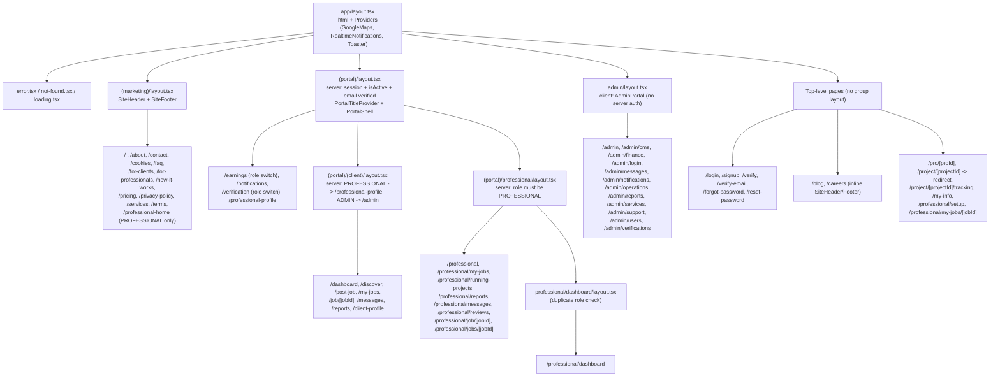
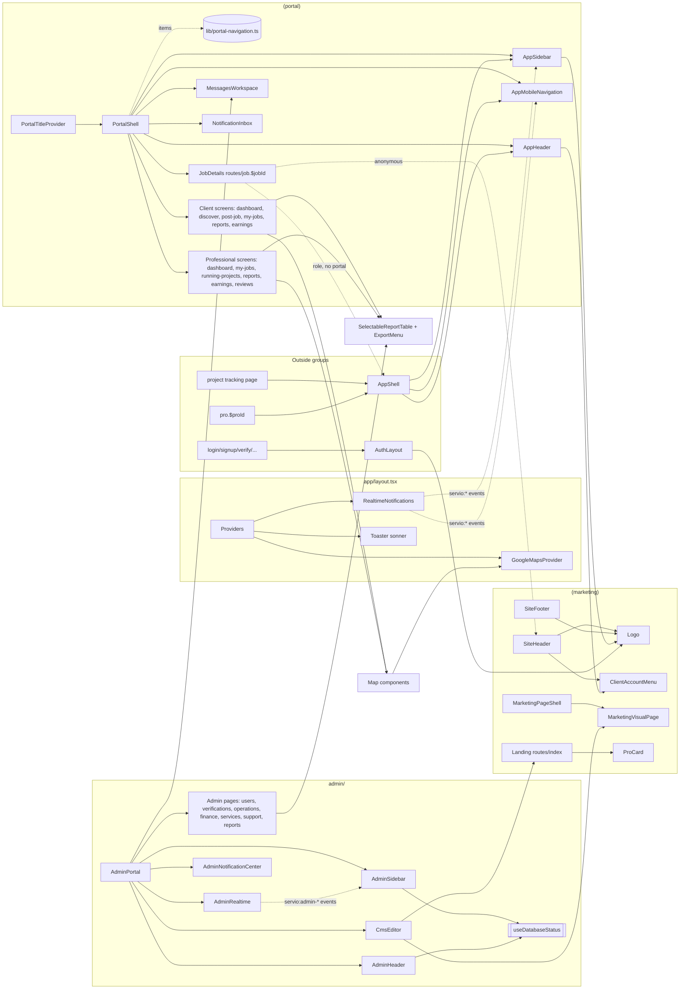

# UI Specification: Frontend and Component Architecture

Last verified against code: 2026-09-16 (commit cd8f4fb); runtime-validated 2026-09-17

| Field         | Value                                                                                                                                                                                                                                                                                                                                                    |
| ------------- | -------------------------------------------------------------------------------------------------------------------------------------------------------------------------------------------------------------------------------------------------------------------------------------------------------------------------------------------------------- |
| Scope         | Spec §10 (Frontend architecture) and §12 (Component architecture)                                                                                                                                                                                                                                                                                        |
| Framework     | Next.js 16 App Router (`next ^16.1.6`), React 19.2, TypeScript 5.8                                                                                                                                                                                                                                                                                       |
| Styling       | Tailwind CSS 4 + shadcn/ui (see [design-system.md](./design-system.md))                                                                                                                                                                                                                                                                                  |
| Related docs  | [screen-inventory.md](./screen-inventory.md) (every route and screen ID), [../03-architecture/authentication-and-authorization.md](../03-architecture/authentication-and-authorization.md), [../05-api/api-specification.md](../05-api/api-specification.md), [../03-architecture/solution-architecture.md](../03-architecture/solution-architecture.md) |
| Status legend | **Implemented**: verified in code. **Partial**: exists but incomplete or inconsistent. **Dead**: present but not reachable or not imported. **[NEEDS VALIDATION]**: needs a runtime check.                                                                                                                                                               |

---

## 1. Frontend at a glance

| Measure (app/ + src/, excluding `src/generated`)                   | Value                                                                                                                                                                                                                 | Evidence                                  |
| ------------------------------------------------------------------ | --------------------------------------------------------------------------------------------------------------------------------------------------------------------------------------------------------------------- | ----------------------------------------- |
| `.tsx` files                                                       | 210                                                                                                                                                                                                                   | file walk                                 |
| `page.tsx` files                                                   | 60                                                                                                                                                                                                                    | `app/**/page.tsx`                         |
| `layout.tsx` files                                                 | 7                                                                                                                                                                                                                     | §3                                        |
| `loading.tsx` / `error.tsx` / `not-found.tsx` / `global-error.tsx` | 8 / 1 / 1 / 0                                                                                                                                                                                                         | §4                                        |
| Files marked `"use client"`                                        | 90                                                                                                                                                                                                                    | grep of the `^"use client"` directive     |
| Page files that are Client Components                              | 10 (9 admin pages + `app/project/[projectId]/tracking/page.tsx`)                                                                                                                                                      | §5                                        |
| Screen modules in `src/routes/`                                    | 35 files, 13,012 lines (27 client, 8 server)                                                                                                                                                                          | §5.2                                      |
| Feature components (`src/components/*.tsx` + `reports/`)           | 48 (5 never imported)                                                                                                                                                                                                 | §12                                       |
| shadcn primitives (`src/components/ui/`)                           | 46 (15 in real use)                                                                                                                                                                                                   | [design-system.md §5](./design-system.md) |
| Custom hooks (`src/hooks/`)                                        | 3                                                                                                                                                                                                                     | §8                                        |
| `fetch(` calls inside client files                                 | 191 in 60 files                                                                                                                                                                                                       | §10                                       |
| `useState` calls / `useEffect` references                          | 525 / 170                                                                                                                                                                                                             | grep `useState[<(]`, `useEffect\b`        |
| `@tanstack/react-query` imports                                    | **0** (installed, unused)                                                                                                                                                                                             | §9                                        |
| `react-hook-form` imports                                          | **1** (`src/components/ui/form.tsx`, which is itself unused)                                                                                                                                                          | §11                                       |
| Global store (Redux/Zustand/Jotai)                                 | none                                                                                                                                                                                                                  | grep                                      |
| Largest UI files                                                   | `app/project/[projectId]/tracking/page.tsx` (2,965 lines), `src/components/CmsEditor.tsx` (1,992), `src/routes/job.$jobId.tsx` (1,798), `app/admin/operations/page.tsx` (1,399), `app/admin/finance/page.tsx` (1,381) | line counts                               |

**Architecture in one sentence:** Server-rendered layouts do session and role gating, then thin `page.tsx` wrappers hand off to large Client Component "screens". Those screens fetch everything after mount with raw `fetch` + `useState`/`useEffect`, and a window-level `CustomEvent` bus (`servio:*`) fed by Socket.IO keeps badges and lists fresh.

---

## 2. App Router tree (actual structure)

### 2.1 Mermaid tree



### 2.2 Route-group responsibilities

| Group / folder                    | URL prefix                                                                                                            | Layout provides                                                                                               | Server-side gating in layout                                                                                                                                                                                | Notes                                                                                                            |
| --------------------------------- | --------------------------------------------------------------------------------------------------------------------- | ------------------------------------------------------------------------------------------------------------- | ----------------------------------------------------------------------------------------------------------------------------------------------------------------------------------------------------------- | ---------------------------------------------------------------------------------------------------------------- |
| `app/` root                       | all                                                                                                                   | `<html lang="en">`, global CSS (`src/styles.css`, `react-loading-skeleton` CSS), `Providers`, root `metadata` | none                                                                                                                                                                                                        | `app/layout.tsx:1-19`                                                                                            |
| `(marketing)`                     | `/`, public info pages                                                                                                | `SiteHeader` + `SiteFooter`                                                                                   | none in layout. `page.tsx` for `/` sends PROFESSIONAL to `/professional-home`. `/professional-home` requires PROFESSIONAL and a complete profile                                                            | `app/(marketing)/layout.tsx`, `app/(marketing)/page.tsx:7-22`, `app/(marketing)/professional-home/page.tsx:8-40` |
| `(portal)`                        | client + professional workspace                                                                                       | `PortalTitleProvider` + `PortalShell` (sidebar, header, mobile nav, Back button, optional title)              | no cookie → `/login`. User inactive → `/login`. Non-admin without `emailVerifiedAt` → intended `/verify`, but see defect UI-D1                                                                              | `app/(portal)/layout.tsx:7-45`                                                                                   |
| `(portal)/(client)`               | `/dashboard`, `/discover`, …                                                                                          | pass-through fragment                                                                                         | PROFESSIONAL → `/professional-profile`, ADMIN → `/admin`                                                                                                                                                    | `app/(portal)/(client)/layout.tsx:5-20`                                                                          |
| `(portal)/professional`           | `/professional/*`                                                                                                     | pass-through fragment                                                                                         | role ≠ PROFESSIONAL → `/dashboard` (CLIENT), `/admin` (ADMIN), else `/login`                                                                                                                                | `app/(portal)/professional/layout.tsx:5-26`                                                                      |
| `(portal)/professional/dashboard` | `/professional/dashboard`                                                                                             | pass-through                                                                                                  | **duplicate** of the parent check                                                                                                                                                                           | `app/(portal)/professional/dashboard/layout.tsx`                                                                 |
| `admin/`                          | `/admin/*`                                                                                                            | `AdminPortal` (Client Component): `AdminRealtime`, `AdminSidebar`, `AdminHeader`. Bypassed on `/admin/login`  | **none in layout.** Only `app/admin/page.tsx` and `app/admin/cms/page.tsx` verify ADMIN server-side. All other admin pages rely on `proxy.ts` (`/admin/*` needs `role === "ADMIN"`) and on API-level checks | `app/admin/layout.tsx`, `src/components/AdminPortal.tsx:7-28`, `proxy.ts:63-67`                                  |
| Top-level (no group)              | auth, `/blog`, `/careers`, `/pro/*`, `/project/*`, `/my-info`, `/professional/setup`, `/professional/my-jobs/[jobId]` | root only; screens mount their own shell (`AuthLayout`, `AppShell`, `SiteHeader`)                             | page-level checks in `/my-info`, `/professional/setup`. `proxy.ts` prefix list for `/project`, `/professional`, `/my-info` (session only, **not role-checked**)                                             | see §5.1                                                                                                         |

Authorization depth is covered in [authentication-and-authorization.md](../03-architecture/authentication-and-authorization.md). This document only records what each UI layer does.

---

## 3. Layout inventory

| #   | File                                             | Kind                                  | Providers / shell                                                      | Auth logic                                                                       | Data fetched server-side                                             |
| --- | ------------------------------------------------ | ------------------------------------- | ---------------------------------------------------------------------- | -------------------------------------------------------------------------------- | -------------------------------------------------------------------- |
| L1  | `app/layout.tsx`                                 | Server                                | `Providers` → `GoogleMapsProvider`, `RealtimeNotifications`, `Toaster` | none                                                                             | none                                                                 |
| L2  | `app/(marketing)/layout.tsx`                     | Server                                | `SiteHeader`, `SiteFooter` (both Client Components)                    | none                                                                             | none                                                                 |
| L3  | `app/(portal)/layout.tsx`                        | Server (async)                        | `PortalTitleProvider`, `PortalShell initialUser`                       | `cookies()` + `verifySession` + `db.user.findUnique` (isActive, emailVerifiedAt) | `firstName`, `lastName`, `role`, `avatarUrl` passed as `initialUser` |
| L4  | `app/(portal)/(client)/layout.tsx`               | Server (async)                        | none                                                                   | role redirect                                                                    | none                                                                 |
| L5  | `app/(portal)/professional/layout.tsx`           | Server (async)                        | none                                                                   | role must be PROFESSIONAL                                                        | none                                                                 |
| L6  | `app/(portal)/professional/dashboard/layout.tsx` | Server (async)                        | none                                                                   | same as L5 (redundant)                                                           | none                                                                 |
| L7  | `app/admin/layout.tsx`                           | Server wrapper → Client `AdminPortal` | `AdminRealtime`, `AdminSidebar`, `AdminHeader`                         | none (see §2.2)                                                                  | none                                                                 |

No `template.tsx`, parallel routes (`@slot`) or intercepting routes exist.

### 3.1 Defects in layouts

| ID    | Severity        | Finding                                                                                                                                                                                                                                                                                                                                    | Evidence                                                                                                              |
| ----- | --------------- | ------------------------------------------------------------------------------------------------------------------------------------------------------------------------------------------------------------------------------------------------------------------------------------------------------------------------------------------ | --------------------------------------------------------------------------------------------------------------------- |
| UI-D1 | Low (mitigated) | `redirect("/verify")` is called **inside** `try {}`. `redirect()` throws, so `catch {}` swallows it and redirects to `/login` instead. The Next 16 docs say to call `redirect` outside `try`. In practice `proxy.ts:78-91` sends unverified users to `/verify` first. The same pattern appears in `app/professional/setup/page.tsx:10-19`. | `app/(portal)/layout.tsx:16-39`, `node_modules/next/dist/docs/01-app/03-api-reference/04-functions/redirect.md:51-53` |
| UI-D2 | Medium          | `/admin/*` layout has no server-side role check. 9 of 11 admin pages are Client Components that render a full admin shell and depend on `proxy.ts` plus API checks. That is defense-in-depth, not a gap today, but it is a single point of failure.                                                                                        | `app/admin/layout.tsx`, `proxy.ts:63-67`                                                                              |
| UI-D3 | Low             | The professional role check is duplicated in L5 and L6. A single `/professional/dashboard` request verifies the session 4 times (`proxy.ts`, L3, L5, L6), and each verification includes a DB session lookup.                                                                                                                              | files L3, L5, L6                                                                                                      |
| UI-D4 | Low             | `/professional/my-jobs/[jobId]` and `/professional/setup` sit **outside** `(portal)/professional`, so they get neither `PortalShell` nor the PROFESSIONAL role check from L5. `proxy.ts` enforces only "has session". `JobDetails` then derives the role client-side.                                                                      | `app/professional/my-jobs/[jobId]/page.tsx`, `proxy.ts:17-37`                                                         |

---

## 4. Loading, error and not-found coverage

| File                                          | Renders                                                  | Applies to                                                                                                                                                                                                                       |
| --------------------------------------------- | -------------------------------------------------------- | -------------------------------------------------------------------------------------------------------------------------------------------------------------------------------------------------------------------------------- |
| `app/loading.tsx`                             | `PageSkeleton`                                           | root fallback for all segments without a closer `loading.tsx`                                                                                                                                                                    |
| `app/admin/loading.tsx`                       | `AdminPageSkeleton`                                      | `/admin/*`                                                                                                                                                                                                                       |
| `app/(portal)/professional/loading.tsx`       | `DashboardSkeleton`                                      | `/professional/*`                                                                                                                                                                                                                |
| `app/(portal)/(client)/dashboard/loading.tsx` | `DashboardSkeleton`                                      | `/dashboard`                                                                                                                                                                                                                     |
| `app/(portal)/(client)/discover/loading.tsx`  | `CardListSkeleton count=6`                               | `/discover`                                                                                                                                                                                                                      |
| `app/pro/[proId]/loading.tsx`                 | `PageSkeleton`                                           | `/pro/[proId]`                                                                                                                                                                                                                   |
| `app/project/[projectId]/loading.tsx`         | `DashboardSkeleton`                                      | `/project/[projectId]/**`                                                                                                                                                                                                        |
| `app/job/[jobId]/loading.tsx`                 | `PageSkeleton`                                           | **Likely dead.** There is no `app/job/[jobId]/page.tsx`. The `/job/[jobId]` page lives in `app/(portal)/(client)/job/[jobId]/`, a different branch of the tree, so this loading file probably never wraps it. [NEEDS VALIDATION] |
| `app/error.tsx`                               | Client; generic "This page didn't load" + `reset` button | all segments below the root layout. It does not log `error` and does not call Sentry. It uses `reset`, but the Next 16 docs now recommend `retry` (stable since v16.3).                                                          |
| `app/not-found.tsx`                           | Static 404 with "Go home" link                           | whole app                                                                                                                                                                                                                        |
| `global-error.tsx`                            | **absent**                                               | errors thrown in `app/layout.tsx` / `Providers` fall back to the Next built-in page                                                                                                                                              |

**Coverage gaps:** there is no segment-level `error.tsx` for `/admin`, `(portal)` or `/project`, so any render error replaces the whole page below the root layout, including the shell. Most loading UI inside screens is hand-rolled (see §13).

---

## 5. Server vs Client Components

### 5.1 The page wrapper → screen pattern

| Pattern                          | Count | Example                                                                                                                                                                                                                                                                  | Behaviour                                                                                          |
| -------------------------------- | ----- | ------------------------------------------------------------------------------------------------------------------------------------------------------------------------------------------------------------------------------------------------------------------------ | -------------------------------------------------------------------------------------------------- |
| **P1 Re-export**                 | 19    | `app/login/page.tsx`: `export { default } from "@/routes/login"` (`/faq` also exports `revalidate = 0`)                                                                                                                                                                  | Page is whatever the screen module is (server or client)                                           |
| **P2 Thin server wrapper**       | 15    | `app/(portal)/(client)/dashboard/page.tsx` renders `<ClientDashboard />`; `app/reset-password/page.tsx` wraps in `<Suspense>`                                                                                                                                            | No data. Screen fetches after mount                                                                |
| **P3 Server gate / role switch** | 6     | `app/(portal)/earnings/page.tsx` and `app/(portal)/verification/page.tsx` render the client or professional screen by `session.role`; `app/admin/page.tsx`, `app/admin/cms/page.tsx`, `app/(portal)/(client)/client-profile/page.tsx`, `app/professional/setup/page.tsx` | `cookies()`/`headers()` + `verifySession` (+ DB verified check) + `redirect`, then a client screen |
| **P4 Server data fetch → props** | 4     | `/`, `/professional-home`, `/professional-profile`, `/my-info` (table 5.3)                                                                                                                                                                                               | Real server-side data                                                                              |
| **P5 Full client page**          | 10    | `app/admin/users/page.tsx` (573 lines), `app/project/[projectId]/tracking/page.tsx` (2,965 lines)                                                                                                                                                                        | Whole screen implemented in `app/` rather than `src/routes/`, so the convention is inconsistent    |
| **P6 Inline static server page** | 5     | `app/blog/page.tsx`, `app/careers/page.tsx`, `/cookies`, `/privacy-policy`, `/terms` via `LegalPage`                                                                                                                                                                     | Static JSX                                                                                         |
| **P7 Redirect only**             | 1     | `app/project/[projectId]/page.tsx` → `/project/:id/tracking`                                                                                                                                                                                                             | none                                                                                               |

Total: 60 pages. Some P1 targets are async Server Components that read CMS or DB data (see §5.2 and §5.3).

### 5.2 `src/routes/` screen modules (legacy React-Router naming)

File names such as `job.$jobId.tsx` and `pro.$proId.tsx` come from the Lovable/TanStack port (`project-docs/src/routes/docs/design-system.md` §1). The `$param` part is inert. Params come from `useParams()` (`src/routes/job.$jobId.tsx:236`, `src/routes/professional/pro.$proId.tsx:53`).

| Kind                            | Files                                                                                                                                                                                                                                                                                                                                                                                                                           |
| ------------------------------- | ------------------------------------------------------------------------------------------------------------------------------------------------------------------------------------------------------------------------------------------------------------------------------------------------------------------------------------------------------------------------------------------------------------------------------- |
| **Async Server Components** (8) | `about.tsx` (reads `readCmsContent`), `contact.tsx`, `faq.tsx`, `for-clients.tsx`, `for-professionals.tsx`, `how-it-works.tsx`, `pricing.tsx` (all → `MarketingPageShell` → `readMarketingContent`), `services.tsx` (`getCompleteCategoryHierarchy` → `ServicesCatalog`)                                                                                                                                                        |
| **Client screens** (27)         | `index.tsx`, `login.tsx`, `signup.tsx`, `verify.tsx`, `verify-email.tsx`, `forgot-password.tsx`, `reset-password.tsx`, `job.$jobId.tsx`, `notifications.tsx`, `messages.tsx` (**dead**), `professional-home.tsx`, `admin/admin.tsx`, `client/{dashboard,discover,earnings,my-jobs,post-job,reports,verification}.tsx`, `professional/{dashboard,earnings,my-jobs,pro.$proId,reports,reviews,running-projects,verification}.tsx` |

### 5.3 Pages that fetch data on the server

| Route                   | Server data                                                                                                   | Evidence                                           |
| ----------------------- | ------------------------------------------------------------------------------------------------------------- | -------------------------------------------------- |
| `/`                     | `readHomeContent()` (CMS JSON) + auth flag                                                                    | `app/(marketing)/page.tsx:21`                      |
| `/professional-home`    | user profile completeness + `readMarketingContent("professional-home")`                                       | `app/(marketing)/professional-home/page.tsx:20-40` |
| `/professional-profile` | `getDetailedProfessional()`, rendered entirely server-side (487-line Server Component using `Badge`/`Button`) | `app/(portal)/professional-profile/page.tsx`       |
| `/my-info`              | `getClientAccountSummary(userId)` → `ClientMyInfoPage data`                                                   | `app/my-info/page.tsx:45-47`                       |
| Marketing info pages    | CMS JSON via `MarketingPageShell` / `readCmsContent`                                                          | `src/components/MarketingPageShell.tsx`            |
| `/services`             | `getCompleteCategoryHierarchy()` (DB)                                                                         | `src/routes/services.tsx:7-9`                      |
| `(portal)` layout       | name/role/avatar for the shell                                                                                | `app/(portal)/layout.tsx:18-36`                    |

Every other screen renders a skeleton or spinner first and then fetches in `useEffect`.

**Caching finding (UI-D5, Medium, [VALIDATED 2026-09-17 · [V-03](../validation/LOCAL_VALIDATION_LOG.md), [V-03b](../validation/LOCAL_VALIDATION_LOG.md)]):** `src/routes/services.tsx:4` exports `dynamic = "force-dynamic"`, but `app/(marketing)/services/page.tsx` re-exports only `default`. Route segment config is read from the page module, so the flag likely has no effect. The static marketing pages (`/about`, `/contact`, `/pricing`, `/services`, …) use no dynamic APIs, and there is no `revalidatePath` anywhere, so they are candidates for build-time prerendering. Admin CMS edits and catalog changes might then not appear until the next build. Only `/faq` sets `revalidate = 0`, and `/` is dynamic through `cookies()`. **Runtime:** `next build` (Next 16.3.0, Turbopack) marks `/services` static (○) together with `/about`, `/contact`, `/pricing`, `/for-clients`, `/for-professionals`, `/how-it-works`, `/cookies`, `/privacy-policy`, `/terms`, `/blog`, `/careers` and all `/admin/*` pages except `/admin` and `/admin/cms`; `/` and `/faq` are dynamic. On a production server, a CMS save for pricing/how-it-works returned 200 and the admin API showed the new content, but the public pages did not change until rebuild. Also, `src/lib/home-cms-file.ts:17-54` keeps a module-level `cachedHomeContent` per server process.

---

## 6. Providers and contexts

| Provider / context                                                  | File                                                                                      | Scope                                    | Value                                                                                                                                                                                                                                                         | Consumers                                                                                           |
| ------------------------------------------------------------------- | ----------------------------------------------------------------------------------------- | ---------------------------------------- | ------------------------------------------------------------------------------------------------------------------------------------------------------------------------------------------------------------------------------------------------------------- | --------------------------------------------------------------------------------------------------- |
| `Providers`                                                         | `src/components/providers.tsx`                                                            | whole app (root layout)                  | composes the three below                                                                                                                                                                                                                                      | `app/layout.tsx`                                                                                    |
| `GoogleMapsContext` via `GoogleMapsProvider` / `useGoogleMaps()`    | `src/components/GoogleMapsProvider.tsx`                                                   | whole app                                | `{isLoaded, isConfigured, hasError, loadError}`. Loads Maps JS (`places` library) with `useJsApiLoader` only when `NEXT_PUBLIC_GOOGLE_MAPS_API_KEY` is set and `NEXT_PUBLIC_GOOGLE_MAPS_JS_ENABLED !== "false"`. Traps `gm_authFailure` (billing/key errors). | 6 map components (§12 Maps)                                                                         |
| `RealtimeNotifications` (not a context; side-effect component)      | `src/components/RealtimeNotifications.tsx`                                                | whole app, including marketing and admin | Socket.IO client + 15 s notification poll + toasts                                                                                                                                                                                                            | none (renders `null`)                                                                               |
| `Toaster` (sonner)                                                  | `src/components/ui/sonner.tsx`                                                            | whole app                                | top-right, offset 76px, 4.5 s, close button, `richColors`                                                                                                                                                                                                     | `toast()` callers (§14)                                                                             |
| `PortalTitleContext` via `PortalTitleProvider` / `usePortalTitle()` | `src/components/PortalShell.tsx:23-40`                                                    | `(portal)` only                          | `{title, setTitle, isInsidePortal}`                                                                                                                                                                                                                           | `PortalShell`, `src/routes/job.$jobId.tsx:145` (picks shell), `src/routes/professional/reviews.tsx` |
| shadcn internal contexts                                            | `ui/form.tsx`, `ui/carousel.tsx`, `ui/chart.tsx`, `ui/sidebar.tsx`, `ui/toggle-group.tsx` | n/a                                      | primitive internals                                                                                                                                                                                                                                           | **all five primitives are unused**                                                                  |

**Observations:**

- There is no auth/session context. The current user is fetched from `/api/v1/auth/me` (rewritten to `/api/auth/me`) independently by **11 components**: `AppShell`, `ClientAccountMenu`, `Logo`, `MarketingVisualPage`, `MessagesWorkspace`, `PortalShell` (only when `initialUser` is missing), `ProfessionalProfileSetup`, `RealtimeNotifications` (uses `/api/auth/me`), `SiteHeader`, `job.$jobId`, `verify`. One marketing page view triggers at least 3 identical calls (`SiteHeader`, `Logo` ×2 in header and footer, `RealtimeNotifications`).
- Because `Providers` is global, public marketing pages also load the Google Maps SDK (when configured) and open a Socket.IO connection, which the server rejects for anonymous users. The connection is configured with `reconnectionAttempts: Infinity` (`RealtimeNotifications.tsx:105-112`) and has no signed-in guard. The server rejects anonymous handshakes ("Unauthorized realtime connection") [[V-28](../validation/LOCAL_VALIDATION_LOG.md)]. In the browser, an anonymous page over 104 s made `/api/auth/me` ×2 and `/api/portal/notifications` ×2 (401) — the 15 s poll does **not** repeat for anonymous users; repeated socket reconnect attempts could not be measured [PARTIALLY VALIDATED 2026-09-17 · [V-52](../validation/LOCAL_VALIDATION_LOG.md)].

---

## 7. State management

| Mechanism                               | Usage                                                                                                                                                            | Evidence        |
| --------------------------------------- | ---------------------------------------------------------------------------------------------------------------------------------------------------------------- | --------------- |
| Local component state                   | dominant: 525 `useState` calls in 67 files. Screens own all state (e.g. `job.$jobId.tsx` holds dozens of `useState` for negotiation, proposal and project flows) | grep            |
| `useMemo` / `useCallback`               | 88 / 21                                                                                                                                                          | grep            |
| **Window CustomEvent bus** (`servio:*`) | cross-component invalidation without a store. Emitters: `RealtimeNotifications`, `AdminRealtime`, `AdminSidebar`, `AppNavigation`, screens. Listeners re-fetch.  | see table below |
| URL state                               | `useSearchParams` in 10 files (e.g. `discover.tsx`, `signup.tsx`, `reset-password.tsx`), with the required `<Suspense>` wrappers                                 | grep            |
| `localStorage`                          | post-job wizard draft (`src/routes/client/post-job.tsx:149,216,395`); dismissed phone reminder (`src/routes/client/dashboard.tsx:86,144`)                        | grep            |
| Server state cache                      | **none**: no React Query or SWR. Navigating back re-fetches.                                                                                                     | §9              |
| Global store                            | none                                                                                                                                                             | grep `zustand   | redux | jotai` = 0 |

### 7.1 `servio:*` event catalogue (client-only bus)

| Event                                                                                          | Dispatched by                                                                                       | Listened by (re-fetch)                                                |
| ---------------------------------------------------------------------------------------------- | --------------------------------------------------------------------------------------------------- | --------------------------------------------------------------------- |
| `servio:notification`                                                                          | `RealtimeNotifications` (new or missed notification, proposal), `AdminRealtime` (most admin events) | `AppNavigation` unread counters, `AdminSidebar` counts, inbox screens |
| `servio:notifications-read`                                                                    | `AppNavigation` (on `/notifications`), `AdminSidebar` (section visit)                               | `AppNavigation`, `AdminSidebar`                                       |
| `servio:message`                                                                               | `RealtimeNotifications` (`message:new` for me), `AdminRealtime`                                     | `AppNavigation` unread messages, `AdminSidebar`                       |
| `servio:message-read`                                                                          | `AdminSidebar`, messaging UI                                                                        | `AppNavigation`, `AdminSidebar`                                       |
| `servio:project-update`                                                                        | `RealtimeNotifications` / `AdminRealtime` on `project:updated`                                      | project/job screens (18 references)                                   |
| `servio:proposal`                                                                              | `RealtimeNotifications` on `proposal:new`                                                           | job screens                                                           |
| `servio:profile-updated`                                                                       | profile screens                                                                                     | shell/menu components (4 references)                                  |
| `servio:admin-overview-update`, `-verifications-update`, `-operations-update`, `-users-update` | `AdminRealtime`                                                                                     | `AdminSidebar`, admin pages                                           |

Evidence: `src/components/RealtimeNotifications.tsx:56-128`, `src/components/AdminRealtime.tsx:69-116`, `src/components/AppNavigation.tsx:17-82`, `src/components/AdminSidebar.tsx:66-129`.

---

## 8. Hooks (`src/hooks/`)

| Hook                    | File                     | Purpose                                                    | Used by                                                                                              |
| ----------------------- | ------------------------ | ---------------------------------------------------------- | ---------------------------------------------------------------------------------------------------- |
| `useIsMobile()`         | `use-mobile.tsx`         | `matchMedia(max-width: 767px)`                             | only `ui/sidebar.tsx`, which is unused, so the hook is **effectively dead**                          |
| `useDatabaseStatus()`   | `use-database-status.ts` | one-shot GET `/api/v1/admin/database-status` → `"checking" | "connected"                                                                                          | "disconnected"` | `AdminHeader`, `AdminSidebar` (2 independent requests per admin page load) |
| `useRowSelection(rows)` | `use-row-selection.ts`   | `Set<number>` selection, toggle, toggle-all-visible, clear | `app/admin/reports/page.tsx`, `src/routes/client/reports.tsx`, `src/routes/professional/reports.tsx` |

Local hooks inside components: `useUnreadMessages`, `useUnreadNotifications` (`src/components/AppNavigation.tsx:17-82`). Data fetching is **not** abstracted into hooks.

---

## 9. API client layer

| Aspect            | Actual implementation                                                                                                                                                                                                                                                                                                                     |
| ----------------- | ----------------------------------------------------------------------------------------------------------------------------------------------------------------------------------------------------------------------------------------------------------------------------------------------------------------------------------------- |
| HTTP client       | Raw `fetch()` inline: 191 calls in 60 client files. There is no shared wrapper, base URL, error normalizer or typed client.                                                                                                                                                                                                               |
| React Query       | `@tanstack/react-query ^5.83.0` in `package.json` with **0 imports**. No `QueryClientProvider`.                                                                                                                                                                                                                                           |
| URL namespaces    | Mixed. Most screens call `/api/v1/*`, which `next.config.ts` rewrites to `/api/*`. Others call `/api/*` directly, sometimes in the same file (e.g. `ProfessionalProfileSetup` uses `/api/geocode`, `/api/profile/avatar`, `/api/v1/professional/profile`; `client/reports.tsx` uses `/api/v1/client/jobs` and `/api/client/jobs/export`). |
| Auth transport    | Same-origin cookie `servio_session`. No `Authorization` header. State-changing requests pass `proxy.ts` because the browser sends `Origin`.                                                                                                                                                                                               |
| Response handling | Ad-hoc per call: `response.ok ? response.json() : null`, `.catch(() => {})`, with `{ error }` bodies surfaced via `setError`, `alert()` or inline text.                                                                                                                                                                                   |
| Cancellation      | Occasional `let active/cancelled` flags (e.g. `use-database-status.ts:9-20`). No `AbortController` convention.                                                                                                                                                                                                                            |
| Binary downloads  | `ExportMenu` POSTs, reads `blob()` and triggers an `<a download>` (`src/components/reports/ExportMenu.tsx:36-60`)                                                                                                                                                                                                                         |

### 9.1 UI → API dependency map (condensed)

| UI module                                                                                                | Endpoints called (as written in code)                                                                                                                                                                                                                                                          |
| -------------------------------------------------------------------------------------------------------- | ---------------------------------------------------------------------------------------------------------------------------------------------------------------------------------------------------------------------------------------------------------------------------------------------- |
| `PortalShell`, `AppShell`, `Logo`, `SiteHeader`, `ClientAccountMenu`                                     | `/api/v1/auth/me`, `/api/v1/auth/logout`                                                                                                                                                                                                                                                       |
| `AppNavigation`                                                                                          | `/api/v1/messages`, `/api/portal/notifications` (GET, PATCH `{all:true}`)                                                                                                                                                                                                                      |
| `AppHeader`                                                                                              | `/api/search`, `/api/portal/notifications`                                                                                                                                                                                                                                                     |
| `AdminSidebar` / `AdminHeader`                                                                           | `/api/admin/sidebar-counts` (GET, PATCH `{section}`), `/api/v1/admin/database-status`, `/api/v1/auth/logout`                                                                                                                                                                                   |
| `MessagesWorkspace`                                                                                      | `/api/v1/messages` (GET list, GET `?conversationId=`, POST), Socket.IO                                                                                                                                                                                                                         |
| `NotificationInbox`, `AdminNotificationCenter`                                                           | `/api/portal/notifications` (GET/PATCH), `/api/portal/project`                                                                                                                                                                                                                                 |
| `login.tsx`                                                                                              | `/api/v1/auth/login`, `/send-phone-login-otp`, `/login-phone`, `/google`                                                                                                                                                                                                                       |
| `signup.tsx`                                                                                             | `/api/v1/auth/check-availability`, `/register`, `/google`                                                                                                                                                                                                                                      |
| `forgot-password.tsx`, `reset-password.tsx`, `verify.tsx`, `verify-email.tsx`                            | `/api/v1/auth/{forgot-password, forgot-password-phone, verify-forgot-password-phone, reset-password, resend-verification, update-email, verify-email}`                                                                                                                                         |
| `client/discover.tsx`                                                                                    | `/api/profile`, `/api/geocode`, `/api/v1/marketplace/categories`, `/api/v1/marketplace/job`, `/api/v1/professionals`                                                                                                                                                                           |
| `client/post-job.tsx`                                                                                    | `/api/v1/marketplace/categories`, `/api/v1/profile`, `/api/v1/profile/locations`, `/api/v1/client/jobs[/:id]`, `/api/geocode`                                                                                                                                                                  |
| `client/earnings.tsx`                                                                                    | `/api/v1/wallet`, `/api/v1/wallet/deposit/{order,verify,fail}`, `/api/v1/portal/{earnings,payment-details/:id,invoices/:id}`                                                                                                                                                                   |
| `job.$jobId.tsx`                                                                                         | `/api/v1/auth/me`, `/api/v1/portal/project?jobId=`, `/api/v1/client/jobs/:id`, `/api/v1/marketplace/job`, `/api/v1/professional/proposals`, `/api/v1/professionals`, `/api/v1/client/project-requests[/:id]`, `/api/v1/professional/project-requests/:id`                                      |
| `project/[projectId]/tracking`                                                                           | `/api/v1/portal/project`, `/api/v1/portal/project-actions`, `/api/v1/portal/project-files`, `/api/v1/wallet`, `/api/wallet/milestone`, Socket.IO                                                                                                                                               |
| `professional/*` screens                                                                                 | `/api/v1/portal/professional-jobs`, `/api/v1/portal/{earnings,reviews}`, `/api/professional/razorpay-account`, `/api/v1/professional/{project-requests/:id,favorite-jobs/:id,verification,verification/upload}`, `/api/verification/persona/{start,status}`                                    |
| Admin pages                                                                                              | `/api/v1/admin/data/{overview,users,jobs,finance,support}`, `/api/v1/admin/{users/:id,jobs/:id,disputes/:id,disputes/:id/messages,services,support,verifications,login}`, `/api/admin/finance/{milestone-payout,withdrawals/:id}`, `/api/admin/reports/{users,jobs,finance}`, `/api/admin/cms` |
| `ProfessionalProfileSetup`, `ClientProfilePage`, `ProfileSetup`, `PhoneVerification`, `AddressMapPicker` | `/api/v1/professional/profile`, `/api/v1/profile`, `/api/v1/profile/locations[/:id]`, `/api/profile/avatar`, `/api/v1/auth/{send-phone-otp,verify-phone}`, `/api/geocode`                                                                                                                      |

For endpoint contracts see [../05-api/api-specification.md](../05-api/api-specification.md). `login.tsx` and `signup.tsx` call `/api/v1/auth/google`; Google sign-in is implemented server-side: `GET /api/v1/auth/google` → 307 to `accounts.google.com` [VALIDATED 2026-09-17 · [V-33](../validation/LOCAL_VALIDATION_LOG.md)]; the full callback needs real Google credentials (not testable locally).

---

## 10. Forms and client-side validation

| Aspect                 | Finding                                                                                                                                                                                                                                                                       | Evidence                                                                             |
| ---------------------- | ----------------------------------------------------------------------------------------------------------------------------------------------------------------------------------------------------------------------------------------------------------------------------- | ------------------------------------------------------------------------------------ |
| Library                | None in practice. `react-hook-form` and `@hookform/resolvers` are installed. The only import is `src/components/ui/form.tsx`, which nothing imports.                                                                                                                          | grep                                                                                 |
| Pattern                | Controlled inputs with one `useState` per field. `onSubmit`/`onClick` handler calls `fetch` with JSON and shows the `{error}` from the response.                                                                                                                              | 18 `<form>` elements in 13 files; many flows use button `onClick` without a `<form>` |
| Client validation      | **Partial and hand-written**, only in 3 screens with an `errors` object: `login.tsx` (email regex at `:96`), `signup.tsx` (email regex `:85`, password ≥ 8 `:88`), `client/post-job.tsx` (multi-step wizard). Elsewhere validation is server-only (zod in 36 route handlers). | grep `setErrors                                                                      | fieldErrors` |
| Native HTML validation | `type="email"` in 5 files, `maxLength` in 6, no `pattern=`                                                                                                                                                                                                                    | grep                                                                                 |
| Zod on the client      | **none**. zod is imported only in `app/api/**` and `src/lib/{pagination.ts, reports/pdf/request.ts}`                                                                                                                                                                          | grep                                                                                 |
| Special inputs         | OTP entry is custom in `PhoneVerification` / `login` / `forgot-password`, **not** `input-otp` (that primitive is unused). Dates do not use `react-day-picker` (`ui/calendar` unused). Address uses Google Places via `AddressMapPicker`.                                      | grep                                                                                 |
| Confirmation           | native `window.confirm()` / `alert()`: 16 calls in 7 files (`job.$jobId.tsx`, `client/my-jobs.tsx`, `client/discover.tsx`, `professional/my-jobs.tsx`, `admin/finance`, `admin/services`, `project tracking`). `ClientProfilePage` uses `AlertDialog`.                        | grep                                                                                 |
| Wizard drafts          | post-job persists `{form, step, maxStep}` to `localStorage`                                                                                                                                                                                                                   | `src/routes/client/post-job.tsx:149-216`                                             |

---

## 11. Error handling in the UI

| Layer          | Mechanism                                                                                                                                                                                                                                                                                                                                                                                                                              | Evidence                       |
| -------------- | -------------------------------------------------------------------------------------------------------------------------------------------------------------------------------------------------------------------------------------------------------------------------------------------------------------------------------------------------------------------------------------------------------------------------------------- | ------------------------------ |
| Render errors  | Single root `app/error.tsx`. It does not report to Sentry (`instrumentation-client.ts` exists, but `captureException` is only called in `src/lib/server-logger.ts:13`). The browser SDK does initialise when a DSN is set, but the CSP `connect-src` does not allow Sentry ingest hosts, so browser events are blocked (1 `securitypolicyviolation` per event) [VALIDATED 2026-09-17 · [V-51](../validation/LOCAL_VALIDATION_LOG.md)]. | §4                             |
| Fetch errors   | Per-screen `setError(...)` state (83 calls in 20 files) rendered inline. Many background calls swallow errors with `.catch(() => {})` or `.catch(() => setCount(0))`.                                                                                                                                                                                                                                                                  | grep                           |
| Toasts         | `sonner` `toast()` is used in only **3 files**: `RealtimeNotifications`, `AdminRealtime`, `app/admin/services/page.tsx`. Toasts are therefore mostly used for realtime notifications, not for mutation feedback.                                                                                                                                                                                                                       | grep                           |
| Native dialogs | `alert()` for failed mutations in several screens                                                                                                                                                                                                                                                                                                                                                                                      | §10                            |
| Console        | 30 `console.*` calls in 21 files (e.g. `AdminRealtime.tsx:65` logs `connect_error`)                                                                                                                                                                                                                                                                                                                                                    | grep                           |
| Maps failures  | `GoogleMapsProvider` exposes `hasError` / `loadError`. Map components render fallbacks.                                                                                                                                                                                                                                                                                                                                                | `GoogleMapsProvider.tsx:28-58` |

---

## 12. Loading states

| Mechanism                                                                                                                                                                                               | Where                                                                                                                     | Evidence                                            |
| ------------------------------------------------------------------------------------------------------------------------------------------------------------------------------------------------------- | ------------------------------------------------------------------------------------------------------------------------- | --------------------------------------------------- |
| `react-loading-skeleton` via `LoadingSkeleton.tsx` (`CardListSkeleton`, `DashboardSkeleton`, `PageSkeleton`, `AdminPageSkeleton`, themed through `SkeletonTheme` with `--color-muted` / `--color-card`) | all `loading.tsx` files, plus `SelectableReportTable`, `ClientAccountMenu`, `client/discover.tsx`                         | `src/components/LoadingSkeleton.tsx` (14 importers) |
| Tailwind `animate-pulse` placeholders                                                                                                                                                                   | 45 occurrences in 29 files (e.g. `MessagesWorkspace` Suspense fallback)                                                   | grep                                                |
| Spinners (`Loader2` / `animate-spin`)                                                                                                                                                                   | 30 occurrences in 10 files, mostly on buttons during submit                                                               | grep                                                |
| `ui/skeleton.tsx` (shadcn)                                                                                                                                                                              | used only by unused `ui/sidebar.tsx`, so effectively unused                                                               | grep                                                |
| `<Suspense>`                                                                                                                                                                                            | 9 files, mostly required boundaries for `useSearchParams` with `fallback={null}`                                          | grep                                                |
| `next/dynamic` with `ssr:false`                                                                                                                                                                         | map components in `AddressMapPicker`, `ProfessionalProfileSetup`, `client/discover`, `professional/my-jobs`, `pro.$proId` | grep                                                |

---

## 13. Realtime client (Socket.IO)

| Client                  | File                                                                                                                                                     | Connects on                       | Events handled → effect                                                                                                                                                                                                                                                                                      |
| ----------------------- | -------------------------------------------------------------------------------------------------------------------------------------------------------- | --------------------------------- | ------------------------------------------------------------------------------------------------------------------------------------------------------------------------------------------------------------------------------------------------------------------------------------------------------------ |
| `RealtimeNotifications` | `src/components/RealtimeNotifications.tsx`                                                                                                               | **every page** (global provider)  | `notification:new` → deduplicated toast + `servio:notification`. `message:new` (if `receiverId === me`) → `servio:message`. `project:updated` → `servio:project-update`. `proposal:new` → `servio:proposal`. Also polls `/api/portal/notifications` every 15 s while visible and on focus/visibility change. |
| `AdminRealtime`         | `src/components/AdminRealtime.tsx`                                                                                                                       | admin pages except `/admin/login` | `admin:notification`, `notification:new`, `admin:{verifications,operations,users,overview}-update`, `message:new`, `project:updated` → toasts + `servio:admin-*` events                                                                                                                                      |
| `MessagesWorkspace`     | `src/components/MessagesWorkspace.tsx:168-195`                                                                                                           | messages pages                    | `message:new`, `project:updated`, … → updates the thread in place                                                                                                                                                                                                                                            |
| Screen-level sockets    | `client/dashboard.tsx`, `client/my-jobs.tsx`, `professional/dashboard.tsx`, `professional/running-projects.tsx`, `project/[projectId]/tracking/page.tsx` | those screens                     | re-fetch on project/proposal signals                                                                                                                                                                                                                                                                         |

All clients use `io({ path: "/api/realtime", withCredentials: true })`, so authentication is the `servio_session` cookie read by `server.mjs`. Events carry **signals, not authoritative data**, and screens re-fetch afterwards.

**Findings:**

- UI-D6 (Medium): up to **3 simultaneous Socket.IO connections** per tab on messaging/admin pages (global `RealtimeNotifications` + `AdminRealtime` + `MessagesWorkspace`). On admin pages, `notification:new` is handled by both global and admin listeners with **separate de-duplication sets**, so the same notification produces two toasts. Runtime: one professional registration → **2 identical toasts** on an admin tab; right after admin sign-in, **15 historical notifications** were shown as toasts at once (not after a reload) [VALIDATED 2026-09-17 · [V-53](../validation/LOCAL_VALIDATION_LOG.md)]. The number of simultaneous socket connections per tab could not be measured in the browser [PARTIALLY VALIDATED · [V-52](../validation/LOCAL_VALIDATION_LOG.md)].
- UI-D7 (Low): the `RealtimeNotifications` effect depends on `userId` (`:144`), so the socket is torn down and re-created once `/api/auth/me` resolves.

---

## 14. Maps, rich text, PDF reports

| Capability                 | Implementation                                                                                                                                                                                                                                                                                                                                                                                                                                                                                                                                                                                                               | Status                                             |
| -------------------------- | ---------------------------------------------------------------------------------------------------------------------------------------------------------------------------------------------------------------------------------------------------------------------------------------------------------------------------------------------------------------------------------------------------------------------------------------------------------------------------------------------------------------------------------------------------------------------------------------------------------------------------- | -------------------------------------------------- |
| **Maps**                   | `@react-google-maps/api`, `GoogleMapsProvider` (global loader, `places` library). Display components: `ProfessionalDiscoveryMap`, `ProfessionalsPreviewMap` (client discover), `ProfessionalJobsMap`, `JobsPreviewMap` (professional my-jobs), `ProfessionalLocationMap` (`pro.$proId`). Input: `AddressMapPicker` → `GoogleAddressMap` + `/api/geocode`. The server obfuscates professional coordinates with `createDisplayPoint()` (`src/lib/geo.ts:40`) before sending them to the UI.                                                                                                                                    | Implemented                                        |
| **Rich text / CMS**        | **CKEditor is not used in code.** `@ckeditor/ckeditor5-build-classic` and `@ckeditor/ckeditor5-react` remain in `package.json`, and CKEditor CSS remains in `src/styles.css` (`.cms-editor .ck…`), but no file imports CKEditor. The current CMS (`src/components/CmsEditor.tsx`, 1,992 lines) is a **visual in-place editor**: it renders the real public screens (`Landing`, `ProfessionalHome`, `MarketingVisualPage`, `AboutHero`, `AboutFeatureCard`) with `cmsMode`, which switches on `contentEditable` text, `@dnd-kit` drag-to-reorder sections/cards and `<textarea>` fields, then saves JSON to `/api/admin/cms`. | Implemented. CKEditor dependency and CSS are dead. |
| **PDF reports / invoices** | Generated **server-side** with `@react-pdf/renderer` (`src/lib/reports/pdf/{ReportDocument,InvoiceDocument,render,request,theme,types}`) in export routes. The client `ExportMenu` picks scope (all/selected), page size and orientation, POSTs and downloads the blob. Endpoints: `/api/{client/jobs,client/payments,professional/jobs,professional/earnings}/export`, `/api/admin/reports/{users,jobs,finance}`. Invoices: `/api/v1/portal/invoices/:paymentId` (route file is `.tsx`).                                                                                                                                    | Implemented                                        |
| **Charts**                 | `recharts` is used only in `src/components/ui/chart.tsx`, which is **not imported**. Dashboards use hand-built Tailwind stat cards and bars.                                                                                                                                                                                                                                                                                                                                                                                                                                                                                 | recharts effectively unused                        |
| **Payments UI**            | Razorpay Checkout script (CSP allows `checkout.razorpay.com`), used from wallet/earnings/tracking screens. See [../03-architecture/integrations.md](../03-architecture/integrations.md).                                                                                                                                                                                                                                                                                                                                                                                                                                     | Implemented                                        |

---

## 15. Navigation configuration and role-based rendering

### 15.1 Navigation sources

| Nav                             | Source                                                             | Items                                                                                                                                                                                                                                                        |
| ------------------------------- | ------------------------------------------------------------------ | ------------------------------------------------------------------------------------------------------------------------------------------------------------------------------------------------------------------------------------------------------------ |
| Client sidebar (≥ lg)           | `clientItems`, `src/lib/portal-navigation.ts`                      | Dashboard, Find pros, Post a job, Projects (`/my-jobs`), Reports, Messages, Earnings, Verification, Notifications (9)                                                                                                                                        |
| Professional sidebar            | `professionalItems`                                                | Dashboard, My Jobs, Running Projects, Reports, Messages, Verification, Reviews, Earnings, Notifications, Profile (`/professional-profile?from=dashboard`) (10)                                                                                               |
| Client mobile bottom bar (< lg) | `clientMobileItems`                                                | Home, Search, Jobs, Messages (4)                                                                                                                                                                                                                             |
| Professional mobile bottom bar  | `professionalMobileItems`                                          | 8 items rendered in `grid-cols-6` (`AppNavigation.tsx:158`), so they **wrap to a second row**. "Jobs" and "Running" also share the same `Briefcase` icon. (UI-D8, Low)                                                                                       |
| Admin sidebar                   | hard-coded `linkGroups` in `src/components/AdminSidebar.tsx:22-59` | MAIN: Overview, Users, Verification, Jobs & disputes. CATALOG & FINANCE: Services catalog, Finance & payouts, Reports & exports. PLATFORM & CONTENT: Support & FAQs, Website content, Notifications, Messages. Badges come from `/api/admin/sidebar-counts`. |
| Admin page titles               | `pageTitles` map in `src/components/AdminHeader.tsx:7-19`          | 11 titles                                                                                                                                                                                                                                                    |
| Marketing header                | `links` in `src/components/SiteHeader.tsx:11-19`                   | Home, How It Works, Services, For Clients, For Professionals, Pricing, FAQ                                                                                                                                                                                   |
| Portal quick search             | `pages` array in `src/components/AppHeader.tsx` + `/api/search`    | role-aware hrefs                                                                                                                                                                                                                                             |

`src/lib/portal-navigation.ts` imports a **type** from `src/components/AppNavigation.tsx`, so config depends on the component module.

### 15.2 Client-side role-based rendering (not a security control)

| Location                                             | Rule                                                                                                                                                                                                                                     |
| ---------------------------------------------------- | ---------------------------------------------------------------------------------------------------------------------------------------------------------------------------------------------------------------------------------------- |
| `PortalShell` / `AppShell`                           | `activeUser.role === "PROFESSIONAL"` selects professional nav. Without a user, it infers from the `pathname.startsWith("/professional")` prefix.                                                                                         |
| `SiteHeader`, `Logo`                                 | Home link → `/professional-home` for PROFESSIONAL. Dashboard link → `/admin`, `/professional/dashboard` or `/dashboard` by role.                                                                                                         |
| `job.$jobId.tsx`                                     | `viewerRole` (prop + `/api/v1/auth/me`) toggles owner/client controls vs professional proposal/negotiation panels (`:1153`, `:1487-1498`). It picks a shell: embedded in portal → none, has role → `AppShell`, anonymous → `SiteHeader`. |
| `app/(portal)/earnings`, `app/(portal)/verification` | Server-side role switch between client and professional screens (these switches are server-enforced)                                                                                                                                     |
| `MessagesWorkspace admin`                            | Admin mode adds a CLIENT/PROFESSIONAL tab (`:123`)                                                                                                                                                                                       |
| `NotificationInbox admin` prop                       | Accepted but ignored (`admin: _isAdmin`)                                                                                                                                                                                                 |

Role checks written as `role === "…"` / `viewerRole` / `isProfessional` / `isAdmin` appear 173 times in 47 files. **Hiding a control in the browser grants or denies nothing.** Enforcement lives in `proxy.ts`, server layouts/pages, and each API route handler (see [authentication-and-authorization.md](../03-architecture/authentication-and-authorization.md)).

---

# Part B: Component Architecture (§12)

## 16. Component groups

"Used by" is from import grep (`@/components/...` and relative imports). Trivial or unused primitives are omitted; see [design-system.md §5](./design-system.md).

### 16.1 Layout and shells

| Component                                                | Path                                    | Responsibility                                                                                                                                     | Used by                                                                                                   | Key props / data deps                                                                         |
| -------------------------------------------------------- | --------------------------------------- | -------------------------------------------------------------------------------------------------------------------------------------------------- | --------------------------------------------------------------------------------------------------------- | --------------------------------------------------------------------------------------------- |
| `Providers`                                              | `src/components/providers.tsx`          | Global client provider tree                                                                                                                        | `app/layout.tsx`                                                                                          | none                                                                                          |
| `PortalShell` + `PortalTitleProvider` + `usePortalTitle` | `src/components/PortalShell.tsx`        | Workspace chrome for `(portal)`: fixed sidebar (lg), `AppHeader`, Back button (hidden on the two dashboards), optional H1 title, mobile bottom nav | `app/(portal)/layout.tsx`. Context read by `job.$jobId.tsx`, `professional/reviews.tsx`                   | `initialUser {firstName,lastName,role,avatarUrl}`. Falls back to `/api/v1/auth/me`            |
| `AppShell`                                               | `src/components/AppShell.tsx`           | **Near-duplicate of PortalShell** for pages outside `(portal)`. Always shows Back. Hides sidebar for anonymous users.                              | `app/project/[projectId]/tracking/page.tsx`, `ClientMyInfoPage`, `job.$jobId.tsx`, `pro.$proId.tsx`       | `title?`, `initialUser?`. Fetches `/api/v1/auth/me`                                           |
| `AdminPortal`                                            | `src/components/AdminPortal.tsx`        | Admin chrome. Skipped on `/admin/login`. Full-width (1720px) on `/admin/finance`.                                                                  | `app/admin/layout.tsx`                                                                                    | `usePathname`                                                                                 |
| `AuthLayout`                                             | `src/components/AuthLayout.tsx`         | Split-screen auth layout (form + testimonial aside) or centred card (`hideAside`)                                                                  | `login`, `signup`, `verify`, `verify-email`, `forgot-password`, `reset-password`, `ProfileSetup` (unused) | `title`, `subtitle?`, `footer?`, `hideAside?`. Hot-links `https://i.pravatar.cc/100?u=olivia` |
| `MarketingPageShell`                                     | `src/components/MarketingPageShell.tsx` | Async Server Component: loads CMS JSON → `MarketingVisualPage`                                                                                     | `contact`, `faq`, `for-clients`, `for-professionals`, `how-it-works`, `pricing` routes                    | `page: MarketingPageId`                                                                       |
| `LegalPage`                                              | `src/components/LegalPage.tsx`          | Static legal page template                                                                                                                         | `/cookies`, `/privacy-policy`, `/terms`                                                                   | `eyebrow`, `title`, `description`, `sections[]`                                               |
| `LoadingSkeleton` exports                                | `src/components/LoadingSkeleton.tsx`    | Skeleton set (§12)                                                                                                                                 | 14 files                                                                                                  | `count?`                                                                                      |

### 16.2 Navigation

| Component                                                                             | Path                                   | Responsibility                                                                                                                          | Used by                                                                               | Data deps                                                                                                         |
| ------------------------------------------------------------------------------------- | -------------------------------------- | --------------------------------------------------------------------------------------------------------------------------------------- | ------------------------------------------------------------------------------------- | ----------------------------------------------------------------------------------------------------------------- |
| `AppSidebar`, `AppMobileNavigation` (+ `useUnreadMessages`, `useUnreadNotifications`) | `src/components/AppNavigation.tsx`     | Portal nav with unread badges. Marks all notifications read on `/notifications` visit (PATCH `{all:true}`).                             | `PortalShell`, `AppShell`                                                             | `items: NavigationItem[]`, `pathname`, `user`. `/api/v1/messages`, `/api/portal/notifications`, `servio:*` events |
| `AppHeader`                                                                           | `src/components/AppHeader.tsx`         | Portal top bar: quick search (static page list + `/api/search` jobs), notification bell, `ClientAccountMenu`                            | `PortalShell`, `AppShell`                                                             | `role?`                                                                                                           |
| `ClientAccountMenu`                                                                   | `src/components/ClientAccountMenu.tsx` | Avatar dropdown (profile links by role, logout)                                                                                         | `AppHeader`, `SiteHeader`                                                             | `/api/v1/auth/me`, `/api/v1/auth/logout`                                                                          |
| `SiteHeader`                                                                          | `src/components/SiteHeader.tsx`        | Public sticky header, desktop links + mobile menu, role-aware home/dashboard links. Supports `preview`/`onNavigate` for the CMS canvas. | `(marketing)` layout, `/blog`, `/careers`, `job.$jobId` (anonymous)                   | `/api/v1/auth/me`                                                                                                 |
| `SiteFooter`                                                                          | `src/components/SiteFooter.tsx`        | Public footer                                                                                                                           | `(marketing)` layout, `/blog`, `/careers`                                             | none                                                                                                              |
| `Logo`                                                                                | `src/components/Logo.tsx`              | Brand mark (lucide `Briefcase` tile + "Klick-Pro"), role-aware href                                                                     | `AppNavigation`, `AuthLayout`, `ProfessionalProfileSetup`, `SiteFooter`, `SiteHeader` | `/api/v1/auth/me` on every mount                                                                                  |
| `AdminSidebar`                                                                        | `src/components/AdminSidebar.tsx`      | Grouped admin nav, badge counts, clears the section badge on visit (PATCH), DB health footer, hard-coded "v2.4.0" label                 | `AdminPortal`                                                                         | `/api/admin/sidebar-counts`, `useDatabaseStatus`                                                                  |
| `AdminHeader`                                                                         | `src/components/AdminHeader.tsx`       | Title breadcrumb, marketplace link, DB status pill, logout                                                                              | `AdminPortal`                                                                         | `useDatabaseStatus`, `/api/v1/auth/logout`                                                                        |

### 16.3 Authentication and onboarding

| Component / screen                                                             | Path                                                                               | Responsibility                                                                                                               | Used by                                                                          |
| ------------------------------------------------------------------------------ | ---------------------------------------------------------------------------------- | ---------------------------------------------------------------------------------------------------------------------------- | -------------------------------------------------------------------------------- |
| Login / Signup / Verify / VerifyEmail / ForgotPassword / ResetPassword screens | `src/routes/{login,signup,verify,verify-email,forgot-password,reset-password}.tsx` | Email/password + phone OTP login, registration with availability check, email verification, password reset by email or phone | `app/{login,signup,verify,verify-email,forgot-password,reset-password}/page.tsx` |
| `GoogleMark`                                                                   | `src/components/GoogleMark.tsx`                                                    | Google "G" SVG for the sign-in button                                                                                        | `login.tsx`, `signup.tsx`                                                        |
| `PhoneVerification`                                                            | `src/components/PhoneVerification.tsx`                                             | Send + verify phone OTP                                                                                                      | `ClientProfilePage`, `ProfessionalProfileSetup`, `ProfileSetup` (unused)         |
| `ProfessionalProfileSetup`                                                     | `src/components/ProfessionalProfileSetup.tsx` (654 lines)                          | Professional onboarding: category, location (map), avatar, phone                                                             | `/professional/setup`                                                            |
| Admin login                                                                    | `app/admin/login/page.tsx` (client, 281 lines)                                     | Admin username/password form → `/api/v1/admin/login`                                                                         | route                                                                            |
| `ProfileSetup`                                                                 | `src/components/ProfileSetup.tsx`                                                  | **Dead**: older generic setup form, never imported                                                                           | none                                                                             |

### 16.4 Forms and tables

| Component                  | Path                                                                                     | Responsibility                                                                                                                                 | Used by                                                                | Key props                                                                                                                                 |
| -------------------------- | ---------------------------------------------------------------------------------------- | ---------------------------------------------------------------------------------------------------------------------------------------------- | ---------------------------------------------------------------------- | ----------------------------------------------------------------------------------------------------------------------------------------- |
| `AddressMapPicker`         | `src/components/AddressMapPicker.tsx`                                                    | Address fields + Google map pin + geocode                                                                                                      | `ClientProfilePage`, `ProfessionalProfileSetup`, `client/post-job.tsx` | value/onChange-style props [see file]                                                                                                     |
| Post-job wizard            | `src/routes/client/post-job.tsx` (1,258 lines)                                           | Multi-step job creation with validation and a localStorage draft                                                                               | `/post-job`                                                            | none                                                                                                                                      |
| `SelectableReportTable<T>` | `src/components/reports/SelectableReportTable.tsx`                                       | Generic checkbox table with skeleton and empty state                                                                                           | admin/client/professional reports                                      | `columns: ReportTableColumn<T>[]`, `rows`, `loading`, `emptyMessage`, `selectedIds`, `onToggle`, `allSelected`, `onToggleAll`, `rowLabel` |
| `ExportMenu`               | `src/components/reports/ExportMenu.tsx`                                                  | PDF export dropdown (scope `all`/`selected`, page size `A4`/`LETTER`, orientation `portrait`/`landscape`, from `src/lib/reports/pdf/types.ts`) | same 3 report screens                                                  | `endpoint`, `selectedIds`, `fileBaseName`                                                                                                 |
| Admin tables               | inline in `app/admin/{users,verifications,operations,finance,services,support}/page.tsx` | Hand-built tables (not `ui/table`) with filters and modals                                                                                     | routes                                                                 | none                                                                                                                                      |

### 16.5 Dialogs

`ui/dialog` is imported by 10 files (admin services, project tracking, `AdminNotificationCenter`, `ClientProfilePage`, `CmsEditor`, `NotificationInbox`, `job.$jobId`, …). `ui/alert-dialog` is used only in `ClientProfilePage`. Several admin pages build **custom fixed-position modals** (e.g. `app/admin/operations/page.tsx:859,1161` with `.admin-job-details-scroll`). Many destructive confirmations use `window.confirm` (§10).

### 16.6 Cards

| Component                                           | Path                                  | Responsibility                                                                                  | Used by                                   |
| --------------------------------------------------- | ------------------------------------- | ----------------------------------------------------------------------------------------------- | ----------------------------------------- |
| `ProCard`                                           | `src/components/ProCard.tsx`          | Professional summary card: avatar, green verified tick, rating, obfuscated location, hover lift | `client/discover.tsx`, `routes/index.tsx` |
| `AboutHero`, `AboutFeatureGrid`, `AboutFeatureCard` | `src/components/About*.tsx`           | CMS-driven About page blocks                                                                    | `routes/about.tsx`, `CmsEditor`           |
| `JobCard`                                           | `src/components/JobCard.tsx`          | **Dead**: never imported. Job lists render inline markup.                                       | none                                      |
| Stat cards                                          | inline in dashboards/earnings screens | KPI tiles (no shared component)                                                                 | none                                      |

### 16.7 Charts

No chart component is in use. `ui/chart.tsx` (recharts wrapper) is unused. Visual metrics are Tailwind bars/cards inside `client/earnings.tsx`, `professional/earnings.tsx`, `routes/admin/admin.tsx` and `app/admin/finance/page.tsx`. [NEEDS VALIDATION: visual check]

### 16.8 Admin

| Component / page                  | Path                                                       | Responsibility                                                         | Data                                                               |
| --------------------------------- | ---------------------------------------------------------- | ---------------------------------------------------------------------- | ------------------------------------------------------------------ |
| Overview                          | `src/routes/admin/admin.tsx`                               | KPIs, command centre                                                   | `/api/v1/admin/data/overview`                                      |
| Users                             | `app/admin/users/page.tsx`                                 | List/filter/update users                                               | `/api/v1/admin/data/users`, `/api/v1/admin/users/:id`              |
| Verifications                     | `app/admin/verifications/page.tsx`                         | KYC/document review queue                                              | `/api/v1/admin/verifications`                                      |
| Operations                        | `app/admin/operations/page.tsx`                            | Jobs + disputes, dispute messaging                                     | `/api/v1/admin/data/jobs`, `/jobs/:id`, `/disputes/:id[/messages]` |
| Finance                           | `app/admin/finance/page.tsx`                               | Escrow, milestone payouts, withdrawals                                 | `/api/v1/admin/data/finance`, `/api/admin/finance/*`               |
| Services                          | `app/admin/services/page.tsx`                              | Category/service catalogue CRUD                                        | `/api/v1/admin/services`                                           |
| Support                           | `app/admin/support/page.tsx`                               | Support tickets + FAQs                                                 | `/api/v1/admin/data/support`, `/api/v1/admin/support`              |
| Reports                           | `app/admin/reports/page.tsx`                               | Tables + PDF export                                                    | §14                                                                |
| `CmsEditor`                       | `src/components/CmsEditor.tsx`                             | Visual website editor (§14)                                            | `/api/admin/cms`                                                   |
| `AdminNotificationCenter`         | `src/components/AdminNotificationCenter.tsx` (1,223 lines) | Admin notification inbox                                               | `/api/portal/notifications`, `/api/portal/project`                 |
| `AdminRealtime`                   | `src/components/AdminRealtime.tsx`                         | Admin socket listener → toasts/events                                  | Socket.IO                                                          |
| `AdminDataPage`, `DatabaseStatus` | `src/components/`                                          | **Dead**: generic admin data page and DB status widget, never imported | none                                                               |

### 16.9 User (client) workspaces

| Screen                     | Path                                   | Lines | Responsibility                                                                               |
| -------------------------- | -------------------------------------- | ----- | -------------------------------------------------------------------------------------------- |
| Dashboard                  | `src/routes/client/dashboard.tsx`      | 458   | Overview, phone reminder, realtime refresh (`/api/v1/dashboard`)                             |
| Discover                   | `src/routes/client/discover.tsx`       | 836   | Search pros by category/location, map + list, geolocation                                    |
| Post job                   | `src/routes/client/post-job.tsx`       | 1,258 | Job wizard                                                                                   |
| My jobs                    | `src/routes/client/my-jobs.tsx`        | 441   | Jobs/drafts list, delete draft, realtime                                                     |
| Job details                | `src/routes/job.$jobId.tsx`            | 1,798 | Job view, proposals, negotiation, hire. Redirects to project tracking when a project exists. |
| Earnings (payments/wallet) | `src/routes/client/earnings.tsx`       | 782   | Wallet deposits (Razorpay), payment history, invoices                                        |
| Reports                    | `src/routes/client/reports.tsx`        | 240   | Jobs/payments tables + PDF                                                                   |
| Verification               | `src/routes/client/verification.tsx`   | 86    | Client verification status                                                                   |
| Profile                    | `src/components/ClientProfilePage.tsx` | 557   | Profile, avatar, locations, phone, delete confirmation                                       |
| My info                    | `src/components/ClientMyInfoPage.tsx`  | 388   | Account summary (server data)                                                                |

### 16.10 User (professional) workspaces

| Screen            | Path                                           | Lines | Responsibility                                       |
| ----------------- | ---------------------------------------------- | ----- | ---------------------------------------------------- |
| Dashboard         | `src/routes/professional/dashboard.tsx`        | 428   | Jobs, notifications, realtime                        |
| My jobs           | `src/routes/professional/my-jobs.tsx`          | 1,294 | Marketplace jobs, map, favourites, request responses |
| Running projects  | `src/routes/professional/running-projects.tsx` | 513   | Active projects, realtime                            |
| Earnings          | `src/routes/professional/earnings.tsx`         | 692   | Earnings, wallet, Razorpay linked account, invoices  |
| Reports           | `src/routes/professional/reports.tsx`          | 241   | Jobs/earnings tables + PDF                           |
| Reviews           | `src/routes/professional/reviews.tsx`          | 112   | Reviews list (sets the portal title)                 |
| Verification      | `src/routes/professional/verification.tsx`     | 361   | Document upload + Persona KYC start/status           |
| Public profile    | `src/routes/professional/pro.$proId.tsx`       | 622   | Public pro profile, hire/request flow                |
| Own profile       | `app/(portal)/professional-profile/page.tsx`   | 487   | Server-rendered profile view                         |
| Professional home | `src/routes/professional-home.tsx`             | 507   | CMS-driven landing for logged-in professionals       |

### 16.11 Shared (cross-role)

| Component             | Path                                                      | Responsibility                                                                        | Used by                                           |
| --------------------- | --------------------------------------------------------- | ------------------------------------------------------------------------------------- | ------------------------------------------------- |
| Project tracking      | `app/project/[projectId]/tracking/page.tsx` (2,965 lines) | Milestones, files, actions, milestone wallet payments, realtime. **Largest UI file.** | clients and professionals                         |
| `NotificationInbox`   | `src/components/NotificationInbox.tsx` (1,234 lines)      | Notification list, mark read, project lookup                                          | `src/routes/notifications.tsx` → `/notifications` |
| `ServicesCatalog`     | `src/components/ServicesCatalog.tsx` (799 lines)          | Public category hierarchy browser                                                     | `src/routes/services.tsx`                         |
| `MarketingVisualPage` | `src/components/MarketingVisualPage.tsx` (793 lines)      | CMS-driven marketing page renderer (editable in `cmsMode`)                            | `MarketingPageShell`, `CmsEditor`                 |
| `Landing`             | `src/routes/index.tsx`                                    | Home page (editable in `cmsMode`)                                                     | `/`, `CmsEditor`                                  |
| `WebsitePagePreview`  | `src/components/WebsitePagePreview.tsx`                   | **Dead**: iframe preview, never imported                                              | none                                              |

### 16.12 Messaging

| Component           | Path                                               | Responsibility                                                                                                                          | Used by                                                  | Props / deps                                     |
| ------------------- | -------------------------------------------------- | --------------------------------------------------------------------------------------------------------------------------------------- | -------------------------------------------------------- | ------------------------------------------------ |
| `MessagesWorkspace` | `src/components/MessagesWorkspace.tsx` (805 lines) | Contacts list + thread + composer, per-project conversations, project status chips, realtime. `Suspense` wrapper for `useSearchParams`. | `/messages`, `/professional/messages`, `/admin/messages` | `admin?: boolean`. `/api/v1/messages`, Socket.IO |
| `Messages` (legacy) | `src/routes/messages.tsx`                          | **Dead**: not routed. Calls `/api/v1/portal/messages`.                                                                                  | none                                                     | none                                             |

### 16.13 Notifications

| Component                 | Path                                                                    | Responsibility                  |
| ------------------------- | ----------------------------------------------------------------------- | ------------------------------- |
| `RealtimeNotifications`   | `src/components/RealtimeNotifications.tsx`                              | Global toasts + event bus (§13) |
| `AdminRealtime`           | `src/components/AdminRealtime.tsx`                                      | Admin toasts + event bus        |
| `NotificationInbox`       | `src/components/NotificationInbox.tsx`                                  | User inbox                      |
| `AdminNotificationCenter` | `src/components/AdminNotificationCenter.tsx`                            | Admin inbox                     |
| Badges                    | `AppNavigation` (`useUnread*`), `AppHeader` bell, `AdminSidebar` counts | Unread counters                 |

### 16.14 Maps

| Component                                             | Path                                    | Used by                                      |
| ----------------------------------------------------- | --------------------------------------- | -------------------------------------------- |
| `GoogleMapsProvider` / `useGoogleMaps`                | `src/components/GoogleMapsProvider.tsx` | `providers.tsx` + 6 map components           |
| `ProfessionalDiscoveryMap`, `ProfessionalsPreviewMap` | `src/components/`                       | `client/discover.tsx` (dynamic, `ssr:false`) |
| `ProfessionalJobsMap`, `JobsPreviewMap`               | `src/components/`                       | `professional/my-jobs.tsx`                   |
| `ProfessionalLocationMap`                             | `src/components/`                       | `pro.$proId.tsx`                             |
| `AddressMapPicker` → `GoogleAddressMap`               | `src/components/`                       | profile/setup/post-job forms                 |

### 16.15 CMS

| Component                | Path                                                                                                                   | Responsibility                                                                                                   |
| ------------------------ | ---------------------------------------------------------------------------------------------------------------------- | ---------------------------------------------------------------------------------------------------------------- |
| `CmsEditor`              | `src/components/CmsEditor.tsx`                                                                                         | Admin visual editor. Page picker, drag-and-drop ordering (`@dnd-kit`), inline editing, save to `/api/admin/cms`. |
| Editable renderers       | `routes/index.tsx` (`Landing`), `routes/professional-home.tsx`, `MarketingVisualPage`, `AboutHero`, `AboutFeatureCard` | Render public content. In `cmsMode` they enable `contentEditable` and sorting.                                   |
| Content readers (server) | `src/lib/cms-file.ts`, `src/lib/home-cms-file.ts`, `src/lib/marketing-cms.ts` (+ `marketing-cms-shared.ts`)            | Read `data/cms-*.json`                                                                                           |

---

## 17. Component relationship diagram (shells, navigation, workspaces)



**Explanation:** Three shells exist: `PortalShell` for grouped portal routes, `AppShell` for ungrouped authenticated pages, and `AdminPortal`. The first two share `AppSidebar`/`AppMobileNavigation`/`AppHeader` and the same nav config. Dotted edges are runtime signals over the window `servio:*` event bus, not imports.

**Limitations:** the diagram groups screens rather than listing each one. Import edges come from grep and exclude dynamic `next/dynamic` import paths except maps.

---

## 18. Traceability example (UI slice)

```text
Screen: /post-job  (app/(portal)/(client)/post-job/page.tsx)
  -> Component: src/routes/client/post-job.tsx  (+ AddressMapPicker, GoogleMapsProvider)
  -> API: GET /api/v1/marketplace/categories, GET/POST /api/v1/profile/locations,
          POST /api/v1/client/jobs, PATCH /api/v1/client/jobs/:id, GET /api/geocode
  -> Handler: app/api/client/jobs/route.ts (zod validation)
  -> Data: Job model (see ../04-database/schema.md)
```

---

## 19. Consolidated UI findings

| ID     | Severity                                                                                                                               | Title                                                                                                                                                                                                                                                                                                                                    | Evidence                                                                                                        | Impact                                                                    |
| ------ | -------------------------------------------------------------------------------------------------------------------------------------- | ---------------------------------------------------------------------------------------------------------------------------------------------------------------------------------------------------------------------------------------------------------------------------------------------------------------------------------------- | --------------------------------------------------------------------------------------------------------------- | ------------------------------------------------------------------------- |
| UI-D1  | Low                                                                                                                                    | `redirect()` inside `try/catch` in server layouts/pages                                                                                                                                                                                                                                                                                  | `app/(portal)/layout.tsx:16-39`, `app/professional/setup/page.tsx:10-19`                                        | Unverified users go to `/login` instead of `/verify` if proxy is bypassed |
| UI-D2  | Medium                                                                                                                                 | No server-side role gate in `app/admin/layout.tsx`. 9 admin pages are fully client-side.                                                                                                                                                                                                                                                 | `app/admin/layout.tsx`                                                                                          | Relies solely on `proxy.ts` + APIs                                        |
| UI-D4  | Low                                                                                                                                    | Professional routes outside `(portal)/professional` lack the role layout and shell                                                                                                                                                                                                                                                       | `app/professional/my-jobs/[jobId]/page.tsx`                                                                     | Inconsistent chrome and guard                                             |
| UI-D5  | Medium [VALIDATED 2026-09-17 · [V-03](../validation/LOCAL_VALIDATION_LOG.md), [V-03b](../validation/LOCAL_VALIDATION_LOG.md)]          | `dynamic` flag in `src/routes/services.tsx` not applied. 12 marketing/legal pages (incl. `/services`, `/pricing`, `/how-it-works`) are prerendered static with no revalidation; CMS saves do not show until rebuild.                                                                                                                     | `src/routes/services.tsx:4`, `app/(marketing)/services/page.tsx`                                                | CMS or catalog edits not visible until rebuild                            |
| UI-D6  | Medium [PARTIALLY VALIDATED 2026-09-17 · [V-53](../validation/LOCAL_VALIDATION_LOG.md), [V-52](../validation/LOCAL_VALIDATION_LOG.md)] | Multiple Socket.IO connections per tab (not measurable at runtime) and duplicate admin toasts (confirmed: 2 per event; burst of historical toasts after admin sign-in)                                                                                                                                                                   | `providers.tsx`, `AdminPortal.tsx`, `MessagesWorkspace.tsx:168`                                                 | Extra load, duplicate notifications                                       |
| UI-D8  | Low                                                                                                                                    | Professional mobile nav has 8 items in a 6-column grid                                                                                                                                                                                                                                                                                   | `src/lib/portal-navigation.ts:50-59`, `AppNavigation.tsx:158`                                                   | Wrapped or broken bottom bar on phones                                    |
| UI-D9  | Medium                                                                                                                                 | React Query installed but unused. 191 raw `fetch` calls with no cache or dedup. At least 11 independent `/auth/me` fetchers.                                                                                                                                                                                                             | §6, §9                                                                                                          | Waterfalls, redundant requests, inconsistent error handling               |
| UI-D10 | Low                                                                                                                                    | Mixed `/api/v1/*` and `/api/*` usage for the same resources                                                                                                                                                                                                                                                                              | §9.1                                                                                                            | Confusing contract, harder mobile/API versioning                          |
| UI-D11 | Low                                                                                                                                    | Dead UI code: `AdminDataPage`, `DatabaseStatus`, `JobCard`, `ProfileSetup`, `WebsitePagePreview`, `src/routes/messages.tsx`, orphan `app/job/[jobId]/loading.tsx`, 26 unused shadcn primitives, CKEditor deps + CSS, `recharts`                                                                                                          | §12, [design-system.md](./design-system.md)                                                                     | Bundle/maintenance overhead, misleading docs                              |
| UI-D12 | Medium                                                                                                                                 | Very large client files (2,965 / 1,992 / 1,798 lines) mixing fetching, state and rendering                                                                                                                                                                                                                                               | §1                                                                                                              | Hard to test or review. No tests exist.                                   |
| UI-D13 | Low                                                                                                                                    | Only a root `error.tsx`. No `global-error.tsx`. No Sentry capture in the error boundary.                                                                                                                                                                                                                                                 | §4                                                                                                              | Shell lost on error. Client render errors not reported.                   |
| UI-D14 | Low                                                                                                                                    | Client-side validation is limited to 3 screens. Frequent `alert()`/`confirm()`.                                                                                                                                                                                                                                                          | §10                                                                                                             | Round-trip-only errors, inconsistent UX and accessibility                 |
| UI-D15 | Low                                                                                                                                    | `AppShell` duplicates `PortalShell` logic                                                                                                                                                                                                                                                                                                | `src/components/AppShell.tsx`, `PortalShell.tsx`                                                                | Divergence risk                                                           |
| UI-D16 | Medium [FOUND IN VALIDATION 2026-09-17 · [V-05b](../validation/LOCAL_VALIDATION_LOG.md)]                                               | Admin user detail never shows client-profile data: `GET /api/admin/users/[id]` returns `user.clientProfiles` as a single object (1:1 relation, with one arbitrary `savedLocations` object), but the page reads `clientProfiles?.[0]` → `undefined`. No crash (optional chaining), but company/address/saved locations are always hidden. | `app/admin/users/page.tsx:296,527`; `app/api/admin/users/[id]/route.ts:115`                                     | Admins cannot see client profile details                                  |
| UI-D17 | Medium [FOUND IN VALIDATION 2026-09-17 · [V-40](../validation/LOCAL_VALIDATION_LOG.md)]                                                | After an avatar upload, the client profile cannot be saved: the returned `avatarUrl` is relative (`/api/profile/avatar?key=…`) and `POST /api/profile` rejects it with 400 "Enter a valid photo URL."; the avatar is also only loadable by its owner (other users/admin 404, anonymous 401), so it never displays to others              | `src/components/ClientProfilePage.tsx:133`; `app/api/profile/avatar/route.ts`; `app/api/profile/route.ts:11-16` | Broken profile save; avatars invisible to others                          |
| UI-D18 | Low [VALIDATED 2026-09-17 · [V-51](../validation/LOCAL_VALIDATION_LOG.md)]                                                             | Browser Sentry events blocked by CSP `connect-src`                                                                                                                                                                                                                                                                                       | `next.config.ts`, `instrumentation-client.ts`                                                                   | Client errors never reported                                              |

---

## 20. Relationship to existing docs

| Existing doc                                                                     | Status                                           | Notes                                                                                                                                                                                                                                                                                                                                                                                                                                                                                                                                                                                                                                                                                                                                                                                                                                                                                                                                                                                                                                                                                                                                                                                                                                                                                                                                                                                                                                                                   |
| -------------------------------------------------------------------------------- | ------------------------------------------------ | ----------------------------------------------------------------------------------------------------------------------------------------------------------------------------------------------------------------------------------------------------------------------------------------------------------------------------------------------------------------------------------------------------------------------------------------------------------------------------------------------------------------------------------------------------------------------------------------------------------------------------------------------------------------------------------------------------------------------------------------------------------------------------------------------------------------------------------------------------------------------------------------------------------------------------------------------------------------------------------------------------------------------------------------------------------------------------------------------------------------------------------------------------------------------------------------------------------------------------------------------------------------------------------------------------------------------------------------------------------------------------------------------------------------------------------------------------------------------- |
| `docs/_archive/2026-09-14-flat-docs/react-guide.md` (flat, earlier AI session)   | **Partially accurate. Superseded by this file.** | Correct: three-layer pattern, no data library, React Query 0 imports, RHF only in `ui/form.tsx`, `rsc:false`, providers tree, hooks list, coordinate obfuscation. **Outdated or incorrect:** (1) its `app/job/[jobId]/page.tsx` example no longer exists; `/job/[jobId]` is now `app/(portal)/(client)/job/[jobId]/page.tsx`, a 6-line wrapper passing `initialViewerRole="CLIENT"`, and professionals use `/professional/job(s)/[jobId]`. (2) The largest component is now `app/project/[projectId]/tracking/page.tsx` (2,965 lines), not `job.$jobId.tsx`. (3) Counts drifted: 90 `"use client"` (was 89), 191 client `fetch` (was 156), 525 `useState` calls. (4) "`input-otp` is used for OTP screens and `react-day-picker` for dates" is **false**: both primitives are unused. (5) "recharts for reports and earnings charts" is **false**: recharts is only in the unused `ui/chart.tsx`. (6) "Custom CSS limited to CKEditor overrides" is **false**: `src/styles.css` has 554 lines, including the admin light theme, CMS editing and scrollbars, and CKEditor is no longer imported. (7) The realtime table omits `project:updated`, `proposal:new`, `admin:users-update` and the `servio:*` event bus. (8) "Four map components" is really 5 display maps + 2 input components. (9) "6 ESLint react-hooks warnings" is **outdated**: `eslint .` now reports 0 errors and 0 warnings [CORRECTED 2026-09-17 · [V-04](../validation/LOCAL_VALIDATION_LOG.md)]. |
| `project-docs/src/routes/docs/design-system.md`                                  | Obsolete for architecture                        | Describes the pre-port TanStack Start prototype. See [design-system.md §12](./design-system.md) for drift.                                                                                                                                                                                                                                                                                                                                                                                                                                                                                                                                                                                                                                                                                                                                                                                                                                                                                                                                                                                                                                                                                                                                                                                                                                                                                                                                                              |
| `project-docs/src/routes/docs/nextjs-port-guide.md`, `technical-architecture.md` | Not re-audited here                              | Treat frontend statements there as historical. Prefer this file.                                                                                                                                                                                                                                                                                                                                                                                                                                                                                                                                                                                                                                                                                                                                                                                                                                                                                                                                                                                                                                                                                                                                                                                                                                                                                                                                                                                                        |
